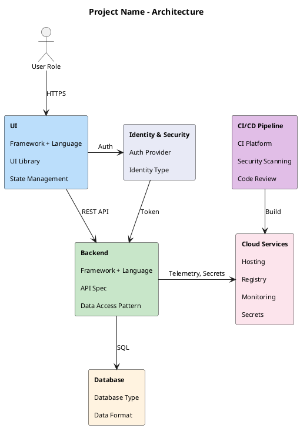
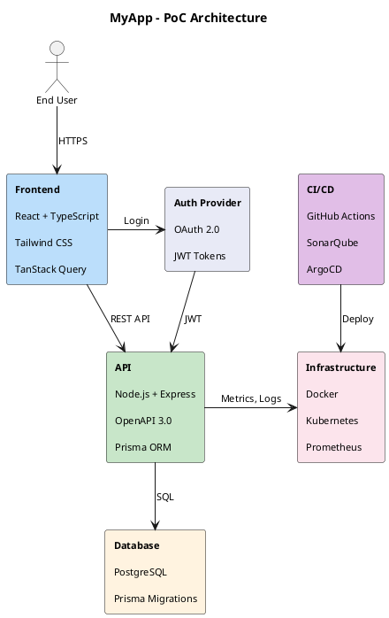

# Architecture Diagram Template (PlantUML)

This template provides a standardized approach for creating architecture diagrams using PlantUML. It produces clean, readable diagrams with consistent styling.

## Key Principles

1. **Use flat text with line breaks** - Instead of nested rectangles, use `\n\n` for visual separation
2. **Directional arrows for layout** - Use `-down->`, `-right->`, `-left->`, `-up->` to control element placement
3. **Color coding** - Use consistent pastel colors for different element types
4. **Hidden links** - Use `[hidden]` links to force elements side-by-side without visible arrows

## Color Palette

| Element Type | Color Code | Description |
|--------------|------------|-------------|
| UI/Frontend | `#BBDEFB` | Light blue |
| Backend/API | `#C8E6C9` | Light green |
| Database/Storage | `#FFF3E0` | Light orange |
| Identity/Security | `#E8EAF6` | Light indigo |
| CI/CD/DevOps | `#E1BEE7` | Light purple |
| Cloud Services | `#FCE4EC` | Light pink |

## Template



## Usage Guidelines

### 1. Element Text Format

```
"**Header**\n\nItem 1\n\nItem 2\n\nItem 3"
```

- Use `**Header**` for bold titles
- Use `\n\n` (double newline) after header and between items
- Keep items concise (technology names, not descriptions)

### 2. Layout Control

**Vertical flow (primary data path):**
```plantuml
user -down-> ui : HTTPS
ui -down-> backend : REST API
backend -down-> database : SQL
```

**Horizontal placement (support services):**
```plantuml
ui -right-> identity : Auth
backend -right-> cloud : Monitoring
```

**Force side-by-side without visible arrow:**
```plantuml
ui -right[hidden]-> identity
```

### 3. Relationship Labels

Keep labels short and descriptive:
- Protocol: `HTTPS`, `REST API`, `SQL`, `gRPC`
- Action: `Auth`, `Token`, `Build`, `Deploy`
- Combined: `Telemetry, Secrets`

### 4. Rendering

Using C4 diagrams skill (if available):
```bash
python3 ~/.claude/skills/c4-diagrams/scripts/render-diagram.py path/to/diagram.puml
```

Using node-plantuml:
```bash
npx -y node-plantuml render path/to/diagram.puml -o path/to/diagram.png
```

## Example: Web Application Architecture



## Anti-Patterns to Avoid

1. **Nested rectangles** - PlantUML spacing is not configurable, results in large gaps
2. **Too many elements** - Keep to 6-8 main components for readability
3. **Long labels** - Use short, clear relationship descriptions
4. **Missing directional hints** - Without `-down->` etc., layout becomes unpredictable
5. **Inconsistent colors** - Stick to the color palette for similar element types
