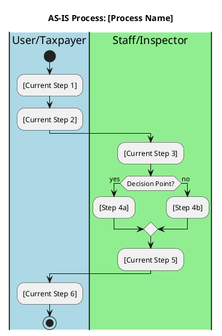
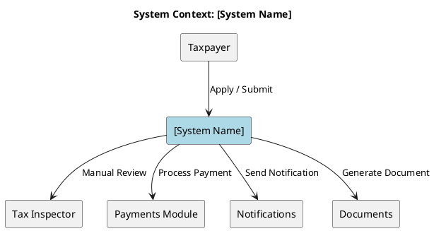
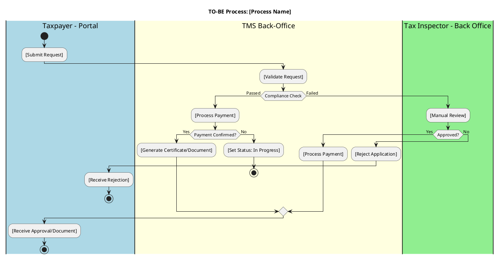

# Business Requirements Document

## [PROJECT NAME]

**Version**: [X.X]
**Date**: [DD Month YYYY]
**Classification**: [Public | Internal | Confidential]

---

| Attribute | Value |
|-----------|-------|
| **Customer** | [Customer Name] |
| **Implementation Partner** | [Partner Name] |
| **Document Owner** | [Name, Role] |
| **Document Reference** | [Reference ID] |
| **Status** | [Draft | In Review | Approved | Baselined] |

---

*This document describes the business requirements for [brief one-line description of the project/module].*

---

## Table of Contents

1. [Document Control](#1-document-control)
2. [Executive Summary](#2-executive-summary)
3. [Definitions, Acronyms and Abbreviations](#3-definitions-acronyms-and-abbreviations)
4. [Scope](#4-scope)
5. [Stakeholders](#5-stakeholders)
6. [Summary of Business Requirements](#6-summary-of-business-requirements)
7. [As Is Process](#7-as-is-process)
8. [Proposed Solution](#8-proposed-solution)
9. [Constraints](#9-constraints)
10. [Assumptions](#10-assumptions)
11. [Risks](#11-risks)

---

## 1. DOCUMENT CONTROL

### 1.1 Version Control

| Version | Date | Change | Responsible Person(s) |
|---------|------|--------|----------------------|
| 0.1 | [DD Mon YYYY] | Initial draft | [Name] |
| 0.2 | [DD Mon YYYY] | [Description of changes] | [Name] |
| 1.0 | [DD Mon YYYY] | Approved for baseline | [Name] |

### 1.2 Document Change Control

Changes to this document must follow the established change control process:

1. All changes must be submitted via the designated change request process
2. Changes are reviewed by the Project Manager and relevant stakeholders
3. Approved changes are incorporated and version number is incremented
4. All stakeholders are notified of significant changes

### 1.3 Document Approval

This BRD is approved by the people named below:

| Title | Name | Signature | Approval Date |
|-------|------|-----------|---------------|
| Project Manager - [Customer] | [Name] | | |
| Business Owner | [Name] | | |
| Project Manager - [Partner] | [Name] | | |
| [Additional Approver] | [Name] | | |

---

## 2. EXECUTIVE SUMMARY

[Opening statement: One paragraph describing the project context and business need. Explain WHY this initiative exists and the business problem it addresses.]

The key objectives of this [project/initiative] are:

- [Objective 1: Measurable business outcome]
- [Objective 2: Measurable business outcome]
- [Objective 3: Measurable business outcome]
- [Objective 4: Measurable business outcome]

[Closing paragraph: Brief description of what this document covers, the scope boundaries, and expected business impact.]

---

## 3. DEFINITIONS, ACRONYMS AND ABBREVIATIONS

| Term | Definition |
|------|------------|
| BRD | Business Requirements Document - shall refer to this document |
| BR | Business Requirement |
| NFR | Non-Functional Requirement |
| [Term] | [Definition in context of this project] |
| [Acronym] | [Full form and explanation] |

<!--
INSTRUCTION: Add all domain-specific terms, technical acronyms, and
abbreviations used in this document. Alphabetize entries.
-->

---

## 4. SCOPE

| In Scope | Out Of Scope |
|----------|--------------|
| [Feature/Function that IS included] | [Feature/Function that is NOT included] |
| [Process that will be changed] | [Process that will remain unchanged] |
| [Integration that will be built] | [Integration deferred to future phase] |
| [User group that will be supported] | [User group not addressed in this phase] |
| [Geographic region covered] | [Geographic region not covered] |

<!--
INSTRUCTION: Be specific and explicit. If something is frequently
asked about, include it explicitly in either In Scope or Out Of Scope.
Each row should have corresponding entries in both columns where applicable.
-->

---

## 5. STAKEHOLDERS

| Stakeholder | Role & Responsibility | Expectations |
|-------------|----------------------|--------------|
| Project Manager - [Customer] | Responsible for organizing requirements gathering and verification meetings | Project team to attend meetings and help deliver the project |
| Project Team - [Customer] | Attend project meetings and provide required input during requirement gathering sessions | Documents to be shared with team in advance for review |
| Business Owner | Final approval authority for business requirements | Solution meets operational needs |
| Project Manager - [Partner] | Responsible for organizing the delivery team and stakeholder management | Team to prepare and attend all organized meetings |
| Product Owner - [Partner] | Facilitate requirement gathering meetings and prepare BRD for approval | Receive all required documentation and business rules |
| End Users - [Category] | Use the system daily for business processes | Intuitive interface, fast response |
| [Stakeholder Name/Group] | [Primary role and key responsibilities] | [What they expect from the solution] |

<!--
INSTRUCTION: Include all parties who have interest in or influence on
the project. Consider: sponsors, owners, users, IT, legal, external partners.
-->

---

## 6. SUMMARY OF BUSINESS REQUIREMENTS

This section provides a high-level overview of the business requirements. Detailed requirements are documented in Section 8.3.

- [Capability 1: Brief description of major business capability]
- [Capability 2: Brief description of major business capability]
- [Capability 3: Brief description of major business capability]
- [Capability 4: Brief description of major business capability]
- [Capability 5: Brief description of major business capability]

<!--
INSTRUCTION: Provide 5-10 bullet points summarizing the major capabilities.
These should map to the detailed requirements in Section 8.3.
Write in business language, not technical terms.
-->

---

## 7. AS IS PROCESS

### Current State Description

[Narrative description of how the current process works. Include:
- Who performs the process
- What triggers the process
- Key steps in the process
- Systems currently used
- Time taken for typical scenarios]

### Current Process Diagram

<!--
INSTRUCTION: Insert or embed a process diagram showing the current state.
Use BPMN notation where possible. Replace placeholder with actual diagram.
-->

### Current Pain Points

1. [Pain point 1: Description of issue with current state]
2. [Pain point 2: Description of issue with current state]
3. [Pain point 3: Description of issue with current state]
4. [Pain point 4: Description of issue with current state]

---

## 8. PROPOSED SOLUTION

### 8.1 High-Level Context Diagram

<!--
INSTRUCTION: Insert a context diagram showing the solution in its ecosystem.
Show all external actors, systems, and data flows.
-->

#### Ecosystem Overview

| ATTRIBUTE | DESCRIPTION |
|-----------|-------------|
| **Taxpayer** | [Description of taxpayer interaction with the system] |
| **Payments Module** | [Description of payment processing integration] |
| **Tax Compliance** | [Description of compliance verification rules] |
| **Tax Inspector** | [Description of inspector role and responsibilities] |
| **Notifications** | [Description of notification channels and triggers] |
| **Documents** | [Description of document generation and storage] |

### 8.2 Process Overview Diagram

<!--
INSTRUCTION: Insert a process flow diagram showing the TO-BE solution process.
-->

#### 8.2.1 [Entity] Statuses

<!--
INSTRUCTION: Document all statuses/states that the primary entity can have.
Replace [Entity] with the actual entity name (e.g., "Application", "Request", "Certificate").
-->

| Status Name | Description of Status |
|-------------|----------------------|
| Draft | [Entity] has been initiated and saved to be submitted later for processing |
| Submitted | [Entity] has been submitted for decision - manual approval may be required |
| In Progress | [Entity] is awaiting confirmation of payment or additional action |
| Under Review | [Entity] is being reviewed by Tax Inspector |
| Approved | [Entity] has been approved (payment confirmed if applicable) |
| Refused | [Entity] has been rejected |
| [Status] | [Description] |

#### 8.2.2 [Entity] Process

<!--
INSTRUCTION: Break down the process into sub-processes. Each sub-process
should have its own subsection with detailed steps.
-->

##### 8.2.2.1 [Sub-process 1: e.g., Application Submission]

[Description of sub-process 1: what it does, when it is triggered, who is involved]

**Process Steps:**
1. [Step description]
2. [Step description]
3. [Step description]

**Form Fields** (if applicable):

| Field | Description |
|-------|-------------|
| [Field 1] | [Field 1 description] |
| [Field 2] | [Field 2 description] |
| [Field 3] | [Field 3 description] |

##### 8.2.2.2 [Sub-process 2: e.g., Validation Process]

[Description of sub-process 2: what validations are performed, business rules applied]

**Validation Rules:**
1. [Validation rule 1]
2. [Validation rule 2]
3. [Validation rule 3]

##### 8.2.2.3 [Sub-process 3: e.g., Decision Process]

[Description of sub-process 3: how decisions are made, approval workflow]

**Decision Criteria:**
1. [Criterion 1]
2. [Criterion 2]
3. [Criterion 3]

### 8.3 Business Requirements

<!--
INSTRUCTION: Use BR-N format for all business requirements.
Each requirement should have a clear title and description.
Be specific and measurable where possible.
-->

**BR-1: [Requirement Title]**

[Detailed description of the business requirement. Include:
- What the system must do
- Who benefits from this requirement
- Any business rules that apply
- Success criteria]

---

**BR-2: [Requirement Title]**

[Detailed description of the business requirement.]

---

**BR-3: [Requirement Title]**

[Detailed description of the business requirement.]

---

**BR-4: [Requirement Title]**

[Detailed description of the business requirement.]

---

**BR-5: [Requirement Title]**

[Detailed description of the business requirement.]

---

**BR-6: [Requirement Title]**

[Detailed description of the business requirement.]

---

<!-- Add more BR-N entries as needed -->

### 8.4 Non-Functional Requirements

<!--
INSTRUCTION: Use NFR-N format for all non-functional requirements.
Categories typically include: Performance, Security, Availability,
Scalability, Usability, Localization, Compliance.

CRITICAL: Non-Functional Requirements should be stated at BUSINESS LEVEL,
not technical implementation level. Focus on business expectations and outcomes,
not technical metrics or implementation details.

EXAMPLES:

✅ GOOD (Business-level):
- "The system SHALL respond to user actions within acceptable time for business processes"
- "The system SHALL be available during business-critical hours (8 AM - 6 PM)"
- "The system SHALL support expected concurrent user load during peak business operations"
- "The system SHALL protect sensitive taxpayer data according to regulatory requirements"

❌ BAD (Technical-level - defer to System Specification):
- "Page loads within 3 seconds" (technical metric)
- "System uptime 99.9%" (technical SLA)
- "Support 500 concurrent users" (technical capacity)
- "Encrypt data using AES-256" (technical implementation)

Technical metrics, SLAs, and implementation details are documented in the System Specification.
-->

**NFR-1: Performance**

[Description of performance requirements with measurable targets where applicable]
- [Performance criterion 1]
- [Performance criterion 2]

---

**NFR-2: Availability**

[Description of availability requirements]
- [Availability criterion 1]
- [Availability criterion 2]

---

**NFR-3: Security**

[Description of security requirements]
- [Security criterion 1]
- [Security criterion 2]

---

**NFR-4: Localization**

[Description of localization requirements]
- [Localization criterion 1]
- [Localization criterion 2]

---

**NFR-5: Compliance**

[Description of compliance requirements]
- [Compliance criterion 1]
- [Compliance criterion 2]

---

<!-- Add more NFR-N entries as needed -->

---

## 9. CONSTRAINTS

### Budget Constraints

- [Budget limitation 1]
- [Budget limitation 2]

### Timeline Constraints

- [Timeline constraint 1: e.g., Must go live by Q2 2026]
- [Timeline constraint 2: e.g., Dependent on X project completion]

### Legal/Regulatory Constraints

- [Legal constraint 1: e.g., Must comply with applicable regulations]
- [Legal constraint 2: e.g., Data residency requirements]
- [Legal constraint 3: e.g., Audit trail requirements]

### Integration Constraints

- [Integration constraint 1: e.g., Must integrate with existing back-office system]
- [Integration constraint 2: e.g., Must exchange data with external regulatory systems]
- [Integration constraint 3: e.g., Limited access to legacy system for data extraction]

<!--
NOTE: Technical implementation constraints (technology stack, frameworks, architecture patterns)
are documented in the System Specification, not the BRD. Focus here on business-level
integration requirements and organizational constraints only.
-->

### Other Constraints

- [Resource constraint: e.g., Limited availability of SMEs]
- [Organizational constraint: e.g., Change freeze during filing season]
- [Other constraint]

<!--
INSTRUCTION: Constraints are factors that limit options.
Be honest and explicit about constraints - they inform solution design.
-->

---

## 10. ASSUMPTIONS

<!--
INSTRUCTION: Use A-N format for all assumptions.
Assumptions should be validated during the project.
Track which assumptions have been validated.
-->

**A-1: [Assumption Title]**

[Assumption statement - something taken to be true without proof]

---

**A-2: [Assumption Title]**

[Assumption statement]

---

**A-3: [Assumption Title]**

[Assumption statement]

---

**A-4: [Assumption Title]**

[Assumption statement]

---

<!--
COMMON ASSUMPTION CATEGORIES:
- Resource availability (e.g., "Key stakeholders will be available for weekly reviews")
- Technical (e.g., "Existing APIs will remain stable during development")
- Data (e.g., "Data quality in source system is sufficient for migration")
- Organizational (e.g., "No major organizational changes during project")
- Integration (e.g., "Third-party system will support required authentication method")
-->

---

## 11. RISKS

<!--
INSTRUCTION: Use R-N format for all risks.
Each risk should have: Risk description, Impact assessment, Mitigation strategy.
Consider probability and severity when prioritizing.
-->

**R-1: [Risk Title]**

| Aspect | Description |
|--------|-------------|
| **Risk** | [Description of what could go wrong] |
| **Impact** | [Consequence if risk materializes - include severity: High/Medium/Low] |
| **Mitigation** | [Actions to reduce probability or impact] |

---

**R-2: [Risk Title]**

| Aspect | Description |
|--------|-------------|
| **Risk** | [Description of what could go wrong] |
| **Impact** | [Consequence if risk materializes] |
| **Mitigation** | [Actions to reduce probability or impact] |

---

**R-3: [Risk Title]**

| Aspect | Description |
|--------|-------------|
| **Risk** | [Description of what could go wrong] |
| **Impact** | [Consequence if risk materializes] |
| **Mitigation** | [Actions to reduce probability or impact] |

---

<!-- Add more R-N entries as needed -->

---

## APPENDIX: VALIDATION CHECKLIST

Before submitting this BRD for approval, verify:

### Document Completeness

- [ ] Cover page completed with correct version and date
- [ ] All sections 1-11 completed
- [ ] Version control table is current
- [ ] Document approval table has correct approvers listed

### Content Quality

- [ ] Executive Summary clearly articulates business need and objectives
- [ ] All acronyms and terms are defined in Section 3
- [ ] Scope table has corresponding In Scope/Out of Scope entries
- [ ] All stakeholders identified with clear roles and expectations
- [ ] AS IS process accurately describes current state with diagram
- [ ] Context diagram shows all external system interactions

### Requirements Quality

- [ ] All Business Requirements use BR-N numbering (BR-1, BR-2, etc.)
- [ ] All Non-Functional Requirements use NFR-N numbering (NFR-1, NFR-2, etc.)
- [ ] Requirements are specific and testable
- [ ] No duplicate requirements
- [ ] Requirements trace to business objectives in Executive Summary
- [ ] Requirements describe WHAT the system must do, not HOW it will be implemented
- [ ] No technology choices embedded in requirements (defer to System Specification)
- [ ] Acceptance criteria are business-testable (not technical metrics)

### Supporting Elements

- [ ] All Assumptions use A-N numbering (A-1, A-2, etc.)
- [ ] All Risks use R-N numbering (R-1, R-2, etc.)
- [ ] Each Risk has Risk, Impact, and Mitigation documented
- [ ] Constraints are realistic and verified with stakeholders

### Diagrams

- [ ] AS IS process diagram is included
- [ ] TO-BE process diagram is included
- [ ] Context diagram is included
- [ ] Entity status table is complete
- [ ] All diagrams are readable and properly labeled

### Review Status

- [ ] Technical review completed
- [ ] Business review completed
- [ ] Stakeholder feedback incorporated
- [ ] Ready for formal approval

---

*Template Version: 1.0*
