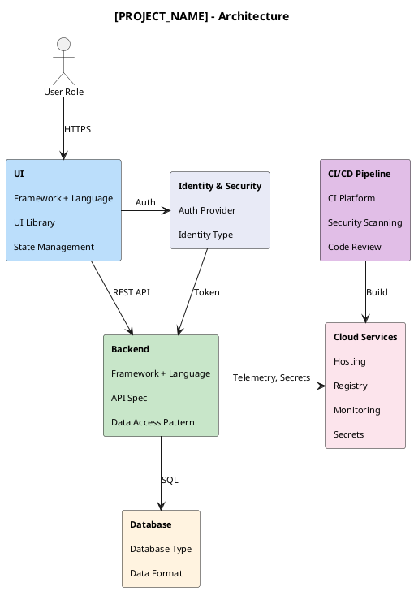

# High-Level Application Technical Architecture Template

This template provides a comprehensive structure for documenting high-level technical architecture decisions. Use this as a starting point for new projects.

## Template Usage

1. Copy the template content below to your project's `docs/architecture/` folder
2. Replace all `[PLACEHOLDER]` values with project-specific content
3. Remove sections marked as optional if not applicable
4. Update the PlantUML diagram using the [architecture-diagram-template.md](./architecture-diagram-template.md)

---

## Template Content

```markdown
# High-Level Application Technical Architecture

**Project:** [PROJECT_NAME]
**Client:** [CLIENT_NAME]
**Version:** [VERSION]
**Date:** [DATE]
**Status:** Draft | Review | Approved
**Author:** [SOLUTION_ARCHITECT]

---

## Document Control

| Version | Date | Author | Changes | Reviewers |
|---------|------|--------|---------|-----------|
| 0.1 | YYYY-MM-DD | [Name] | Initial draft | |

---

## 1. Executive Summary

### 1.1 Purpose
This document presents the high-level technical architecture for [PROJECT_NAME], analyzing constraints, evaluating architectural options, and recommending an approach for stakeholder decision-making.

### 1.2 Scope
**In Scope:**
- [List application components in scope]
- [Integration boundaries]
- [Deployment considerations]

**Out of Scope:**
- [Components explicitly excluded]
- [Future phases]

### 1.3 Key Recommendations Summary

| Decision Area | Recommended Option | Confidence | Decision Required By |
|--------------|-------------------|------------|---------------------|
| Architecture Style | [e.g., Microservices] | High/Medium/Low | [Date] |
| Cloud Platform | [e.g., AWS] | High/Medium/Low | [Date] |
| Frontend Framework | [e.g., React] | High/Medium/Low | [Date] |
| Database Strategy | [e.g., PostgreSQL + Redis] | High/Medium/Low | [Date] |

---

## 2. Business Context

### 2.1 Business Drivers
What business objectives drive this solution?

| Driver | Description | Priority |
|--------|-------------|----------|
| [Driver 1] | [Description] | Critical/High/Medium |
| [Driver 2] | [Description] | Critical/High/Medium |

### 2.2 Stakeholders

| Stakeholder | Role | Concerns | Influence |
|-------------|------|----------|-----------|
| [Name/Role] | Sponsor | Budget, timeline, ROI | Decision-maker |
| [Name/Role] | Technical Lead | Technical feasibility | Advisor |
| [Name/Role] | Operations | Maintainability, support | Consulted |
| [Name/Role] | End Users | Usability, performance | Informed |

### 2.3 Business Processes Impacted
Brief description of which business processes the solution supports or transforms.

---

## 3. Requirements Analysis

### 3.1 Functional Requirements Overview

| Requirement ID | Description | Priority | Architectural Impact |
|---------------|-------------|----------|---------------------|
| FR-001 | [Requirement description] | Must Have | [Impact on architecture] |
| FR-002 | [Requirement description] | Should Have | [Impact on architecture] |

### 3.2 Quality Attribute Requirements (Non-Functional)

| Attribute | Requirement | Measurable Target | Priority |
|-----------|-------------|-------------------|----------|
| **Performance** | Response time | < 200ms for 95th percentile | Critical |
| **Scalability** | Concurrent users | Support 10,000 concurrent users | High |
| **Availability** | Uptime | 99.9% (8.76 hours downtime/year) | Critical |
| **Security** | Authentication | MFA, OAuth 2.0 / OIDC | Critical |
| **Data Retention** | Compliance | [Specific requirement] | High |
| **Recovery** | RTO/RPO | RTO: 4 hours, RPO: 1 hour | High |
| **Maintainability** | Deployment frequency | Daily deployments possible | Medium |

### 3.3 Constraints

| Constraint Type | Description | Impact on Architecture |
|-----------------|-------------|----------------------|
| **Regulatory** | [e.g., GDPR, HIPAA] | [How it affects design] |
| **Technical** | [e.g., Must integrate with SAP] | [How it affects design] |
| **Organizational** | [e.g., Limited cloud expertise] | [How it affects design] |
| **Timeline** | [e.g., Go-live in 6 months] | [How it affects design] |
| **Budget** | [e.g., Cloud spend cap] | [How it affects design] |

### 3.4 Assumptions

| ID | Assumption | Risk if Invalid | Mitigation |
|----|------------|-----------------|------------|
| A-001 | [Assumption] | [Risk] | [Mitigation approach] |

---

## 4. Current State Analysis (As-Is)

*If greenfield project, note "Not Applicable - Greenfield Development"*

### 4.1 Existing Systems Landscape

```
[Diagram placeholder: Current system context diagram]
```

### 4.2 Integration Points

| System | Integration Type | Data Flow | Current Issues |
|--------|-----------------|-----------|----------------|
| [System name] | [API/File/DB] | [In/Out/Bidirectional] | [Known issues] |

### 4.3 Technical Debt and Pain Points
- [Current pain point 1]
- [Current pain point 2]

---

## 5. Architecture Decision Records (ADRs)

### ADR-001: Architecture Style Selection

**Status:** Proposed | Accepted | Deprecated | Superseded
**Date:** [YYYY-MM-DD]
**Decision Makers:** [Names]

#### Context
[Describe the context and problem that requires a decision]

#### Options Considered

| Option | Description | Pros | Cons |
|--------|-------------|------|------|
| **A: Monolithic** | Single deployable unit | Simple deployment, lower initial complexity | Scaling challenges, technology lock-in |
| **B: Microservices** | Distributed services | Independent scaling, technology flexibility | Operational complexity, network overhead |
| **C: Modular Monolith** | Single deployment, modular internal structure | Balance of simplicity and modularity | Requires discipline to maintain boundaries |

#### Evaluation Criteria

| Criterion | Weight | Option A | Option B | Option C |
|-----------|--------|----------|----------|----------|
| Scalability requirements | 30% | 2 | 5 | 3 |
| Team expertise | 25% | 4 | 2 | 4 |
| Time to market | 20% | 5 | 2 | 4 |
| Long-term maintainability | 15% | 2 | 4 | 4 |
| Operational complexity | 10% | 5 | 1 | 4 |
| **Weighted Score** | 100% | **3.3** | **3.1** | **3.7** |

#### Recommendation
[Option C: Modular Monolith] is recommended based on [reasoning].

#### Consequences
- Positive: [Expected benefits]
- Negative: [Trade-offs accepted]
- Risks: [Residual risks]

---

### ADR-002: Cloud Platform Selection

**Status:** Proposed
**Date:** [YYYY-MM-DD]

#### Context
[Why cloud platform decision is needed]

#### Options Considered

| Option | Description | Pros | Cons |
|--------|-------------|------|------|
| **A: AWS** | Amazon Web Services | Mature, broad services | Cost complexity |
| **B: Azure** | Microsoft Azure | Enterprise integration | Learning curve |
| **C: GCP** | Google Cloud Platform | Data/ML capabilities | Smaller ecosystem |
| **D: On-premises** | Self-hosted | Control, compliance | CapEx, maintenance |

#### Evaluation Criteria

| Criterion | Weight | Option A | Option B | Option C | Option D |
|-----------|--------|----------|----------|----------|----------|
| Service availability in region | 25% | | | | |
| Existing organizational skills | 20% | | | | |
| Total cost of ownership | 20% | | | | |
| Compliance requirements | 15% | | | | |
| Integration with existing systems | 10% | | | | |
| Vendor relationship | 10% | | | | |

#### Recommendation
[To be determined after evaluation]

---

### ADR-003: Frontend Technology Stack

**Status:** Proposed
**Date:** [YYYY-MM-DD]

#### Context
Selection of frontend framework and technology stack.

#### Options Considered

| Option | Pros | Cons |
|--------|------|------|
| **React + TypeScript** | Large ecosystem, hiring pool | Bundle size concerns |
| **Angular** | Enterprise-ready, opinionated | Steeper learning curve |
| **Vue.js** | Gentle learning curve | Smaller enterprise adoption |

#### Recommendation
[To be determined]

---

### ADR-004: Database Strategy

**Status:** Proposed
**Date:** [YYYY-MM-DD]

#### Context
Selection of database technology considering data patterns and requirements.

#### Options Considered

| Option | Use Case Fit | Pros | Cons |
|--------|-------------|------|------|
| **PostgreSQL** | Relational data, ACID | Mature, extensible | Scaling complexity |
| **MongoDB** | Document-oriented | Flexible schema | Consistency trade-offs |
| **DynamoDB/CosmosDB** | Key-value, high scale | Managed, scalable | Cost at scale, lock-in |

---

### ADR-005: Authentication and Authorization

**Status:** Proposed
**Date:** [YYYY-MM-DD]

#### Options Considered

| Option | Pros | Cons |
|--------|------|------|
| **Azure AD / Entra ID** | Enterprise SSO | Microsoft dependency |
| **Auth0** | Feature-rich, multi-provider | Cost at scale |
| **Keycloak (self-hosted)** | Open source, control | Operational overhead |
| **AWS Cognito** | AWS integration | Limited customization |

---

## 6. Target Architecture (To-Be)

### 6.1 Architecture Overview


<details>
<summary>PlantUML Source</summary>



</details>

### 6.2 System Context

**External Actors:**
- [Actor 1]: [Description and interaction]
- [Actor 2]: [Description and interaction]

**External Systems:**
- [System 1]: [Integration purpose]
- [System 2]: [Integration purpose]

### 6.3 Architecture Layers

| Layer | Purpose | Technologies (Recommended) |
|-------|---------|---------------------------|
| **Presentation** | User interfaces | [To be decided via ADR-003] |
| **API Gateway** | Routing, auth, rate limiting | [e.g., Kong, AWS API Gateway] |
| **Application** | Business logic | [e.g., Java/Spring, .NET, Node.js] |
| **Domain Services** | Core domain functionality | [As per architecture style] |
| **Integration** | External system connectivity | [e.g., Apache Camel, MuleSoft] |
| **Data** | Persistence | [To be decided via ADR-004] |
| **Infrastructure** | Cloud services | [To be decided via ADR-002] |

### 6.4 Key Components

| Component | Responsibility | Technology | Scaling Strategy |
|-----------|---------------|------------|------------------|
| [Component 1] | [Description] | [Tech] | [Horizontal/Vertical] |
| [Component 2] | [Description] | [Tech] | [Horizontal/Vertical] |

---

## 7. Integration Architecture

### 7.1 Integration Patterns

| Pattern | Use Case | Example in This Solution |
|---------|----------|-------------------------|
| Synchronous API | Real-time data retrieval | [Example] |
| Asynchronous Messaging | Event-driven processing | [Example] |
| Batch/ETL | Bulk data processing | [Example] |
| File Transfer | Legacy system integration | [Example] |

### 7.2 Integration Points

| External System | Protocol | Direction | Frequency | Data Volume | SLA |
|-----------------|----------|-----------|-----------|-------------|-----|
| [System 1] | REST API | Bidirectional | Real-time | ~1000 req/min | 99.9% |
| [System 2] | SFTP | Inbound | Daily | 50 MB | 99% |

### 7.3 API Strategy

| Aspect | Approach |
|--------|----------|
| API Style | REST / GraphQL / gRPC |
| Versioning | URL path / Header |
| Documentation | OpenAPI 3.0 |
| Security | OAuth 2.0 + API Keys |

---

## 8. Security Architecture

### 8.1 Security Controls

| Control Area | Approach | Technologies |
|--------------|----------|--------------|
| **Authentication** | [SSO, MFA] | [IdP selection] |
| **Authorization** | [RBAC/ABAC] | [Implementation] |
| **Data at Rest** | [Encryption standard] | [AES-256] |
| **Data in Transit** | TLS 1.3 | Certificate management |
| **API Security** | OAuth 2.0, rate limiting | API Gateway |
| **Secrets Management** | Centralized vault | [HashiCorp Vault / AWS Secrets Manager] |

### 8.2 Compliance Requirements

| Requirement | Applicability | Architectural Implication |
|-------------|--------------|--------------------------|
| GDPR | [Yes/No] | Data residency, right to deletion |
| [Industry-specific] | [Yes/No] | [Implications] |

---

## 9. Infrastructure and Deployment

### 9.1 Environment Strategy

| Environment | Purpose | Infrastructure | Data Strategy |
|-------------|---------|----------------|---------------|
| Development | Developer work | Shared, minimal | Synthetic data |
| Test/QA | Integration testing | Production-like | Anonymized data |
| Staging | Pre-production validation | Production mirror | Production snapshot |
| Production | Live system | Full scale | Real data |

### 9.2 CI/CD Pipeline

| Stage | Tools | Automation Level |
|-------|-------|------------------|
| Source Control | [Git provider] | Fully automated |
| Build | [Build tool] | Fully automated |
| Test | [Test frameworks] | Fully automated |
| Security Scan | [SAST/DAST tools] | Fully automated |
| Deploy | [Deployment tool] | [Manual approval for prod] |

---

## 10. Operations and Observability

### 10.1 Monitoring Strategy

| Aspect | Approach | Tools |
|--------|----------|-------|
| **Application Metrics** | Custom metrics, SLIs | [Prometheus, CloudWatch] |
| **Logging** | Centralized, structured | [ELK, CloudWatch Logs] |
| **Tracing** | Distributed tracing | [Jaeger, X-Ray] |
| **Alerting** | SLO-based alerts | [PagerDuty, Opsgenie] |

### 10.2 Disaster Recovery

| Metric | Target | Approach |
|--------|--------|----------|
| RTO (Recovery Time Objective) | [X hours] | [Strategy] |
| RPO (Recovery Point Objective) | [X hours] | [Backup frequency] |

---

## 11. Risk Assessment

| Risk ID | Risk Description | Probability | Impact | Mitigation | Owner |
|---------|-----------------|-------------|--------|------------|-------|
| R-001 | [Risk description] | High/Medium/Low | High/Medium/Low | [Mitigation approach] | [Name] |
| R-002 | [Risk description] | High/Medium/Low | High/Medium/Low | [Mitigation approach] | [Name] |

---

## 12. Roadmap and Phasing

### 12.1 Architecture Evolution

| Phase | Timeline | Scope | Dependencies |
|-------|----------|-------|--------------|
| Phase 1 (MVP) | [Dates] | [Core functionality] | [Dependencies] |
| Phase 2 | [Dates] | [Extended features] | Phase 1 completion |
| Phase 3 | [Dates] | [Full solution] | Phase 2 completion |

### 12.2 Technology Roadmap Alignment
How this architecture aligns with organizational technology strategy and roadmap.

---

## 13. Cost Estimation

### 13.1 Infrastructure Costs (Monthly)

| Component | Sizing | Estimated Cost | Notes |
|-----------|--------|----------------|-------|
| Compute | [Specification] | [Currency] | |
| Database | [Specification] | [Currency] | |
| Storage | [Specification] | [Currency] | |
| Networking | [Specification] | [Currency] | |
| **Total** | | **[Currency]** | |

### 13.2 Build vs Buy Analysis
For key components, analysis of build vs. buy (COTS/SaaS) options.

---

## 14. Decision Points and Next Steps

### 14.1 Decisions Required

| Decision | Options | Deadline | Decision Maker | Status |
|----------|---------|----------|----------------|--------|
| Approve architecture style | Accept ADR-001 | [Date] | [Role] | Pending |
| Select cloud platform | AWS/Azure/GCP | [Date] | [Role] | Pending |
| Approve technology stack | As per ADRs | [Date] | [Role] | Pending |

### 14.2 Open Questions

| Question | Owner | Due Date | Status |
|----------|-------|----------|--------|
| [Question 1] | [Name] | [Date] | Open |

### 14.3 Next Steps

1. [ ] Review this document with technical stakeholders
2. [ ] Conduct architecture review board session
3. [ ] Finalize ADR decisions
4. [ ] Proceed to detailed design phase

---

## Appendices

### Appendix A: Glossary

| Term | Definition |
|------|------------|
| [Term] | [Definition] |

### Appendix B: Reference Documents

| Document | Location | Relevance |
|----------|----------|-----------|
| [Document name] | [Link/path] | [Why relevant] |

### Appendix C: Diagram Source Files

Architecture diagrams are maintained as PlantUML source files:
- `docs/architecture/architecture-diagram.puml` - Main architecture diagram

See [architecture-diagram-template.md](../../.ai/2_templates/architecture-diagram-template.md) for PlantUML styling guidelines.

---

*Document generated using High-Level Architecture Template v1.0*
```

---

## Quick Reference: Section Purposes

| Section | Purpose | When to Complete |
|---------|---------|------------------|
| 1. Executive Summary | High-level overview for stakeholders | After all sections drafted |
| 2. Business Context | Why we're building this | Discovery phase |
| 3. Requirements Analysis | What we need to achieve | Discovery phase |
| 4. Current State | What exists today | Discovery phase |
| 5. ADRs | Key technology decisions | Architecture phase |
| 6. Target Architecture | What we're building | Architecture phase |
| 7. Integration | How systems connect | Architecture phase |
| 8. Security | How we protect the system | Architecture phase |
| 9. Infrastructure | How we deploy | Architecture phase |
| 10. Operations | How we run the system | Architecture phase |
| 11. Risks | What could go wrong | Throughout |
| 12. Roadmap | How we get there | Planning phase |
| 13. Costs | What it will cost | Planning phase |
| 14. Next Steps | What happens next | Before review |

## Related Templates

- [architecture-diagram-template.md](./architecture-diagram-template.md) - PlantUML diagram styling
- [adr-template.md](./adr-template.md) - Standalone ADR template (if available)
