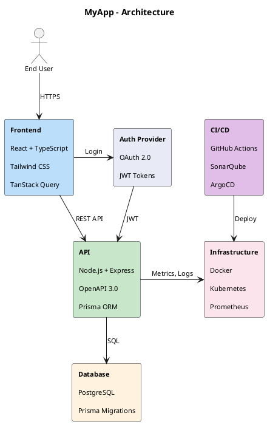

# How to Create Architecture Diagrams with PlantUML

This guide explains how to create clean, readable architecture diagrams using PlantUML.

## Quick Start

Use this prompt to create an architecture diagram:

```
Create an architecture diagram for [PROJECT_NAME] using PlantUML. Include:
- [Component 1] with technologies: [Tech A, Tech B, Tech C]
- [Component 2] with technologies: [Tech D, Tech E]
- ...

Use the architecture-diagram-template.md from .ai/2_templates/ for styling.
Save to docs/architecture/[diagram-name].puml
```

## Key Principles

### 1. Use Flat Text with Line Breaks (NOT Nested Rectangles)

**Good** - Compact and readable:
```plantuml
rectangle "**UI**\n\nReact 19 + TypeScript\n\nApache ECharts\n\nTanStack Query" as ui #BBDEFB
```

**Bad** - Large gaps, hard to control spacing:
```plantuml
rectangle "**UI**" as ui #BBDEFB {
    rectangle "React 19 + TypeScript" as ui1 #E3F2FD
    rectangle "Apache ECharts" as ui2 #E3F2FD
}
```

### 2. Use Directional Arrows for Layout Control

Control element placement with arrow directions:
- `-down->` : Arrow pointing down (vertical flow)
- `-right->` : Arrow pointing right (horizontal placement)
- `-left->` : Arrow pointing left
- `-up->` : Arrow pointing up

```plantuml
user -down-> ui : HTTPS
ui -down-> backend : REST API
ui -right-> identity : Auth
```

### 3. Use Hidden Links for Side-by-Side Placement

Force elements onto the same row without visible arrows:
```plantuml
ui -right[hidden]-> identity
```

### 4. Consistent Color Palette

| Element Type | Color Code | Description |
|--------------|------------|-------------|
| UI/Frontend | `#BBDEFB` | Light blue |
| Backend/API | `#C8E6C9` | Light green |
| Database/Storage | `#FFF3E0` | Light orange |
| Identity/Security | `#E8EAF6` | Light indigo |
| CI/CD/DevOps | `#E1BEE7` | Light purple |
| Cloud Services | `#FCE4EC` | Light pink |

## Complete Example



## Rendering the Diagram

### Option 1: C4 Diagrams Skill (if available)
```bash
python3 ~/.claude/skills/c4-diagrams/scripts/render-diagram.py docs/architecture/my-diagram.puml
```

### Option 2: node-plantuml
```bash
npx -y node-plantuml render docs/architecture/my-diagram.puml -o docs/architecture/my-diagram.png
```

### Option 3: PlantUML Online
Visit https://www.plantuml.com/plantuml/uml/ and paste your code.

## Anti-Patterns to Avoid

1. **Nested rectangles** - PlantUML spacing is not configurable
2. **Too many elements** - Keep to 6-8 main components
3. **Long labels** - Use short relationship descriptions
4. **Missing directional hints** - Layout becomes unpredictable
5. **Inconsistent colors** - Stick to the color palette

## Related Templates

- `.ai/2_templates/architecture-diagram-template.md` - Complete PlantUML template
- `.ai/2_templates/high-level-architecture-template.md` - Full architecture document template
