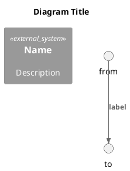
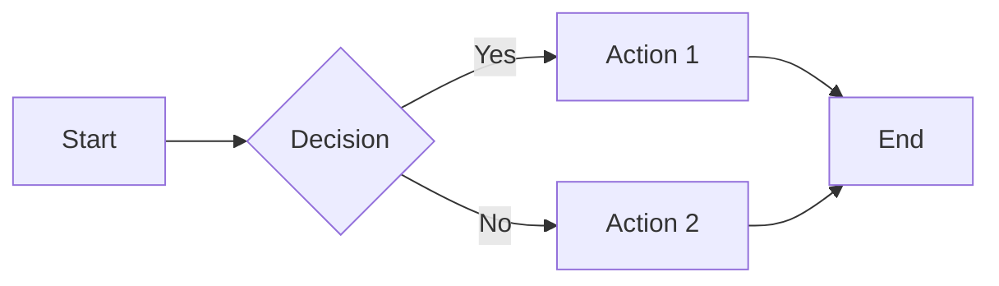

# Arc42 Template Guide

## Overview

This directory contains Arc42 architecture documentation templates. Each section has a standardized format optimized for:

1. **Human readability** - Clear structure, consistent formatting
2. **AI assistance** - Structured data, metadata headers
3. **Version control** - Markdown-based, diffable

## Diagram Conventions

### When to Use Each Tool

| Diagram Type | Tool | Reason |
|--------------|------|--------|
| C4 Context/Container/Component | PlantUML | Rich C4 library support |
| Sequence diagrams (complex) | PlantUML | Better control, styling |
| Deployment diagrams | PlantUML | Infrastructure icons |
| Simple flowcharts | Mermaid | GitHub native rendering |
| State diagrams | Mermaid | Simple syntax |
| Entity relationships | Mermaid | Quick ERDs |
| Decision trees | Mermaid | Simple visualization |

### PlantUML Template

### Mermaid Template

## Section Checklist

| # | Section | Template | Status | Last Updated |
|---|---------|----------|--------|--------------|
| 01 | Introduction & Goals | [01-introduction-goals.md](01-introduction-goals.md) | [ ] Draft / [ ] Review / [ ] Complete | |
| 02 | Constraints | [02-constraints.md](02-constraints.md) | [ ] Draft / [ ] Review / [ ] Complete | |
| 03 | Context & Scope | [03-context-scope.md](03-context-scope.md) | [ ] Draft / [ ] Review / [ ] Complete | |
| 04 | Solution Strategy | [04-solution-strategy.md](04-solution-strategy.md) | [ ] Draft / [ ] Review / [ ] Complete | |
| 05 | Building Block View | [05-building-block-view.md](05-building-block-view.md) | [ ] Draft / [ ] Review / [ ] Complete | |
| 06 | Runtime View | [06-runtime-view.md](06-runtime-view.md) | [ ] Draft / [ ] Review / [ ] Complete | |
| 07 | Deployment View | [07-deployment-view.md](07-deployment-view.md) | [ ] Draft / [ ] Review / [ ] Complete | |
| 08 | Crosscutting Concepts | [08-crosscutting-concepts.md](08-crosscutting-concepts.md) | [ ] Draft / [ ] Review / [ ] Complete | |
| 09 | Architecture Decisions | [09-architecture-decisions/](09-architecture-decisions/) | [ ] Draft / [ ] Review / [ ] Complete | |
| 10 | Quality Requirements | [10-quality-requirements.md](10-quality-requirements.md) | [ ] Draft / [ ] Review / [ ] Complete | |
| 11 | Risks & Technical Debt | [11-risks-technical-debt.md](11-risks-technical-debt.md) | [ ] Draft / [ ] Review / [ ] Complete | |
| 12 | Glossary | [12-glossary.md](12-glossary.md) | [ ] Draft / [ ] Review / [ ] Complete | |
| **13** | **Documentation Gaps (Custom)** | [13-documentation-gaps.md](13-documentation-gaps.md) | [ ] Draft / [ ] Review / [ ] Complete | |

### BMAD Extensions (Three-Source Synthesis)

These sections were added to support the BMAD (Brownfield Methodology for AI-Assisted Development) process:

| Section | Extension | Purpose |
|---------|-----------|---------|
| **01** | 1.4 Design Intent and Evolution | Capture original design goals and system evolution |
| **01** | 1.5 Documentation Gaps Identified | Summary of gaps between docs and reality |
| **04** | 4.1 Enhanced Decision Templates | Decisions with intent, rationale, and current assessment |
| **13** | Documentation Gaps (New) | Full gap analysis including tribal knowledge |

## Quick Start

1. Copy the template for the section you need
2. Replace `{placeholders}` with actual content
3. Add diagrams using PlantUML or Mermaid
4. Update the checklist above
5. Commit changes

## File Naming

- Sections: `01-introduction-goals.md`, `02-constraints.md`, etc.
- Diagrams: `c4-context.puml`, `seq-vrk-import.puml`, etc.
- ADRs: `ADR-001-title.md`, `ADR-002-title.md`, etc.

## Diagram Usage by Section

| Section | PlantUML | Mermaid | Diagram Types |
|---------|----------|---------|---------------|
| 01 Introduction | - | Yes | mindmap (stakeholders) |
| 02 Constraints | - | Yes | flowchart (constraint visualization) |
| 03 Context & Scope | Yes | Yes | C4 Context, network zones |
| 04 Solution Strategy | Yes | Yes | C4 Component, flowcharts |
| 05 Building Block | Yes | Yes | C4 Container/Component, class diagrams |
| 06 Runtime View | Yes | Yes | Sequence, flowchart, state diagrams |
| 07 Deployment | Yes | Yes | Deployment, network, HA |
| 08 Crosscutting | - | Yes | ERD, flowchart, pie charts |
| 09 ADRs | - | Yes | State diagram (workflow) |
| 10 Quality | - | Yes | mindmap, flowchart |
| 11 Risks | - | Yes | quadrant chart, pie, gantt |
| 12 Glossary | - | Yes | mindmap (term relationships) |

## Related Resources

- [Arc42 Official](https://arc42.org/)
- [C4 Model](https://c4model.com/)
- [C4-PlantUML](https://github.com/plantuml-stdlib/C4-PlantUML)
- [Mermaid Documentation](https://mermaid.js.org/)
- [MADR Templates](https://adr.github.io/madr/)
