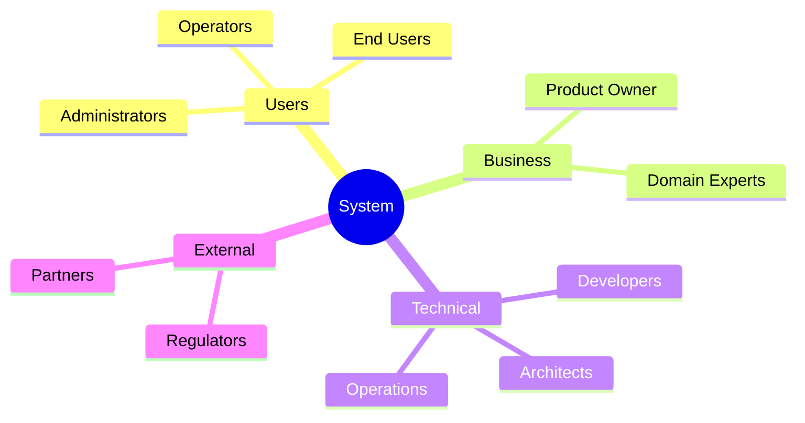

# 1. Introduction and Goals

<!--
Arc42 Section 1: Introduction and Goals
Provides the essential context for the system and its development.
-->

## 1.1 Requirements Overview

### Business Context

| Attribute | Description |
|-----------|-------------|
| **System Name** | {System Name} |
| **Business Domain** | {Domain - e.g., Address Registry, Financial Services} |
| **Primary Purpose** | {1-2 sentence description of what the system does} |
| **Key Stakeholders** | {List primary stakeholder groups} |

### Essential Features

| Feature ID | Feature | Description | Priority |
|------------|---------|-------------|----------|
| F-001 | {Feature Name} | {Brief description} | {Must/Should/Could} |
| F-002 | {Feature Name} | {Brief description} | {Must/Should/Could} |
| F-003 | {Feature Name} | {Brief description} | {Must/Should/Could} |

### Background and Motivation

{Why does this system exist? What problem does it solve?}

---

## 1.2 Quality Goals

The top quality goals for the system, ordered by priority:

| Priority | Quality Goal | Scenario | Metric |
|----------|--------------|----------|--------|
| 1 | {e.g., Reliability} | {Concrete scenario} | {Measurable target} |
| 2 | {e.g., Performance} | {Concrete scenario} | {Measurable target} |
| 3 | {e.g., Security} | {Concrete scenario} | {Measurable target} |

### Quality Goal Details

#### Goal 1: {Quality Goal Name}

**Definition**: {What does this quality mean in context of this system?}

**Rationale**: {Why is this quality important?}

**Acceptance Criteria**:
- {Criterion 1}
- {Criterion 2}

---

## 1.3 Stakeholders

### Stakeholder Overview

### Stakeholder Table

| Role | Contact | Expectations | Concerns |
|------|---------|--------------|----------|
| {Role} | {Name/Team} | {What they expect from the system} | {What worries them} |
| {Role} | {Name/Team} | {What they expect from the system} | {What worries them} |
| {Role} | {Name/Team} | {What they expect from the system} | {What worries them} |

### Communication Channels

| Stakeholder | Artifact | Frequency |
|-------------|----------|-----------|
| {Role} | {Document/Meeting type} | {How often} |

---

## 1.4 Design Intent and Evolution

### Original System Goals ({Original Year})

**Business Drivers** (from {Source - BRD, ADR, etc.}):
1. {Original business driver 1}
2. {Original business driver 2}
3. {Original business driver 3}

**Design Principles** (from {Source - ADR documents, interviews}):
1. {Design principle 1 - e.g., Flexibility over performance}
2. {Design principle 2 - e.g., Standards compliance}
3. {Design principle 3 - e.g., Incremental migration}

**Constraints at Time of Design** (from {Source - interviews, docs}):
1. {Constraint 1 - e.g., Backward compatibility requirements}
2. {Constraint 2 - e.g., Budget limitations}
3. {Constraint 3 - e.g., Team size/expertise}

### System Evolution ({Start Year}-{Current Year})

**Major Changes**:
- {Year}: {Change description}
- {Year}: {Change description}
- {Year}: {Change description}

**Divergence from Original Design**:
- {Status icon} {Divergence description} (was: {original intent})
- {Status icon} {Divergence description} (was: {original intent})

Use:
- ⚠️ for concerning divergence
- ✅ for positive outcome
- ❌ for negative outcome

**Lessons Learned** (from stakeholder interviews):
- {Lesson 1}
- {Lesson 2}
- {Lesson 3}

---

## 1.5 Documentation Gaps Identified

This AS-IS documentation corrects the following gaps between original documentation and current reality:

| Gap | Original Docs | Reality | Source |
|-----|--------------|---------|--------|
| {Gap Name} | {What original docs said} | {What actually exists} | {Code + Stakeholder} |
| {Gap Name} | {What original docs said} | {What actually exists} | {Code + Stakeholder} |
| {Gap Name} | {What original docs said} | {What actually exists} | {Code + Stakeholder} |

See `artifacts/07-synthesis/DOCUMENTATION-GAP-SUMMARY.md` for complete list.

---

## References

- [Constraints](02-constraints.md) - Technical and organizational constraints
- [Quality Requirements](10-quality-requirements.md) - Detailed quality scenarios
- [Glossary](12-glossary.md) - Term definitions

---

*Last Updated: {Date}*
*Status: [ ] Draft / [ ] Review / [ ] Complete*
