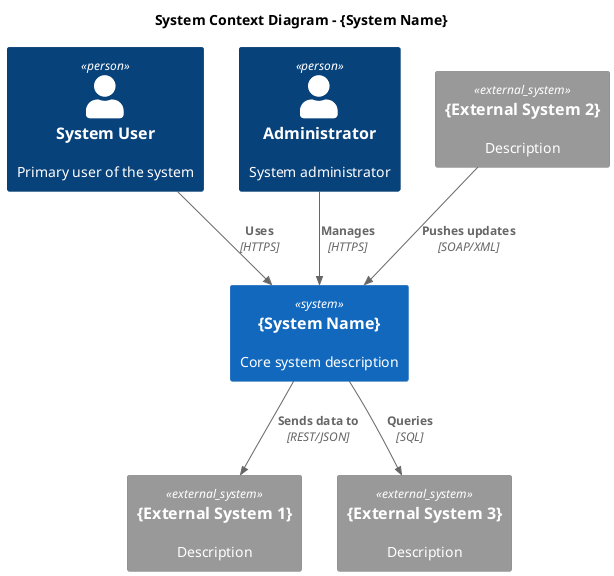
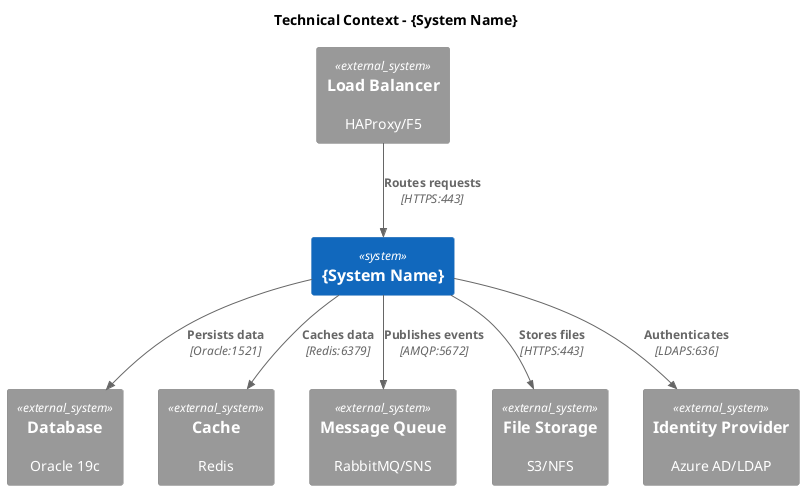
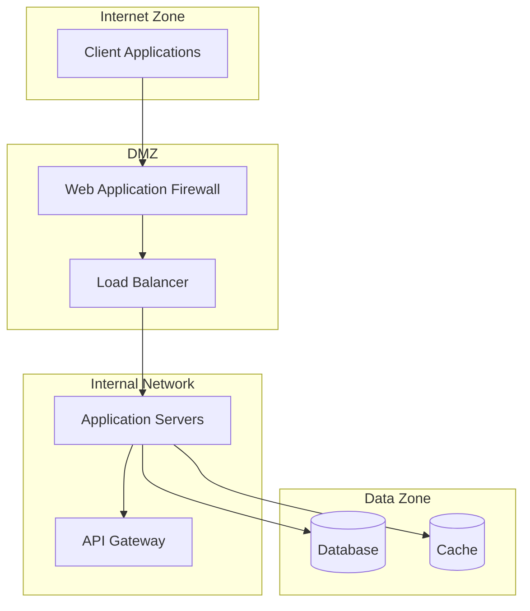

# 3. Context and Scope

<!--
Arc42 Section 3: Context and Scope
Defines the system boundary and its interactions with external systems.
-->

## 3.1 Business Context

### Context Diagram

*Export: `docs/architecture/diagrams/exports/c4-context.png`*

### Business Partners/Users

| Partner/User | Description | Interface | Data Exchanged |
|--------------|-------------|-----------|----------------|
| {Name} | {Who they are} | {How they interact} | {What data} |
| {Name} | {Who they are} | {How they interact} | {What data} |
| {Name} | {Who they are} | {How they interact} | {What data} |

### External Systems

| System | Description | Interface | Protocol | Direction |
|--------|-------------|-----------|----------|-----------|
| {Name} | {Purpose} | {API/File/DB} | {REST/SOAP/File} | {In/Out/Both} |
| {Name} | {Purpose} | {API/File/DB} | {REST/SOAP/File} | {In/Out/Both} |

---

## 3.2 Technical Context

### Technical Context Diagram

### Technical Interfaces

| Interface | Technology | Port | Protocol | Security |
|-----------|------------|------|----------|----------|
| Web API | IIS/Kestrel | 443 | HTTPS | TLS 1.2+ |
| Database | Oracle | 1521 | TNS | Encrypted |
| Cache | Redis | 6379 | RESP | TLS |
| Events | SNS/SQS | 443 | HTTPS | IAM |

### Network Zones

---

## 3.3 Mapping Input/Output

### Data Flow Summary

| Direction | Source | Destination | Data | Format | Frequency |
|-----------|--------|-------------|------|--------|-----------|
| Inbound | {Source} | {System} | {Data type} | {JSON/XML} | {Real-time/Batch} |
| Outbound | {System} | {Destination} | {Data type} | {JSON/XML} | {Real-time/Batch} |

### Input Channels

| Channel | Source | Data | Format | Validation |
|---------|--------|------|--------|------------|
| {Name} | {Source} | {Description} | {Format} | {Rules} |

### Output Channels

| Channel | Destination | Data | Format | SLA |
|---------|-------------|------|--------|-----|
| {Name} | {Destination} | {Description} | {Format} | {Response time} |

---

## References

- [Building Block View](05-building-block-view.md) - Internal structure
- [Runtime View](06-runtime-view.md) - Runtime interactions
- [Deployment View](07-deployment-view.md) - Physical deployment

---

*Last Updated: {Date}*
*Status: [ ] Draft / [ ] Review / [ ] Complete*
