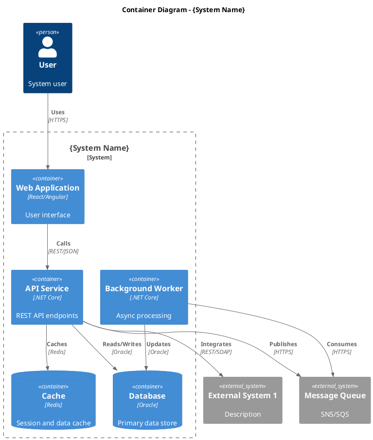
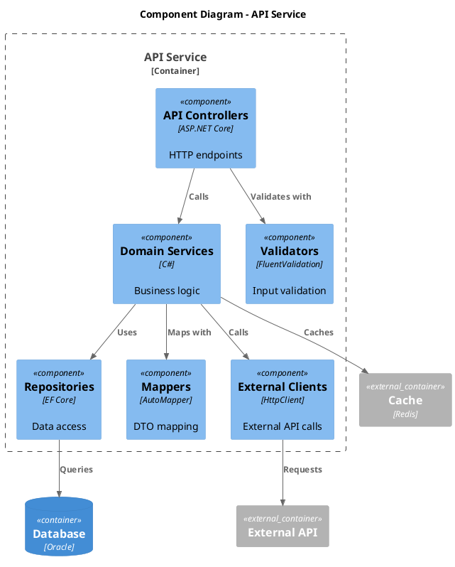
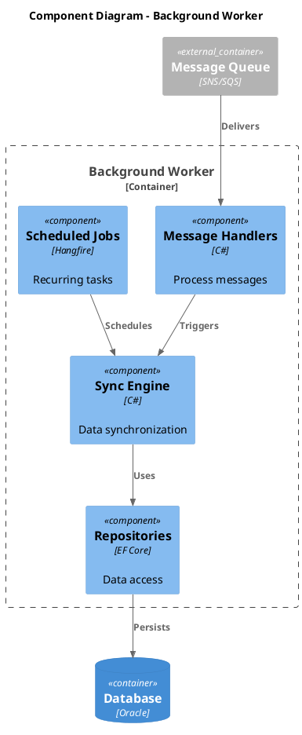
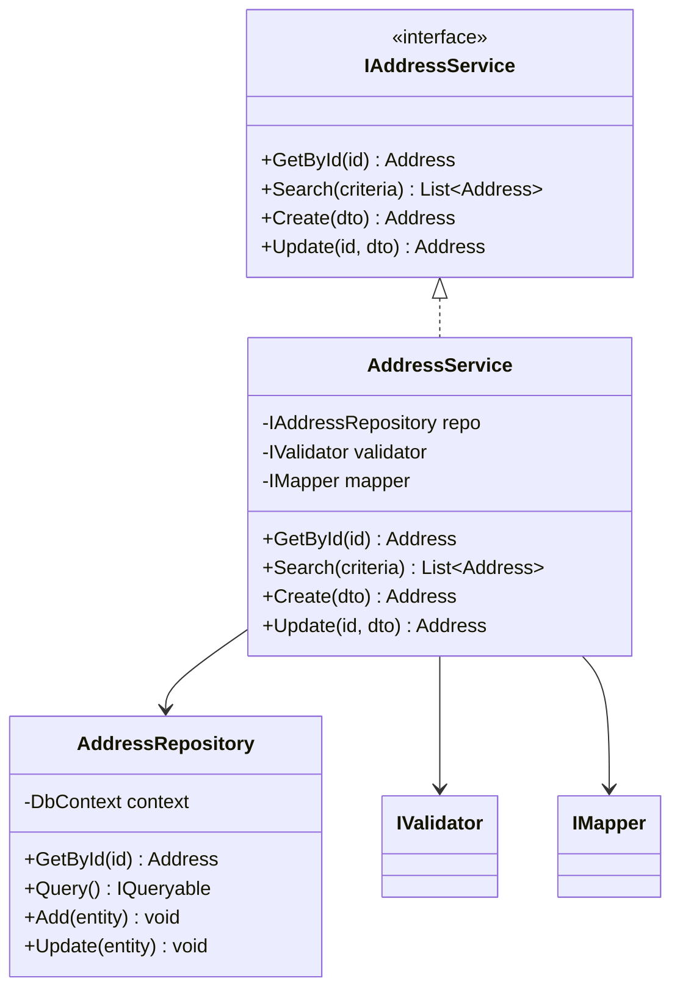
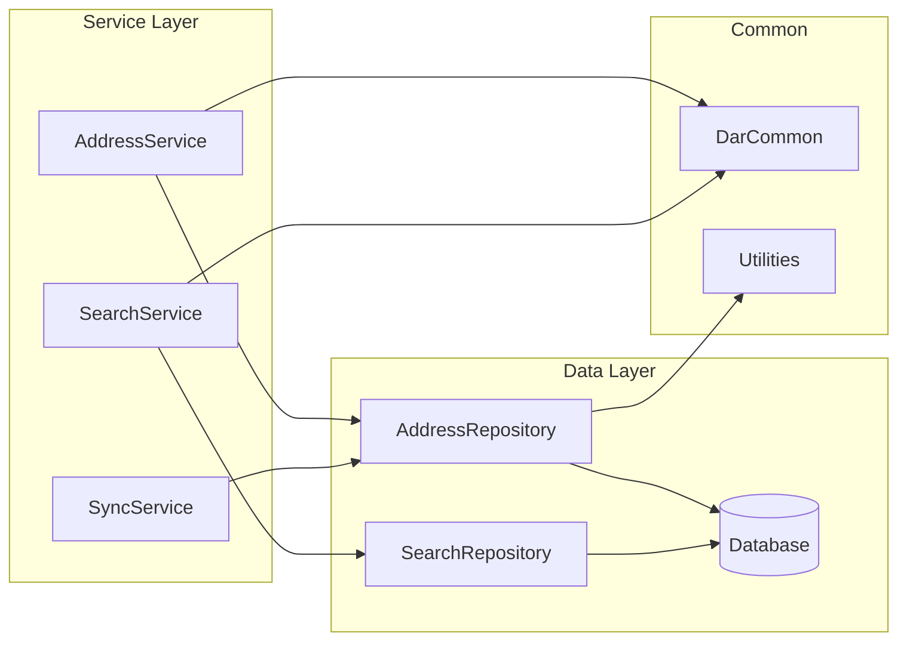

# 5. Building Block View

<!--
Arc42 Section 5: Building Block View
Shows the static decomposition of the system into building blocks and their dependencies.
Uses C4 model hierarchy: Context -> Container -> Component
-->

## 5.1 Level 1: System Context (Whitebox)

### Container Diagram

*Export: `docs/architecture/diagrams/exports/c4-container.png`*

### Container Overview

| Container | Technology | Purpose | Owner |
|-----------|------------|---------|-------|
| Web Application | React | User interface | Frontend Team |
| API Service | .NET Core | Business logic & API | Backend Team |
| Background Worker | .NET Core | Async processing | Backend Team |
| Database | Oracle | Persistent storage | DBA Team |
| Cache | Redis | Performance | DevOps |

---

## 5.2 Level 2: Container Decomposition

### 5.2.1 API Service (Whitebox)

#### Component Responsibilities

| Component | Responsibility | Key Classes |
|-----------|----------------|-------------|
| Controllers | HTTP request handling | `AddressController`, `SearchController` |
| Services | Business logic | `AddressService`, `SearchService` |
| Validators | Input validation | `AddressValidator`, `SearchValidator` |
| Repositories | Data access | `AddressRepository`, `IRepository<T>` |
| Mappers | Object mapping | `AddressProfile`, `DTOMappings` |
| Clients | External integration | `VrkClient`, `OsorClient` |

### 5.2.2 Background Worker (Whitebox)

---

## 5.3 Level 3: Component Details

### Key Component: {Component Name}

#### Class Responsibilities

| Class | Purpose | Dependencies |
|-------|---------|--------------|
| `AddressService` | Core business logic | Repository, Validator, Mapper |
| `AddressRepository` | Data access | DbContext |
| `AddressValidator` | Validation rules | None |

---

## 5.4 Dependency Overview

### Internal Dependencies

### Dependency Matrix

| Component | Depends On | Used By |
|-----------|------------|---------|
| DarCommon | - | All services |
| DarDatabaseServices | DarCommon | All services |
| AddressService | DarDatabaseServices, DarCommon | Controllers |
| SearchService | DarDatabaseServices, DarCommon | Controllers |

---

## 5.5 Important Interfaces

| Interface | Purpose | Implementors |
|-----------|---------|--------------|
| `IAddressService` | Address operations | `AddressService` |
| `IRepository<T>` | Generic data access | All repositories |
| `IExternalClient` | External API calls | `VrkClient`, `OsorClient` |

---

## References

- [Context](03-context-scope.md) - System boundary
- [Runtime View](06-runtime-view.md) - How blocks interact
- [Deployment View](07-deployment-view.md) - Where blocks run

---

*Last Updated: {Date}*
*Status: [ ] Draft / [ ] Review / [ ] Complete*
