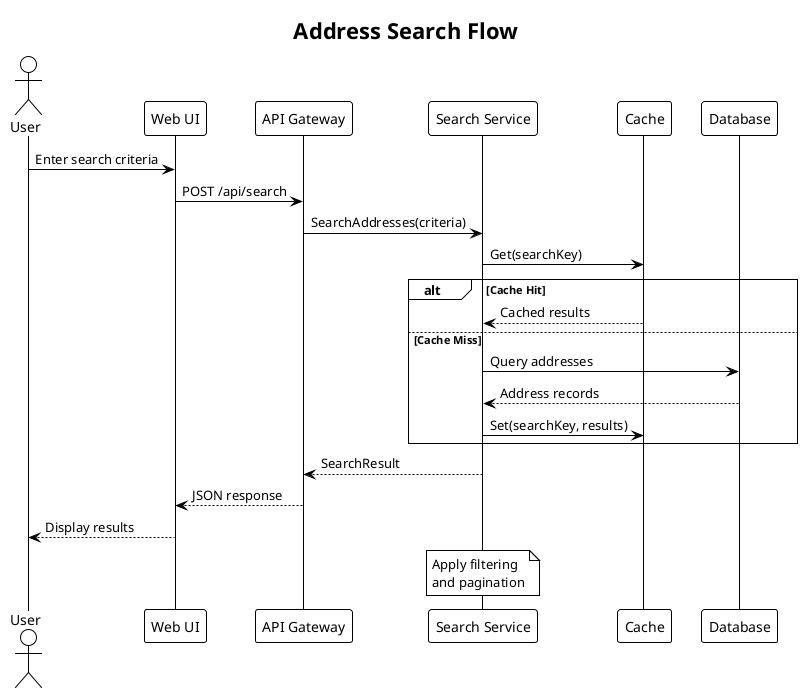
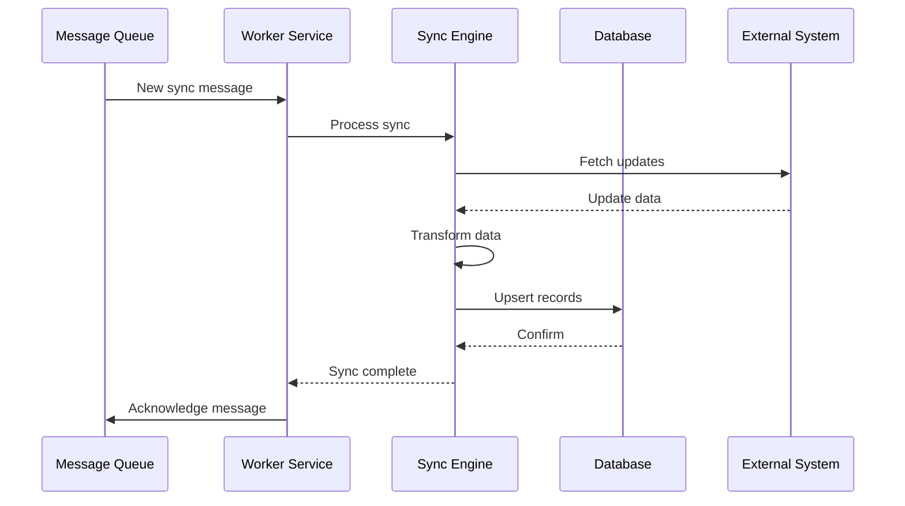
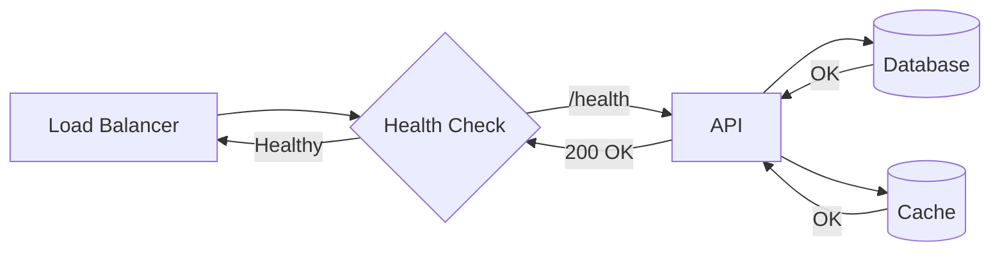
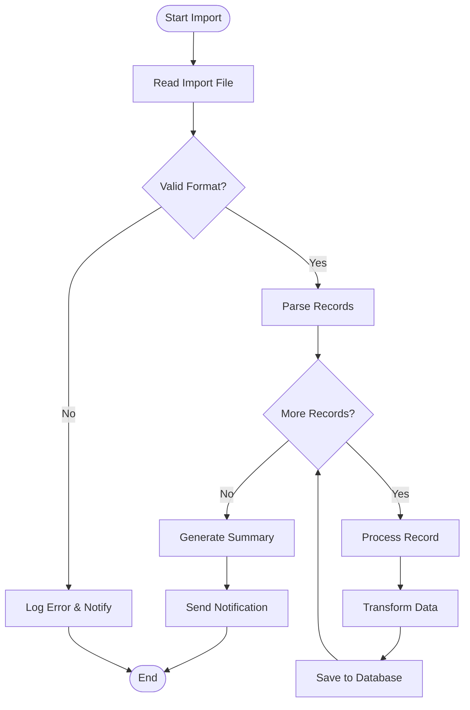
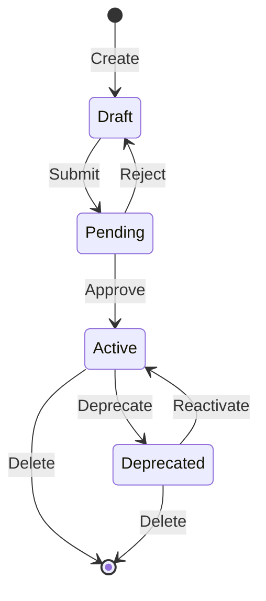

# 6. Runtime View

<!--
Arc42 Section 6: Runtime View
Shows how building blocks interact at runtime through scenarios.
Use sequence diagrams (PlantUML) for complex flows, Mermaid for simple ones.
-->

## 6.1 Key Runtime Scenarios

### Scenario Overview

| Scenario | Description | Complexity | Diagram Type |
|----------|-------------|------------|--------------|
| {Scenario 1} | {Description} | High | PlantUML Sequence |
| {Scenario 2} | {Description} | Medium | Mermaid Sequence |
| {Scenario 3} | {Description} | Low | Mermaid Flowchart |

---

## 6.2 Scenario 1: {Complex Flow - e.g., Address Search}

### Sequence Diagram

*Export: `docs/architecture/diagrams/exports/seq-address-search.png`*

### Flow Description

| Step | Actor | Action | Result |
|------|-------|--------|--------|
| 1 | User | Enters search criteria | Form submitted |
| 2 | UI | Sends API request | HTTP POST |
| 3 | API | Validates and routes | Call to service |
| 4 | Service | Checks cache | Hit or miss |
| 5 | Service | Queries database (if miss) | Raw results |
| 6 | Service | Applies business rules | Filtered results |
| 7 | API | Returns response | JSON payload |

### Error Handling

| Error Condition | Handling | User Impact |
|-----------------|----------|-------------|
| Database timeout | Circuit breaker opens | Cached results or error message |
| Invalid input | Validation error returned | Form validation feedback |
| No results | Empty result set | "No matches found" message |

---

## 6.3 Scenario 2: {Medium Flow - e.g., Data Sync}

### Sequence Diagram (Mermaid)

### Processing Steps

1. **Message Receipt**: Worker receives sync trigger from queue
2. **Data Fetch**: Sync engine retrieves data from external system
3. **Transformation**: Data mapped to internal format
4. **Persistence**: Records upserted to database
5. **Acknowledgment**: Message marked as processed

---

## 6.4 Scenario 3: {Simple Flow - e.g., Health Check}

### Flow Diagram

### Health Check Components

| Component | Endpoint | Timeout | Criticality |
|-----------|----------|---------|-------------|
| API | `/health` | 5s | Critical |
| Database | Connection test | 3s | Critical |
| Cache | PING | 1s | Non-critical |

---

## 6.5 Scenario 4: {e.g., Batch Import}

### Activity Diagram

### Batch Processing Rules

| Rule | Description | On Failure |
|------|-------------|------------|
| Validation | All records validated before processing | Reject batch |
| Transaction | Each record in separate transaction | Skip record, continue |
| Logging | All operations logged | N/A |
| Notification | Summary sent on completion | Email fallback |

---

## 6.6 State Transitions

### Entity State Machine (e.g., Address)

### State Definitions

| State | Description | Allowed Transitions |
|-------|-------------|---------------------|
| Draft | Newly created, not validated | Submit, Delete |
| Pending | Awaiting approval | Approve, Reject |
| Active | Live in production | Deprecate, Delete |
| Deprecated | Marked for removal | Reactivate, Delete |

---

## 6.7 Timing and Performance

### Critical Path Analysis

| Scenario | Target | P50 | P95 | P99 |
|----------|--------|-----|-----|-----|
| Address Search | <500ms | 120ms | 350ms | 800ms |
| Data Sync | <30s | 5s | 15s | 45s |
| Health Check | <1s | 50ms | 200ms | 500ms |

### Bottleneck Identification

| Scenario | Bottleneck | Mitigation |
|----------|------------|------------|
| Search | Database query | Caching, indexing |
| Sync | External API latency | Parallel processing |
| Import | Transaction overhead | Batch commits |

---

## References

- [Building Blocks](05-building-block-view.md) - Component definitions
- [Deployment](07-deployment-view.md) - Runtime environment
- [Quality Requirements](10-quality-requirements.md) - Performance targets

---

*Last Updated: {Date}*
*Status: [ ] Draft / [ ] Review / [ ] Complete*
