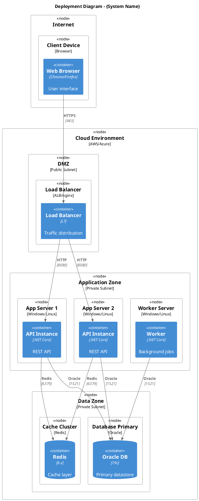
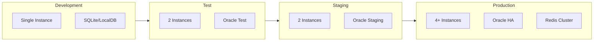
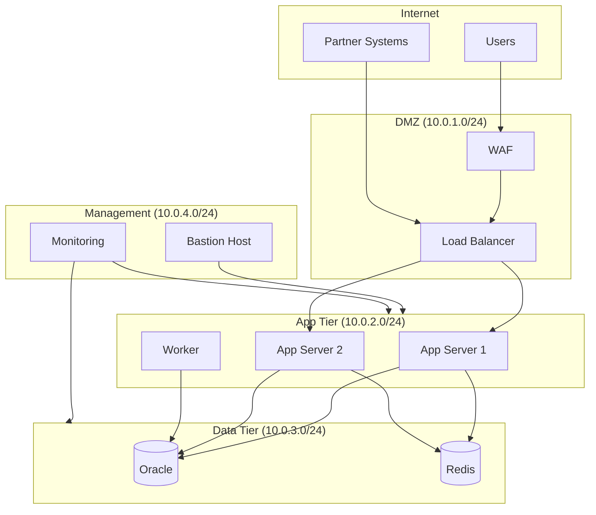
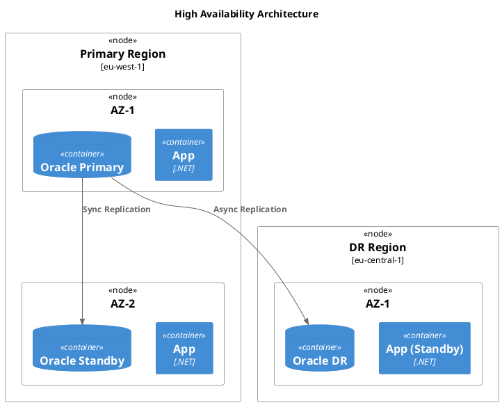

# 7. Deployment View

<!--
Arc42 Section 7: Deployment View
Shows the technical infrastructure and how software maps to it.
Uses PlantUML for deployment diagrams with infrastructure icons.
-->

## 7.1 Infrastructure Overview

### Deployment Diagram



*Export: `docs/architecture/diagrams/exports/deployment.png`*

---

## 7.2 Environment Overview

### Environments

| Environment | Purpose | URL | Notes |
|-------------|---------|-----|-------|
| Development | Local development | `localhost:5000` | Docker Compose |
| Test | Integration testing | `test.example.com` | Shared |
| Staging | Pre-production | `staging.example.com` | Production mirror |
| Production | Live system | `app.example.com` | HA enabled |

### Environment Comparison



---

## 7.3 Infrastructure Topology

### Network Diagram



### Network Security

| Source | Destination | Port | Protocol | Purpose |
|--------|-------------|------|----------|---------|
| Internet | WAF | 443 | HTTPS | User access |
| WAF | Load Balancer | 443 | HTTPS | Traffic forwarding |
| Load Balancer | App Servers | 8080 | HTTP | Application traffic |
| App Servers | Database | 1521 | Oracle | Data access |
| App Servers | Cache | 6379 | Redis | Caching |
| Bastion | App Servers | 22/3389 | SSH/RDP | Administration |

---

## 7.4 Hardware/Cloud Specifications

### Compute Resources

| Component | Instance Type | vCPU | Memory | Storage | Quantity |
|-----------|--------------|------|--------|---------|----------|
| Load Balancer | ALB | N/A | N/A | N/A | 2 (HA) |
| App Server | m5.large | 2 | 8 GB | 50 GB | 2-4 (ASG) |
| Worker | m5.medium | 1 | 4 GB | 30 GB | 2 |
| Database | db.r5.2xlarge | 8 | 64 GB | 500 GB | 2 (Primary/Standby) |
| Cache | r6g.large | 2 | 16 GB | N/A | 3 (Cluster) |

### Storage

| Storage Type | Size | IOPS | Purpose |
|--------------|------|------|---------|
| Database SSD | 500 GB | 10,000 | Primary data |
| Database Backup | 2 TB | N/A | Daily backups |
| Application Logs | 100 GB | 3,000 | Log storage |
| File Storage | 200 GB | N/A | Document storage |

---

## 7.5 Configuration Management

### Configuration Sources

| Source | Scope | Examples |
|--------|-------|----------|
| appsettings.json | Application defaults | Logging, features |
| Environment Variables | Environment-specific | Connection strings, API keys |
| AWS Parameter Store | Secrets | Database passwords |
| Feature Flags | Runtime | Feature toggles |

### Configuration Hierarchy

```mermaid
flowchart TD
    Base[appsettings.json] --> EnvFile[appsettings.{Environment}.json]
    EnvFile --> EnvVars[Environment Variables]
    EnvVars --> Secrets[Secret Manager]
    Secrets --> Runtime[Runtime Overrides]

    style Base fill:#e1f5fe
    style Secrets fill:#ffcdd2
```

---

## 7.6 High Availability & Disaster Recovery

### HA Architecture



### Recovery Objectives

| Metric | Target | Current | Notes |
|--------|--------|---------|-------|
| RTO (Recovery Time Objective) | 1 hour | 2 hours | Automated failover in progress |
| RPO (Recovery Point Objective) | 5 minutes | 15 minutes | Sync replication planned |
| Availability Target | 99.9% | 99.5% | Multi-AZ deployment |

---

## 7.7 Monitoring & Observability

### Monitoring Stack

| Tool | Purpose | Scope |
|------|---------|-------|
| CloudWatch/Prometheus | Metrics | Infrastructure & Application |
| ELK/Splunk | Logging | All components |
| Jaeger/X-Ray | Tracing | Distributed requests |
| PagerDuty/Opsgenie | Alerting | On-call notifications |

### Key Metrics

| Metric | Threshold | Alert |
|--------|-----------|-------|
| CPU Utilization | >80% | Warning |
| Memory Usage | >85% | Warning |
| Response Time P99 | >2s | Critical |
| Error Rate | >1% | Critical |
| Database Connections | >80% | Warning |

---

## References

- [Building Blocks](05-building-block-view.md) - What is deployed
- [Runtime View](06-runtime-view.md) - How components interact
- [Crosscutting](08-crosscutting-concepts.md) - Logging, monitoring details

---

*Last Updated: {Date}*
*Status: [ ] Draft / [ ] Review / [ ] Complete*
