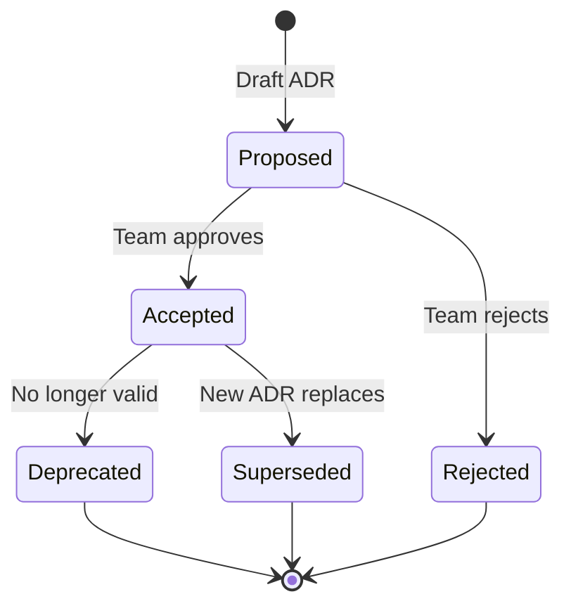

# 9. Architecture Decisions

<!--
Arc42 Section 9: Architecture Decisions
Documents important, expensive, large-scale, or risky architecture decisions.
Uses MADR (Markdown Any Decision Records) format.
-->

## Overview

This directory contains Architecture Decision Records (ADRs) that document significant architectural decisions made for this project.

## ADR Index

| ID | Title | Status | Date |
|----|-------|--------|------|
| ADR-001 | [Template](ADR-000-template.md) | Template | - |
| ADR-001 | {Decision title} | {Proposed/Accepted/Deprecated/Superseded} | {Date} |
| ADR-002 | {Decision title} | {Proposed/Accepted/Deprecated/Superseded} | {Date} |

## Decision Status Workflow

## When to Create an ADR

Create an ADR when:

- Choosing between multiple architectural approaches
- Making decisions that are hard or expensive to change
- Introducing new technologies or frameworks
- Changing existing architectural patterns
- Addressing significant technical debt

## ADR Lifecycle

1. **Propose**: Create ADR with "Proposed" status
2. **Discuss**: Review in architecture meeting
3. **Decide**: Update status to "Accepted" or "Rejected"
4. **Document**: Record date and participants
5. **Maintain**: Update status if superseded or deprecated

## Related Documents

- [Solution Strategy](../04-solution-strategy.md) - High-level decisions
- [Constraints](../02-constraints.md) - Decision constraints
- [Risks](../11-risks-technical-debt.md) - Decision risks

---

*Last Updated: {Date}*
