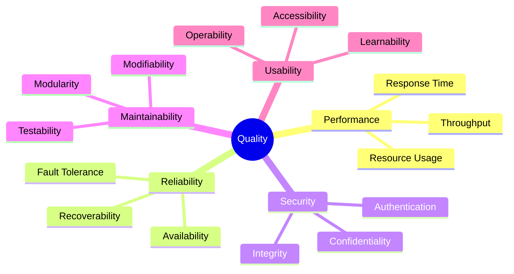
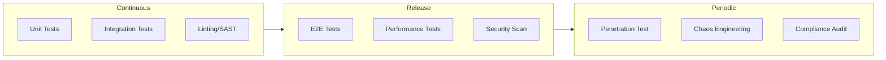

# 10. Quality Requirements

<!--
Arc42 Section 10: Quality Requirements
Details the quality requirements with scenarios and metrics.
Based on ISO 25010 quality model.
-->

## 10.1 Quality Tree

---

## 10.2 Quality Scenarios

### 10.2.1 Performance Scenarios

| ID | Scenario | Stimulus | Response | Measure |
|----|----------|----------|----------|---------|
| QS-P01 | Normal Load | 100 concurrent users | System responds | <500ms response time |
| QS-P02 | Peak Load | 500 concurrent users | System remains stable | <2s response time |
| QS-P03 | Batch Processing | 100K records import | Processing completes | <30 min total time |
| QS-P04 | Database Query | Complex search | Results returned | <1s query time |

#### Performance Targets

| Metric | Target | Measurement |
|--------|--------|-------------|
| API Response Time (P50) | <200ms | Application metrics |
| API Response Time (P95) | <500ms | Application metrics |
| API Response Time (P99) | <1000ms | Application metrics |
| Throughput | 1000 req/s | Load testing |
| Page Load Time | <3s | Real User Monitoring |

### 10.2.2 Reliability Scenarios

| ID | Scenario | Stimulus | Response | Measure |
|----|----------|----------|----------|---------|
| QS-R01 | Database Failure | Primary DB down | Failover to standby | <30s switchover |
| QS-R02 | Service Restart | Application crash | Auto-restart | <60s recovery |
| QS-R03 | Network Partition | Network split | Graceful degradation | No data loss |
| QS-R04 | Dependency Failure | External API down | Circuit breaker | Cached response |

#### Reliability Targets

| Metric | Target | Calculation |
|--------|--------|-------------|
| Availability | 99.9% | Uptime / Total time |
| MTBF | >720 hours | Mean Time Between Failures |
| MTTR | <1 hour | Mean Time To Recovery |
| Error Rate | <0.1% | Errors / Total requests |

### 10.2.3 Security Scenarios

| ID | Scenario | Stimulus | Response | Measure |
|----|----------|----------|----------|---------|
| QS-S01 | Authentication Attack | Brute force login | Account lockout | After 5 attempts |
| QS-S02 | Data Breach Attempt | SQL injection | Blocked, logged | 0 successful injections |
| QS-S03 | Session Hijacking | Stolen session | Session invalidation | Immediate |
| QS-S04 | Audit Request | Compliance audit | Full audit trail | 90 days retention |

#### Security Requirements

| Requirement | Standard | Compliance |
|-------------|----------|------------|
| Data Encryption (Rest) | AES-256 | Required |
| Data Encryption (Transit) | TLS 1.2+ | Required |
| Password Policy | NIST 800-63B | Required |
| Access Logging | All access logged | Required |
| Vulnerability Scanning | OWASP Top 10 | Weekly |

### 10.2.4 Maintainability Scenarios

| ID | Scenario | Stimulus | Response | Measure |
|----|----------|----------|----------|---------|
| QS-M01 | New Feature | Add new endpoint | Implement, test, deploy | <1 sprint |
| QS-M02 | Bug Fix | Critical bug found | Fix and deploy | <4 hours |
| QS-M03 | Dependency Update | Security patch | Update and deploy | <1 day |
| QS-M04 | Knowledge Transfer | New team member | Productive | <2 weeks |

#### Maintainability Metrics

| Metric | Target | Measurement |
|--------|--------|-------------|
| Code Coverage | >80% | Test coverage tools |
| Cyclomatic Complexity | <10 avg | Static analysis |
| Technical Debt Ratio | <5% | SonarQube |
| Documentation Coverage | >90% | API docs complete |

### 10.2.5 Usability Scenarios

| ID | Scenario | Stimulus | Response | Measure |
|----|----------|----------|----------|---------|
| QS-U01 | New User | First time use | Complete task | <10 min |
| QS-U02 | Error Recovery | User makes error | Clear guidance | Self-recovery |
| QS-U03 | Accessibility | Screen reader use | Fully accessible | WCAG 2.1 AA |
| QS-U04 | Mobile Access | Tablet user | Responsive UI | Full functionality |

---

## 10.3 Quality Requirements Matrix

| Quality Goal | Priority | Scenarios | Validation |
|--------------|----------|-----------|------------|
| Performance | High | QS-P01 to QS-P04 | Load testing |
| Reliability | High | QS-R01 to QS-R04 | Chaos engineering |
| Security | Critical | QS-S01 to QS-S04 | Penetration testing |
| Maintainability | Medium | QS-M01 to QS-M04 | Code review, metrics |
| Usability | Medium | QS-U01 to QS-U04 | User testing |

---

## 10.4 Quality Assurance Approach

### Testing Strategy

### Quality Gates

| Gate | Criteria | Enforcement |
|------|----------|-------------|
| PR Merge | Tests pass, coverage met, no blockers | CI pipeline |
| Staging Deploy | All tests pass, security scan clean | CD pipeline |
| Production Deploy | QA sign-off, performance validated | Manual approval |

---

## 10.5 Monitoring for Quality

### Quality Dashboards

| Dashboard | Metrics | Audience |
|-----------|---------|----------|
| System Health | Uptime, errors, latency | Operations |
| Performance | Response times, throughput | Development |
| Security | Failed logins, blocked requests | Security team |
| Business | User activity, conversions | Product |

### Alerting Rules

| Alert | Condition | Severity | Response |
|-------|-----------|----------|----------|
| High Error Rate | >1% errors | Critical | Immediate |
| Slow Response | P95 >2s | Warning | Investigate |
| Low Availability | <99.5% | Critical | Immediate |
| Security Event | Auth failures spike | Warning | Review |

---

## References

- [Introduction and Goals](01-introduction-goals.md) - Quality goals
- [Crosscutting Concepts](08-crosscutting-concepts.md) - Implementation details
- [Risks](11-risks-technical-debt.md) - Quality risks

---

*Last Updated: {Date}*
*Status: [ ] Draft / [ ] Review / [ ] Complete*
