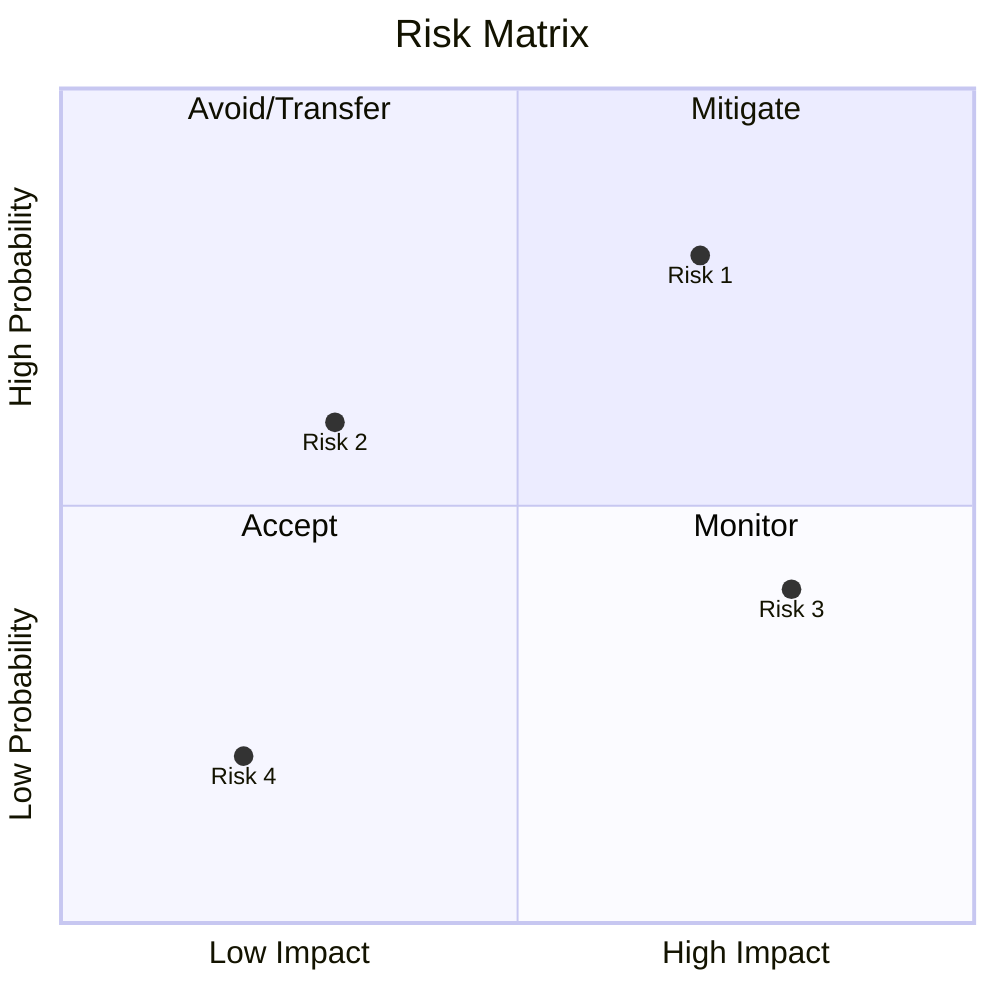
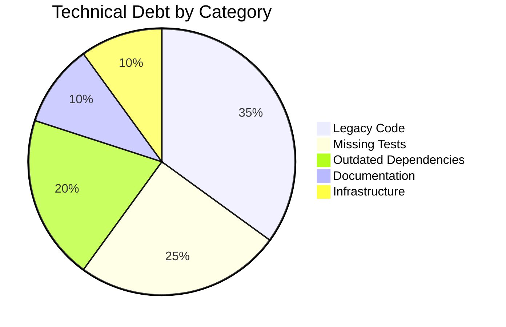
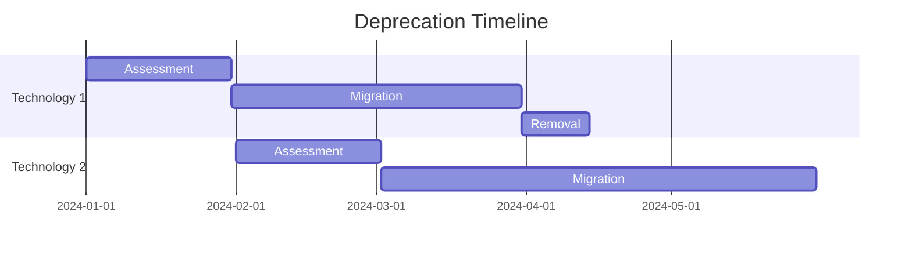

# 11. Risks and Technical Debt

<!--
Arc42 Section 11: Risks and Technical Debt
Documents known technical risks and accumulated technical debt.
-->

## 11.1 Risk Register

### Risk Matrix

### Active Risks

| Risk ID | Description | Probability | Impact | Score | Mitigation | Owner | Status |
|---------|-------------|-------------|--------|-------|------------|-------|--------|
| RISK-001 | {Description} | High | High | Critical | {Mitigation plan} | {Name} | Active |
| RISK-002 | {Description} | Medium | High | High | {Mitigation plan} | {Name} | Active |
| RISK-003 | {Description} | Medium | Medium | Medium | {Mitigation plan} | {Name} | Monitoring |
| RISK-004 | {Description} | Low | Low | Low | {Mitigation plan} | {Name} | Accepted |

### Risk Scoring

| Probability | Impact | Score |
|-------------|--------|-------|
| High (>70%) | High | Critical |
| High (>70%) | Medium | High |
| Medium (30-70%) | High | High |
| Medium (30-70%) | Medium | Medium |
| Low (<30%) | Any | Low |

---

## 11.2 Risk Details

### RISK-001: {Risk Title}

| Attribute | Value |
|-----------|-------|
| **Category** | Technology / Security / Operational / External |
| **Probability** | High / Medium / Low |
| **Impact** | High / Medium / Low |
| **Status** | Active / Mitigated / Accepted / Closed |
| **Owner** | {Name} |
| **Created** | {Date} |
| **Last Reviewed** | {Date} |

**Description**: {Detailed description of the risk}

**Root Cause**: {What causes this risk to exist?}

**Potential Impact**:
- {Impact 1}
- {Impact 2}

**Mitigation Strategy**:
1. {Action 1}
2. {Action 2}
3. {Action 3}

**Contingency Plan**: {What to do if risk materializes}

**Indicators**: {Early warning signs}

---

## 11.3 Technical Debt Register

### Debt Overview

### Technical Debt Items

| Debt ID | Description | Category | Severity | Effort | Interest | Owner |
|---------|-------------|----------|----------|--------|----------|-------|
| TD-001 | {Description} | Code | High | {days} | High | {Name} |
| TD-002 | {Description} | Dependencies | Medium | {days} | Medium | {Name} |
| TD-003 | {Description} | Testing | Medium | {days} | Low | {Name} |
| TD-004 | {Description} | Documentation | Low | {days} | Low | {Name} |

### Interest Explanation

| Interest Level | Description | Impact |
|----------------|-------------|--------|
| High | Affects every change | Slows all development |
| Medium | Affects some changes | Occasional delays |
| Low | Rarely encountered | Minimal ongoing impact |

---

## 11.4 Technical Debt Details

### TD-001: {Debt Title}

| Attribute | Value |
|-----------|-------|
| **Category** | Code / Architecture / Testing / Documentation / Dependencies / Infrastructure |
| **Severity** | Critical / High / Medium / Low |
| **Effort to Fix** | {days/weeks} |
| **Interest Rate** | High / Medium / Low |
| **Age** | {When introduced} |
| **Owner** | {Name} |

**Description**: {Detailed description}

**Why It Exists**: {Historical reason for the debt}

**Impact**:
- Development velocity: {impact}
- Maintenance burden: {impact}
- Risk exposure: {impact}

**Remediation Plan**:
1. {Step 1}
2. {Step 2}
3. {Step 3}

**Blocked By**: {Dependencies for fixing}

**Related Items**: TD-XXX, RISK-XXX

---

## 11.5 Deprecated Technologies

### Deprecation Schedule

| Technology | Current State | Target State | Deprecation Date | Owner |
|------------|---------------|--------------|------------------|-------|
| {Tech 1} | In production | Removed | {Date} | {Name} |
| {Tech 2} | Partial use | Migrated | {Date} | {Name} |
| {Tech 3} | Legacy only | Encapsulated | {Date} | {Name} |

### Migration Timeline

---

## 11.6 Known Vulnerabilities

### Vulnerability Summary

| ID | Severity | Component | CVE | Status | ETA |
|----|----------|-----------|-----|--------|-----|
| VUL-001 | Critical | {Component} | CVE-XXXX-XXXX | In Progress | {Date} |
| VUL-002 | High | {Component} | CVE-XXXX-XXXX | Planned | {Date} |
| VUL-003 | Medium | {Component} | CVE-XXXX-XXXX | Monitoring | - |

### Vulnerability Remediation

| Severity | SLA | Response |
|----------|-----|----------|
| Critical | 24 hours | Immediate patch or workaround |
| High | 7 days | Prioritized fix |
| Medium | 30 days | Planned fix |
| Low | 90 days | Normal backlog |

---

## 11.7 Debt Reduction Strategy

### Quarterly Goals

| Quarter | Focus Area | Target Reduction | Investment |
|---------|------------|------------------|------------|
| Q1 | Critical security | 30% | 20% capacity |
| Q2 | Legacy code | 20% | 15% capacity |
| Q3 | Testing debt | 25% | 15% capacity |
| Q4 | Dependencies | 25% | 10% capacity |

### Debt Prevention Practices

| Practice | Enforcement | Tooling |
|----------|-------------|---------|
| Code review | PR required | GitHub |
| Static analysis | CI gate | SonarQube |
| Dependency scanning | Weekly | Dependabot |
| Architecture review | Monthly | ADR process |

---

## 11.8 Tracking and Reporting

### Metrics Dashboard

| Metric | Current | Target | Trend |
|--------|---------|--------|-------|
| Total debt items | {n} | <50 | {up/down/stable} |
| Critical items | {n} | 0 | {up/down/stable} |
| Average age (days) | {n} | <90 | {up/down/stable} |
| Reduction rate | {%}/quarter | >10% | {up/down/stable} |

### Review Cadence

| Review | Frequency | Participants | Output |
|--------|-----------|--------------|--------|
| Risk review | Monthly | Architects, Leads | Updated register |
| Debt review | Bi-weekly | Team leads | Prioritized backlog |
| Vulnerability review | Weekly | Security, DevOps | Action items |

---

## References

- [Constraints](02-constraints.md) - Constraints causing risks
- [Quality Requirements](10-quality-requirements.md) - Quality impacts
- [ADRs](09-architecture-decisions/) - Related decisions

---

*Last Updated: {Date}*
*Status: [ ] Draft / [ ] Review / [ ] Complete*
