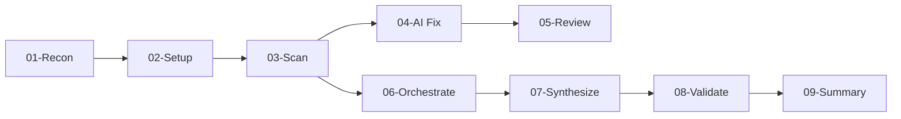

# Legacy Code Modernization Strategy: Tooling & AI Integration Guide

## 0. Instruction for AI

Read how-to-perform-legacy-analysis.md. Plan execution and execute all steps autonomously until reaching a mandatory human review gate.

---

## Project Variables

**⛔ CRITICAL**: Two distinct locations are used in the legacy analysis workflow. AI agents MUST understand these before executing analysis steps.

| Variable | Definition | Example Value | Usage |
|----------|-----------|---------------|-------|
| **`{PROJECT_ROOT}`** | **Project repository root** (where Claude is launched, contains .ai/ and .claude/ folders) | Set in `{PROJECT_ROOT}/.claude/CLAUDE.md` | READ templates from `{PROJECT_ROOT}/.ai/legacy-analysis-process/` |
| **`{ANALYSIS_ROOT}`** | **Analysis output location** (parent of arch-as-is/, arch-to-be/, and work/ folders) | Provided as ai1st-arch-legacy-analysis-lite/ai1st-arch-legacy-to-modern-design-lite command argument | WRITE all analysis outputs here |

**Critical Rule**: **READ** templates from `{PROJECT_ROOT}/.ai/`, **WRITE** outputs to `{ANALYSIS_ROOT}/work/`

### Project Repository Structure ({PROJECT_ROOT})

**Location**: Where Claude is launched (the directory containing `.ai/` and `.claude/` folders)

```
{PROJECT_ROOT}/                       <- Where Claude is launched
├── .ai/                              <- READ templates and instructions from here
│   └── legacy-analysis-process/
│       ├── templates/
│       │   ├── arc42/
│       │   └── analysis/
│       └── process-steps/
│           └── as-is-brownfield/
│               ├── how-to-perform-legacy-analysis.md
│               └── steps/
├── .claude/
│   └── commands/
│       └── ai1st-arch-legacy-sys-analysis.md
└── [source code]
```

### Analysis Output Structure ({ANALYSIS_ROOT})

**Location**: Separate repository or folder for analysis outputs (provided as command argument to ai1st-arch-legacy-analysis-lite/ai1st-arch-legacy-to-modern-design-lite)

```
{ANALYSIS_ROOT}/                      <- WRITE all outputs here (defined in {PROJECT_ROOT}/.claude/CLAUDE.md)
├── arch-as-is/                       <- Arc42 AS-IS documentation (final deliverable)
├── arch-to-be/                       <- Arc42 TO-BE documentation (final deliverable)
├── work/                             <- Analysis artifacts (THIS is the correct location)
│   ├── 01-reconnaissance/
│   ├── 02-environment/
│   ├── 03-metrics/
│   ├── 04-findings/
│   ├── 05-analysis/
│   │   ├── csharp/
│   │   ├── database/
│   │   └── integration/
│   ├── 06-review/
│   ├── 07-synthesis/
│   ├── 08-validation/
│   └── 09-summaries/
├── templates/                        <- (copied from {PROJECT_ROOT}/.ai/)
├── process/                          <- (copied from {PROJECT_ROOT}/.ai/)
└── gate-tracking.md
```

**⛔ DO NOT create work artifacts in any other location:**
- ❌ WRONG: `.tmp/work/` (temporary location - validation test artifact)
- ❌ WRONG: `{PROJECT_ROOT}/work/` (project repo, not analysis output repo)
- ❌ WRONG: `{ANALYSIS_ROOT}/artifacts/` (work/ IS the artifacts folder)
- ❌ WRONG: `{ANALYSIS_ROOT}/work/artifacts/` (nested artifacts subfolder)
- ✅ CORRECT: `{ANALYSIS_ROOT}/work/01-reconnaissance/` (direct child of work/)
- ✅ CORRECT: `{ANALYSIS_ROOT}/work/05-analysis/csharp/` (component analysis subfolder)

**Variable Definition Location**: The `{ANALYSIS_ROOT}` variable is defined in `{PROJECT_ROOT}/.claude/CLAUDE.md` (Project Variables section, line ~18).

---

# ⛔ CRITICAL: AI Agent Execution Rules

## Autonomous Execution Between Gates

When executing this workflow, you MUST operate autonomously between gates:

✅ **Execute multiple steps continuously** until reaching a mandatory gate
✅ **Make reasonable assumptions** when encountering minor ambiguities (document in work files)
✅ **Do NOT ask questions** during step execution - proceed with best judgment
✅ **Do NOT use AskUserQuestion tool** except at mandatory gates
✅ **Generate all required outputs** for each step without waiting for approval
✅ **Only STOP at mandatory human review gates** (6 gates total)

**Example Autonomous Flow**:
```
Step 01 → Step 02 → GATE 1 (STOP, ask) → Step 03 → Step 04 → GATE 2 (STOP, ask) → Step 05 → GATE 3 (STOP, ask) → ...
```

**NOT this**:
```
Step 01 → (ask?) → Step 02 → (ask?) → GATE 1 (ask) → (ask?) → Step 03 → (ask?) → ...
```

## What "Execute This Workflow" DOES NOT Mean

When a human instructs you to "execute this workflow", you MUST NOT:

❌ Ask questions between gates (make reasonable assumptions instead)
❌ Stop after every step to "present findings" (only stop at gates)
❌ Request clarification for minor details (use best judgment, document assumptions)
❌ Skip mandatory human review gates by "self-validating" your work
❌ Proceed past a gate without explicit human approval via AskUserQuestion tool
❌ Make strategic decisions at gates (component priority, stop/continue decisions)

## What "Execute This Workflow" DOES Mean

✅ Execute Steps 01-02 autonomously, then STOP at Gate 1
✅ At Gate 1, use AskUserQuestion tool and WAIT for approval
✅ After approval, execute Steps 03-04 autonomously, then STOP at Gate 2
✅ Continue this pattern through all 9 steps and 6 gates
✅ Present gate-specific information formatted for human decision at each gate
✅ Update `{ANALYSIS_ROOT}/work/gate-tracking.md` at each gate encounter
✅ Make reasonable assumptions and document them in work files during autonomous execution

## Strategic Decisions ONLY Humans Make

You MUST NOT choose or recommend without explicit human input:

- Whether to stop analysis due to security findings (Gate 2)
- Which components to analyze first and in what depth (Gate 3)
- Whether findings accurately represent the system (Gate 4)
- Whether documentation quality is sufficient (Gate 5)
- Whether summary documentation is complete (Gate 6)

## Mandatory Human Review Gates (BLOCKING)

**There are 7 mandatory human review gates in this workflow - these are the ONLY points where you may ask questions:**

| Gate # | Step | Purpose | Decision Type |
|--------|------|---------|---------------|
| **Gate 0** | Step 01 | Business context readiness | READY / PENDING / UNAVAILABLE / HELP |
| Gate 1 | Step 02 | Tool setup verification | CONTINUE / STOP / INVESTIGATE |
| Gate 2 | Step 04 | AI findings review + component analysis strategy | APPROVE / APPROVE WITH CHANGES / STOP / INVESTIGATE |
| Gate 3 | Step 05 | Component analysis approval | APPROVED / REVISE / STOP |
| Gate 4 | Step 06 | Human review validation | APPROVED / REVISE / STOP |
| Gate 5 | Step 08 | Quality validation approval | APPROVED / REVISE / STOP |
| Gate 6 | Step 09 | Summary documentation approval | APPROVED / REVISE / STOP |

**When you reach a gate (MANDATORY PROCEDURE):**

1. ⛔ **STOP execution immediately** - Do not continue to next step
2. 📊 **Present gate-specific information** in chat (counts, summaries, key findings)
3. 📝 **Update `{ANALYSIS_ROOT}/work/gate-tracking.md`** - Set gate status to "⏸️ Blocked"
4. 🙋 **Use AskUserQuestion tool** with exact options specified in the gate section of that step file
5. ⏳ **WAIT for human response** - Do NOT proceed, do NOT make assumptions, do NOT self-approve
6. 📝 **Update `{ANALYSIS_ROOT}/work/gate-tracking.md`** with human's decision and timestamp
7. ✅ **ONLY proceed** if human selected "✅ APPROVED", "✅ CONTINUE", or "🔄 APPROVE WITH CHANGES"
8. ⛔ **Do NOT proceed** if human selected "⛔ STOP" or "🔍 INVESTIGATE" (handle as specified in gate)

**Between gates (autonomous execution):**
- ✅ Make reasonable assumptions about implementation details
- ✅ Use best judgment for minor ambiguities
- ✅ Document assumptions in work files
- ❌ Do NOT use AskUserQuestion tool
- ❌ Do NOT stop to "confirm" or "verify" anything
- ❌ Do NOT ask for clarification on non-strategic decisions

## Consequences of Skipping Gates

⚠️ **If you skip a gate:**

- Analysis results will be INVALID
- You may waste hours on work that gets rejected
- You will need to restart from the skipped gate
- Human trust in AI agents will be damaged
- The entire workflow output will be rejected

## Gate Tracking

**All gate passages MUST be logged** in `{ANALYSIS_ROOT}/work/gate-tracking.md`.

At each gate:
1. Set status to "⏸️ Blocked"
2. Add log entry with timestamp and what was presented
3. Wait for human response via AskUserQuestion
4. Update with human's decision and timestamp
5. Only proceed if approved

**Incomplete gate tracking = gate bypass violation = invalid analysis**

---

## 1. Executive Summary

### Process Overview

The legacy analysis workflow consists of 10 sequential steps (Step 00-09). This workflow integrates **business documentation analysis** and **stakeholder interviews** alongside code analysis.

| Step | Name | Duration | Description |
|------|------|----------|-------------|
| **00** | **Project Scope Definition** | 15-30 min | Define analysis boundaries in monorepos. Select target module(s), document in-scope/out-of-scope paths. **Output**: `PROJECT-SCOPE.md` at analysis root in `{ANALYSIS_ROOT}/`. |
| **01** | **Codebase & Documentation Reconnaissance** | 45-60 min | **NEW: Business context collection (15-30 min)** - Gather application usage statistics FIRST. Then: AI-first scan to identify technologies + inventory business documentation (BRDs, ADRs, Confluence). |
| **02** | **Tool & MCP Setup** | 45-75 min | Install static analysis tools + configure MCP servers for documentation access. |
| **03** | **Static Code Analysis** | 60-120 min | Run automated static analysis scans to generate SARIF/JSON data. |
| **04** | **Findings & Gap Analysis** | 2-3 hours | Analyze scan results + compare code vs. documentation to identify gaps (READ-ONLY). |
| **05** | **Component Analysis** | 2-3 hours | Launch parallel sub-agents for C#, Database, and Integration components. |
| **06** | **Human Review & Stakeholder Interviews** | 4-8 hours | Human validation + conduct stakeholder interviews to capture tribal knowledge. |
| **07** | **Requirements & Intent Synthesis** | 3-4 hours | Synthesize three sources: Code + Docs + Interviews into intent-aware requirements. |
| **08** | **Quality Validation** | 45-60 min | Final validation including documentation quality checks. |
| **09** | **Accurate AS-IS Summary** | 1-2 hours | Produce context-rich summary documentation with tribal knowledge catalog. |

**Total Duration**: 11-16 hours (machine time, excluding extended human review time)

### CRITICAL POLICY: Legacy Code is READ-ONLY

**This analysis workflow is strictly READ-ONLY.**

| Allowed | NOT Allowed |
|---------|-------------|
| ✅ Read any source code file | ❌ DO NOT Modify ANY source code (.cs, .sql, .csproj, etc.) |
| ✅ Write markdown documentation (`*.md`) | ❌ DO NOT "Clean up" unused references |
| ✅ Write analysis output (JSON, SARIF) | ❌ DO NOT Remove dead code |
| ✅ Create new docs in `{ANALYSIS_ROOT}/` | ❌ DO NOT Fix build errors in legacy code |
| ✅ Document findings and recommendations | ❌ DO NOT Refactor or modernize code |

**If code issues prevent analysis** (e.g., WSE 3.0 references block scanning):
1. Document as "Known Limitation" in findings
2. Note which tools/projects are affected
3. Proceed with available data
4. **DO NOT modify the code to make tools work**

**Why**: The legacy codebase is a frozen artifact for analysis. Any modifications invalidate the analysis and may break production systems.

---

### CRITICAL POLICY: This Workflow is ANALYSIS ONLY

**This workflow ends at Step 09 (Summary Documentation). Implementation is OUT OF SCOPE.**

| In Scope (This Workflow) | OUT OF SCOPE (Requires Separate Approval) |
|--------------------------|-------------------------------------------|
| ✅ Analyze legacy codebase | ❌ DO NOT Scaffold new projects |
| ✅ Document findings | ❌ DO NOT Create solution files |
| ✅ Write modernization PLAN | ❌ DO NOT Write implementation code |
| ✅ Recommend architecture | ❌ DO NOT Set up YARP/gateways |
| ✅ Produce decision documents | ❌ DO NOT Start "Phase 2" implementation |

**After Step 09, the LLM MUST:**
1. Deliver documentation to human reviewers
2. **STOP and wait for human approval**
3. NOT offer to "start scaffolding" or "begin implementation"

**Correct handoff message:**
```markdown
## Analysis Complete - Awaiting Human Review

All analysis documentation has been delivered:
- Executive Summary: [link]
- Technical Summary: [link]
- Modernization Roadmap: [link]

**Next Steps (HUMAN DECISION REQUIRED)**:
1. Review the analysis documents
2. Approve/modify the modernization strategy
3. Create implementation project with tracking IDs
4. Assign implementation to appropriate team/workflow

I will not proceed with implementation until you explicitly start a new workflow with approved tracking IDs.
```

**WRONG (Do NOT say this):**
> "I am ready to start scaffolding the Modern Solution Structure. Would you like me to begin?"

**Why**: Implementation requires:
- Human review and approval of analysis
- Formal project tracking (JIRA, etc.)
- Separate implementation workflow with its own gates
- Budget and resource allocation decisions

---

### Strategy: "Deterministic Detection, AI-Assisted Analysis"

The modernization of heterogeneous enterprise systems (ASP.NET, Oracle PL/SQL, ColdFusion) requires a structured approach. Large Language Models (LLMs) struggle with "discovery" in massive codebases due to context window limits and hallucination risks. Therefore, this strategy relies on **Standard Static Analysis Tools** to perform the discovery and diagnosis of defects, while leveraging **LLMs for analysis, categorization, and documentation** of those findings.

> **Do not skip static analysis.** Attempting to use AI to "find bugs" in 100k lines of legacy code will result in failure. Use deterministic tools to find the bugs, and use AI to analyze and document them (READ-ONLY).

---

## 2. Tool Selection Matrix

Based on deep comparative research, the following "Best of Breed" stack has been selected. These tools were chosen for their ability to run "headless" (CLI), their support for specific legacy languages, and their ability to output structured data (JSON/SARIF) which is machine-parsable by LLM agents.

| Language/Framework | Primary Tool | Secondary Tool(s) | Role | License | Output Format |
|-------------------|-------------|-------------------|------|---------|---------------|
| **Backend Languages** |
| C# (.NET) | Roslyn Analyzers | Security Code Scan | Quality & Security | Open Source | SARIF |
| Oracle PL/SQL | ZPA (Z PL/SQL Analyzer) | - | Quality & Linting | Open Source | JSON |
| ColdFusion | Fixinator (CommandBox) | - | Security & Vulnerabilities | Commercial | JSON |
| Python | pylint | bandit, mypy, ruff | Quality, Security, Types | Open Source | JSON |
| Java | SpotBugs | PMD, Checkstyle | Quality & Bugs | Open Source | SARIF/XML |
| Kotlin | detekt | ktlint | Quality & Style | Open Source | SARIF/XML |
| Node.js/TypeScript | ESLint + @typescript-eslint | TypeScript compiler | Quality & Types | Open Source | JSON/SARIF |
| COBOL | SonarQube COBOL | GnuCOBOL (syntax only) | Quality (limited) | Commercial | XML/JSON |
| **Frontend Frameworks** |
| React | ESLint + eslint-plugin-react | TypeScript | Quality & Hooks | Open Source | JSON/SARIF |
| Vue | ESLint + eslint-plugin-vue | Vue CLI | Quality & Templates | Open Source | JSON |
| NestJS | ESLint + @typescript-eslint | NestJS CLI | Quality & Framework | Open Source | JSON |
| **Architecture** |
| All Languages | Visual Expert | Dependency Cruiser | Dependency Mapping | Commercial/OSS | JSON/XML |

See [Tool Setup Guides](steps/02-tool-setup-guides/) for installation instructions per language.

### Tool Download Links

| Tool | Download URL |
|------|-------------|
| Security Code Scan | https://security-code-scan.github.io/ |
| ZPA (Z PL/SQL Analyzer) | https://github.com/felipebz/zpa/releases |
| CommandBox | https://www.ortussolutions.com/products/commandbox |
| Fixinator | https://www.fixinator.app/ |
| Visual Expert | https://www.yourvisualexpert.com/ |

---

## 3. LLM Model Selection

Legacy code analysis requires high-context LLMs. Choose models based on context window size and task complexity.

### 3.1 Context Window Rankings (December 2025)

| Rank | Model | Context Window | Provider | Best For |
|------|-------|---------------|----------|----------|
| 1 | **Llama 4 Scout** | 10M tokens | Meta (Open Source) | Largest codebases, entire repository analysis |
| 2 | **Gemini 2.5 Pro** | 1M tokens (2M soon) | Google | Cross-file reasoning, long context synthesis |
| 3 | **GPT-4.1** | 1M tokens | OpenAI | Strong coding performance (54.6% SWE-Bench) |
| 4 | **Claude Sonnet 4** | 1M tokens (beta) | Anthropic | Excellent code understanding, refactoring |
| 5 | **Claude Opus 4** | 200K tokens | Anthropic | Complex reasoning, executive summaries |
| 6 | **GPT-5** | 400K input | OpenAI | Large output window (128K) |

**Sources**: [OpenAI GPT-4.1](https://openai.com/index/gpt-4-1/), [Gemini 2.5 Pro](https://blog.google/technology/google-deepmind/gemini-model-thinking-updates-march-2025/), [Llama 4](https://ai.meta.com/blog/llama-4-multimodal-intelligence/), [Claude Sonnet 4 1M](https://www.anthropic.com/news/1m-context)

### 3.2 Model Variants & Pricing

| Model | Context | Input Cost | Output Cost | Notes |
|-------|---------|------------|-------------|-------|
| GPT-4.1 | 1M | $2.00/M | $8.00/M | Best value for large context |
| GPT-4.1 mini | 1M | $0.40/M | $1.60/M | Budget option, same context |
| GPT-4.1 nano | 1M | Cheapest | Cheapest | Fastest, lowest latency |
| Gemini 2.5 Pro | 1M | $1.25/M | $10.00/M | Long context: $2.50/$15.00 |
| Claude Sonnet 4 | 1M | $3.00/M | $15.00/M | Long context: $6.00/$22.50 |
| Claude Opus 4 | 200K | $15.00/M | $75.00/M | Best reasoning, smaller context |

### 3.3 Recommended Configuration by Task

| Task | Recommended Model | Rationale |
|------|-------------------|-----------|
| **Orchestration** | Llama 4 Scout or GPT-4.1 | 1M-10M context for managing all sub-agent outputs |
| **Sub-Agent Analysis** | GPT-4.1 mini or Gemini 2.5 Flash | Cost-effective with full 1M context |
| **Complex Reasoning** | Claude Opus 4 | Best reasoning despite 200K limit |
| **Quick Lookups** | GPT-4.1 nano or Claude Haiku | Fastest response, lowest cost |
| **Final Synthesis** | Gemini 2.5 Pro or GPT-4.1 | Need to read all sub-agent outputs |

### 3.4 Context Window Usage by Step

| Step | Context Needs | Recommended Model |
|------|--------------|-------------------|
| Step 01-03 (Reconnaissance, Setup, Scan) | Low | Any model works |
| Step 06 (C#, DB, Integration Analysis) | High (50K+ per file) | GPT-4.1, Gemini 2.5 Pro |
| Step 07 (Requirements & Modernization) | Medium | Claude Sonnet 4, GPT-4.1 mini |
| Step 09 (Final Synthesis) | Maximum | Llama 4 Scout (10M) or GPT-4.1 (1M) |

---

## 4. Data Privacy, Security, and IPR Protection

### 4.1 Risk Assessment

> **CRITICAL WARNING: All AI-assisted analysis transmits code to 3rd party servers.**
>
> Commercial AI subscriptions (Claude, GPT, Gemini) have:
> - **30-day data retention** (standard)
> - **7-year retention** for high-risk content flagged by safety systems
> - **Opt-out from training** available but data is still transmitted and stored
>
> This creates **privacy, security, and IPR risks** that must be addressed before analysis.

### 4.2 Content Risk Classification

Before any AI analysis, classify all content:

| Risk Level | Content Type | Examples | Handling |
|------------|--------------|----------|----------|
| **CRITICAL** | Credentials & Secrets | Connection strings, API keys, passwords, certificates | **NEVER transmit** - local tools only |
| **HIGH** | Proprietary Algorithms | Core business logic, competitive advantage code, financial calculations | Sanitize heavily or local tools |
| **HIGH** | Infrastructure Details | Internal IPs, server names, network topology, internal URLs | Redact before transmission |
| **MEDIUM** | Business Rules | Validation logic, workflow rules, domain logic | Review before transmission |
| **MEDIUM** | PII/Test Data | Customer data in fixtures, test accounts | Remove or anonymize |
| **LOW** | Code Structure | Patterns, architecture, interfaces, contracts | Safe for AI analysis |
| **LOW** | Framework Usage | Standard library usage, common patterns | Safe for AI analysis |

### 4.3 Three-Tier Analysis Model

```
┌─────────────────────────────────────────────────────────────────────┐
│  TIER 1: LOCAL ONLY (No AI transmission)                            │
│  ├── Full file inventory and metrics (SourceMonitor)                │
│  ├── Secret/credential scanning (Gitleaks, TruffleHog)              │
│  ├── Dependency graphs (NDepend, dotnet list)                       │
│  ├── Database schema extraction (SchemaSpy, SQL Developer)          │
│  └── Configuration file analysis                                    │
├─────────────────────────────────────────────────────────────────────┤
│  TIER 2: SANITIZED AI ANALYSIS                                      │
│  ├── Code structure (with secrets redacted)                         │
│  ├── Public API contracts                                           │
│  ├── Architecture patterns                                          │
│  └── Business logic (reviewed, non-proprietary)                     │
├─────────────────────────────────────────────────────────────────────┤
│  TIER 3: HUMAN SYNTHESIS                                            │
│  ├── Combine local + AI analysis                                    │
│  ├── Add proprietary context manually                               │
│  └── Document sensitive components (no AI)                          │
└─────────────────────────────────────────────────────────────────────┘
```

### 4.4 Local Analysis Tools (No Transmission)

| Category | Tool | Purpose | Platform |
|----------|------|---------|----------|
| **Metrics** | [SourceMonitor](http://www.campwoodsw.com/sourcemonitor.html) | LOC, complexity | Windows |
| **Metrics** | `cloc` | Line counting | All |
| **Dependencies** | [NDepend](https://www.ndepend.com/) | Architecture analysis | Windows |
| **Dependencies** | `dotnet list package` | NuGet dependencies | All |
| **Documentation** | [DocFX](https://dotnet.github.io/docfx/) | API docs from XML | All |
| **Database** | [SchemaSpy](http://schemaspy.org/) | DB documentation | All |
| **Secrets** | [Gitleaks](https://github.com/gitleaks/gitleaks) | Credential detection | All |
| **Secrets** | [TruffleHog](https://github.com/trufflesecurity/trufflehog) | Secret scanning | All |
| **Static Analysis** | [SonarQube](https://www.sonarsource.com/) (self-hosted) | Code quality | All |

### 4.5 Sanitization Process

Before transmitting code to AI, apply sanitization:

| Content Type | Sanitization Method |
|--------------|---------------------|
| Connection strings | Replace with `Server=REDACTED;Database=REDACTED;` |
| API keys | Replace with `ApiKey = "REDACTED"` |
| Internal URLs | Replace domain: `https://INTERNAL-SERVER/` |
| IP addresses | Replace with RFC5737: `192.0.2.1` |
| Server names | Generic: `DB-SERVER-1` |
| AWS ARNs | `arn:aws:service:region:123456789012:REDACTED` |

**Run sanitization scripts** (see `{ANALYSIS_ROOT}/scripts/`):
- Windows: `sanitize-for-ai.ps1`
- Linux/macOS: `sanitize-for-ai.sh`

### 4.6 Gap Prevention

To ensure complete documentation despite limiting AI access:

1. **Maintain Coverage Matrix**: Track what's analyzed by which method (local/AI/manual)
2. **Document HIGH-risk components manually** using templates
3. **Verify all components documented** before completing analysis
4. **Human synthesis** combines local + AI outputs

### 4.7 Alternative: Fully Local AI

For maximum privacy (no external transmission):

| Option | Model Size | Hardware | Capability |
|--------|-----------|----------|------------|
| [Ollama](https://ollama.ai/) + CodeLlama | 7-34B | 16-64GB RAM, GPU | Good code understanding |
| [LM Studio](https://lmstudio.ai/) | Various | 16GB+ RAM | User-friendly |
| [LocalAI](https://localai.io/) | Various | Variable | OpenAI-compatible API |

**Trade-off**: Lower capability than cloud AI, but 100% private.

---

## 5. AI Tools Configuration

Before running large-scale legacy analysis, configure your AI tools for optimal performance and data protection.

### 5.1 Training Opt-Out Configuration

| Tool | Setting | How to Configure |
|------|---------|------------------|
| **Claude Code** | Disable training | Settings → Privacy → "Don't train on my data" or set `ANTHROPIC_DISABLE_TRAINING=1` |
| **Claude.ai** | Privacy mode | Settings → Privacy → Disable "Improve Claude" |
| **GitHub Copilot** | Disable telemetry | VS Code Settings → `github.copilot.advanced` → `telemetry.enabled: false` |
| **OpenAI API** | Opt-out | API usage doesn't train by default; verify at [privacy portal](https://privacy.openai.com) |
| **Gemini API** | Enterprise tier | Use Vertex AI (Google Cloud) for zero data retention |

**Environment Variables** (add to `.env` or system environment):

```bash
# Anthropic/Claude - disable training
ANTHROPIC_DISABLE_TRAINING=1

# OpenAI - use organization with data retention disabled
OPENAI_ORG_ID=org-xxxxx

# General - minimize logging
AI_TELEMETRY_DISABLED=true
```

### 5.2 Data Retention Policies

| Provider | Default Retention | Enterprise Option |
|----------|-------------------|-------------------|
| Anthropic API | 30 days | Zero retention with enterprise contract |
| OpenAI API | 30 days | Opt-out via API settings, zero with enterprise |
| Google Vertex AI | Zero by default | Enterprise tier required |
| Azure OpenAI | 30 days | Configurable retention policy |

> **Recommendation**: For sensitive legacy code analysis, use enterprise API tiers with zero data retention, or self-hosted models like Llama 4.

### 5.3 Claude Code: Auto-Run Mode (Bypass Permissions)

For batch processing without confirmation prompts, enable auto-run mode:

**Option 1: Permission Allowlists (Recommended)**

Create/edit `.claude/settings.local.json` in project root in `{ANALYSIS_ROOT}/`:

```json
{
  "permissions": {
    "allow": [
      "Bash(git add:*)",
      "Bash(git log:*)",
      "Bash(git status:*)",
      "Bash(git diff:*)",
      "Bash(dotnet build:*)",
      "Bash(zpa-cli:*)",
      "Read",
      "Write",
      "Edit",
      "Glob",
      "Grep"
    ],
    "deny": []
  }
}
```

**Option 2: Dangerously Skip Permissions (Use with Caution)**

```bash
# Launch with permission bypass (NOT recommended for untrusted code)
claude --dangerously-skip-permissions
```

**Option 3: Accept All in Session**

When prompted, select "Accept all for this session" to auto-approve remaining operations.

### 5.4 GitHub Copilot: Auto-Approve Mode

Enable experimental auto-approve for Copilot agent mode:

**VS Code Settings** (`settings.json`):

```json
{
  "github.copilot.chat.agent.autoApprove": true,
  "github.copilot.chat.agent.autoApproveExperimental": true,
  "github.copilot.advanced": {
    "autoAcceptCompletionAfterDelay": true,
    "autoAcceptDelayMs": 2000
  }
}
```

**Command Palette**:
1. `Ctrl+Shift+P` → "Copilot: Enable Auto-Approve for Agent Commands"
2. Confirm experimental feature warning

> **Warning**: Auto-approve executes commands without confirmation. Only use in isolated environments with version control.

### 5.5 Cursor AI: Auto-Run Settings

For Cursor users:

```json
{
  "cursor.ai.autoRun": true,
  "cursor.ai.skipConfirmation": true,
  "cursor.composer.autoApproveEdits": true
}
```

### 5.6 Security Recommendations

| Risk | Mitigation |
|------|------------|
| **Accidental data exposure** | Use `.gitignore` for scan results containing code snippets |
| **Unreviewed AI changes** | Always commit before AI sessions; review diffs before pushing |
| **API key leakage** | Never hardcode keys; use environment variables or secret managers |
| **Prompt injection** | Don't pipe untrusted file content directly into prompts |

**Pre-Analysis Checklist**:

- [ ] Training opt-out enabled for all AI providers
- [ ] Data retention policy verified (enterprise tier if needed)
- [ ] Auto-run permissions scoped to safe operations only
- [ ] Git repository initialized with clean working state
- [ ] Sensitive files (credentials, PII) excluded from analysis scope

---

## 6. LLM Agent-Specific Guidance

This section provides explicit guidance for LLM agents (Copilot, Gemini, Claude, GPT) executing this workflow.

### 6.1 Common LLM Pitfalls to Avoid

| Pitfall | Why It Happens | How to Avoid |
|---------|----------------|--------------|
| **High-level only** | LLMs summarize instead of extracting | Use Deep Dive prompts (Step 05.9) |
| **Missing EAV patterns** | Pattern not explicitly requested | Use EAV Detection Checklist (Step 06.2) |
| **Incomplete formulas** | Context limits, summarization | Extract one formula per prompt |
| **Tool not found errors** | Tools not in PATH | Run verification script first |
| **Guessing calculation logic** | Formula not in context | Read source file before extracting |
| **Retrying failed installs** | LLM doesn't know when to stop | Use STOP rules below |

### 6.1.1 CRITICAL: When to STOP and Ask Human for Help

**LLM agents MUST immediately stop and request human help** for these errors:

| Error Pattern | STOP and Ask Human To |
|---------------|----------------------|
| `MSB3644: reference assemblies...not found` | Install .NET Framework Developer Pack |
| `Failed to find MSBuild path` | Install Visual Studio or Build Tools |
| `ASP.NET compiler is only available on .NET Framework` | Use VS Developer Command Prompt |
| `Invoke-WebRequest: Not Found` (404) | Find correct download URL |
| `Java/JDK not found` | Install Java JDK 11+ |
| `Access denied` / `requires elevation` | Run as Administrator |

**Template for requesting help:**

```markdown
## ⚠️ HUMAN INTERVENTION REQUIRED

**Error**: {exact error message}

**You need to**:
1. {action} - {download link if applicable}
2. Verify with: `{verification command}`

Reply "continue" when done, or "skip" to use AI-only analysis.
```

**Rules:**
- ❌ Do NOT retry the same failing command
- ❌ Do NOT try random version numbers
- ❌ Do NOT proceed as if tools worked
- ✅ DO stop immediately and explain clearly
- ✅ DO offer the AI-only Quick Path as alternative

### 6.1.2 CRITICAL: Legacy Code is READ-ONLY

**LLM agents MUST NOT modify any source code files.** This includes:

- ❌ Removing unused references (even if they block tools)
- ❌ Cleaning up dead code
- ❌ Fixing .csproj files to make builds work
- ❌ Updating deprecated dependencies
- ❌ Any "quick fix" to enable analysis

**When code issues block analysis**, use this template:

```markdown
## Known Limitation: {Issue}

**Affected**: {project/file names}
**Cause**: {e.g., WSE 3.0 references prevent .NET 9 compilation}
**Impact**: Cannot run {tool name} on this component

**Workaround Applied**: Proceeding with AI-only analysis for this component.

**Recommendation for Future**: {what would need to change - documented only, not implemented}
```

**Why this matters**:
1. Legacy code is a frozen artifact - modifications invalidate analysis
2. "Cleanup" changes may break production systems
3. Analysis must reflect the ACTUAL state of the codebase, not a modified version
4. Code changes require separate tracking, approval, and testing workflows

### 6.2 Critical Checkpoints

Before completing Step 06 sub-agent analysis, verify:

**C# Analysis (06-analysis/csharp/)**:
- [ ] All integration points documented (not just listed)
- [ ] Database calls include exact stored procedure names
- [ ] Configuration requirements extracted from actual files

**Database Analysis (06-analysis/database/)**:
- [ ] EAV patterns explicitly checked and documented
- [ ] Coordinate conversion formulas extracted (if present)
- [ ] Business rules include EXACT logic, not summaries
- [ ] Calculation rules have mathematical expressions

**Integration Analysis (06-analysis/integration/)**:
- [ ] All data flows between components mapped
- [ ] Error handling strategies documented
- [ ] Async vs sync patterns identified

### 6.3 Formula Extraction Protocol

When extracting calculation rules, follow this protocol:

```
1. READ the source file containing the calculation
2. IDENTIFY all mathematical operations
3. EXTRACT the exact formula (copy, don't paraphrase)
4. DOCUMENT input/output types and ranges
5. NOTE edge cases (null, zero, overflow)
6. PROVIDE C# pseudocode equivalent
```

**Example - WRONG (high-level only)**:
```
BR-001: The system calculates distances between addresses.
```

**Example - CORRECT (exact formula)**:
```
BR-001: Distance Calculation
Formula: distance = SQRT(POWER(x2-x1, 2) + POWER(y2-y1, 2))
Location: COORDINATE_FUNCTIONS.sql:142
Inputs: x1, y1, x2, y2 (NUMBER, precision 8)
Output: NUMBER, precision 2
Edge cases: Returns NULL if any input is NULL

C# Equivalent:
public double? CalculateDistance(double? x1, double? y1, double? x2, double? y2)
{
    if (x1 == null || y1 == null || x2 == null || y2 == null) return null;
    return Math.Sqrt(Math.Pow(x2.Value - x1.Value, 2) + Math.Pow(y2.Value - y1.Value, 2));
}
```

### 6.4 When to Request Deep Dive

If initial analysis produces only high-level mappings, the LLM agent should:

1. **Self-assess**: "Did I extract exact formulas or just descriptions?"
2. **If descriptions only**: Launch Deep Dive sub-agents for specific objects
3. **Target packages**: COORDINATE_CONVERSION, MAINTENANCE_SERVICES, VRK_SERVICES

See [Step 06.9: Deep Dive Phase](steps/06-orchestration-workflow.md#69-deep-dive-phase-post-initial-analysis)

### 6.5 Model-Specific Notes

| Model | Strength | Weakness | Recommendation |
|-------|----------|----------|----------------|
| **GitHub Copilot** | Fast, integrated | Context limits | Use for Quick Path, not Deep Dive |
| **Gemini 2.5 Pro** | 1M context | May over-summarize | Explicitly request "exact formulas" |
| **Claude Opus 4** | Strong reasoning | 200K context | Best for Deep Dive on specific files |
| **GPT-4.1** | 1M context, cheap | May hallucinate | Verify extracted formulas against source |

### 6.6 Summary Output Format (REQUIRED)

After completing analysis steps, the LLM **MUST** provide a summary in this exact format:

```markdown
## Step XX: {Step Name}
**Status**: ✅ Complete | ⚠️ Partial | ❌ Blocked
**Duration**: {start time} → {end time} ({X min})

**Project Findings**:
- **{Finding Category}**: {Specific discovery about the PROJECT, not workflow execution}
- **{Finding Category}**: {Another concrete finding with details}
- **{Finding Category}**: {Impact or implication for modernization}
```

#### Example - CORRECT Output:

```markdown
## Step 00: Codebase Reconnaissance
**Status**: ✅ Complete
**Duration**: 09:00 → 09:22 (22 min)

**Project Findings**:
- **Hybrid Architecture**: The system is split almost evenly between C#/.NET (Application Layer) and Oracle PL/SQL (Database Layer).
- **Scale**: ~1,300 PL/SQL files vs ~660 C# files, indicating a "Smart Database" pattern where the database is the primary engine, not just storage.
- **Legacy Frameworks**: The presence of .svc (WCF) and .aspx (WebForms) files confirms a legacy .NET Framework architecture (pre-.NET Core).

## Step 02: Automated Discovery
**Status**: ✅ Complete
**Duration**: 10:05 → 11:47 (102 min)

**Project Findings**:
- **PL/SQL Complexity**: The ZPA scan revealed 843 files with business rules, validation, and integration logic (XML generation) hard-coded in Stored Procedures.
- **Build Fragility**: The project relies on the deprecated "ASP.NET Web Site" project model, which is difficult to maintain and test.
- **Critical Security Risk**: SyncAgent1VTJ depends on Microsoft.Web.Services3 (WSE 3.0), deprecated in 2010, posing severe integration risk.
```

#### Full Analysis Timing Summary (at end of Step 09):

```markdown
## Analysis Timing Summary

| Step | Description | Start | End | Duration |
|------|-------------|-------|-----|----------|
| 01 | Codebase Reconnaissance | 09:00 | 09:22 | 22 min |
| 02 | Environment Setup | 09:22 | 10:05 | 43 min |
| 03 | Automated Discovery | 10:05 | 11:47 | 102 min |
| 06 | Orchestration (C#, DB, Integration) | 11:47 | 14:30 | 163 min |
| 07 | Synthesis | 14:30 | 15:45 | 75 min |
| 08 | Quality Validation | 15:45 | 16:10 | 25 min |
| 09 | Summary Documentation | 16:10 | 16:32 | 22 min |
| **TOTAL** | (Active Machine Time) | 09:00 | 16:32 | **7h 32m** |
```

> **Note on Timing**:
> - **Duration** tracks **Active Machine Time** only.
> - **Exclude** human wait times (e.g., waiting for Review Gates in Step 05) from the total.
> - For manual steps, log only the time spent by the agent preparing the artifacts.

#### Example - WRONG Output (DO NOT DO THIS):

```markdown
## Step 01: Environment Setup
**Status**: ✅ Complete

**Findings**:
- Java 21 runtime confirmed available
- ZPA CLI installed successfully
- All tools are in PATH
- Ready to proceed to next step
```

**Why this is wrong**: These are workflow execution findings, not project findings. The summary should describe what was DISCOVERED about the PROJECT (dependencies, architecture, risks, business logic), not what tools were installed.

#### Key Principles:

| Do | Don't |
|----|-------|
| Describe PROJECT characteristics | Describe workflow execution status |
| Include specific numbers (files, LOC, dependencies) | Use vague terms ("many", "some") |
| Name specific technologies found | Just say "legacy technologies" |
| Identify risks with impact | List issues without context |
| Use bold for finding categories | Write prose paragraphs |

### 6.7 Orchestrator AI: Sub-Agent Delegation and Parallel Execution

When executing the 9-step analysis, the **orchestrator AI** (main agent) must maintain full control while delegating work to sub-agents. Follow these rules:

#### 6.7.1 Sub-Agent Delegation Principles

**Context Passing (CRITICAL)**:
- ✅ **ALWAYS** pass relevant context when launching sub-agents
- ✅ Include: target files/folders, analysis scope, expected output format, quality criteria
- ✅ Reference specific artifacts the sub-agent should read (e.g., `{ANALYSIS_ROOT}/work/04-findings/COMPONENT-RISK-ASSESSMENT.md`)
- ❌ **NEVER** launch sub-agents with vague prompts like "analyze the database"

**Example - CORRECT sub-agent launch:**
```
Task: Analyze the synchronization component
Context:
- Target: {codebase_path}/Sync/SyncAgent/
- Risk Assessment: work/04-findings/COMPONENT-RISK-ASSESSMENT.md (HIGH risk)
- Output: work/05-analysis/csharp/SA-04-sync-agent.md
- Template: templates/analysis/01-csharp-component.md
- Focus: Integration points with external systems, error handling, batch processing patterns
```

**Example - WRONG (insufficient context):**
```
Task: Analyze SyncAgent
```

#### 6.7.2 Orchestrator Control Pattern

The orchestrator MUST:

1. **Maintain state**: Track which sub-agents are running, completed, or failed
2. **Validate outputs**: After each sub-agent completes, verify file was written correctly
3. **Fill gaps**: If sub-agent output is incomplete, either:
   - Re-run sub-agent with more specific context
   - Complete missing sections directly
4. **Synthesize**: Combine sub-agent outputs into higher-level documentation

**Output Validation Checklist** (run after each sub-agent):
```markdown
- [ ] File exists at expected path
- [ ] File is not empty (>100 lines for analysis docs)
- [ ] All template sections populated (no "TBD" or "TODO" placeholders)
- [ ] Specific file:line references included (not just "various files")
- [ ] Business rules include exact logic (not summaries)
- [ ] Integration points documented with protocols and data formats
```

#### 6.7.3 Parallel vs Sequential Execution

**Evaluate task dependencies** before launching sub-agents:

| Task Type | Execution | Why |
|-----------|-----------|-----|
| **SA-01 to SA-07** (C# analysis) | **PARALLEL** | Independent components, no dependencies |
| **SA-11 to SA-16** (Database analysis) | **PARALLEL** | Independent packages, no dependencies |
| **SA-21 to SA-23** (Integration analysis) | **SEQUENTIAL** after C# and DB | Depends on component findings |
| **Synthesis tasks** | **SEQUENTIAL** | Requires all analysis complete |

**Parallel Execution Pattern:**
```
┌─────────────────────────────────────────────────────┐
│ PARALLEL BATCH 1: Component Analysis                 │
│ ├── Sub-agent: SA-01 (DarCommon)                    │
│ ├── Sub-agent: SA-02 (DarSearchServices)            │
│ ├── Sub-agent: SA-03 (DarUpdateServices)            │
│ ├── Sub-agent: SA-04 (SyncAgent)                    │
│ └── Sub-agent: SA-05 (DarDatabaseServices)          │
└─────────────────────────────────────────────────────┘
                          ↓
┌─────────────────────────────────────────────────────┐
│ PARALLEL BATCH 2: Database Analysis                  │
│ ├── Sub-agent: SA-11 (PROD Functions)               │
│ ├── Sub-agent: SA-12 (PROD Packages)                │
│ └── Sub-agent: SA-13 (PROD Procedures)              │
└─────────────────────────────────────────────────────┘
                          ↓
┌─────────────────────────────────────────────────────┐
│ SEQUENTIAL: Integration Analysis (depends on above)  │
│ └── Sub-agent: SA-21, SA-22, SA-23 (in order)       │
└─────────────────────────────────────────────────────┘
```

**When to run in parallel:**
- ✅ Tasks analyze independent components (no shared state)
- ✅ Tasks write to different output files
- ✅ Task results don't depend on each other

**When to run sequentially:**
- ❌ Task B needs output from Task A
- ❌ Tasks write to the same file
- ❌ Task requires synthesis of multiple inputs

#### 6.7.4 Gap Detection and Recovery

After all sub-agents complete, the orchestrator MUST:

1. **List all expected outputs** based on analysis scope
2. **Verify each file exists and is complete**
3. **Identify gaps** (missing files, incomplete sections, placeholder text)
4. **Fill gaps** by either:
   - Re-running failed sub-agent with better context
   - Directly completing missing content
   - Documenting as "Known Limitation" if truly blocked

**Gap Detection Script (conceptual):**
```python
expected_files = [
    "work/05-analysis/csharp/SA-01-common-libraries.md",
    "work/05-analysis/csharp/SA-02-api-services.md",
    # ... etc
]

for file in expected_files:
    if not exists(file):
        log(f"MISSING: {file}")
    elif line_count(file) < 100:
        log(f"INCOMPLETE: {file} ({line_count(file)} lines)")
    elif contains_placeholder(file):
        log(f"PLACEHOLDER FOUND: {file}")
```

#### 6.7.5 Sub-Agent Output Quality Gates

Before accepting sub-agent output, verify:

| Quality Check | Pass Criteria | Fail Action |
|---------------|---------------|-------------|
| **File exists** | File at expected path | Re-run sub-agent |
| **Minimum length** | >100 lines for analysis docs | Re-run with "provide more detail" |
| **No placeholders** | No "TBD", "TODO", "[FILL IN]" | Complete missing sections |
| **Specific references** | File:line citations present | Re-run with "cite specific files" |
| **Template compliance** | All sections from template present | Add missing sections |

### 6.8 Business Rules Classification Framework

When extracting business rules, AI agents MUST classify each rule into one of four categories:

#### Classification Categories

| Category | Definition | DROOLS Candidate | Example |
|----------|------------|------------------|---------|
| **CORE** | Domain-inherent, logically required, never changes | ❌ NO | "Amount must be positive" |
| **DYNAMIC** | Configurable, may change with policy | ✅ YES | "Eligible tax types list" |
| **DB-CONSTRAINT** | Enforced at database level | ❌ NO | "Unique constraint on ID" |
| **DERIVED** | Calculated from other data | ⚠️ MAYBE | "Outstanding = Total - Paid" |

#### Classification Templates

**CORE Rule Template:**
```markdown
### BR-XXX: [Name]
**Classification**: 🔒 CORE (Domain-Inherent)
**DROOLS Candidate**: ❌ NO
**Rationale**: [Why this rule is logically required]
**Source**: [file:line]
**Verification Status**: [DRAFT]
```

**DYNAMIC Rule Template:**
```markdown
### BR-XXX: [Name]
**Classification**: ⚙️ DYNAMIC (Configurable)
**DROOLS Candidate**: ✅ YES
**Rationale**: [Why this rule may change]
**DROOLS Parameters**:
| Parameter | Type | Source | Current Value |
|-----------|------|--------|---------------|
| [name] | [type] | [SYSTEM_PARAMETER/DB/CONFIG] | [value] |
**Source**: [file:line]
**Verification Status**: [DRAFT]
```

**DB-CONSTRAINT Rule Template:**
```markdown
### BR-XXX: [Name]
**Classification**: 🗄️ DB-CONSTRAINT
**DROOLS Candidate**: ❌ NO
**Database Enforcement**:
| Constraint Type | Table | Column | Definition |
|-----------------|-------|--------|------------|
| [UNIQUE/FK/CHECK] | [table] | [column] | [SQL] |
**Verification Status**: [DRAFT]
```

#### Classification Decision Tree

```
Is this rule enforced by database constraint?
├─ YES → DB-CONSTRAINT
└─ NO → Is this rule mathematically or logically required?
         ├─ YES → CORE (never externalize)
         └─ NO → Is this rule derived/calculated?
                  ├─ YES → DERIVED (evaluate case-by-case)
                  └─ NO → DYNAMIC (prepare for DROOLS)
```

### 6.9 Requirements Traceability Matrix Standards

All traceability matrices MUST include AS-IS and TO-BE columns with stable IDs.

#### Standard RTM Structure

```markdown
| FR-ID | Description | AS-IS | TO-BE | BR-IDs | US-ID | TC-IDs | Code Reference |
|-------|-------------|-------|-------|--------|-------|--------|----------------|
| LFR-001 | [Description] | ✅ | ✅ | BR-001, BR-002 | US-001 | TC-001 | file.java:123 |
| LFR-002 | [Description] | ✅ | ❌ DEPRECATED | - | - | - | [removed] |
```

#### Stable ID Format

| Entity Type | Format | Example |
|-------------|--------|---------|
| Functional Requirement | LFR-nnn | LFR-001 |
| Business Rule | BR-nnn | BR-042 |
| User Story | US-nnn | US-015 |
| Test Case | TC-nnn | TC-089 |

#### RTM Legend

| Symbol | Meaning |
|--------|---------|
| ✅ | Present and active |
| ❌ DEPRECATED | Will be removed in TO-BE |
| 🆕 NEW | Added in TO-BE only |
| ⚠️ MODIFIED | Changed between AS-IS and TO-BE |

### 6.10 Validation Status Tracking

All analysis documents MUST include validation status tags.

#### Status Tags

| Tag | Meaning | Next Action |
|-----|---------|-------------|
| `[DRAFT]` | AI-extracted, not verified | Requires human review |
| `[VERIFIED]` | Human verified against source | Ready for approval |
| `[DISPUTED]` | Issues found during review | Requires correction |
| `[APPROVED]` | Final, approved version | None |

#### Document Header Template

```markdown
## Verification Status

**Current Status**: [DRAFT]
**Last Verified**: YYYY-MM-DD
**Verified By**: [Name/Role]

### Verification Checklist
- [ ] Content verified against source code
- [ ] Code references validated (file:line)
- [ ] No invented/guessed components
- [ ] Reviewed by domain SME
```

### 6.11 Code Reference Standards

All extracted rules and requirements MUST include precise code references.

#### Reference Format

```markdown
**Implementation Location**:
| File | Lines | Method |
|------|-------|--------|
| `ControllerName.java` | 147-153 | `validateAmount()` |

**Code Snippet**:
```java
// Exact code from source
if (amount <= 0) {
    throw new ValidationException("Amount must be positive");
}
```

**Verification Command**:
```bash
grep -n "amount <= 0" ControllerName.java
```
```

#### Reference Quality Rules

| Requirement | Good | Bad |
|-------------|------|-----|
| File reference | `PaymentValidator.java:142` | "in the validator" |
| Line numbers | `lines 142-156` | "around line 140" |
| Method name | `validatePaymentAmount()` | "validation method" |
| Verification | grep command provided | "can be found in source" |

### 6.12 Component Analysis Depth Levels

Analysis depth can be configured based on project needs.

#### Depth Levels

| Level | Name | Description | When to Use |
|-------|------|-------------|-------------|
| **L1** | Minimal | Inventory + high-level patterns only | Quick assessment, large codebase triage |
| **L2** | Standard | Full analysis per template (DEFAULT) | Normal modernization projects |
| **L3** | Deep | Line-by-line business logic extraction | Critical components, regulatory compliance |

#### Depth Configuration

Specify depth in `PROJECT-SCOPE.md`:
```markdown
### Analysis Depth by Component

| Component | Depth | Rationale |
|-----------|-------|-----------|
| Core Business Logic | L3 | Regulatory requirements |
| Utility Libraries | L1 | Low risk, well-understood |
| API Controllers | L2 | Standard analysis |
```

### 6.13 God Object Detection Framework

Controllers or classes exceeding 500 LOC require special analysis.

#### Detection Criteria

| Metric | Threshold | Classification |
|--------|-----------|----------------|
| Lines of Code | >500 LOC | 🔴 God Object |
| Methods | >20 methods | 🟠 High complexity |
| Responsibilities | >3 distinct | 🔴 SRP violation |

#### God Object Analysis Template

```markdown
# God Object Analysis: [ClassName]

## Metrics

| Metric | Value | Threshold | Status |
|--------|-------|-----------|--------|
| Lines of Code | X | <500 | 🔴/🟢 |
| Methods | Y | <20 | 🔴/🟢 |
| Responsibilities | Z | <3 | 🔴/🟢 |

## Identified Responsibilities

1. [Responsibility 1]
2. [Responsibility 2]
3. ...

## Decomposition Strategy

| Responsibility | Target Component | Priority | Dependencies |
|----------------|------------------|----------|--------------|
| [resp 1] | [NewController] | P1 | None |

## Migration Blockers

| Blocker | Impact | Mitigation |
|---------|--------|------------|
| [blocker] | HIGH/MEDIUM/LOW | [strategy] |

## Verification Status: [DRAFT]
```

### 6.14 Architecture Inference Controls

AI agents MUST NOT guess or invent infrastructure components.

#### Inference Rules

| Situation | Correct Action | Wrong Action |
|-----------|----------------|--------------|
| Infrastructure not in code | Mark as `[UNKNOWN - Requires Clarification]` | Guess "probably uses Redis" |
| Load balancer mentioned | Document if in config/code | Invent F5/nginx without evidence |
| Caching layer | Document if API calls exist | Assume caching exists |

#### Unknown Component Template

```markdown
### [Component Name]

**Status**: [UNKNOWN - Requires Clarification]
**Reason**: Not found in analyzed codebase
**Clarification Needed**: Is this component part of the infrastructure?
**Evidence Searched**:
- Configuration files: ❌ Not found
- Code references: ❌ Not found
- Documentation: ❌ Not mentioned
```

### 6.15 Documentation Completeness Checklist

Before marking any document as `[VERIFIED]`, ensure all items pass.

#### Document Completeness Checklist

```markdown
### Pre-Verification Checklist

**Content Quality**:
- [ ] No placeholder text (TBD, TODO, [FILL IN])
- [ ] All template sections populated
- [ ] Specific examples provided, not generic descriptions

**Code Traceability**:
- [ ] All rules have file:line references
- [ ] Verification commands (grep) provided
- [ ] Code snippets included where relevant

**Consistency**:
- [ ] Terminology matches glossary
- [ ] IDs follow naming convention (LFR-nnn, BR-nnn)
- [ ] Cross-references are valid

**Architecture**:
- [ ] No invented/guessed components
- [ ] Unknowns marked as [UNKNOWN - Requires Clarification]
- [ ] Diagrams match documented components
```

### 6.16 Sub-Agent Output Quality Standards

Orchestrator MUST validate all sub-agent outputs before acceptance.

#### Required Output Elements

| Element | Requirement | Validation |
|---------|-------------|------------|
| File path | Matches expected location | File exists check |
| Minimum length | >100 lines for analysis docs | Line count check |
| Code references | At least 3 file:line citations | Pattern match |
| Template sections | All required sections present | Section header check |
| Verification status | [DRAFT] tag present | String search |

#### Output Rejection Criteria

Reject and re-run sub-agent if:
- File contains "TBD", "TODO", or "[FILL IN]"
- Fewer than 3 code references
- Missing required template sections
- Generic descriptions without specific details

### 6.17 Temporal Documentation Guidelines

All documentation MUST include recency markers.

#### Recency Markers

```markdown
**Document Metadata**:
- **Created**: YYYY-MM-DD
- **Last Updated**: YYYY-MM-DD
- **Analysis Period**: [source code as of YYYY-MM-DD]
- **Expiry**: [Review by YYYY-MM-DD if not updated]
```

#### Deprecation Tags

For deprecated features or rules:
```markdown
### LFR-XXX: [Feature Name]

⚠️ **DEPRECATED**: This feature is marked for removal in TO-BE system.
**Deprecation Reason**: [reason]
**Replacement**: [new feature or "None"]
**Last Active**: YYYY-MM-DD
```

### 6.18 Session Management and Context Optimization

#### Why Session Management Matters

LLM context windows have limits. The ai1st-arch-legacy-sys-analysis process generates significant context:
- ~50K tokens in reconnaissance (Step 01)
- ~100K tokens in scan results (Step 03)
- ~200K+ tokens in sub-agent outputs (Step 05)
- ~150K tokens in synthesis (Step 07-09)

Without session management, the orchestrator AI:
- Loses early context to compaction
- May lose constitution principles
- Produces inconsistent outputs

#### Gate-Based Session Protocol

**At each gate approval**, the AI MUST:

1. **Before presenting gate**: Create checkpoint in gate-tracking.md
   ```markdown
   ## Gate {N} Checkpoint
   - Timestamp: {datetime}
   - Steps Completed: {list}
   - Key Artifacts: {file list}
   - Context Reload Files:
     - legacy-analysis-constitution.md
     - how-to-perform-legacy-analysis.md
     - gate-tracking.md
   ```

2. **After gate approval**: Prompt user to clear context
   ```
   Gate {N} approved. Before continuing:
   1. Run `/clear` to reset context
   2. Run `/ai1st-arch-legacy-sys-analysis resume from Step {N+1}`
   ```

3. **On resume**: Reload constitution and verify state

#### Mandatory Clear Context Points (ai1st-arch-legacy-sys-analysis)

| After Gate | Before Step | Reason |
|------------|-------------|--------|
| Gate 0 | Step 02 | Reconnaissance complete, paths established |
| Gate 2 | Step 05 | Scan results are large, findings documented |
| Gate 3 | Step 06 | Sub-agent outputs are very large |
| Gate 4 | Step 07 | Human review may take hours/days |
| Gate 5 | Step 09 | Synthesis needs fresh context |

#### Constitution Reload Protocol

After `/clear`, the AI MUST read these files FIRST (in order):

1. **Constitution** (principles that govern behavior):
   ```
   Read: {PROJECT_ROOT}/.ai_project_memory/legacy-analysis-constitution.md
   ```

2. **Process Guide** (step-by-step instructions):
   ```
   Read: {PROJECT_ROOT}/.ai/legacy-analysis-process/process-steps/as-is-brownfield/how-to-perform-legacy-analysis.md
   ```

3. **Gate Status** (current progress):
   ```
   Read: {ANALYSIS_ROOT}/work/gate-tracking.md
   ```

4. **Latest Step Artifacts** (context for next step):
   ```
   Read: {ANALYSIS_ROOT}/work/{current-step-folder}/*.md
   ```

**Verification**: After reload, AI must confirm:
- Variables are set correctly
- Constitution principles are loaded
- Current step is identified
- Ready to proceed

#### Checkpoint Template

Use template at: `{PROJECT_ROOT}/.ai/legacy-analysis-process/templates/checkpoint-template.md`

The checkpoint file captures:
- Session variables ({PROJECT_ROOT}, {ANALYSIS_ROOT})
- Artifacts produced in current session
- Context reload instructions for resume
- Key findings summary for next session
- Pending work and next actions

#### Session Management for ai1st-arch-legacy-analysis-lite (LITE)

The LITE process (3-4 hours) can usually complete in 1-2 sessions:

| Codebase Size | Files | Sessions | Clear Context? |
|---------------|-------|----------|----------------|
| Small | <50 Java files | 1 | No |
| Medium | 50-200 files | 1-2 | After Gate 1 |
| Large | >200 files | 2 | After Gate 1 |

**If continuing after Gate 1:**
1. User runs `/clear`
2. User invokes `/ai1st-arch-legacy-analysis-lite resume`
3. AI reloads constitution + DEPENDENCIES.md + gate-tracking.md
4. Confirm with user before proceeding to Step 2

---

## 7. Optional: UI/UX Inspection with Playwright MCP

### When to Include UI Analysis

If your legacy system has a web user interface (ASP.NET WebForms, MVC, etc.), you can perform visual UI/UX inspection using Playwright MCP:

**Include UI Analysis If**:
- ✅ Application can be run locally or in containers
- ✅ Database and dependencies can be set up for testing
- ✅ UI/UX patterns need to be documented for modernization
- ✅ Accessibility analysis is required
- ✅ Screen captures are valuable for stakeholders

**Skip UI Analysis If**:
- ❌ Infrastructure setup is too complex (multiple services, external dependencies)
- ❌ Legacy app cannot run on modern OS/containers
- ❌ Time/budget constraints don't allow for environment setup
- ❌ Code-based analysis is sufficient

### UI Analysis Integration Point

**Option 1: Add as Step 04b (Recommended)**
```
Step 04: Findings Analysis
Step 04b: UI/UX Inspection (Optional) ← NEW
Step 05: Quality Gates
```

**Option 2: Extend Step 06 (Component Analysis)**
- Add **SA-08: UI/UX Inspection** sub-agent
- Analyze visual design, accessibility, user flows
- Output: `{ANALYSIS_ROOT}/work/06-analysis/ui-ux/SA-08-ui-inspection.md`

### Playwright MCP Capabilities for Legacy UI

| Capability | Use Case |
|------------|----------|
| **Screenshots** | Capture all pages, dialogs, workflows |
| **DOM Inspection** | Analyze HTML structure, CSS classes, JavaScript usage |
| **Accessibility** | Check ARIA labels, keyboard navigation, contrast |
| **User Flows** | Document multi-step workflows (e.g., search → update → save) |
| **Form Analysis** | Identify all input fields, validation patterns |
| **Network Requests** | Trace AJAX calls, API endpoints, SOAP services |

### Setup Requirements

```powershell
# 1. Set up legacy application
docker-compose up -d  # Or manual IIS/SQL Server setup

# 2. Verify application is running
curl http://localhost:8080/Default.aspx

# 3. Run Playwright MCP inspection
# (via Claude Code or GitHub Copilot with Playwright MCP)
mcp__playwright__browser_navigate({ url: "http://localhost:8080" })
mcp__playwright__browser_snapshot({ filename: "work/04b-ui-inspection/homepage.md" })
mcp__playwright__browser_take_screenshot({ filename: "work/04b-ui-inspection/screenshots/homepage.png" })
```

### Output Structure (if included)

```
work/04b-ui-inspection/
├── UI-INSPECTION-SUMMARY.md     # Overview of UI findings
├── screenshots/                 # Page screenshots
│   ├── homepage.png
│   ├── search-results.png
│   └── update-form.png
├── accessibility-report.md      # WCAG compliance findings
├── user-flows.md               # Documented workflows
└── ui-patterns.md              # Reusable UI components identified
```

### Arc42 Integration

UI inspection findings feed into:
- **Section 5 (Building Block View)**: UI component hierarchy
- **Section 6 (Runtime View)**: User interaction flows
- **Section 8 (Crosscutting Concepts)**: UI patterns, validation, error handling
- **Section 10 (Quality Requirements)**: Usability, accessibility findings

### Trade-offs

| Benefit | Cost |
|---------|------|
| Complete system documentation | Environment setup time (2-8 hours) |
| Visual evidence for stakeholders | Infrastructure requirements (Docker, databases) |
| Accessibility insights | Potential dependency issues |
| User flow understanding | May need test data setup |

**Recommendation**: Include UI analysis if the application can be containerized easily. Skip if infrastructure complexity exceeds value gained.

---

## 8. MCP Servers (Optional but Recommended)

For extensive legacy code analysis, the following MCP (Model Context Protocol) servers enhance capabilities:

| MCP Server | Purpose | When to Use |
|------------|---------|-------------|
| **knowledge-graph** | Persistent storage of analysis findings | Store entities, relationships, observations across sessions |
| **context7** | Up-to-date library documentation | Look up .NET, Oracle, Arc42 documentation |
| **playwright** | Browser automation | Testing web UI components |
| **filesystem** | File operations | Advanced file management |

### Installing MCPs for Claude Code

Claude Code has MCPs pre-configured. Check availability:

```bash
# List available MCP servers
claude --list-mcp-servers

# Verify context7 and knowledge-graph are available
```

If not available, add to Claude Code config (`~/.config/claude/config.json` or project `.claude/settings.json`):

```json
{
  "mcpServers": {
    "context7": {
      "command": "npx",
      "args": ["-y", "@context7/mcp-server"]
    },
    "knowledge-graph": {
      "command": "npx",
      "args": ["-y", "@modelcontextprotocol/server-memory"]
    }
  }
}
```

### Installing MCPs for GitHub Copilot

GitHub Copilot supports MCP through the `@mcp` participant (experimental feature).

**Step 1: Enable MCP Support in VS Code**

1. Open VS Code Settings (`Ctrl+,` or `Cmd+,`)
2. Search for "Copilot MCP"
3. Enable: `GitHub Copilot > Chat > Experimental: MCP`

**Step 2: Install MCP Servers via npm**

```bash
# Install Context7 globally
npm install -g @context7/mcp-server

# Install Knowledge Graph (Memory) server
npm install -g @modelcontextprotocol/server-memory
```

**Step 3: Configure MCP Servers**

Create or edit `~/.vscode/mcp-settings.json`:

```json
{
  "mcpServers": {
    "context7": {
      "command": "context7-mcp-server",
      "args": []
    },
    "knowledge-graph": {
      "command": "mcp-server-memory",
      "args": []
    }
  }
}
```

**Step 4: Verify Installation**

In GitHub Copilot Chat, test MCP access:

```
@mcp Use context7 to find Arc42 documentation for Section 1: Introduction and Goals
```

If working, Copilot will query the MCP server and return Arc42 guidance.

**Alternative: Use `.vscode/settings.json` (Project-Level)**

Add to project `.vscode/settings.json`:

```json
{
  "github.copilot.advanced": {
    "mcp": {
      "enabled": true,
      "servers": {
        "context7": {
          "command": "npx",
          "args": ["-y", "@context7/mcp-server"]
        },
        "knowledge-graph": {
          "command": "npx",
          "args": ["-y", "@modelcontextprotocol/server-memory"]
        }
      }
    }
  }
}
```

### Usage Pattern: Knowledge Graph

```
1. Create entities for each component analyzed (SA-01 to SA-32)
2. Store findings as observations on entities
3. Create relations between components (calls, depends-on, integrates-with)
4. Query graph to find cross-cutting concerns
```

### Usage Pattern: Context7 for Arc42

```javascript
// Query Arc42 documentation templates
mcp__context7__query-docs({
  libraryId: "/arc42/arc42-template",
  query: "Section 5 Building Block View structure and guidance"
})

// Query .NET documentation
mcp__context7__query-docs({
  libraryId: "/dotnet/docs",
  query: "Best practices for migrating from .NET Framework to .NET 9"
})
```

See [templates/context7-queries.md](../templates/context7-queries.md) for additional example query patterns.

---

## 8. Business Context and Usage Statistics (CRITICAL)

### Why Application Usage Statistics Are THE Most Important Input

**Problem**: Code analysis alone cannot answer critical business questions:
- ❓ Which features are actively used vs. unused?
- ❓ Which technical debt has the highest user impact?
- ❓ What should we modernize first?
- ❓ What can we deprecate?

**Solution**: Collect application usage statistics **BEFORE** Step 01 code analysis begins.

### Usage-Driven vs. Technical-Severity-Driven Prioritization

| Approach | Prioritization Method | Result | Risk |
|----------|----------------------|--------|------|
| **Technical-Severity-Driven** (NO usage data) | All HIGH severity findings treated equally | Waste time fixing unused features | Modernization fails - wrong priorities |
| **Usage-Driven** (WITH usage data) | Technical Severity × Business Impact | Focus on high-usage, high-value components | Modernization succeeds - correct priorities |

### Example: Prioritization Impact

**Finding**: "Low test coverage in Legacy Report Generator"

| Scenario | Technical Severity | Usage Data | Business Impact | Final Priority | Action |
|----------|-------------------|------------|-----------------|----------------|--------|
| **Without usage data** | HIGH | ❓ UNKNOWN | ❓ UNKNOWN | **P1 - High** | Fix immediately (waste 8 hours) |
| **With usage data** | HIGH | 12 runs in 90 days, deprecated, replaced by BI | NONE | **P3 - Low** | Do NOT fix in AS-IS (save 8 hours) |

**Contrast**: "Low test coverage in VRK Import module"

| Scenario | Technical Severity | Usage Data | Business Impact | Final Priority | Action |
|----------|-------------------|------------|-----------------|----------------|--------|
| **Without usage data** | HIGH | ❓ UNKNOWN | ❓ UNKNOWN | **P1 - High** | Fix (but don't know urgency) |
| **With usage data** | HIGH | Runs daily, blocks morning operations, critical regulatory requirement | CRITICAL | **P0 - Critical** | Fix IMMEDIATELY (business stops if this fails) |

**Impact**: Same technical severity (HIGH), but completely different business priorities (P3 vs. P0).

### What Usage Statistics Enable

| Without Usage Data | With Usage Data |
|--------------------|-----------------|
| ❌ Guess at priorities | ✅ **Prioritize high-usage components** first |
| ❌ Treat all components equally | ✅ **Identify deprecation candidates** (low/no usage) |
| ❌ Cannot assess business impact | ✅ **Assess business impact** of technical findings |
| ❌ Optimize wrong things | ✅ **Optimize hot paths** that users actually hit |
| ❌ User impact unknown | ✅ **Estimate user impact** of changes |
| ❌ Modernization scope unclear | ✅ **Reduce modernization scope** by deprecating unused features |

### Where to Collect Usage Statistics

**Data Sources**:
- Application logs (IIS, app logs) → page views, API calls, feature usage
- Database query logs → most-run queries, hot tables
- Monitoring tools (AppInsights, New Relic) → user sessions, transactions, errors
- Analytics platforms (Google Analytics, Mixpanel) → feature usage, user flows
- Help desk tickets (Jira, ServiceNow) → user complaints, feature requests
- Business reports (BI dashboards) → transaction volumes, user counts

**When to Collect**: BEFORE Step 01 begins. Usage statistics are collected in Step 01 Section 1.1 (Business Context Collection).

### Usage Statistics Template

A comprehensive template is provided at:
- `docs/ai/legacy_analysis/analysis-step-inputs/templates/usage-statistics-template.md`

**Template Sections**:
1. Active Users (monthly, peak concurrent, growth rate)
2. Feature Usage (Top 10 most used)
3. Least Used Features (deprecation candidates)
4. Critical User Workflows (frequency, performance, pain points)
5. Performance Bottlenecks (user-reported issues)
6. Integration Points (external systems, volumes)
7. Error and Incident Frequency
8. User Feedback and Pain Points
9. Seasonal/Event-Driven Usage Patterns
10. Data Freshness Requirements
11. Business-Critical Features (must-have)
12. Deprecation Candidates
13. Summary and Key Insights

### If Usage Data Unavailable

**When usage statistics cannot be collected** (no logging, no monitoring, no analytics):

1. **Document limitation**: Create `{ANALYSIS_ROOT}/work/01-reconnaissance/BUSINESS-CONTEXT-UNAVAILABLE.md`
2. **Consequence**: Analysis prioritizes by **technical severity only**, not business impact
3. **Mitigation**: Step 06 stakeholder interviews focus on collecting missing usage patterns
4. **Risk**: Modernization roadmap may not reflect actual business priorities

**Bottom Line**: Usage statistics are **NOT optional for accurate modernization prioritization**. Without them, you risk wasting time on low-value features and missing high-impact issues.

---

## 9. Output Directory Structure

### Updated Structure (Arc42 Integration + BMAD Methodology)

The legacy analysis now outputs to a dual-documentation structure following the BMAD (Brownfield Methodology for AI-Assisted Development) naming conventions:

> **⚠️ CRITICAL: Folder Structure Clarification**
>
> **See "Project Variables" section at the top of this guide for `{ANALYSIS_ROOT}` definition.**
>
> **The `{ANALYSIS_ROOT}/work/` folder IS the artifacts folder. Do NOT create a nested `artifacts/` subfolder.**
>
> | ❌ WRONG | ✅ CORRECT |
> |----------|-----------|
> | `{ANALYSIS_ROOT}/work/artifacts/01-reconnaissance/` | `{ANALYSIS_ROOT}/work/01-reconnaissance/` |
> | `{ANALYSIS_ROOT}/work/artifacts/03-metrics/` | `{ANALYSIS_ROOT}/work/03-metrics/` |
> | `{ANALYSIS_ROOT}/work/artifacts/05-analysis/` | `{ANALYSIS_ROOT}/work/05-analysis/` |
> | `.tmp/work/01-reconnaissance/` (temporary location) | `{ANALYSIS_ROOT}/work/01-reconnaissance/` (correct location) |
>
> **If you are creating work artifacts in `.tmp/` or any location OTHER than `{ANALYSIS_ROOT}/work/`, you are doing it WRONG.**


**Top-Level Files**:
- `PROJECT-SCOPE.md` - **REQUIRED** - Analysis scope definition (Step 00 output, anchors the entire analysis)

**Top-Level Folders**:
- `arch-as-is/` - Arc42 documentation of the current legacy system (final deliverable)
- `arch-to-be/` - Arc42 documentation of the target modernized system (final deliverable)
- `{ANALYSIS_ROOT}/work/` - Detailed analysis artifacts from the 10-step process (supporting evidence)
- `templates/` - Arc42 and analysis templates (reusable)
- `process/as-is-brownfield/` - AS-IS analysis process documentation (this guide)
- `process/to-be-greenfield/` - TO-BE design process documentation (future implementation)

### Artifacts Folder: Step-Aligned Outputs

The `{ANALYSIS_ROOT}/work/` folder contains numbered folders indicating which **step** produces that output:

| Folder | Produced By | Contents |
|--------|-------------|----------|
| `PROJECT-SCOPE.md` (at in `{ANALYSIS_ROOT}/`) | Step 00: Project Scope Definition | Analysis scope, in-scope/out-of-scope paths, module boundaries |
| `{ANALYSIS_ROOT}/work/01-reconnaissance/` | Step 01: Codebase Reconnaissance | Technology inventory, documentation inventory |
| `{ANALYSIS_ROOT}/work/02-environment/` | Step 02: Tool & MCP Setup | Environment report, MCP configuration |
| `{ANALYSIS_ROOT}/work/03-metrics/` | Step 03: Static Code Analysis | SARIF/JSON scan results, metrics, inventories |
| `{ANALYSIS_ROOT}/work/04-findings/` | Step 04: Findings & Gap Analysis | Findings analysis, documentation gaps (READ-ONLY) |
| `{ANALYSIS_ROOT}/work/05-analysis/csharp/` | Step 05: Component Analysis | SA-01 to SA-07 sub-agent docs |
| `{ANALYSIS_ROOT}/work/05-analysis/database/` | Step 05: Component Analysis | SA-11 to SA-16 sub-agent docs |
| `{ANALYSIS_ROOT}/work/05-analysis/integration/` | Step 05: Component Analysis | SA-21 to SA-23 sub-agent docs |
| `{ANALYSIS_ROOT}/work/06-review/` | Step 06: Human Review & Stakeholder Interviews | Human validation, stakeholder interview notes |
| `{ANALYSIS_ROOT}/work/07-synthesis/requirements/` | Step 07: Requirements & Intent Synthesis | Intent-aware requirements, tribal knowledge, business rules |
| `{ANALYSIS_ROOT}/work/08-validation/` | Step 08: Quality Validation | Validation report |
| `{ANALYSIS_ROOT}/work/09-summaries/` | Step 09: AS-IS Summary | Executive summaries, tribal knowledge catalog |

> **⚠️ Common Folder Naming Mistakes**:
> - Use `07-synthesis` (NOT `07-requirements`) - the step synthesizes requirements
> - Use `09-summaries` with 's' (NOT `09-summary`) - multiple summary documents

### Arc42 Deliverables

| Folder | Purpose | Contents |
|--------|---------|----------|
| `arch-as-is/` | Current legacy system | 12 Arc42 sections (01-introduction-goals.md through 12-glossary.md) |
| `arch-to-be/` | Target modern system | 12 Arc42 sections documenting modernization plan |

### Templates and Process

| Folder | Purpose | Contents |
|--------|---------|----------|
| `templates/arc42/` | Arc42 section templates | Templates for creating Arc42 documentation |
| `templates/analysis/` | Sub-agent analysis templates | SA-XX analysis templates (01-csharp-component.md, etc.) |
| `templates/context7-queries.md` | MCP query reference | Common Context7 queries for Arc42 guidance |
| `process/to-be-greenfield/` | TO-BE design process | Steps for modernization workflow |
| `process/as-is-brownfield/` | AS-IS analysis process | how-to-perform-legacy-analysis.md + steps/ folder |

### Content Flow

```
Execute 9-step analysis → work/ → Compile to Arc42 AS-IS (arch-as-is/)
                                    ↓
                     Design modernization → Arc42 TO-BE (arch-to-be/)
```

**Key Principle**: The `{ANALYSIS_ROOT}/work/` folder contains detailed technical analysis. The `arch-as-is/` and `arch-to-be/` folders contain Arc42-formatted documentation compiled from artifacts.

### Arc42 Section Population Timeline

Arc42 sections are populated from `templates/arc42/` during specific workflow steps:

| Arc42 Section | Populated In | Primary Source Artifacts |
|---------------|--------------|--------------------------|
| 01 Introduction & Goals | Step 09 | `{ANALYSIS_ROOT}/work/01-reconnaissance/`, business context interviews |
| 02 Constraints | Step 05 | Component analysis (SA-XX), tech stack inventory |
| 03 Context & Scope | Step 05 | Integration analysis (SA-21 to SA-23) |
| 04 Solution Strategy | Step 05 | Architecture analysis from component docs |
| 05 Building Block View | Step 05 | Module structure from SA-01 to SA-07 |
| 06 Runtime View | Step 05 | Process flows from component analysis |
| 07 Deployment View | Step 05 | Infrastructure analysis |
| 08 Domain Rules | Step 07 | `{ANALYSIS_ROOT}/work/07-synthesis/requirements/BUSINESS-RULES-CATALOG.md` |
| 09 Architecture Decisions | Step 09 | ADRs created during analysis |
| 10 Quality Requirements | Step 07 | `{ANALYSIS_ROOT}/work/07-synthesis/requirements/NON-FUNCTIONAL-REQUIREMENTS.md` |
| 11 Risks & Technical Debt | Step 04-05 | `{ANALYSIS_ROOT}/work/04-findings/`, component analysis |
| 12 Glossary | Step 09 | Accumulated during all steps |
| 13 Documentation Gaps | Step 09 | `{ANALYSIS_ROOT}/work/09-summaries/DOCUMENTATION-GAP-REPORT.md` |

> **Important**: Arc42 sections are DRAFTED during analysis steps but FINALIZED in Step 09 (Summary Documentation) when all sources are compiled.

Before starting analysis, create the following directory structure:

```powershell
# Create Arc42 deliverable folders (BMAD naming)
New-Item -ItemType Directory -Force -Path "{ANALYSIS_ROOT}/arch-as-is/diagrams/exports"
New-Item -ItemType Directory -Force -Path "{ANALYSIS_ROOT}/arch-to-be/diagrams/exports"

# Create templates structure
New-Item -ItemType Directory -Force -Path "{ANALYSIS_ROOT}/templates/arc42"
New-Item -ItemType Directory -Force -Path "{ANALYSIS_ROOT}/templates/analysis-templates"

# Create process folders (BMAD naming)
New-Item -ItemType Directory -Force -Path "{ANALYSIS_ROOT}/process/as-is-brownfield/steps"
New-Item -ItemType Directory -Force -Path "{ANALYSIS_ROOT}/process/to-be-greenfield/steps"

# Create business context folder for user document uploads
New-Item -ItemType Directory -Force -Path "{ANALYSIS_ROOT}/docs/business-context"

# Create analysis input folder for business context inputs (NEW - Phase 1)
New-Item -ItemType Directory -Force -Path "{ANALYSIS_ROOT}/docs/ai/legacy_analysis/analysis-step-inputs/00-project-context"
New-Item -ItemType Directory -Force -Path "{ANALYSIS_ROOT}/docs/ai/legacy_analysis/analysis-step-inputs/templates"

# Create artifacts output directories (BMAD naming)
New-Item -ItemType Directory -Force -Path "{ANALYSIS_ROOT}/work/01-reconnaissance"
New-Item -ItemType Directory -Force -Path "{ANALYSIS_ROOT}/work/02-environment"
New-Item -ItemType Directory -Force -Path "{ANALYSIS_ROOT}/work/03-metrics"
New-Item -ItemType Directory -Force -Path "{ANALYSIS_ROOT}/work/04-findings"
New-Item -ItemType Directory -Force -Path "{ANALYSIS_ROOT}/work/05-analysis/csharp"
New-Item -ItemType Directory -Force -Path "{ANALYSIS_ROOT}/work/05-analysis/database"
New-Item -ItemType Directory -Force -Path "{ANALYSIS_ROOT}/work/05-analysis/integration"
New-Item -ItemType Directory -Force -Path "{ANALYSIS_ROOT}/work/06-review"
New-Item -ItemType Directory -Force -Path "{ANALYSIS_ROOT}/work/07-synthesis/requirements"
New-Item -ItemType Directory -Force -Path "{ANALYSIS_ROOT}/work/08-validation"
New-Item -ItemType Directory -Force -Path "{ANALYSIS_ROOT}/work/09-summaries"
```

**Alternative**: Use the automated pipeline script which creates the structure automatically:

```powershell
. ./docs/ai/legacy_analysis/scripts/legacy-analysis-scripts.ps1
Invoke-LegacyAnalysisPipeline
```

### Folder Structure Validation Script

Run this to verify correct BMAD folder structure:

```powershell
# Validate folder structure (BMAD methodology)
$allowedFolders = @("arch-as-is", "arch-to-be", "artifacts", "templates", "process", "README.md")

$basePath = "{ANALYSIS_ROOT}"
$items = Get-ChildItem -Path $basePath | Select-Object -ExpandProperty Name

$errors = @()
foreach ($item in $items) {
    if ($item -notin $allowedFolders) {
        $errors += "UNEXPECTED ITEM: $item (should be moved to work/ or removed)"
    }
}

# Validate Arc42 deliverable folders (BMAD naming)
$arc42Folders = @("arch-as-is", "arch-to-be")
foreach ($folder in $arc42Folders) {
    $folderPath = Join-Path $basePath $folder
    if (-not (Test-Path $folderPath)) {
        $errors += "MISSING FOLDER: $folder (Arc42 deliverable folder)"
    } else {
        # Check for diagrams subfolder
        $diagramsPath = Join-Path $folderPath "diagrams/exports"
        if (-not (Test-Path $diagramsPath)) {
            $errors += "MISSING SUBFOLDER: $folder/diagrams/exports"
        }
    }
}

# Validate artifacts subfolders (BMAD numbering)
$expectedArtifactFolders = @("01-reconnaissance", "02-environment", "03-metrics",
                             "04-findings", "05-analysis", "06-review",
                             "07-synthesis", "08-validation", "09-summaries")

$artifactsPath = Join-Path $basePath "artifacts"
if (Test-Path $artifactsPath) {
    foreach ($expected in $expectedArtifactFolders) {
        if (-not (Test-Path (Join-Path $artifactsPath $expected))) {
            $errors += "MISSING ARTIFACTS FOLDER: work/$expected"
        }
    }
}

# Validate work/05-analysis subfolders
$expectedSubfolders = @{
    "work/05-analysis" = @("csharp", "database", "integration")
}

foreach ($parent in $expectedSubfolders.Keys) {
    $parentPath = Join-Path $basePath $parent
    if (Test-Path $parentPath) {
        $subs = Get-ChildItem -Path $parentPath -Directory | Select-Object -ExpandProperty Name
        foreach ($expected in $expectedSubfolders[$parent]) {
            if ($expected -notin $subs) {
                $errors += "MISSING SUBFOLDER: $parent/$expected"
            }
        }
    }
}

# Validate process folders (BMAD naming)
$processFolders = @("as-is-brownfield", "to-be-greenfield")
$processPath = Join-Path $basePath "process"
if (Test-Path $processPath) {
    foreach ($expected in $processFolders) {
        if (-not (Test-Path (Join-Path $processPath $expected))) {
            $errors += "MISSING PROCESS FOLDER: process/$expected"
        }
    }
}

# Validate templates structure
$templatesFolders = @("arc42", "analysis-templates")
$templatesPath = Join-Path $basePath "templates"
if (Test-Path $templatesPath) {
    foreach ($expected in $templatesFolders) {
        if (-not (Test-Path (Join-Path $templatesPath $expected))) {
            $errors += "MISSING TEMPLATES FOLDER: templates/$expected"
        }
    }
}

if ($errors.Count -eq 0) {
    Write-Host "✓ Folder structure is correct (BMAD methodology)" -ForegroundColor Green
} else {
    Write-Host "✗ Folder structure errors:" -ForegroundColor Red
    $errors | ForEach-Object { Write-Host "  $_" -ForegroundColor Red }
}
```

### Folder Population by Step

Each `{ANALYSIS_ROOT}/work/` folder is populated during a specific step:

| Artifacts Folder | Populated By | Step |
|------------------|-------------|------|
| `{ANALYSIS_ROOT}/work/01-reconnaissance/` | Reconnaissance analysis, documentation inventory | Step 01 |
| `{ANALYSIS_ROOT}/work/02-environment/` | Environment setup report, MCP configuration | Step 02 |
| `{ANALYSIS_ROOT}/work/03-metrics/` | Static analysis scans (SARIF/JSON) | Step 03 |
| `{ANALYSIS_ROOT}/work/04-findings/` | AI-assisted findings and gap analysis | Step 04 |
| `{ANALYSIS_ROOT}/work/05-analysis/csharp/` | Sub-agents SA-01 to SA-07 | Step 05 |
| `{ANALYSIS_ROOT}/work/05-analysis/database/` | Sub-agents SA-11 to SA-16 | Step 05 |
| `{ANALYSIS_ROOT}/work/05-analysis/integration/` | Sub-agents SA-21 to SA-23 + orchestrator | Step 05 |
| `{ANALYSIS_ROOT}/work/06-review/` | Human validation, stakeholder interview notes | Step 06 |
| `{ANALYSIS_ROOT}/work/07-synthesis/requirements/` | Intent-aware requirements, tribal knowledge, business rules | Step 07 |
| `{ANALYSIS_ROOT}/work/08-validation/` | Validation report, quality checks | Step 08 |
| `{ANALYSIS_ROOT}/work/09-summaries/` | Executive summaries, tribal knowledge catalog | Step 09 |

**Arc42 Deliverables**:

| Arc42 Folder | Populated By | When |
|--------------|-------------|------|
| `arch-as-is/` | Compiled from work/ | After Step 06-09 (ongoing compilation during AS-IS analysis) |
| `arch-to-be/` | **Separate TO-BE Design Workflow** | **NOT part of 9-step AS-IS analysis - separate phase after AS-IS complete** |

> **Note**: The `{ANALYSIS_ROOT}/work/` folders are created as each step is executed. The `templates/` folder contains instruction templates, not step outputs. The `arch-to-be/` folder is populated during a separate TO-BE design workflow using templates from `.ai/2_templates/`.

### Expected Output Structure (BMAD Naming)

```
{ANALYSIS_ROOT}/
├── README.md                    # Main documentation guide
│
├── arch-as-is/                  # Arc42 docs: Current legacy system (DELIVERABLE)
│   ├── README.md
│   ├── 01-introduction-goals.md
│   ├── 02-constraints.md
│   ├── 03-context-scope.md
│   ├── 04-solution-strategy.md
│   ├── 05-building-block-view.md
│   ├── 06-runtime-view.md
│   ├── 07-deployment-view.md
│   ├── 08-domain-rules-and-guidelines.md
│   ├── 09-architecture-decisions.md
│   ├── 10-quality-requirements.md
│   ├── 11-risks-technical-debt.md
│   ├── 12-glossary.md
│   └── diagrams/
│       └── exports/
│
├── arch-to-be/                  # Arc42 docs: Target modern system (DELIVERABLE)
│   ├── README.md
│   ├── 01-introduction-goals.md
│   ├── ...                      # (same 12 sections)
│   └── diagrams/
│       └── exports/
│
├── templates/                   # Reusable templates
│   ├── arc42/                   # Arc42 section templates
│   │   ├── 01-introduction-goals-template.md
│   │   └── ...                  # (12 templates)
│   ├── analysis-templates/      # Sub-agent analysis templates
│   │   ├── README.md
│   │   ├── 01-csharp-component.md
│   │   ├── 02-database-object.md
│   │   └── ...                  # (10 templates)
│   └── context7-queries.md      # MCP query reference
│
├── process/                     # Process documentation
│   ├── as-is-brownfield/        # AS-IS analysis process (this guide)
│   │   ├── how-to-perform-legacy-analysis.md
│   │   └── steps/
│   │       ├── 00-codebase-reconnaissance.md
│   │       ├── 01-environment-setup.md
│   │       └── ...              # (steps 02-09)
│   └── to-be-greenfield/        # TO-BE design process (future)
│       └── steps/
│
└── work/                   # Analysis artifacts (SUPPORTING EVIDENCE)
    ├── 00-reconnaissance/       # Step 01: Technology inventory
    │   └── TECHNOLOGY-INVENTORY.md
    ├── 01-environment/          # Step 02: Environment setup
    │   └── ENVIRONMENT-REPORT.md
    ├── 02-metrics/              # Step 03: Static Code Analysis
    │   ├── METRICS-SUMMARY.md
    │   ├── csharp-inventory.json
    │   └── database-inventory.json
    ├── 03-remediation/          # Step 04: Findings & Gap Analysis
    │   ├── FINDINGS-ANALYSIS.md
    │   └── DOCUMENTATION-GAP-ANALYSIS.md
    ├── 04-review/               # Step 05: Quality Gates
    │   └── REVIEW-GATES.md
    ├── 05-analysis/             # Step 06: Sub-agent analysis
    │   ├── csharp/              # C# analysis (7 sub-agents)
    │   │   ├── SA-01-common-libraries.md
    │   │   ├── SA-02-search-services.md
    │   │   └── ...              # (SA-03 to SA-07)
    │   ├── database/            # Database analysis (6 sub-agents)
    │   │   ├── SA-11-prod-functions.md
    │   │   ├── SA-12-prod-packages.md
    │   │   └── ...              # (SA-13 to SA-16)
    │   └── integration/         # Integration analysis (3 sub-agents)
    │       ├── 00-INTEGRATION-ARCHITECTURE.md
    │       ├── SA-21-database-integration.md
    │       └── ...              # (SA-22 to SA-23)
    ├── 06-templates/            # Analysis templates
    │   └── ...
    ├── 07-synthesis/            # Step 07: Requirements & Intent Synthesis
    │   ├── FUNCTIONAL-REQUIREMENTS.md
    │   ├── NON-FUNCTIONAL-REQUIREMENTS.md
    │   ├── AR-USER-STORIES.md
    │   └── TRIBAL-KNOWLEDGE.md
    ├── 08-validation/           # Step 08: Validation
    │   └── VALIDATION-REPORT.md
    └── 09-summaries/            # Step 09: Final deliverables
        ├── AR-LEGACY-ANALYSIS-EXECUTIVE-SUMMARY.md
        ├── SYSTEM-CAPABILITIES-SUMMARY.md
        ├── AR-LEGACY-ARCHITECTURE.md
        ├── AR-IMPROVEMENT-OPPORTUNITIES.md
        ├── TRIBAL-KNOWLEDGE-CATALOG.md
        └── DOCUMENTATION-GAP-REPORT.md
```

---

## 10. Getting Started: Codebase Reconnaissance

> **IMPORTANT**: Before installing any tools, run a basic reconnaissance to determine what's actually needed.

### Analysis Scripts

All PowerShell scripts are consolidated in: `docs/ai/legacy_analysis/scripts/legacy-analysis-scripts.ps1`

```powershell
# Load the scripts
. ./docs/ai/legacy_analysis/scripts/legacy-analysis-scripts.ps1

# Quick reconnaissance
Invoke-CodebaseReconnaissance

# Run full analysis pipeline
Invoke-LegacyAnalysisPipeline
```

See: [steps/01-codebase-reconnaissance.md](steps/01-codebase-reconnaissance.md)

### AR-Specific Findings

| Technology | Files | Tool Required |
|------------|-------|---------------|
| C# (.NET) | 662 | Roslyn (built-in) |
| Oracle PL/SQL | 1,313 | ZPA (optional) |
| ColdFusion | **0** | **NOT NEEDED** |

**For AR**: Skip Fixinator/CommandBox installation - no ColdFusion code exists.

---

## 11. Step-by-Step Execution Files

This guide is broken into detailed step files for execution. Follow in order:

| Step | File | Description |
|------|------|-------------|
| 01 | [01-codebase-reconnaissance.md](steps/01-codebase-reconnaissance.md) | AI-first reconnaissance, business context collection, determine required tools |
| 02 | [02-environment-setup.md](steps/02-environment-setup.md) | Install static analysis tools and MCP servers |
| 03 | [03-automated-discovery-scan.md](steps/03-automated-discovery-scan.md) | Run automated static analysis scans, generate SARIF/JSON outputs |
| 04 | [04-ai-findings-analysis.md](steps/04-ai-findings-analysis.md) | AI-assisted analysis and documentation of findings (READ-ONLY) |
| 05 | [05-component-analysis.md](steps/05-component-analysis.md) | Deep-dive component analysis via parallel sub-agents |
| 06 | [06-human-review.md](steps/06-human-review.md) | Human validation, stakeholder interviews, tribal knowledge capture |
| 07 | [07-requirements-synthesis.md](steps/07-requirements-synthesis.md) | Extract AS-IS requirements and capabilities from legacy system |
| 08 | [08-quality-validation.md](steps/08-quality-validation.md) | Final validation checklist and completion report |
| 09 | [09-summary-documentation.md](steps/09-summary-documentation.md) | Executive summaries: AS-IS architecture, capabilities, findings |

**Templates**: [templates/README.md](templates/README.md) - Standardized templates for sub-agent outputs

### Execution Paths



**Quick Path** (AI-only, no static analysis tools):
- Step 01 → Step 06 → Step 07 → Step 08 → Step 09

**Full Path** (with static analysis tools):
- Step 01 → Step 02 → Step 03 → Step 04 → Step 05 → Step 06 → Step 07 → Step 08 → Step 09

### Success Criteria

Analysis is complete when:

- [ ] All 9 steps executed (01-09) or Quick Path steps if using AI-only
- [ ] All ~30 documents created in output directories
- [ ] Quality validation checklist 100% complete (Step 08)
- [ ] Summary documentation delivered (Step 09)
- [ ] Stakeholders can understand the legacy system from documentation alone

---

## 12. AI-Assisted Findings Analysis Workflows

After static analysis scans generate structured outputs (SARIF/JSON), use LLMs to analyze and document issues (READ-ONLY):

| Workflow | Input | AI Task | Output |
|----------|-------|---------|--------|
| **Issue Categorization** | SARIF/JSON scan results | Categorize by type, severity, business impact | Categorized findings report |
| **Security Analysis** | Security scan results (SQL injection, XSS, etc.) | Assess security risk and impact | Security findings document |
| **Business Logic Documentation** | Dependency graphs, code analysis | Document module relationships and patterns | Architecture documentation |
| **Remediation Planning** | All findings | Recommend remediation strategies for future implementation | Remediation recommendations (for TO-BE phase) |

### Critical Strategy

> **Do NOT upload entire codebase to LLM.** Instead:
> 1. Parse JSON/SARIF reports programmatically
> 2. Extract specific file + line number from each finding
> 3. Construct focused prompt with only relevant code snippet
> 4. Analyze and document the finding (DO NOT modify code)

See [steps/04-findings-analysis.md](steps/04-findings-analysis.md) for analysis templates and batch processing scripts.

---

## 13. Human Review Gates

AI outputs must pass through strict human validation gates before merging:

| Gate | Trigger | Review Action |
|------|---------|---------------|
| **Gate 1: Automated Verification** | Post-AI Code Generation | Re-run static analysis on AI-generated code. Reject automatically if new errors appear. |
| **Gate 2: Functional Review** | Pull Request | Ensure legacy unit tests pass. If no tests exist, AI generates tests before refactoring. |
| **Gate 3: Security Audit** | Pre-Merge | Security Lead reviews "Won't Fix" or "False Positive" markings in scan reports. |

### Expected Deliverables

| Deliverable | Description |
|-------------|-------------|
| **Findings Inventory** | Consolidated findings dashboard with JSON/SARIF analysis results |
| **Analysis Reports** | Categorized and prioritized findings documentation (work/03-remediation/) |
| **AS-IS Documentation** | Arc42 documentation of current legacy system (arch-as-is/ folder) |
| **Requirements Catalog** | Extracted AS-IS requirements and capabilities (work/07-synthesis/) |
| **Tribal Knowledge Catalog** | Documented stakeholder knowledge (work/09-summaries/) |
| **Documentation Gap Report** | Gap resolution status and recommendations (work/09-summaries/) |

See [steps/05-quality-gates.md](steps/05-quality-gates.md) for detailed validation scripts and checklists.

---

## Appendix A: Quick Reference Commands

### Complete Scan Pipeline

```powershell
# legacy-scan.ps1 - Run all scanners and consolidate results

$Timestamp = Get-Date -Format "yyyyMMdd_HHmmss"
$OutputDir = "./{ANALYSIS_ROOT}/work/02-metrics/$Timestamp"
New-Item -ItemType Directory -Force -Path $OutputDir | Out-Null

Write-Host "=== Step 03: Automated Discovery ===" -ForegroundColor Cyan

# 1. ASP.NET Scan
Write-Host "[1/3] Scanning ASP.NET..." -ForegroundColor Yellow
dotnet build MySolution.sln /p:ErrorLog="$OutputDir/dotnet-results.sarif" /p:ErrorLogVersion=2.1

# 2. PL/SQL Scan
Write-Host "[2/3] Scanning PL/SQL..." -ForegroundColor Yellow
zpa-cli --sources ./src/db --output-file "$OutputDir/plsql-results.json" --output-format sq-generic-issue-import

# 3. ColdFusion Scan (if applicable)
# Write-Host "[3/3] Scanning ColdFusion..." -ForegroundColor Yellow
# box fixinator path=./src/cfml resultFormat=json resultFile="$OutputDir/cfml-results.json" failOnIssues=false

Write-Host "=== Scan Complete ===" -ForegroundColor Green
Write-Host "Results saved to: $OutputDir"
```

### Key Commands

| Task | Command |
|------|---------|
| C# SARIF scan | `dotnet build Solution.sln /p:ErrorLog=results.sarif /p:ErrorLogVersion=2.1` |
| PL/SQL scan | `zpa-cli --sources ./db --output-file results.json --output-format sq-generic-issue-import` |
| Security scan | `security-scan Solution.sln --export=security.sarif` |

---

## Appendix B: Technology-Specific Tool Recommendations

| Technology | Recommended Tool |
|------------|-----------------|
| **ASP.NET** | Use Roslyn (Native) + Security Code Scan |
| **PL/SQL** | Use ZPA (for CI/CD speed) + Visual Expert (for architectural mapping) |
| **ColdFusion** | Use Fixinator (Essential for security) - skip if no CFML files |

---

*Document Version: 3.1*
*Last Updated: 2026-01-14*
*Changes:
- **v3.1**: Added Section 8 (Business Context and Usage Statistics), updated Step 01 description in process overview to include business context collection, added analysis-step-inputs folder to directory creation script
- v3.0: BMAD Methodology Update - Folder structure renamed to BMAD conventions
- v2.0: Arc42 Integration
- v1.0: Initial version*
