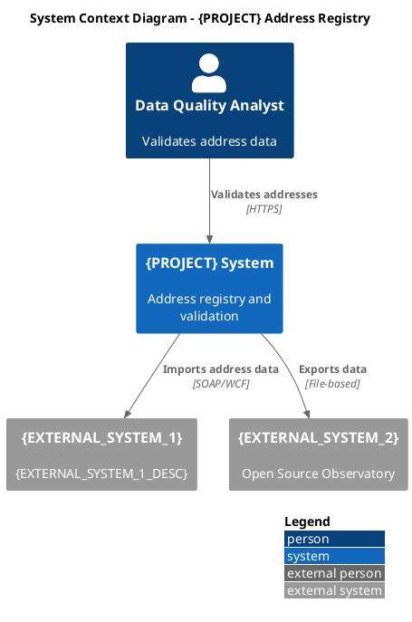
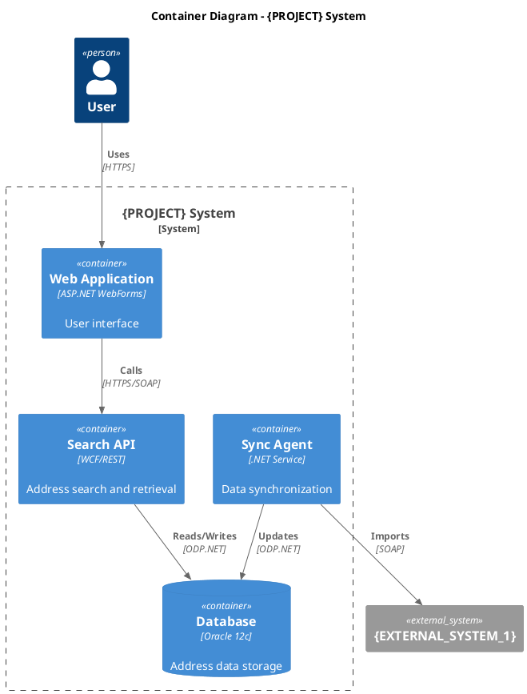
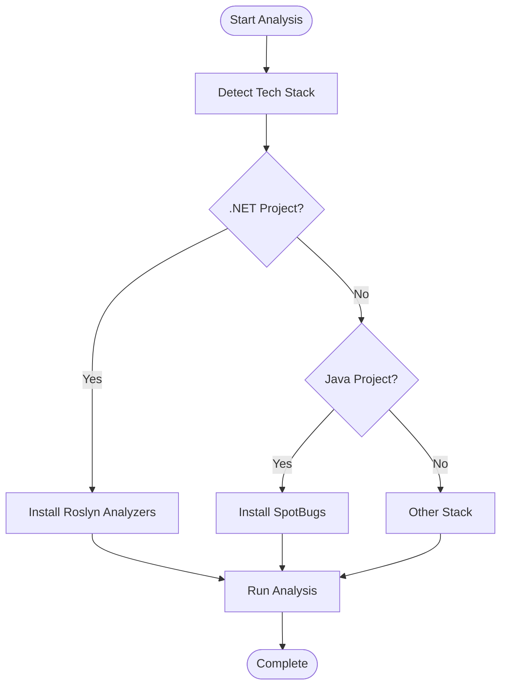
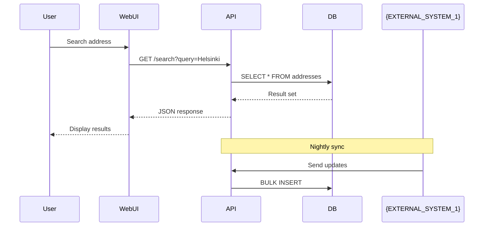

# Diagram Tools Setup

**Purpose**: Set up PlantUML and Mermaid for architecture diagram generation

**Diagram Types**:
- **PlantUML with C4 Model** - Architecture diagrams (Context, Container, Component)
- **Mermaid** - Flowcharts, sequence diagrams, class diagrams

---

## 🚀 Automated Documentation Generation (Recommended)

**For generating Arc42 documentation with embedded diagrams**, use the automated Python script instead of manual diagram generation.

### Quick Start

```bash
# From repository root
python scripts/render_diagrams_for_doc.py
```

**What it does:**
1. Reads markdown files from `{ANALYSIS_ROOT}/as-is/` and `artifacts/09-summaries/`
2. Extracts Mermaid and PlantUML code blocks from markdown
3. Renders Mermaid diagrams using `npx @mermaid-js/mermaid-cli` (on-demand, no global install)
4. Renders PlantUML diagrams using public PlantUML server at `http://www.plantuml.com/plantuml/png/`
5. Replaces code blocks with PNG image references
6. Runs Pandoc to generate Word document with table of contents and automatic section numbering

**Output:** `{ANALYSIS_ROOT}/as-is/{PROJECT}-AS-IS-ARCHITECTURE-COMPLETE.docx`

### Prerequisites (Automated Workflow)

**Required:**
- Python 3.7+
- Node.js (for npx - Mermaid rendering)
- Pandoc (for DOCX generation)
- Internet connection (for PlantUML server)

**NOT Required:**
- ❌ Local PlantUML JAR (uses cloud rendering)
- ❌ Global Mermaid CLI install (uses npx on-demand)
- ❌ Java (not needed for cloud rendering)

### Installation

```powershell
# 1. Node.js (for Mermaid)
winget install OpenJS.NodeJS

# 2. Python 3.7+
winget install Python.Python.3

# 3. Pandoc
winget install JohnMacFarlane.Pandoc

# Verify
node --version
python --version
pandoc --version
```

### Usage Examples

**Basic usage:**
```bash
# Cross-platform version (recommended)
python scripts/render_diagrams_for_doc.py
```

**Windows-only version** (uses hardcoded paths):
```bash
python scripts/render_diagrams_for_doc_windows.py
```

**Expected output:**
```
Repository root: {PROJECT_ROOT}
Source directory: {PROJECT_ROOT}\docs\ai\legacy_analysis\as-is
Output directory: {PROJECT_ROOT}\docs\ai\legacy_analysis\as-is

Starting processing...
Rendering mermaid diagram: 03-context-scope_fig0.png...
Rendering plantuml diagram: 05-building-block-view_fig0.png...
...
Running Pandoc...
SUCCESS! Created: {ANALYSIS_ROOT}/as-is/{PROJECT}-AS-IS-ARCHITECTURE-COMPLETE.docx
Size: 1234.56 KB
```

### Troubleshooting

| Issue | Solution |
|-------|----------|
| `pandoc not found` | Install Pandoc: `winget install JohnMacFarlane.Pandoc` |
| `npx not found` | Install Node.js: `winget install OpenJS.NodeJS` |
| Mermaid diagrams fail | Verify Node.js: `node --version` and `npx --version` |
| PlantUML diagrams fail | Check internet connection (uses cloud server) |

**See detailed documentation:** [scripts/README.md](../../../../scripts/README.md)

---

## Manual Diagram Generation (Alternative)

**If you need to generate individual diagrams manually** or set up local rendering, follow the instructions below.

### Prerequisites (Manual Workflow)

- Java 11+ (for local PlantUML JAR)
- Node.js 16+ (for global Mermaid CLI)
- Graphviz (optional, for advanced PlantUML layouts)

## Installation Steps

### 1. PlantUML CLI Setup

#### Windows

```powershell
# Create tools directory
New-Item -ItemType Directory -Force -Path "C:\tools\plantuml" | Out-Null

# Download latest PlantUML JAR
$PlantUmlUrl = "https://github.com/plantuml/plantuml/releases/download/v1.2024.7/plantuml-1.2024.7.jar"
Invoke-WebRequest -Uri $PlantUmlUrl -OutFile "C:\tools\plantuml\plantuml.jar"

# Create plantuml.bat for easy CLI access
$BatchContent = @"
@echo off
java -jar C:\tools\plantuml\plantuml.jar %*
"@
Set-Content -Path "C:\tools\plantuml\plantuml.bat" -Value $BatchContent

# Add to PATH
$env:Path += ";C:\tools\plantuml"
[System.Environment]::SetEnvironmentVariable("Path", $env:Path, "User")
```

#### Linux/macOS

```bash
# Create tools directory
mkdir -p ~/tools/plantuml

# Download PlantUML JAR
wget -O ~/tools/plantuml/plantuml.jar \
  https://github.com/plantuml/plantuml/releases/download/v1.2024.7/plantuml-1.2024.7.jar

# Create alias
echo 'alias plantuml="java -jar ~/tools/plantuml/plantuml.jar"' >> ~/.bashrc
source ~/.bashrc
```

### 2. PlantUML C4 Model Includes

```bash
# Download C4 model includes
mkdir -p C:\tools\plantuml\C4
cd C:\tools\plantuml\C4

# Download C4 stdlib files
$files = @(
    "C4_Context.puml",
    "C4_Container.puml",
    "C4_Component.puml",
    "C4_Deployment.puml",
    "C4_Dynamic.puml"
)

foreach ($file in $files) {
    Invoke-WebRequest `
        -Uri "https://raw.githubusercontent.com/plantuml-stdlib/C4-PlantUML/master/$file" `
        -OutFile $file
}
```

**Note**: Modern PlantUML includes C4 stdlib, but downloading locally ensures offline usage.

### 3. Mermaid CLI Setup

```bash
# Install Mermaid CLI globally
npm install -g @mermaid-js/mermaid-cli

# Install Chromium (required for rendering)
npx -y @mermaid-js/mermaid-cli install
```

### 4. Graphviz (Optional - for Complex Layouts)

**Windows**:
```powershell
# Using Chocolatey
choco install graphviz

# Or download from https://graphviz.org/download/
```

**Linux**:
```bash
sudo apt-get install graphviz
```

**macOS**:
```bash
brew install graphviz
```

## Configuration

### PlantUML Configuration (plantuml.config)

Create `C:\tools\plantuml\plantuml.config`:

```
# Encoding
skinparam defaultTextAlignment center
skinparam handwritten false

# C4 Model defaults
!define C4_LAYOUT_WITH_LEGEND true

# Output quality
skinparam dpi 300
```

### Mermaid Configuration (.mermaidrc)

Create in project root:

```json
{
  "theme": "default",
  "themeVariables": {
    "fontSize": "16px"
  },
  "flowchart": {
    "useMaxWidth": true,
    "htmlLabels": true,
    "curve": "basis"
  },
  "sequence": {
    "diagramMarginX": 50,
    "diagramMarginY": 10,
    "actorMargin": 50,
    "width": 150,
    "height": 65,
    "boxMargin": 10,
    "useMaxWidth": true
  }
}
```

## Running Diagram Generation

### PlantUML

```bash
# Generate single diagram
plantuml diagram.puml

# Generate to specific format
plantuml -tpng diagram.puml
plantuml -tsvg diagram.puml

# Generate all diagrams in directory
plantuml {ANALYSIS_ROOT}/artifacts/**/*.puml

# With output directory
plantuml -o artifacts/diagrams docs/ai/**/*.puml
```

### Mermaid

```bash
# Generate single diagram
mmdc -i diagram.mmd -o diagram.png

# Specify format
mmdc -i diagram.mmd -o diagram.svg

# Generate all diagrams
mmdc -i 'docs/**/*.mmd' -o artifacts/diagrams/
```

## C4 PlantUML Examples

### Context Diagram



### Container Diagram



## Mermaid Examples

### Flowchart



### Sequence Diagram



## Verification

### Verify Automated Workflow (Recommended)

Test the complete documentation generation workflow:

```powershell
# Verify prerequisites
python --version      # Should be 3.7+
node --version        # Should be 16+
pandoc --version      # Should be installed
npx --version         # Should be installed with Node.js

# Test the script on a small subset (optional - edit script first)
# Comment out most files in FILES list, keep only 1-2 files
# Then run:
python scripts/render_diagrams_for_doc.py

# Check output
Test-Path "{ANALYSIS_ROOT}/as-is/{PROJECT}-AS-IS-ARCHITECTURE-COMPLETE.docx"
# Should return True

# Open and verify diagrams are rendered as images
Start-Process "{ANALYSIS_ROOT}/as-is/{PROJECT}-AS-IS-ARCHITECTURE-COMPLETE.docx"
```

### Verify Manual Tools (Alternative)

If you installed manual tools, test them individually:

**Test PlantUML (if installed locally):**

```bash
# Check version
java -jar C:\tools\plantuml\plantuml.jar -version

# Test generation
echo "@startuml
Alice -> Bob: Hello
@enduml" > test.puml

plantuml test.puml
# Should create test.png

Remove-Item test.puml, test.png
```

**Test Mermaid (if installed globally):**

```bash
# Check version
mmdc --version

# Test generation
echo "graph TD
    A-->B" > test.mmd

mmdc -i test.mmd -o test.png
# Should create test.png

Remove-Item test.mmd, test.png
```

**Test Mermaid via npx (used by automated script):**

```bash
# Check version
npx -y @mermaid-js/mermaid-cli --version

# Test generation
echo "graph TD
    A-->B" > test.mmd

npx -y @mermaid-js/mermaid-cli -i test.mmd -o test.png
# Should create test.png

Remove-Item test.mmd, test.png
```

## Output Formats

### PlantUML

- PNG (default)
- SVG (vector, recommended for documentation)
- PDF
- ASCII art (for markdown)

### Mermaid

- PNG
- SVG (recommended)
- PDF

## Common Issues

### PlantUML Issues

**Issue**: `java.lang.OutOfMemoryError`
**Solution**: Increase heap size: `java -Xmx2g -jar plantuml.jar ...`

**Issue**: Graphviz errors
**Solution**: Install Graphviz or use `!pragma layout smetana` for built-in layout engine

**Issue**: C4 includes not found
**Solution**: Use stdlib includes: `!include <C4/C4_Context>`

### Mermaid Issues

**Issue**: `Error: Failed to launch the browser process!`
**Solution**: Run `npx -y @mermaid-js/mermaid-cli install` to install Chromium

**Issue**: Diagrams render but look low quality
**Solution**: Add `scale: 2` to .mermaidrc configuration

**Issue**: Syntax errors not clear
**Solution**: Use online Mermaid Live Editor for validation: https://mermaid.live/

## Best Practices

### PlantUML C4

1. **Use Layout Directives**: `LAYOUT_TOP_DOWN()`, `LAYOUT_LEFT_RIGHT()`
2. **Use Directional Relations**: `Rel_L`, `Rel_R`, `Rel_U`, `Rel_D` instead of `Rel`
3. **Group with Boundaries**: `System_Boundary`, `Container_Boundary`
4. **Include Legend**: `LAYOUT_WITH_LEGEND()`

### Mermaid

1. **Specify Direction**: `flowchart TD` (top-down) or `LR` (left-right)
2. **Use Subgraphs**: For grouping related nodes
3. **Avoid Bidirectional Arrows**: Use two separate arrows instead
4. **Keep Diagrams Simple**: Max 10-15 nodes per diagram

## Integration with Diagram Testing

See [AI Diagram Testing Plan](../../.tmp/AI-DIAGRAM-TESTING-PLAN.md) for automated validation of generated diagrams.

## See Also

- [Main Environment Setup](../02-environment-setup.md)
- [MCP Servers Setup](mcp-servers.md) - for Playwright browser testing
- [Verification Scripts](verification-scripts.md)

## Additional Resources

- PlantUML: https://plantuml.com/
- C4 Model: https://c4model.com/
- PlantUML C4: https://github.com/plantuml-stdlib/C4-PlantUML
- Mermaid: https://mermaid.js.org/
- Graphviz: https://graphviz.org/
