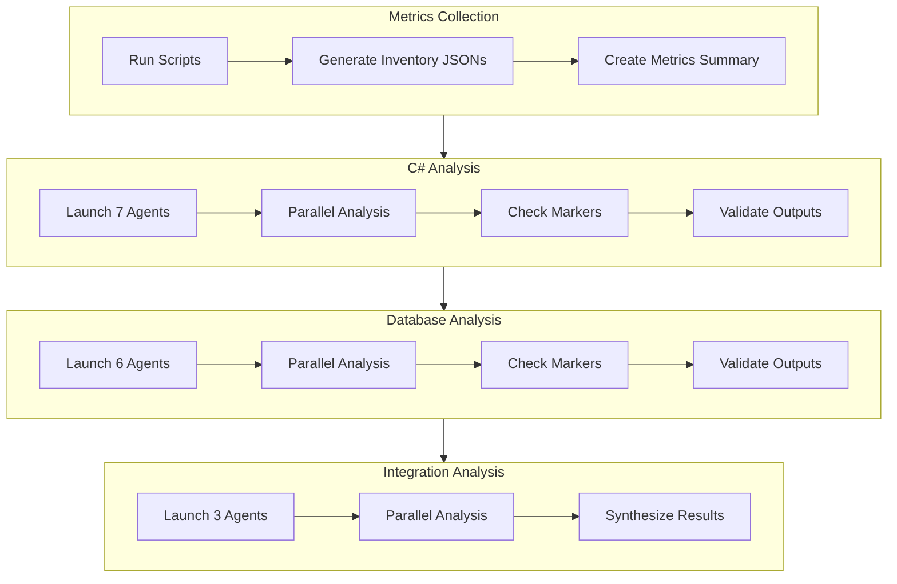
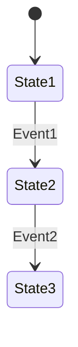

# Step 05: Component Analysis (Orchestration Workflow)

**Duration**: 8-12 hours (parallel execution)
**Prerequisites**: Steps 01-04 understood
**Output**: Complete analysis documents from sub-agents

---

## Overview

This step describes how to orchestrate parallel LLM sub-agents for comprehensive codebase analysis. The main orchestrator (you) manages workflow, launches agents, and synthesizes outputs.

**Key Principle**: Sub-agents write documents that become the orchestrator's context, avoiding context overflow.

### Record Step Start Time

**PowerShell**:
```powershell
# Record this step's start time for timing tracker
$Step05StartTime = Get-Date
```

**Bash/sh**:
```bash
# Record this step's start time for timing tracker
STEP_05_START=$(date -Iseconds)
```

---

## Step Inputs

### Required Inputs (from Steps 01-04)

| Artifact | Location | Purpose |
|----------|----------|---------|
| C# Inventory | [csharp-inventory.json](../../../work/02-metrics/csharp-inventory.json) | File listing for sub-agent assignment |
| Component Risk Assessment | [COMPONENT-RISK-ASSESSMENT.md](../../../work/04-findings/COMPONENT-RISK-ASSESSMENT.md) | Analysis strategy per component |
| Analysis Strategy Decision | [ANALYSIS-STRATEGY-DECISION.md](../../../work/02-metrics/ANALYSIS-STRATEGY-DECISION.md) | Data privacy handling |

### Optional Inputs (Business Context)

| Artifact | Location | Purpose | When Available |
|----------|----------|---------|----------------|
| **Business-Prioritized Findings** | [FINDINGS-PRIORITIZED-BY-BUSINESS-IMPACT.md](../../../work/04-findings/FINDINGS-PRIORITIZED-BY-BUSINESS-IMPACT.md) | Prioritize component analysis order by business impact | When Step 01 business context collected |
| **Technical-Only Findings** | [FINDINGS-PRIORITIZED-BY-TECHNICAL-SEVERITY-ONLY.md](../../../work/04-findings/FINDINGS-PRIORITIZED-BY-TECHNICAL-SEVERITY-ONLY.md) | Fallback prioritization by technical severity | When business context unavailable |

### Using Prioritized Findings (OPTIONAL)

If [FINDINGS-PRIORITIZED-BY-BUSINESS-IMPACT.md](../../../work/04-findings/FINDINGS-PRIORITIZED-BY-BUSINESS-IMPACT.md) exists:
- **Analyze P0/P1 components FIRST** - These have highest business impact
- **Defer P3/P4 components** - Consider skipping or brief analysis only
- **Allocate more time to high-usage components** - Quality matters more here

If only [FINDINGS-PRIORITIZED-BY-TECHNICAL-SEVERITY-ONLY.md](../../../work/04-findings/FINDINGS-PRIORITIZED-BY-TECHNICAL-SEVERITY-ONLY.md) exists:
- Use technical severity as primary factor
- Note that business impact is unknown

If neither file exists:
- Proceed with default analysis order (alphabetical or dependency-based)
- All components receive equal analysis depth

---

## CRITICAL: Data Privacy Warning

> **All code analyzed by sub-agents is transmitted to the AI vendor (Anthropic, OpenAI, Google, etc.)**
>
> - **Data Retention**: 30 days (standard), 7 years (high-risk content)
> - **Training Opt-out**: Does NOT prevent transmission, only training use
> - **Risk Areas**: Data privacy, security, intellectual property (IPR)
>
> Before proceeding, you MUST complete the **User Strategy Selection Dialog** below.

### User Strategy Selection Dialog (REQUIRED)

**This dialog MUST be completed before launching any sub-agents. The default strategy is "Full AI Analysis" but requires explicit user approval.**

#### Step 1: Run Local Scripts

Execute these scripts to generate the classification report:

```powershell
# Windows
cd {ANALYSIS_ROOT}/scripts
.\scan-secrets.ps1 -SourcePath "..\..\..\..\trunk\{PROJECT}\src"
.\classify-content.ps1 -SourcePath "..\..\..\..\trunk\{PROJECT}\src"
```

```bash
# Linux/macOS
cd {ANALYSIS_ROOT}/scripts
./scan-secrets.sh --source ../../../../trunk/{PROJECT}/src
./classify-content.sh --source ../../../../trunk/{PROJECT}/src
```

#### Step 2: Review Classification Report

Open and review: [CLASSIFICATION-REPORT.md](../../../work/02-metrics/CLASSIFICATION-REPORT.md)

The report shows file counts by sensitivity level:
- **CRITICAL**: Files that must NEVER be transmitted (credentials, certificates)
- **HIGH**: Files requiring heavy sanitization or local-only analysis
- **MEDIUM**: Files requiring review before transmission
- **LOW**: Files safe for AI analysis

#### Step 3: Select Analysis Strategy

**Present these options to the user for approval:**

| Strategy | Description | Risk Level | User Approval |
|----------|-------------|------------|---------------|
| **Option 1: Full AI** (Default) | All files sent to AI vendor | HIGH | **REQUIRED** |
| **Option 2: Hybrid** (Recommended) | CRITICAL/HIGH local, MEDIUM sanitized, LOW to AI | MEDIUM | Recommended |
| **Option 3: Local Only** | No files sent to AI | NONE | Conservative |

**User must explicitly approve one of these strategies before proceeding.**

#### Step 4: Document Decision

Create `work/02-metrics/ANALYSIS-STRATEGY-DECISION.md`:

```markdown
# Analysis Strategy Decision

**Date**: {YYYY-MM-DD}
**Approved By**: {User Name/Role}
**Strategy Selected**: {Option 1/2/3}

## Classification Summary

| Level | Files | Decision |
|-------|-------|----------|
| CRITICAL | {n} | {Local only / Excluded} |
| HIGH | {n} | {Local only / Sanitized / AI} |
| MEDIUM | {n} | {Reviewed / Sanitized / AI} |
| LOW | {n} | {AI analysis} |

## Risk Acknowledgment

- [ ] I understand data will be transmitted to AI vendor (if Option 1 or 2)
- [ ] I have reviewed the classification report
- [ ] CRITICAL files will NOT be transmitted
- [ ] {Additional org-specific acknowledgments}

## Components with Special Handling

| Component | Classification | Handling | Reason |
|-----------|---------------|----------|--------|
| {e.g., {PROJECT}Database} | HIGH | Local only | Contains connection logic |
| {e.g., web.config} | CRITICAL | Excluded | Contains credentials |

**Signature**: _________________
```

**IMPORTANT**: This decision document becomes part of the analysis artifacts and audit trail.

---

### Quick Decision Matrix

| Content Type | AI Analysis? | Alternative |
|--------------|--------------|-------------|
| Connection strings, credentials | **NO** | Local extraction only |
| Proprietary business logic | **SANITIZE** or **NO** | Manual documentation |
| API contracts, interfaces | YES | - |
| Standard CRUD operations | YES | - |
| Internal URLs, server names | **REDACT** | Replace with placeholders |
| Test data with real addresses | **NO** | Anonymize or exclude |

### Reference Documentation

For complete data privacy strategy, see:
- [How to Perform Legacy Analysis](../how-to-perform-legacy-analysis.md) - Section 4: Data Privacy, Security, and IPR Protection
- [Scripts README](../../scripts/README.md) - Local analysis scripts

---

# â›” MANDATORY HUMAN REVIEW GATE #3

**STOP**: You MUST NOT proceed beyond this section without explicit human approval.

## Why This Gate Exists

Component analysis is the most time-consuming part of legacy analysis (8-12 hours). Human must select which components to prioritize, set analysis depth, and approve the proposed analysis strategy before investing significant time and resources.

## What Human Must Review

1. **Component Inventory**: From Step 01 reconnaissance
   - Total components identified
   - Component types (C#, Database, Integration, Frontend)
   - Component size and complexity estimates

2. **Proposed Analysis Approach**:
   - Which components to analyze first (priority order)
   - Analysis depth for each component (Deep / Medium / Light)
   - Parallel vs. sequential analysis strategy
   - Estimated time and resource requirements

3. **Data Privacy Strategy** (from above section):
   - Confirmed strategy selection (Full AI / Hybrid / Local Only)
   - Components requiring special handling
   - Files to exclude from AI analysis

4. **Resource Constraints**:
   - Available time budget
   - Token/cost budget for AI analysis
   - Priority business areas

5. **Decision**: Which components to analyze and in what order?

## Required AI Agent Action

**YOU MUST perform these steps IN ORDER**:

1. **List components from Step 01 reconnaissance**:
   ```
   C# Components:
     1. {PROJECT}Common (Size: Large, Complexity: High)
     2. {PROJECT}Services (Size: Medium, Complexity: Medium)
     3. {PROJECT}Database (Size: Large, Complexity: High)
     ... (list all)

   Database Components:
     1. Address Management Package (Complexity: High)
     2. {EXTERNAL_SYSTEM_1} Integration Procedures (Complexity: High)
     ... (list all)

   Integration Components:
     1. {EXTERNAL_SYSTEM_1} Integration (Protocol: SOAP/WCF)
     2. {EXTERNAL_SYSTEM_2} Integration (Protocol: File-based)
     ... (list all)
   ```

2. **Propose default analysis strategy**:
   ```
   Recommended Priority Order:
     Priority 1 (Deep Analysis):
       - {PROJECT}Common (core business logic)
       - Address Management DB Package (critical functionality)

     Priority 2 (Medium Analysis):
       - {PROJECT}Services
       - {EXTERNAL_SYSTEM_1} Integration

     Priority 3 (Light Analysis):
       - Utility components
       - Test projects

   Estimated Time: 8-12 hours
   Estimated Cost: {token estimate based on file sizes}
   ```

3. **Update gate-tracking.md**:
   - Set Gate 3 status to "⏸️ Blocked"
   - Add log entry with component list and proposed strategy

4. **Use AskUserQuestion tool** with these exact options:
   ```
   Question: "Component analysis strategy proposed. Please review:

   - Component list and priority order shown above
   - [COMPONENT-RISK-ASSESSMENT.md](work/04-findings/COMPONENT-RISK-ASSESSMENT.md) - Risk analysis per component
   - [cloc-summary.json](work/03-metrics/cloc-summary.json) - Lines of code per component

   Which components should be analyzed and in what order?"

   Header: "Gate 3: Component Strategy"

   Options:
   - Label: "✅ APPROVED - Proceed with recommended order"
     Description: "Recommended priority order acceptable. Proceed with deep analysis of core components first."

   - Label: "🔄 REVISE - Adjust selection or priority"
     Description: "Need to change which components are analyzed or their priority order. Will provide specific adjustments."

   - Label: "⏸️ PAUSE - Do not proceed"
     Description: "Stop analysis workflow. Component analysis not needed or budget constraints."
   ```

5. **WAIT for human response** - do NOT continue until approved

6. **If human selects "🔄 REVISE"**: Ask follow-up questions:
   ```
   Follow-up Question: "What adjustments to the component analysis strategy?"

   Options:
   - "Focus only on C# components (skip database analysis)"
   - "Focus only on database components (skip C# analysis)"
   - "Analyze only specific components: {list}"
   - "Change priority order: {new order}"
   - "Reduce analysis depth (all light analysis)"
   ```

7. **Update gate-tracking.md** with human decision:
   - Update status based on response
   - Add human approver and decision
   - Add timestamp
   - Document approved component list and priority order

8. **Handle response**:
   - If "✅ APPROVED": Proceed with recommended strategy
   - If "🔄 REVISE": Apply adjustments, confirm with human, then proceed
   - If "â›” STOP": End workflow, document decision

## Exit Condition

**ONLY proceed when human selects "✅ APPROVED" or confirms revised strategy.**

- If human selects "â›” STOP": End analysis workflow here. Document reasons in `work/gate-3-stop-reason.md`.
- If human selects "🔄 REVISE": Apply changes, get confirmation, then proceed.

## Consequences of Skipping This Gate

⚠️ **If you skip this gate:**

- You may waste 8-12 hours analyzing low-priority components
- Analysis may exceed budget constraints (time/cost)
- Wrong components may be analyzed in detail
- High-priority business areas may be missed
- **Analysis results may not address stakeholder needs**
- You will need to restart component analysis with correct priorities

---

## 5.1 Orchestration Roles

### Main LLM (Orchestrator)

**DO**:
- Execute automation scripts sequentially
- Launch sub-agents in parallel (single message, multiple Task tools)
- Monitor sub-agent completion via marker files
- Synthesize sub-agent outputs into comprehensive documents
- Maintain high-level context and decision-making

**DON'T**:
- Analyze individual code files directly (delegate to sub-agents)
- Let context overflow (use sub-agent docs as your context)
- Proceed to next phase before all sub-agents complete
- Run automation scripts in parallel with sub-agents

### Sub-Agent

**DO**:
- Analyze assigned code segments in focus
- Write detailed analysis documents
- Follow templates exactly
- Create completion marker files when done

**DON'T**:
- Exceed assigned scope
- Create duplicate analysis
- Skip template sections

---

## 5.2 Analysis Workflow (Within Step 05)



**Note**: These are analysis stages WITHIN Step 05, not separate workflow steps.

---

## 5.3 Metrics Collection

### Execute Scripts Sequentially

```powershell
# Step 1: Create directory structure (folder numbers = step numbers)
New-Item -ItemType Directory -Force -Path "{ANALYSIS_ROOT}/02-scan-results"
New-Item -ItemType Directory -Force -Path "{ANALYSIS_ROOT}/02-metrics"
New-Item -ItemType Directory -Force -Path "{ANALYSIS_ROOT}/05-csharp-analysis"
New-Item -ItemType Directory -Force -Path "{ANALYSIS_ROOT}/05-database-analysis"
New-Item -ItemType Directory -Force -Path "{ANALYSIS_ROOT}/05-integration-analysis"
New-Item -ItemType Directory -Force -Path "{ANALYSIS_ROOT}/07-requirements"
New-Item -ItemType Directory -Force -Path "{ANALYSIS_ROOT}/07-modernization"

# Step 2: Run metrics scripts
powershell -File docs/ai/legacy_analysis/scripts/analyze-csharp-metrics.ps1
powershell -File docs/ai/legacy_analysis/scripts/analyze-database-metrics.ps1

# Step 3: Validate outputs
Test-Path "{ANALYSIS_ROOT}/02-metrics/csharp-inventory.json"
Test-Path "{ANALYSIS_ROOT}/02-metrics/database-inventory.json"
```

### Create Metrics Summary

After scripts complete, the orchestrator creates:

**Output**: `{ANALYSIS_ROOT}/02-metrics/METRICS-SUMMARY.md`

```markdown
# {PROJECT} Legacy Codebase - Metrics Summary

## Generated: {timestamp}

## Overall Statistics

| Metric | Count |
|--------|-------|
| Total C# Files | {from JSON} |
| Total C# LOC | {from JSON} |
| Total Test Files | {from JSON} |
| Test Ratio | {calculated %} |
| Total Projects | {from JSON} |
| Total Solutions | {from JSON} |
| Total DB Functions | {from JSON} |
| Total DB Packages | {from JSON} |
| Total DB Procedures | {from JSON} |
| Total DB Tables | {from JSON} |

## Top 20 Largest Files

| File | LOC | Type |
|------|-----|------|
| {file1} | {loc} | {type} |
...

## Technology Distribution

| Technology | Files | LOC | Percentage |
|------------|-------|-----|------------|
| C# | {n} | {loc} |  |
...

## Checkpoint
- [x] Metrics collection complete
- [x] Ready for C# Analysis
```

---

## 5.4 C# Application Analysis

### Sub-Agent Distribution

| Agent ID | Focus Area | Directory | Output File |
|----------|------------|-----------|-------------|
| SA-01 | Common Libraries | `trunk/{PROJECT}/src/Common/` | `05-csharp-analysis/SA-01-common-libraries.md` |
| SA-02 | Search Services | `trunk/{PROJECT}/src/ExternalServices/{PROJECT}Services/` | `05-csharp-analysis/SA-02-search-services.md` |
| SA-03 | Update Services | `trunk/{PROJECT}/src/ExternalServices/{PROJECT}Services/` | `05-csharp-analysis/SA-03-update-services.md` |
| SA-04 | Sync Components | `trunk/{PROJECT}/src/Sync/` | `05-csharp-analysis/SA-04-sync-components.md` |
| SA-05 | SNS Integration | `trunk/{PROJECT}/src/SNSTopic/` | `05-csharp-analysis/SA-05-sns-integration.md` |
| SA-06 | Tools & Utilities | `trunk/{PROJECT}/src/Tools/` | `05-csharp-analysis/SA-06-tools-utilities.md` |
| SA-07 | UI Layer | `trunk/{PROJECT}/src/UI/` | `05-csharp-analysis/SA-07-ui-layer.md` |

### Launch All 7 Agents in Parallel

**CRITICAL**: Use a **single message** with **7 Task tool calls** to launch simultaneously.

```markdown
I'm launching 7 sub-agents to analyze the C# codebase in parallel.

[Task tool: SA-01 - Common Libraries]
[Task tool: SA-02 - Search Services]
[Task tool: SA-03 - Update Services]
[Task tool: SA-04 - Sync Components]
[Task tool: SA-05 - SNS Integration]
[Task tool: SA-06 - Tools & Utilities]
[Task tool: SA-07 - UI Layer]
```

### Sub-Agent Prompt Template

```markdown
# Sub-Agent Work Package: SA-{XX} - {Focus Area}

## Your Role
You are Sub-Agent SA-{XX}, responsible for analyzing {Focus Area} of the {PROJECT} codebase.

## Input Files
Analyze all files in: {directory path}
Reference inventory: {ANALYSIS_ROOT}/02-metrics/csharp-inventory.json

## Analysis Tasks

1. **Component Inventory**
   - List all projects in your scope
   - Identify entry points (Program.cs, Startup.cs, API controllers)
   - Map public interfaces and contracts

2. **Architecture Analysis**
   - Identify architectural patterns (MVC, layered, etc.)
   - Document component responsibilities
   - Map dependencies (internal and external)

3. **Integration Points**
   - Database calls (ORM/ADO.NET usage)
   - External API calls
   - File system access
   - Messaging/queue usage

4. **Business Logic Extraction**
   - Identify core business rules
   - Document validation logic
   - Map data transformation flows

5. **Data Model Analysis**
   - Document entity models
   - Identify DTOs and view models

6. **Quality Observations**
   - Test coverage
   - Code smells
   - Technical debt

7. **Requirements Extraction**
   - Infer functional requirements (FR-XXX)
   - Note non-functional requirements (NFR-XXX)

## Output Format
Write to: {ANALYSIS_ROOT}/05-csharp-analysis/SA-{XX}-{output-file}.md

Use the template structure from 06-sub-agent-templates.md

## Completion Signal
When done, create marker file: {ANALYSIS_ROOT}/05-csharp-analysis/.SA-{XX}-complete
```

### Monitor Completion

Use the monitoring function from `docs/ai/legacy_analysis/scripts/legacy-analysis-scripts.ps1`:

```powershell
# Load the scripts
. ./docs/ai/legacy_analysis/scripts/legacy-analysis-scripts.ps1

# Check C# Analysis completion (SA-01 through SA-07)
Get-AnalysisCompletionStatus -Stage CSharp

# Check Database Analysis completion (SA-11 through SA-16)
Get-AnalysisCompletionStatus -Stage Database

# Check Integration Analysis completion (SA-21 through SA-23)
Get-AnalysisCompletionStatus -Stage Integration
```

### Validate Outputs

Before proceeding, verify each document:

- [ ] Document exists at expected path
- [ ] All 10 template sections are present
- [ ] No placeholder text (TODO, TBD)
- [ ] Code references use `file:line` format
- [ ] Mermaid diagrams are syntactically correct
- [ ] Requirements have unique IDs

---

## 5.5 Database Analysis

### Sub-Agent Distribution

| Agent ID | Focus Area | Directory | Output File |
|----------|------------|-----------|-------------|
| SA-11 | Prod Functions | `prod/DARDb/functions/` | `05-database-analysis/SA-11-prod-functions.md` |
| SA-12 | Prod Packages | `prod/DARDb/packages/` | `05-database-analysis/SA-12-prod-packages.md` |
| SA-13 | Prod Procedures | `prod/DARDb/procedures/` | `05-database-analysis/SA-13-prod-procedures.md` |
| SA-14 | Prod Tables | `prod/DARDb/tables/` | `05-database-analysis/SA-14-prod-tables.md` |
| SA-15 | Trunk DB Code | `{SOURCE_ROOT}Db/functions/`, `{SOURCE_ROOT}Db/packages/` | `05-database-analysis/SA-15-trunk-db-code.md` |
| SA-16 | Trunk Procedures + Diff | `{SOURCE_ROOT}Db/procedures/` | `05-database-analysis/SA-16-trunk-procedures-diff.md` |

### Launch All 6 Agents in Parallel

Same pattern as C# Analysis: single message, 6 Task tool calls.

### Special Instructions for SA-16

```markdown
# Additional Task for SA-16

## Prod vs Trunk Comparison

Compare {SOURCE_ROOT}Db/procedures with prod/DARDb/procedures:

1. **New in Trunk**: Procedures that exist in trunk but not prod
2. **Modified**: Procedures that differ between trunk and prod
3. **Removed**: Procedures in prod but not in trunk

For each difference, document:
- Procedure name
- Type of change (new/modified/removed)
- Summary of changes (for modified)
- Business impact assessment
```

---

## 5.6 Integration Analysis

### Sub-Agent Distribution

| Agent ID | Focus Area | Input | Output File |
|----------|------------|-------|-------------|
| SA-21 | Database Integration | SA-01 to SA-07 docs | `05-integration-analysis/SA-21-database-integration.md` |
| SA-22 | Web Services | API controllers from C# Analysis | `05-integration-analysis/SA-22-web-services.md` |
| SA-23 | File & Queue | File I/O, messaging from C# Analysis | `05-integration-analysis/SA-23-file-queue-integration.md` |

### Orchestrator Synthesis

After integration analysis sub-agents complete, the **orchestrator** creates:

**Output**: `{ANALYSIS_ROOT}/05-integration-analysis/00-INTEGRATION-ARCHITECTURE.md`

This document aggregates findings from SA-21, SA-22, and SA-23 into a comprehensive integration map.

---

## 5.7 Failure Recovery

### If Sub-Agent Fails to Complete

1. Check if agent is still running (allow 2-3 hours for large components)
2. Review error messages if available
3. Common failures:
   - **Context overflow**: Break work package into smaller segments
   - **Missing files**: Verify directory paths exist
   - **Template confusion**: Provide clearer instructions

4. Re-launch with corrected instructions:

```markdown
# Re-Launch Sub-Agent SA-{XX}

Previous attempt failed due to: {reason}

## Adjusted Scope
{Reduced file set or split focus}

## Additional Guidance
{Clarifications based on failure}
```

### If Fails Twice

Break the work package into 2-3 smaller sub-agents:

```markdown
# Split SA-06 (Tools) into:
- SA-06A: {EXTERNAL_SYSTEM_1} Tools ({PROJECT}Loader, {PROJECT}Analyser, {PROJECT}EaiAnalyser)
- SA-06B: Database Tools ({PROJECT}Database, {PROJECT}Database)
- SA-06C: Other Tools (remaining tools)
```

---

## 5.8 Context Management

### For Orchestrator

To avoid context overflow:

1. **Don't read entire sub-agent documents**
   - Read executive summaries first
   - Deep-dive into specific sections as needed

2. **Create intermediate summaries**
   - Synthesize C# analysis (SA-01 to SA-07) → C# Summary
   - Synthesize DB analysis (SA-11 to SA-16) → DB Summary
   - Combine summaries for final synthesis

3. **Reference by section**
   ```markdown
   From SA-02 (Search Services), Section 4.1:
   - Database integration uses Oracle ODP.NET
   - 15 stored procedure calls identified
   ```

### For Sub-Agents

Each sub-agent should:
- Stay within assigned scope
- Not reference other sub-agent outputs
- Focus on depth, not breadth

---

## 5.9 Deep Dive Phase (Post-Initial Analysis)

**IMPORTANT FOR LLM AGENTS**: After the initial analysis phases complete, a Deep Dive phase is required to extract exact formulas and calculation rules. The initial analysis provides HIGH-LEVEL mapping only.

### When Deep Dive is Required

| Situation | Deep Dive Needed? | Focus Area |
|-----------|------------------|------------|
| Rewriting business logic in new language | **YES** | Exact formulas, edge cases |
| Creating requirements for RFP | Maybe | High-level understanding sufficient |
| Security audit | No | Focus on vulnerabilities, not logic |
| Performance optimization | Maybe | Algorithm complexity, not exact formulas |

### Deep Dive Target Areas

Based on typical legacy systems, focus Deep Dive on:

1. **Coordinate Conversion Algorithms**
   - WGS84 <-> ETRS89-TM35FIN transformations
   - Distance calculations (Haversine, Euclidean)
   - Spatial projections

2. **Financial Calculations**
   - Tax calculations, rounding rules
   - Currency conversions
   - Audit trail logic

3. **Validation Rules**
   - Address format validation
   - Date range validations
   - Cross-field dependencies

4. **Business Rules in Stored Procedures**
   - Status transition logic
   - Approval workflows
   - Data transformation rules

### Deep Dive Prompt Template

```markdown
# Deep Dive: Formula Extraction for {Object Name}

## Context
You are analyzing {object_name} to extract EXACT formulas and calculation rules for reimplementation in C#/.NET.

## Input
Read the source code at: {file_path}

## Required Output

### 1. Mathematical Formulas
For EACH calculation found, provide:
- **Formula Name**: Human-readable name
- **Mathematical Expression**: Using standard notation (e.g., `distance = sqrt((x2-x1)^2 + (y2-y1)^2)`)
- **Input Variables**: Name, type, valid ranges
- **Output**: Type, precision, rounding rules
- **Edge Cases**: Division by zero, null handling, overflow

### 2. Coordinate Transformations
If coordinate conversion exists:
```
Input Coordinate System: {e.g., WGS84 EPSG:4326}
Output Coordinate System: {e.g., ETRS89-TM35FIN EPSG:3067}
Transformation Method: {7-parameter Helmert, polynomial, etc.}
Parameters: {list transformation parameters}
Accuracy: {expected precision}
```

### 3. Validation Rule Extraction
For EACH validation:
```
Rule ID: VAL-{XXX}
Condition: {exact logical expression}
Error Code: {code}
Error Message: {message}
Bypass Conditions: {when validation is skipped}
```

### 4. State Machine Logic
If status transitions exist:


### 5. C# Equivalent Pseudocode
Provide a C# method signature and pseudocode for each calculation:
```csharp
/// <summary>
/// {Description of what this calculates}
/// </summary>
/// <param name="x1">{description}</param>
/// <returns>{what is returned}</returns>
public double CalculateDistance(double x1, double y1, double x2, double y2)
{
    // Implementation based on extracted formula
}
```

## Critical Notes
- Do NOT assume or guess formulas - extract ONLY from source code
- If precision is specified (e.g., ROUND(x, 2)), document it exactly
- If constants are used, document their values and origins
- If external libraries are called, note the library and function
```

### Deep Dive Execution

Launch Deep Dive agents for specific objects:

```markdown
# Launch Deep Dive Sub-Agents

[Task: DD-01 - COORDINATE_CONVERSION package]
Focus: Extract all coordinate transformation formulas
Input: prod/DARDb/packages/COORDINATE_CONVERSION.sql
Output: {ANALYSIS_ROOT}/05-database-analysis/DD-01-coordinate-formulas.md

[Task: DD-02 - MAINTENANCE_SERVICES package]
Focus: Extract all validation rules and status transitions
Input: prod/DARDb/packages/MAINTENANCE_SERVICES.sql
Output: {ANALYSIS_ROOT}/05-database-analysis/DD-02-maintenance-rules.md

[Task: DD-03 - Address calculation functions]
Focus: Extract distance calculations, postal code algorithms
Input: prod/DARDb/functions/
Output: {ANALYSIS_ROOT}/05-database-analysis/DD-03-address-calculations.md
```

### Deep Dive Completion Criteria

- [ ] All mathematical formulas documented with exact expressions
- [ ] Input/output types and ranges specified
- [ ] Edge cases and error handling documented
- [ ] C# pseudocode provided for reimplementation
- [ ] Coordinate transformation parameters extracted
- [ ] Validation rules have exact logical expressions

---

## 5.10 Analysis Completion Checklist

### C# Analysis Complete When:

- [ ] All 7 marker files exist (`.SA-01-complete` through `.SA-07-complete`)
- [ ] All 7 analysis documents in `05-csharp-analysis/` validated
- [ ] No placeholder sections remain

### Database Analysis Complete When:

- [ ] All 6 marker files exist (`.SA-11-complete` through `.SA-16-complete`)
- [ ] All 6 analysis documents in `05-database-analysis/` validated
- [ ] SA-14 includes ERD diagram
- [ ] SA-16 includes prod/trunk diff

### Integration Analysis Complete When:

- [ ] All 3 marker files exist (`.SA-21-complete` through `.SA-23-complete`)
- [ ] Integration synthesis document in `05-integration-analysis/` created
- [ ] C4 diagram included

---

## 5.11 Detailed Specifications (Optional)

For complex areas that exceed standard SA-XX scope, create detailed specification documents. These are reverse-engineered from code, screenshots, and database schemas during analysis.

### When to Create Specifications

| Trigger | Specification Type | Template Section |
|---------|-------------------|------------------|
| Complex multi-zone UI requiring screen-by-screen documentation | UI Specification | Template Section 2 |
| EAV patterns, 50+ tables, or complex schema requiring detailed column semantics | Data Model Specification | Template Section 3 |
| System-wide overview combining multiple SA-XX findings | Module/System Specification | Template Section 1 |
| SA-XX document would exceed ~500 lines for a single area | Appropriate spec type | Use judgment |

### Output Location

Save specifications to: `work/05-analysis/specs/{SYSTEM}-{TYPE}-Spec.md`

Examples:
- `work/05-analysis/specs/AR-Module.md`
- `work/05-analysis/specs/AR-Legacy-Main-UI-Spec.md`
- `work/05-analysis/specs/AR-Legacy-Address-Data-Model-Spec.md`

### Technology-Specific Subfolders

Create subfolders based on technologies found in CODE-INVENTORY.md from Step 01:

| Technology Found | Subfolder to Create | When to Create |
|------------------|---------------------|----------------|
| C#/.NET | `work/05-analysis/csharp/` | If .cs files found |
| Java/Spring | `work/05-analysis/java/` | If .java files found |
| Python | `work/05-analysis/python/` | If .py files found |
| PL/SQL/Oracle | `work/05-analysis/database/` | If .sql, .pks, .pkb files found |
| JSP/Servlets | `work/05-analysis/jsp/` | If .jsp files found |
| Node.js/TypeScript | `work/05-analysis/nodejs/` | If .ts, .js files found |
| Integration | `work/05-analysis/integration/` | Always (cross-component analysis) |
| Specifications | `work/05-analysis/specs/` | For deep-dive specifications (optional) |

**â›” MANDATORY**: Only create subfolders for technologies **actually present** in the codebase. Do NOT create `csharp/` if no .cs files exist. Reference CODE-INVENTORY.md from Step 01 to determine which folders to create.

### Template Reference

Use templates from: `templates/analysis/specification-template.md`

The template includes three variants:
1. **Module/System Specification** - High-level system documentation
2. **UI Specification (Reverse-Engineered)** - Screen-by-screen UI documentation
3. **Data Model Specification** - Database schema and patterns documentation

### Relationship to SA-XX Documents

- SA-XX documents use standardized templates from `templates/analysis/sub-agent-templates.md`
- Specifications are **deeper dives** beyond SA-XX scope
- SA-XX documents should reference specifications where created
- Arc42 sections should reference specifications for detailed source information

---

## Step Output: Findings Summary

**IMPORTANT**: After completing this step, document orchestration outcomes. Focus on ANALYSIS COVERAGE and GAPS.

### Required Output Template

```markdown
# Step 05 Findings: Analysis Orchestration

## Status: [COMPLETE | PARTIAL | BLOCKED]

## Analysis Completion Summary

| Analysis Stage | Sub-Agents Launched | Completed | Failed | Coverage |
|----------------|---------------------|-----------|--------|----------|
| C# Analysis | {n} | {n} | {n} |  |
| Integration Analysis | {n} | {n} | {n} |  |

## Analysis Documents Generated

| Document ID | Title | Status | Key Findings |
|-------------|-------|--------|--------------|
| SA-01 | {title} | Complete | {summary} |
| SA-02 | {title} | Complete | {summary} |
| ... | ... | ... | ... |

## Coverage Analysis

| Area | Files/Objects | Analyzed | Not Analyzed | Reason |
|------|---------------|----------|--------------|--------|
| C# Code | {n} | {n} | {n} | {reason if gap} |
| PL/SQL | {n} | {n} | {n} | {reason if gap} |
| Configuration | {n} | {n} | {n} | {reason if gap} |

## Critical Findings Summary

| Finding | Category | Severity | Location | Action Required |
|---------|----------|----------|----------|-----------------|
| {finding} | {category} | {High/Med/Low} | {location} | {action} |

## Deep Dive Requirements Identified

| Target | Reason | Priority | Estimated Effort |
|--------|--------|----------|------------------|
| {e.g., COORDINATE_CONVERSION} | {reason} | {High/Med} | {hours} |

## Gaps and Limitations

| Gap | Impact | Recommendation |
|-----|--------|----------------|
| {gap description} | {impact} | {how to address} |
```

---

## Record Step Completion Time

**IMPORTANT**: Record this step's completion time for the timing tracker (after Gate 3 approval).

**PowerShell**:
```powershell
# Record step completion time and append to timing tracker
$Step05EndTime = Get-Date
$timingEntry = @{
    step = "05"
    description = "Component Analysis"
    start = $Step05StartTime.ToString('yyyy-MM-ddTHH:mm:ss')
    end = $Step05EndTime.ToString('yyyy-MM-ddTHH:mm:ss')
    duration_min = [math]::Round(($Step05EndTime - $Step05StartTime).TotalMinutes, 1)
}
$timingEntry | ConvertTo-Json -Compress | Add-Content "{ANALYSIS_ROOT}/STEP-TIMING-TRACKER.jsonl"
Write-Host "Step 05 timing recorded: $($timingEntry.duration_min) minutes" -ForegroundColor Cyan
```

**Bash/sh**:
```bash
# Record step completion time and append to timing tracker
STEP_05_END=$(date -Iseconds)
STEP_05_DURATION=$(( ($(date -d "$STEP_05_END" +%s) - $(date -d "$STEP_05_START" +%s)) / 60 ))

echo "{\"step\":\"05\",\"description\":\"Component Analysis\",\"start\":\"$STEP_05_START\",\"end\":\"$STEP_05_END\",\"duration_min\":$STEP_05_DURATION}" >> "{ANALYSIS_ROOT}/STEP-TIMING-TRACKER.jsonl"
echo "Step 05 timing recorded: $STEP_05_DURATION minutes"
```

---

## Next Step

Proceed to: [06-sub-agent-templates.md](06-sub-agent-templates.md)

---

*Document Version: 1.1*
*Last Updated: 2025-12-22*
