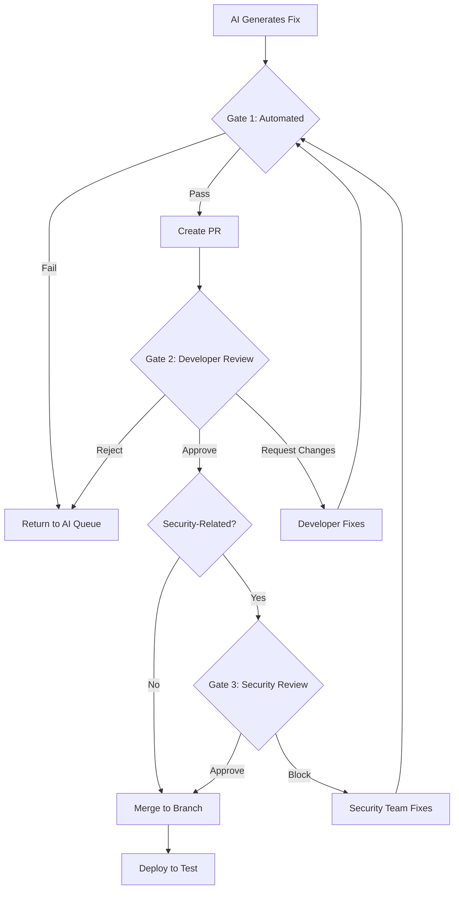

# Step 06: Human Review and Stakeholder Interviews

**Duration**: 4-8 hours (including 2-4 hours interview time)
**Prerequisites**:
- Step 05 component analysis completed
- Step 04 documentation gap analysis completed
**Output**:
- Approved analysis outputs
- Interview notes and synthesis
- Clarified design decisions
- Updated understanding of system intent

---

## Overview

Human review gates ensure AI-generated code meets quality, security, and correctness standards before being merged. This step defines the three mandatory gates and their review criteria.

**Key Principle**: AI outputs must pass strict human validation. The AI assists, humans decide.

### Record Step Start Time

**PowerShell**:
```powershell
# Record this step's start time for timing tracker
$Step06StartTime = Get-Date
```

**Bash/sh**:
```bash
# Record this step's start time for timing tracker
STEP_06_START=$(date -Iseconds)
```

---

## 4.1 Gate Structure

| Gate | Name | Trigger | Reviewer | Outcome |
|------|------|---------|----------|---------|
| Gate 1 | Verification | Post-AI Code Generation | Automated + Developer | Pass/Reject |
| Gate 2 | Functional | Pull Request Created | Developer + QA | Approve/Request Changes |
| Gate 3 | Security | Pre-Merge | Security Lead | Approve/Block |

---

## 4.2 Gate 1: Automated Verification

### Purpose
Automatically validate AI-generated code before human review begins.

### Automated Checks

**1. Static Analysis Re-Scan**

```powershell
# Re-run the original scanner on AI-fixed code
function Test-AiFix {
    param(
        [string]$OriginalFile,
        [string]$FixedFile,
        [string]$RuleId
    )

    # Run ZPA on fixed file
    zpa-cli --sources $FixedFile --output-file "validation-results.json" --output-format sq-generic-issue-import

    $results = Get-Content "validation-results.json" -Raw | ConvertFrom-Json

    # Check if original issue is resolved
    $remainingIssues = $results.issues | Where-Object { $_.ruleId -eq $RuleId }

    if ($remainingIssues.Count -eq 0) {
        Write-Host "[PASS] Issue $RuleId resolved" -ForegroundColor Green
        return $true
    } else {
        Write-Host "[FAIL] Issue $RuleId still present" -ForegroundColor Red
        return $false
    }
}
```

**2. No New Issues Check**

```powershell
function Test-NoNewIssues {
    param(
        [string]$OriginalFile,
        [string]$FixedFile
    )

    # Scan original
    zpa-cli --sources $OriginalFile --output-file "original-scan.json" --output-format sq-generic-issue-import
    $originalIssues = (Get-Content "original-scan.json" -Raw | ConvertFrom-Json).issues.Count

    # Scan fixed
    zpa-cli --sources $FixedFile --output-file "fixed-scan.json" --output-format sq-generic-issue-import
    $fixedIssues = (Get-Content "fixed-scan.json" -Raw | ConvertFrom-Json).issues.Count

    if ($fixedIssues -le $originalIssues) {
        Write-Host "[PASS] No new issues introduced" -ForegroundColor Green
        return $true
    } else {
        Write-Host "[FAIL] New issues detected: $($fixedIssues - $originalIssues)" -ForegroundColor Red
        return $false
    }
}
```

**3. Syntax Validation**

```powershell
# For C#
function Test-CSharpSyntax {
    param([string]$FilePath)

    $result = dotnet build $FilePath 2>&1

    if ($LASTEXITCODE -eq 0) {
        Write-Host "[PASS] C# syntax valid" -ForegroundColor Green
        return $true
    } else {
        Write-Host "[FAIL] C# syntax errors:" -ForegroundColor Red
        Write-Host $result
        return $false
    }
}

# For PL/SQL (basic check)
function Test-PlSqlSyntax {
    param([string]$FilePath)

    # Check for common syntax issues
    $content = Get-Content $FilePath -Raw

    $issues = @()

    if ($content -notmatch "END\s*;") {
        $issues += "Missing END statement"
    }

    if (($content -match "BEGIN" | Measure-Object).Count -ne ($content -match "END" | Measure-Object).Count) {
        $issues += "Unbalanced BEGIN/END blocks"
    }

    if ($issues.Count -eq 0) {
        Write-Host "[PASS] PL/SQL syntax appears valid" -ForegroundColor Green
        return $true
    } else {
        Write-Host "[FAIL] PL/SQL syntax issues:" -ForegroundColor Red
        $issues | ForEach-Object { Write-Host "  - $_" }
        return $false
    }
}
```

**4. Unit Test Execution**

```powershell
function Test-UnitTests {
    param([string]$ProjectPath)

    $result = dotnet test $ProjectPath --no-build 2>&1

    if ($LASTEXITCODE -eq 0) {
        Write-Host "[PASS] All unit tests pass" -ForegroundColor Green
        return $true
    } else {
        Write-Host "[FAIL] Unit test failures:" -ForegroundColor Red
        Write-Host $result
        return $false
    }
}
```

### Gate 1 Checklist

- [ ] Original issue no longer detected by scanner
- [ ] No new issues introduced
- [ ] Code compiles/parses without errors
- [ ] Existing unit tests still pass
- [ ] Code follows project style guidelines

### Automation Script

```powershell
# Save as: scripts/gate1-verify.ps1

param(
    [string]$OriginalFile,
    [string]$FixedFile,
    [string]$RuleId,
    [string]$ProjectPath
)

$allPassed = $true

Write-Host "=== Gate 1: Automated Verification ===" -ForegroundColor Cyan

# Check 1: Issue resolved
if (-not (Test-AiFix -OriginalFile $OriginalFile -FixedFile $FixedFile -RuleId $RuleId)) {
    $allPassed = $false
}

# Check 2: No new issues
if (-not (Test-NoNewIssues -OriginalFile $OriginalFile -FixedFile $FixedFile)) {
    $allPassed = $false
}

# Check 3: Syntax valid
if ($FixedFile -match "\.cs$") {
    if (-not (Test-CSharpSyntax -FilePath $FixedFile)) {
        $allPassed = $false
    }
} elseif ($FixedFile -match "\.sql$") {
    if (-not (Test-PlSqlSyntax -FilePath $FixedFile)) {
        $allPassed = $false
    }
}

# Check 4: Unit tests
if ($ProjectPath -and (Test-Path $ProjectPath)) {
    if (-not (Test-UnitTests -ProjectPath $ProjectPath)) {
        $allPassed = $false
    }
}

# Final result
Write-Host ""
if ($allPassed) {
    Write-Host "=== GATE 1 PASSED ===" -ForegroundColor Green
    exit 0
} else {
    Write-Host "=== GATE 1 FAILED ===" -ForegroundColor Red
    exit 1
}
```

---

## 4.3 Gate 2: Functional Review

### Purpose
Developer and QA review of code correctness, readability, and maintainability.

### Pull Request Template

```markdown
## AI-Assisted Code Change

### Issue Details
- **Scanner**: {ZPA|SecurityCodeScan|Fixinator}
- **Rule ID**: {ruleId}
- **Severity**: {severity}
- **File**: {filePath}
- **Line**: {lineNumber}

### Original Issue
{issue description from scanner}

### AI-Generated Fix
```{language}
{fixed code}
```

### Validation Results
- [x] Gate 1: Automated Verification Passed
- [x] Original issue resolved (re-scan confirmed)
- [x] No new issues introduced
- [x] Unit tests pass

### Review Checklist
- [ ] Code change addresses the identified issue
- [ ] Fix does not change business logic unintentionally
- [ ] Code is readable and maintainable
- [ ] Variable/function naming follows conventions
- [ ] Edge cases are handled appropriately
- [ ] Error handling is adequate

### Testing Notes
{How to test this change manually}

---
Generated by AI-assisted remediation workflow.
Requires human review before merge.
```

### Reviewer Guidelines

**For Code Quality Fixes**:
1. Verify the fix addresses the actual issue, not just silencing the warning
2. Check that refactored code maintains original functionality
3. Ensure code is more maintainable, not just different
4. Look for over-engineering or unnecessary complexity

**For Security Fixes**:
1. Verify the vulnerability is actually fixed, not just obscured
2. Check for proper input validation
3. Ensure parameterization is complete (no partial fixes)
4. Look for similar vulnerable patterns nearby that weren't fixed

### Review Decision Matrix

| Finding | Action |
|---------|--------|
| Fix is correct and complete | Approve |
| Minor improvements needed | Request changes with specific feedback |
| Fix is incorrect or incomplete | Reject, add to remediation queue with feedback |
| Fix introduces new issues | Reject, flag for re-analysis |
| Unclear business impact | Escalate to domain expert |

---

## 4.4 Gate 3: Security Review

### Purpose
Security lead validates that security-related changes don't introduce new vulnerabilities.

### Triggers for Gate 3

The following changes **always** require security review:

- [ ] Any fix for security scanner findings (SCS, Fixinator)
- [ ] Changes to authentication/authorization code
- [ ] Changes to cryptographic operations
- [ ] Changes to input validation
- [ ] Changes to data sanitization/encoding
- [ ] Changes to session management
- [ ] Database query modifications
- [ ] API endpoint changes
- [ ] File upload/download handling
- [ ] External service integrations

### Security Review Checklist

```markdown
## Security Review Checklist

### Vulnerability Assessment
- [ ] Original vulnerability is completely remediated
- [ ] Fix follows OWASP best practices
- [ ] No new attack vectors introduced
- [ ] Defense in depth maintained

### Input Handling
- [ ] All user input is validated
- [ ] Input validation is server-side (not just client-side)
- [ ] Allowlists used where possible (not blocklists)
- [ ] Type coercion handled safely

### Output Handling
- [ ] Data properly encoded for context (HTML, SQL, URL, etc.)
- [ ] No sensitive data exposed in responses
- [ ] Error messages don't leak internal details

### Authentication & Authorization
- [ ] No bypass introduced
- [ ] Session handling unchanged or improved
- [ ] Access controls maintained

### Data Protection
- [ ] No hardcoded credentials
- [ ] Sensitive data not logged
- [ ] PII handling compliant with requirements

### Cryptography
- [ ] Strong algorithms used (no MD5, SHA1 for security)
- [ ] Proper key management
- [ ] Random number generation is cryptographically secure
```

### False Positive Handling

If a scanner finding is determined to be a false positive:

```markdown
## False Positive Documentation

### Finding Details
- **Scanner**: {scanner name}
- **Rule ID**: {ruleId}
- **File**: {filePath}
- **Line**: {lineNumber}

### Why This Is a False Positive
{Detailed technical explanation}

### Compensating Controls
{Any existing controls that mitigate the theoretical risk}

### Approved By
- Security Lead: {name} ({date})
- Tech Lead: {name} ({date})

### Action
- [ ] Add to scanner's exclusion/suppression list
- [ ] Document in security exception register
```

---

## 4.5 Review Workflow Diagram



---

## 4.6 Metrics & Reporting

### Track Review Metrics

```powershell
# Review metrics tracking
$reviewMetrics = @{
    totalAiGeneratedFixes = 0
    gate1PassRate = 0.0
    gate2ApprovalRate = 0.0
    gate3ApprovalRate = 0.0
    averageReviewTime = "0h"
    rejectionReasons = @{}
}

# Log each review outcome
function Log-ReviewOutcome {
    param(
        [string]$IssueId,
        [string]$Gate,
        [string]$Outcome,  # "pass", "fail", "reject"
        [string]$Reason
    )

    $entry = @{
        timestamp = (Get-Date).ToString("o")
        issueId = $IssueId
        gate = $Gate
        outcome = $Outcome
        reason = $Reason
    }

    $entry | ConvertTo-Json -Compress | Add-Content "{ANALYSIS_ROOT}/review-log.jsonl"
}
```

### Weekly Review Report

```powershell
# Generate weekly review summary
function Get-WeeklyReviewSummary {
    $log = Get-Content "{ANALYSIS_ROOT}/review-log.jsonl" |
           ForEach-Object { $_ | ConvertFrom-Json }

    $weekAgo = (Get-Date).AddDays(-7)
    $thisWeek = $log | Where-Object { [datetime]$_.timestamp -gt $weekAgo }

    $summary = @{
        period = "$(($weekAgo).ToString('yyyy-MM-dd')) to $((Get-Date).ToString('yyyy-MM-dd'))"
        totalReviews = $thisWeek.Count
        gate1 = @{
            total = ($thisWeek | Where-Object { $_.gate -eq "gate1" }).Count
            passed = ($thisWeek | Where-Object { $_.gate -eq "gate1" -and $_.outcome -eq "pass" }).Count
        }
        gate2 = @{
            total = ($thisWeek | Where-Object { $_.gate -eq "gate2" }).Count
            approved = ($thisWeek | Where-Object { $_.gate -eq "gate2" -and $_.outcome -eq "pass" }).Count
        }
        gate3 = @{
            total = ($thisWeek | Where-Object { $_.gate -eq "gate3" }).Count
            approved = ($thisWeek | Where-Object { $_.gate -eq "gate3" -and $_.outcome -eq "pass" }).Count
        }
    }

    return $summary
}
```

---

## 4.7 Escalation Procedures

### When to Escalate

| Situation | Escalate To |
|-----------|-------------|
| AI fix causes production issue | Tech Lead + On-Call |
| Security vulnerability in production | Security Lead + CISO |
| False positive dispute | Tech Lead + Scanner Vendor |
| Repeated Gate 1 failures for same rule | Tool Administrator |
| Performance regression from fix | Performance Team |

### Escalation Template

```markdown
## Escalation: {Brief Description}

### Severity
{Critical | High | Medium | Low}

### Summary
{1-2 sentence description}

### Details
- **Issue ID**: {issueId}
- **File**: {filePath}
- **Original Rule**: {ruleId}
- **What Happened**: {description}

### Impact
{What is affected, who is impacted}

### Immediate Actions Taken
1. {action 1}
2. {action 2}

### Requested Support
{What do you need from the escalation target}

### Timeline
- Detected: {timestamp}
- Escalated: {timestamp}
- Resolution needed by: {timestamp}
```

---

## Step Output: Findings Summary

**IMPORTANT**: After completing this step, document review outcomes. Focus on DECISIONS MADE and RISKS ACCEPTED.

### Required Output Template

```markdown
# Step 04 Findings: Human Review Gate

## Status: [APPROVED | PARTIAL | REJECTED]

## Review Summary

| Review Type | Items Reviewed | Approved | Rejected | Deferred |
|-------------|----------------|----------|----------|----------|
| Security Fixes | {n} | {n} | {n} | {n} |
| Refactoring Changes | {n} | {n} | {n} | {n} |
| Business Logic Extraction | {n} | {n} | {n} | {n} |

## Critical Decisions Made

| Decision ID | Topic | Options Considered | Decision | Rationale |
|-------------|-------|-------------------|----------|-----------|
| DEC-001 | {topic} | {options} | {chosen} | {why} |

## Risks Accepted

| Risk ID | Description | Severity | Mitigation | Owner |
|---------|-------------|----------|------------|-------|
| RISK-001 | {description} | {High/Med/Low} | {mitigation} | {person} |

## Deferred Items

| Item | Reason for Deferral | Target Date | Dependency |
|------|---------------------|-------------|------------|
| {item} | {reason} | {date} | {dependency} |

## Escalations

| Issue | Escalated To | Status | Resolution |
|-------|-------------|--------|------------|
| {issue} | {person/team} | {Open/Resolved} | {resolution} |

## Approval Sign-offs

| Reviewer | Role | Date | Signature |
|----------|------|------|-----------|
| {name} | {role} | {date} | {approved/rejected} |
```

---

---

## 6.5 Human Review Gate: Stakeholder Interviews

**Duration**: 2-4 hours (depending on availability)
**Prerequisites**:
- Component analysis completed (6.1-6.3)
- Documentation gap analysis completed (Step 04)
**Output**: Interview notes, clarified decisions, updated understanding

---

### Purpose

Code and documentation provide DATA. Humans provide CONTEXT.

**What Interviews Reveal**:
- WHY certain design decisions were made
- WHAT constraints existed at the time
- HOW the system has evolved over time
- WHICH workarounds are still necessary
- WHAT business rules are implicit/tribal knowledge

---

### 6.5.1 Interview Preparation

#### Identify Interviewees

Based on `artifacts/01-reconnaissance/DOCUMENTATION-INVENTORY.md`:

| Role | Person | Priority | Topics |
|------|--------|----------|--------|
| **Principal Engineer** | {name} | High | Architecture, technical decisions, workarounds |
| **Original Architect** | {name} | High | Design rationale, trade-offs |
| **Product Owner** | {name} | High | Business requirements, priority decisions |
| **Lead Developer** | {name} | Medium | Implementation details, pain points |
| **Database Administrator** | {name} | Medium | Database design, performance issues |
| **Operations Engineer** | {name} | Medium | Deployment, operational issues |
| **Business Analyst** | {name} | Low | User stories, requirements evolution |

#### Prepare Interview Questions

**Generate from Gap Analysis**:

```
Review artifacts/04-findings/DOCUMENTATION-GAP-ANALYSIS.md and create
interview questions for each gap category.

Output: artifacts/05-analysis/INTERVIEW-QUESTIONS.md
```

**Template**: `artifacts/05-analysis/INTERVIEW-QUESTIONS.md`

```markdown
# Stakeholder Interview Questions

## For Principal Engineer: {Name}

### Architecture Decisions
1. **EAV Pattern Usage**: Documentation says it was chosen for "flexibility."
   Can you explain what specific flexibility was needed? Would you make the
   same choice today?

2. **Oracle vs. PostgreSQL**: Decision doc says "existing license." Were there
   technical reasons beyond cost?

### Undocumented Features
1. **Nordic Postal Code Validation**: Code validates all Nordic countries but
   docs say "Finnish only." When did this expand and why?

### Technical Debt
1. **Complex SQL Procedures**: Several 500+ line procedures. Are these
   performance optimizations or legacy from migration? Can they be simplified?

### Known Issues
1. **WSE 3.0 Dependency**: Is this still in use? What would it take to remove?

## For Product Owner: {Name}

### Requirements Evolution
1. **Address Validation Rules**: How have validation requirements changed
   over time? Are current rules in code aligned with business needs?

### Missing Features
1. **Batch Import Rollback**: Documented in Jira but not implemented.
   Still needed?

### Priority Clarification
1. **Performance vs. Flexibility**: EAV pattern gives flexibility but hurts
   performance. What's more important to users?

## For Database Administrator: {Name}

### Database Design
1. **EAV Performance**: Are the performance issues documented in monitoring
   actual production problems or just theoretical?

### Workarounds
1. **Materialized Views**: Code shows several complex queries. Could MVs help?

### Data Volume
1. **Scaling Concerns**: How much has data volume grown? What's the 5-year
   projection?
```

---

### 6.5.2 Conduct Interviews

#### Interview Format

**Recommended Structure** (60-90 minutes per person):

1. **Introduction** (5 min)
   - Explain purpose: understanding system for accurate documentation
   - Emphasize: Not looking to assign blame, just understand reality

2. **Background** (10 min)
   - How long have you worked with this system?
   - What was your role in original development vs. maintenance?

3. **Architecture & Design** (20-30 min)
   - Walk through key design decisions
   - Ask "why" for major architectural choices

4. **Gap Analysis Review** (20-30 min)
   - Show specific gaps from analysis
   - Ask for clarification and context

5. **Pain Points** (10-15 min)
   - What parts of the system cause the most problems?
   - What would you change if you could start over?

6. **Future Evolution** (5-10 min)
   - What direction should modernization take?
   - What MUST be preserved vs. what can be changed?

#### Recording Notes

**Create**: `artifacts/05-analysis/interviews/{ROLE}-{NAME}-{DATE}.md`

Template:
```markdown
# Interview: {Role} - {Name}

**Date**: {YYYY-MM-DD}
**Duration**: {minutes}
**Interviewer**: {AI Agent / Human}
**Status**: {Completed / Partial}

---

## Background

**Experience with System**: {X years}
**Role in Development**: {Original developer / Maintainer / Other}
**Current Responsibilities**: {Description}

---

## Key Insights

### Architecture Decisions

#### EAV Pattern
**Question**: Why was EAV pattern chosen?
**Answer**: {Full answer}
**Key Takeaway**: {Summary}
**Impact on AS-IS Docs**: {How this changes our understanding}

#### {Other Decision}
...

### Gap Clarifications

#### Gap #1: {Description from gap analysis}
**Documented**: {What docs say}
**Reality**: {What code does}
**Explanation**: {Stakeholder's explanation}
**Resolution**: {Keep as-is / Update docs / Flag for modernization}

### Undocumented Features

#### {Feature Name}
**When Added**: {Date/timeframe}
**Why Added**: {Business reason}
**Should Document?**: {Yes/No}

### Tribal Knowledge (Implicit Business Rules)

1. **{Rule}**: {Explanation} - *Source: Stakeholder knowledge, not in docs*
2. **{Rule}**: {Explanation} - *Source: Historical context*

### Pain Points

1. **{Issue}**: {Description and impact}
2. **{Issue}**: {Description and impact}

### Modernization Input

**Must Preserve**: {Critical features/behaviors}
**Can Change**: {Areas open to improvement}
**Watch Out For**: {Pitfalls to avoid}

---

## Action Items

- [ ] Update `BUSINESS-DOCUMENTATION-SUMMARY.md` with tribal knowledge
- [ ] Update `DOCUMENTATION-GAP-ANALYSIS.md` with resolutions
- [ ] Add notes to component analysis for {specific component}
- [ ] Flag for TO-BE phase: {modernization considerations}

---

## Quotes (Notable)

> "{Memorable quote from stakeholder}"
> - Context: {When this was said and why it matters}
```

---

### 6.5.3 Synthesis of Interview Insights

After all interviews, create synthesis document:

**Output**: `artifacts/05-analysis/INTERVIEW-SYNTHESIS.md`

```markdown
# Interview Synthesis

## Interviews Conducted

| Role | Name | Date | Duration | Key Topics |
|------|------|------|----------|------------|
| Principal Engineer | {name} | {date} | {min} | Architecture, decisions |
| Product Owner | {name} | {date} | {min} | Requirements, priorities |
| DBA | {name} | {date} | {min} | Database, performance |

---

## Cross-Cutting Insights

### Confirmed Design Decisions
{Decisions that multiple stakeholders confirmed with consistent rationale}

### Conflicting Perspectives
{Where stakeholders had different views - note both perspectives}

### Tribal Knowledge Documented
{Previously undocumented knowledge that needs to be written down}

### Gap Resolutions

| Gap ID | Gap Type | Resolution | Source |
|--------|----------|------------|--------|
| GAP-001 | Documentation ahead | Feature cancelled in 2020 | Product Owner |
| GAP-002 | Reality ahead | Emergency fix, never documented | Principal Engineer |
| GAP-003 | Divergence | Requirements changed | Product Owner + Architect |

### Impact on AS-IS Documentation

**Must Update**:
1. {Section} in AS-IS docs needs correction based on {interview}
2. {Section} needs tribal knowledge added

**Must Clarify**:
1. {Ambiguous area} now understood as {clarification}

---

## Modernization Implications

### Must Preserve (Non-Negotiable)
- {Feature/behavior} - Reason: {from stakeholder}
- {Feature/behavior} - Reason: {from stakeholder}

### Can Modernize (Opportunities)
- {Component} - Stakeholders agree it's problematic
- {Pattern} - Historical reason no longer applies

### Risks Identified
- {Risk} - Mentioned by {stakeholder}
```

---

## Step Output: Findings Summary

**IMPORTANT**: After completing this step, document review outcomes. Focus on DECISIONS MADE and RISKS ACCEPTED.

### Required Output Template

```markdown
# Step 06 Findings: Human Review and Stakeholder Interviews

## Status: [APPROVED | PARTIAL | REJECTED]

## Review Summary

| Review Type | Items Reviewed | Approved | Rejected | Deferred |
|-------------|----------------|----------|----------|----------|
| Component Analysis | {n} | {n} | {n} | {n} |
| Stakeholder Interviews | {n} | {n} | {n} | {n} |
| Gap Clarifications | {n} | {n} | {n} | {n} |

## Critical Decisions Made

| Decision ID | Topic | Options Considered | Decision | Rationale |
|-------------|-------|-------------------|----------|-----------|
| DEC-001 | {topic} | {options} | {chosen} | {why} |

## Risks Accepted

| Risk ID | Description | Severity | Mitigation | Owner |
|---------|-------------|----------|------------|-------|
| RISK-001 | {description} | {High/Med/Low} | {mitigation} | {person} |

## Stakeholder Sign-offs

| Reviewer | Role | Date | Status |
|----------|------|------|--------|
| {name} | {role} | {date} | {approved/pending} |
```

---

# â›” MANDATORY HUMAN REVIEW GATE #4

**STOP**: You MUST NOT proceed beyond this section without explicit human approval.

## Why This Gate Exists

Human review validation ensures AI-generated component analysis findings are accurate before they become the foundation for requirements synthesis and TO-BE architecture design. Inaccurate findings will cascade into flawed modernization plans.

## What Human Must Review

1. **Component Analysis Accuracy**:
   - Do findings accurately represent the legacy system?
   - Are there any misinterpretations of business logic?
   - Are component relationships correctly identified?

2. **C4 Diagram Accuracy**:
   - Context diagrams show correct external systems?
   - Container diagrams show correct internal components?
   - Component diagrams show correct internal structure?

3. **Interview Notes Integration**:
   - Are stakeholder interview insights incorporated?
   - Are tribal knowledge items documented?
   - Are undocumented features captured?

4. **Documentation Gap Resolution**:
   - Are all gaps from Step 04 addressed?
   - Are documented workarounds vs. bugs clarified?
   - Are missing features vs. removed features clarified?

5. **Decision**: Are findings accurate enough to proceed to requirements synthesis?

## Required AI Agent Action

**YOU MUST perform these steps IN ORDER**:

1. **Summarize component analysis output**:
   ```
   Components Analyzed:
     - C# Components: {count} (SA-01 to SA-07)
     - Database Components: {count} (SA-11 to SA-16)
     - Integration Components: {count} (SA-21 to SA-23)

   C4 Diagrams Generated:
     - Context Diagrams: {count}
     - Container Diagrams: {count}
     - Component Diagrams: {count}

   Business Rules Extracted: {count}
   Data Flow Patterns Documented: {count}

   Interview Notes Created: {count} interviews
   Tribal Knowledge Items: {count}
   ```

2. **List key findings for validation**:
   ```
   Top 5 Business Logic Findings:
     1. {Finding} - Source: {file}:{line}
     2. {Finding} - Source: {file}:{line}
     ...

   Top 5 Architecture Findings:
     1. {Finding} - Diagram: {diagram-name}
     2. {Finding} - Diagram: {diagram-name}
     ...

   Top 5 Integration Findings:
     1. {Finding} - System: {external-system}
     ...
   ```

3. **Highlight items needing validation**:
   ```
   Findings Needing Human Validation:
     - {Uncertain finding 1}
     - {Uncertain finding 2}
     - {Conflicting evidence finding}
   ```

4. **Update gate-tracking.md**:
   - Set Gate 4 status to "⏸️ Blocked"
   - Add log entry with findings summary

5. **Use AskUserQuestion tool** with these exact options:
   ```
   Question: "Component analysis complete. Please review the findings summary above and all SA-XX documents. Are the findings accurate and ready to serve as the foundation for requirements synthesis?"

   Header: "Human Review"

   Options:
   - Label: "✅ APPROVED - Findings validated, proceed to requirements synthesis"
     Description: "Component analysis findings are accurate and complete. Ready to proceed with requirements synthesis."

   - Label: "🔄 REVISE - Specific findings need correction"
     Description: "Some findings are inaccurate or incomplete. Will provide specific corrections needed."

   - Label: "â›” STOP - Findings too inaccurate, restart component analysis"
     Description: "Major inaccuracies found. Need to restart component analysis with corrected approach."
   ```

6. **WAIT for human response** - do NOT continue until approved

7. **If human selects "🔄 REVISE"**: Ask for specific corrections:
   ```
   Follow-up Question: "Which findings need correction?"

   Provide text input for:
   - Document ID (SA-XX)
   - Section needing correction
   - What is incorrect
   - What the correct information should be
   ```

8. **Update gate-tracking.md** with human decision:
   - Update status based on response
   - Add human approver and decision
   - Add timestamp
   - Document any required corrections

9. **Handle response**:
   - If "✅ APPROVED": Proceed to Step 07 (Requirements Synthesis)
   - If "🔄 REVISE": Apply corrections to SA-XX documents, re-request approval
   - If "â›” STOP": End workflow, document what needs to be reanalyzed

## Exit Condition

**ONLY proceed when human selects "✅ APPROVED - Findings validated".**

- If human selects "â›” STOP": End analysis workflow here. Create `artifacts/gate-4-restart-plan.md` documenting what needs to be reanalyzed.
- If human selects "🔄 REVISE": Apply corrections, update affected documents, re-request approval.

## Consequences of Skipping This Gate

⚠️ **If you skip this gate:**

- Inaccurate findings will become the basis for requirements
- TO-BE architecture will be based on misunderstood AS-IS system
- Business logic will be incorrectly implemented in modernized system
- Modernization effort may fail due to flawed understanding
- **Entire analysis output will be INVALID**
- You will need to restart from Step 05 with validated information

---

## Record Step Completion Time

**IMPORTANT**: Record this step's completion time for the timing tracker (after Gate 4 approval).

**PowerShell**:
```powershell
# Record step completion time and append to timing tracker
$Step06EndTime = Get-Date
$timingEntry = @{
    step = "06"
    description = "Human Review and Stakeholder Interviews"
    start = $Step06StartTime.ToString('yyyy-MM-ddTHH:mm:ss')
    end = $Step06EndTime.ToString('yyyy-MM-ddTHH:mm:ss')
    duration_min = [math]::Round(($Step06EndTime - $Step06StartTime).TotalMinutes, 1)
}
$timingEntry | ConvertTo-Json -Compress | Add-Content "{ANALYSIS_ROOT}/STEP-TIMING-TRACKER.jsonl"
Write-Host "Step 06 timing recorded: $($timingEntry.duration_min) minutes" -ForegroundColor Cyan
```

**Bash/sh**:
```bash
# Record step completion time and append to timing tracker
STEP_06_END=$(date -Iseconds)
STEP_06_DURATION=$(( ($(date -d "$STEP_06_END" +%s) - $(date -d "$STEP_06_START" +%s)) / 60 ))

echo "{\"step\":\"06\",\"description\":\"Human Review and Stakeholder Interviews\",\"start\":\"$STEP_06_START\",\"end\":\"$STEP_06_END\",\"duration_min\":$STEP_06_DURATION}" >> "{ANALYSIS_ROOT}/STEP-TIMING-TRACKER.jsonl"
echo "Step 06 timing recorded: $STEP_06_DURATION minutes"
```

**Note**: This excludes actual interview time which should be tracked separately by the human reviewer.

---

## Next Step

After Gate 4 approval, proceed to: [07-requirements-synthesis.md](07-requirements-synthesis.md)

---

*Document Version: 2.1 (Added Gate 4)*
*Last Updated: 2026-01-07*
