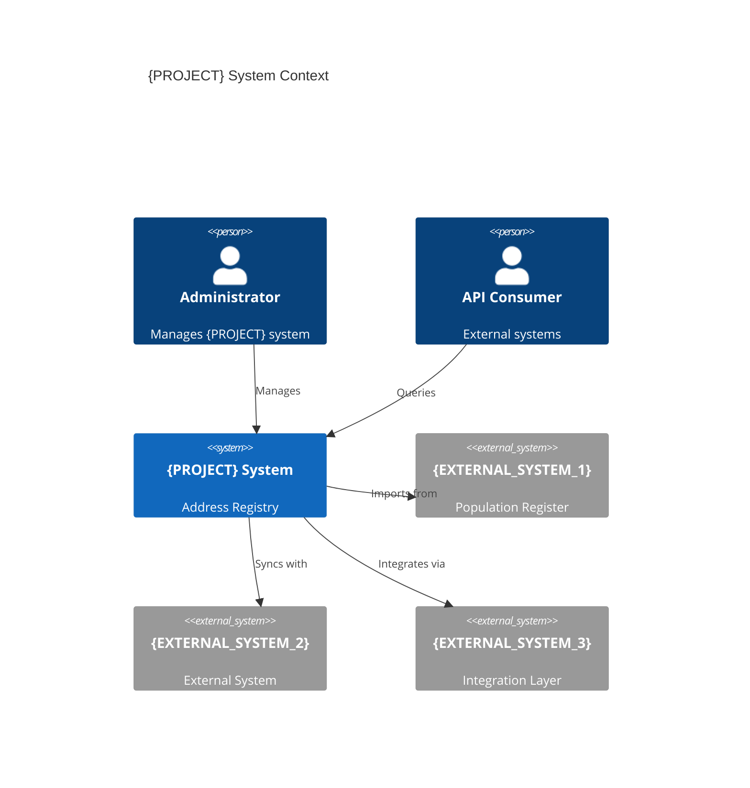
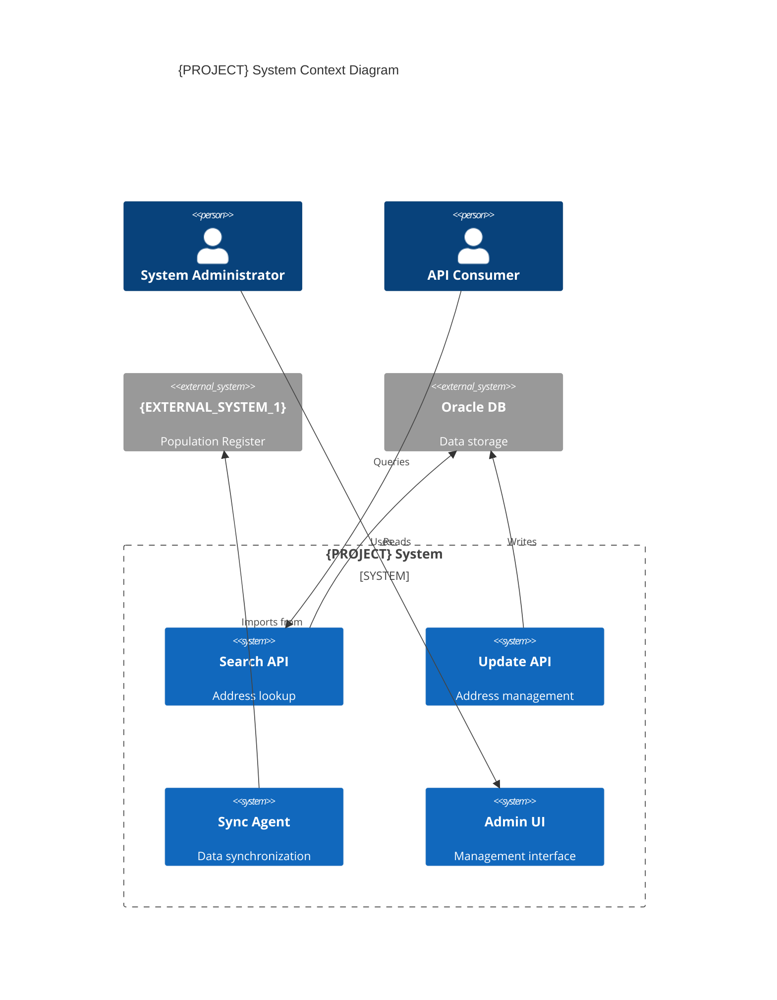
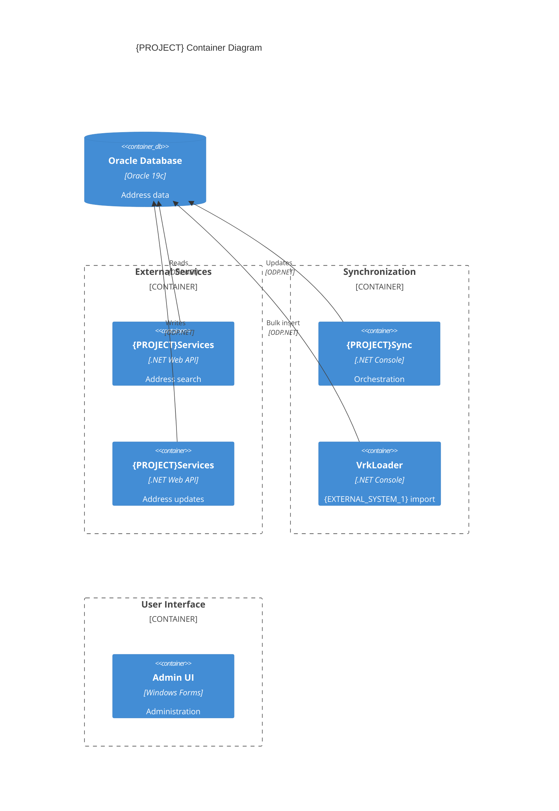
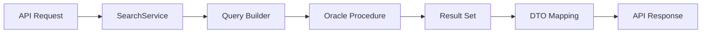

# Step 07: Requirements and Intent Synthesis

**Duration**: 3-4 hours
**Prerequisites**:
- All Step 05 component analysis completed
- Step 06 stakeholder interviews completed
- Documentation gap analysis completed (Step 04)
**Output**:
- AS-IS requirements with business context
- Intent-aware architecture documentation
- Gap-corrected documentation
- Tribal knowledge catalog

---

## Overview

This step synthesizes **THREE sources of truth**:

1. **Code Reality** (from static analysis + component analysis)
2. **Business Documentation** (from Step 01 + Step 04)
3. **Stakeholder Knowledge** (from Step 06 interviews)

**Goal**: Create AS-IS documentation that accurately describes BOTH:
- What the system actually does (reality)
- Why it was designed that way (intent)
- Where documentation diverges from reality (gaps)

### Why All Three Sources Matter

| Source Alone | Limitation | Example Misunderstanding |
|--------------|------------|--------------------------|
| **Code Only** | No context for "why" | "This EAV pattern is bad design" (Actually: documented trade-off) |
| **Docs Only** | May be outdated | "System validates Finnish addresses" (Actually: expanded to all Nordic) |
| **Interviews Only** | Tribal knowledge without evidence | "We handle edge case X" (Actually: not in code) |

**All Three Together** = Accurate AS-IS understanding

### Record Step Start Time

**PowerShell**:
```powershell
# Record this step's start time for timing tracker
$Step07StartTime = Get-Date
```

**Bash/sh**:
```bash
# Record this step's start time for timing tracker
STEP_07_START=$(date -Iseconds)
```

### Input Files

- `artifacts/04-findings/BUSINESS-DOCUMENTATION-SUMMARY.md`
- `artifacts/04-findings/DOCUMENTATION-GAP-ANALYSIS.md`
- `artifacts/05-analysis/interviews/*.md`
- `artifacts/05-analysis/INTERVIEW-SYNTHESIS.md`
- Component analysis outputs (C#, DB, Integration)

---

# â›” MANDATORY: BUSINESS RULE EXTRACTION FIRST

## 🛑 STOP: AI Agent Instruction

**YOU MUST COMPLETE THIS SECTION BEFORE SYNTHESIS.**

If you are an AI agent executing this workflow:

1. **DO NOT skip to synthesis** (Intent-aware requirements, Executive Summary)
2. **DO NOT proceed to Step 08** until this section is complete
3. **YOU MUST extract** business rules from ALL stored procedures (or representative sample)
4. **YOU MUST use** `templates/analysis/requirements-analysis-template.md`
5. **YOU MUST create** `artifacts/07-synthesis/requirements/BUSINESS-RULES-CATALOG.md`

---

## Why This Matters

**Capabilities vs. Requirements**:
- ❌ **Capability**: "System can update addresses" (architectural understanding)
- ✅ **Requirement**: "System MUST validate Swedish postal code has 5 digits with space format" (specific, traceable, testable)

**For a legacy system analysis**:
- You CANNOT validate completeness without granular requirements
- You CANNOT ensure parity (all legacy rules preserved) without extraction
- You CANNOT trace modern features to legacy business logic without identifiable requirements
- Modernization teams need hundreds of specific requirements, not 5 architectural capabilities

**User's Key Question**:
> "is capability enough? shouldn't we produce identifiable requirements from the existing system so that we can trace what requirements are migrated to modern application?"

**Answer**: NO. Capabilities are NOT enough. You MUST extract granular, traceable business requirements.

---

## MANDATORY Process: Business Rule Extraction

### Step 1: Analyze Database Business Logic

> **Meeting Recommendation (2026-01-08)**: Extract business rules ("unchangeables") separately - these are rules that MUST be preserved regardless of technical implementation.
> "There are some things the customer would tell 'these things you cannot do differently'" - Tuomo Penttinen

**Target**: ALL stored procedures, functions, triggers in database tier (Oracle PL/SQL, SQL Server T-SQL, etc.)

**Output**: `artifacts/07-synthesis/requirements/BUSINESS-RULES-CATALOG.md`

**Template**: Use `templates/analysis/business-rules-template.md` for documenting "unchangeable" rules

**Process**:
1. Identify all database procedures/packages from Step 05 component analysis
2. For EACH procedure (or representative sample if 500+ procedures):
   - Read procedure code using Read tool
   - Extract business rules (validation logic, calculations, state transitions)
   - Document as BR-XXX with description, source location, impact
3. Create catalog using template structure below

**Template Structure**:

```markdown
# Business Rules Catalog

**Status**: ⏳ IN PROGRESS {current}/{total} | ✅ COMPLETE

---

## Extraction Coverage

- **Total Database Procedures**: {n} (from Step 05 analysis)
- **Analyzed for Business Rules**: {n} ({%})
- **Business Rules Extracted**: {n}
- **Procedures with NO business logic**: {n} (mark as "Data access only")
- **Coverage Target**: {100% for <100 procs | 80% for 100-500 | 50% minimum for 500+}

---

## Business Rules Mapping

| Rule ID | Business Rule | Enforced By | Requirement ID | Impact |
|---------|---------------|-------------|----------------|--------|
| BR-001 | Swedish postal code MUST be 5 digits with space (e.g., "123 45") | AddressValidator.ValidatePostalCode:45 | FR-12-003 | High - Data quality |
| BR-002 | Municipality merger MUST preserve historical address lookups | MUNICIPALITY_MERGE.sql:120 | FR-05-012 | High - Legal compliance |
| BR-003 | {EXTERNAL_SYSTEM_1} import deduplication uses 3-field match (street, number, city) | VRK_IMPORT.DEDUPLICATE:88 | FR-15-008 | Medium - Data integrity |
| BR-004 | Composite building number MUST parse into building_id + unit_id | ADDRESS_PARSER.PARSE_BUILDING:34 | FR-03-005 | Medium - Search accuracy |
| BR-005 | Address split (property → 2 apartments) requires admin approval | ADDRESS_SPLIT.VALIDATE:12 | FR-08-001 | High - Authorization |

{... continue for all extracted rules ...}

---

## Application-Layer Business Rules

| Rule ID | Business Rule | Enforced By | Requirement ID | Impact |
|---------|---------------|-------------|----------------|--------|
| BR-201 | Address update requires "last modified by" audit trail | AddressService.UpdateAddress:89 | FR-10-004 | High - Audit compliance |
| BR-202 | Nordic address validation (FI, SE, NO, DK postal formats) | NordicAddressValidator.cs:56-234 | FR-12-001 | High - Data quality |

{... continue for all application-layer rules ...}

---

## Extraction Notes

- **Procedures analyzed**: {list of files or reference to Step 05 SA-XX documents}
- **Procedures skipped** (if any): {reason - e.g., "SA-11: 200 generic CRUD procedures with no business logic"}
- **Complex business logic found in**: {highlight specific packages/procedures}
```

**Coverage Requirement**:
- For systems with <50 procedures: Extract rules from ALL procedures
- For systems with 50-500 procedures: Extract rules from ALL procedures (use Task tool with sub-agent if needed)
- For systems with 500+ procedures: Extract rules from representative sample (50% minimum) OR use Task tool to process all

---

### Step 2: Extract Application-Layer Business Rules

**Target**: C# validation logic, business rule classes, domain models

**Output**: Add to `artifacts/07-synthesis/requirements/BUSINESS-RULES-CATALOG.md`

**Process**:
1. Review Step 05 component analysis for application-layer business logic
2. Extract rules from:
   - Validation classes (FluentValidation, DataAnnotations)
   - Business rule engines
   - Domain models with behavior
   - Service layer logic

---

### Step 3: Create Functional Requirements with Traceability

**Output**: `artifacts/07-synthesis/requirements/FUNCTIONAL-REQUIREMENTS.md`

**Template**: Use `templates/analysis/requirements-analysis-template.md`

**Process**:
1. Group business rules (BR-XXX) into functional areas
2. Create FR-XXX requirements that reference business rules
3. Add source traceability (code location)

**Example from template**:

```markdown
## 2.1 Functional Requirements (FR)

| ID | Category | Requirement | Source | Priority | Business Rules |
|----|----------|-------------|--------|----------|----------------|
| FR-12-001 | Validation | The system SHALL validate Nordic postal codes according to country-specific formats | SA-05:AddressValidator.cs:156-234 | Must | BR-001, BR-202 |
| FR-12-003 | Validation | The system SHALL validate Swedish postal codes as 5 digits with space (format: "XXX XX") | SA-05:AddressValidator.cs:178 | Must | BR-001 |
| FR-05-012 | Data Migration | The system SHALL preserve historical address lookups after municipality mergers | SA-11:MUNICIPALITY_MERGE.sql:120 | Must | BR-002 |
```

**Granularity Rule**: Each requirement should be **specific and testable**. NOT:
- ❌ "System can update addresses" (too vague)
- ✅ "System SHALL validate Swedish postal code has 5 digits with space"

---

### Step 4: Create User Stories from Requirements

> **Meeting Recommendation (2026-01-08)**: User stories should be TECHNOLOGY-AGNOSTIC and describe WHAT users need, not HOW it's implemented.
> "We are not copying the legacy system. We are creating a better system that fulfills the same user need." - Juha Parnanen

**Output**: `artifacts/07-synthesis/requirements/USER-STORIES.md`

**Template**: Use `templates/analysis/user-story-template.md`

**Key Principle**: Focus on USER NEEDS, not technical implementation details. This enables direct handoff to implementation phase (Spec Kit / Claude).

**Process**:
1. For each FR-XXX (or groups of related FR), create user stories (US-XXX)
2. Use template format with Given-When-Then acceptance criteria
3. Reference source requirements
4. **AVOID**: Page/button level specifics, database names, API details
5. **INCLUDE**: Business context, acceptance criteria, constraints (business rules)

> **Note**: For screen-level specifications (SRS documents), see [07a-brd-srs-decomposition.md](07a-brd-srs-decomposition.md) for guidance on decomposing user stories into multiple screen-level documents.

**Example from template**:

```markdown
# User Story: US-012 - Validate Swedish Postal Code

**As a** Data Quality Analyst,
**I want to** validate Swedish postal codes during address import,
**So that** the address registry contains correctly formatted Nordic addresses.

## Acceptance Criteria

- [ ] **Scenario 1**: Valid Swedish postal code accepted
  - **Given** an address with Swedish postal code "123 45"
  - **When** address is validated
  - **Then** validation passes

- [ ] **Scenario 2**: Invalid Swedish postal code rejected
  - **Given** an address with Swedish postal code "12345" (missing space)
  - **When** address is validated
  - **Then** validation fails with error "Swedish postal code must have format 'XXX XX'"

## Technical Notes

- **Source Requirement**: FR-12-003
- **Related Components**: AddressValidator.cs
- **Estimated Complexity**: Small (S)
- **Business Rules**: BR-001

## Definition of Done

- [ ] Unit tests passed (valid and invalid formats)
- [ ] Code reviewed
- [ ] Acceptance criteria met
```

---

### Step 5: Create Traceability Matrix

**Output**: `artifacts/07-synthesis/requirements/REQUIREMENTS-TRACEABILITY-MATRIX.md`

**Template**: Use `templates/analysis/traceability-matrix-template.md`

**Purpose**: Map requirements to code, tests, and user stories for modernization planning

**Example from template**:

```markdown
# Requirements Traceability Matrix

**Date**: {YYYY-MM-DD}

| Req ID | Requirement Summary | Source Artifact | User Story ID | Business Rules | Implementation Status |
|--------|---------------------|-----------------|---------------|----------------|-----------------------|
| FR-12-001 | Validate Nordic postal codes | SA-05:AddressValidator.cs:156 | US-012 | BR-001, BR-202 | Done |
| FR-12-003 | Validate Swedish postal code (5 digits + space) | SA-05:AddressValidator.cs:178 | US-012 | BR-001 | Done |
| FR-05-012 | Preserve historical lookups after municipality merge | SA-11:MUNICIPALITY_MERGE.sql:120 | US-045 | BR-002 | Done |

## Coverage Summary

- **Total Business Rules Extracted**: {n}
- **Total Functional Requirements**: {n}
- **Total User Stories**: {n}
- **Mapped to Code**: {n} ({%})
```

---

### Step 6: Create Test Plan for Migration Verification

**Output**: `artifacts/07-synthesis/requirements/TEST-PLAN.md`

**Template**: Use `templates/analysis/test-plan-template.md`

**Purpose**: Document existing test coverage, identify gaps, and create migration verification scenarios for TO-BE validation.

**Key Sections**:

1. **Test Case Inventory** - Map existing tests to requirements (TC-XXX)
2. **Coverage Analysis** - Identify untested requirements and business rules (GAP-XXX)
3. **Migration Verification Scenarios** - Define parity tests for TO-BE (MIG-XXX)

**Process**:
1. Scan codebase for existing test files and test cases
2. Map tests to requirements (FR-XXX) and business rules (BR-XXX)
3. Calculate coverage percentages by requirement type
4. Identify critical coverage gaps (GAP-XXX)
5. Create migration verification scenarios (MIG-XXX) for TO-BE feature parity

**Example from template**:

```markdown
## Migration Verification Scenarios

### MIG-001: Swedish Postal Code Validation

**Description**: Verify TO-BE validates Swedish postal codes identically to AS-IS

**Business Rules Validated**: BR-001
**Requirements Validated**: FR-12-003

**Preconditions**:
1. Address import API available
2. Test data includes Swedish addresses

**Steps**:
1. Submit address with valid Swedish postal code "123 45"
2. Submit address with invalid Swedish postal code "12345"

**AS-IS Expected Result**:
- Valid: Accepted
- Invalid: Rejected with error "Swedish postal code must have format 'XXX XX'"

**TO-BE Expected Result**:
- Same as AS-IS (feature parity required)

**Verification Method**:
- [ ] Automated test: tests/AddressValidation/SwedishPostalCodeTest.cs
```

**Why Test Plan Matters for Migration**:
- **Without Test Plan**: No way to verify TO-BE implements all AS-IS behavior
- **With Test Plan**: Clear acceptance criteria for feature parity verification

---

## Completeness Checklist (BLOCKING)

Before proceeding to synthesis (Section 7.1+), verify:

### Business Rule Extraction
- [ ] `artifacts/07-synthesis/requirements/BUSINESS-RULES-CATALOG.md` exists
- [ ] Coverage status = "✅ COMPLETE" (or minimum 50% for 500+ procedures)
- [ ] Business rules count > 50 (for non-trivial system) OR justified why fewer
- [ ] Each BR-XXX has: description, source location, impact level

### Template Usage
- [ ] `FUNCTIONAL-REQUIREMENTS.md` created using requirements-analysis-template.md
- [ ] User stories created using user-story-template.md format
- [ ] Traceability matrix created using traceability-matrix-template.md
- [ ] Test plan created using test-plan-template.md (migration verification scenarios)

### Granularity Validation
- [ ] Requirements are SPECIFIC (not "system can update" but "system SHALL validate X")
- [ ] Each requirement is TESTABLE (clear acceptance criteria)
- [ ] Each requirement has SOURCE TRACEABILITY (file:line)

### Coverage Validation
- [ ] For systems with <100 stored procedures: ALL analyzed OR justified exceptions
- [ ] For systems with 100-500 procedures: ALL analyzed OR 80% minimum
- [ ] For systems with 500+ procedures: Representative sample 50% minimum

**IF ANY CHECKBOX IS UNCHECKED, STOP HERE AND COMPLETE EXTRACTION.**

**DO NOT PROCEED TO SYNTHESIS (Section 7.1) UNTIL ALL BOXES ARE CHECKED.**

---

## AFTER Extraction: Proceed to Synthesis

Only after completing business rule extraction and template usage:

1. Proceed to Section 7.1: Required Deliverables
2. Proceed to Section 7.2: Requirements with Intent and Gaps
3. Proceed to Section 7.3: Intent-Aware Architecture
4. Proceed to Executive Summary (Section 7.5)

The synthesis sections ADD intent, gaps, and stakeholder knowledge to the requirements you already extracted.

**Why This Ordering Matters**:

- **Before**: Agent did synthesis FIRST → produced 5 architectural capabilities, no granular rules
- **After**: Agent extracts granular rules FIRST → then adds intent/gaps/context in synthesis

---

## 7.1 Required Deliverables

| Deliverable | File | Purpose |
|-------------|------|---------|
| Executive Summary | `{PROJECT}-LEGACY-ANALYSIS-EXECUTIVE-SUMMARY.md` | High-level findings for leadership |
| Architecture Doc | `{PROJECT}-LEGACY-ARCHITECTURE.md` | Technical architecture details |
| Integration Architecture | `{PROJECT}-INTEGRATION-ARCHITECTURE.md` | Integration point documentation |
| Architecture Challenges | `{PROJECT}-ARCHITECTURE-CHALLENGES.md` | Technical debt and issues |
| Improvement Opportunities | `{PROJECT}-IMPROVEMENT-OPPORTUNITIES.md` | Recommended improvements |
| User Stories | `07-requirements/{PROJECT}-USER-STORIES.md` | Extracted user stories |
| Requirements Matrix | `07-requirements/REQUIREMENTS-TRACEABILITY-MATRIX.md` | Traceability matrix |

---

## 7.2 Requirements with Intent and Gaps

This section creates requirements that integrate all three sources of truth.

### 7.2.1 Enhanced Functional Requirements Template

**Output**: `artifacts/07-synthesis/requirements/FUNCTIONAL-REQUIREMENTS.md`

Each requirement includes:
- **ID**: Unique identifier
- **Description**: What the system does (from code)
- **Intent**: Why it was designed this way (from docs + interviews)
- **Source**: Evidence (code files + doc links + interview quotes)
- **Gap Status**: Documentation accuracy
- **Stakeholder Confirmation**: Interview validation

Example format:

```markdown
### SA-FR-001: Finnish Address Validation

**Description**:
System validates addresses for Finland, Sweden, Norway, and {COUNTRY} using
Nordic postal code formats.

**Intent**:
Originally scoped for Finland only (BRD-2018). Expanded to Nordic region in
2020 due to {EXTERNAL_SYSTEM_2} integration requirements.

**Source**:
- Code: `AddressValidator.cs:156-234` (Nordic validation logic)
- Original Docs: BRD-2018 "Finnish address validation"
- Updated Req: Jira {PROJECT}-456 "Expand to Nordic countries"
- Interview: Product Owner confirmed expansion in Q2 2020

**Gap Status**: ⚠️ **DIVERGED**
- Original docs not updated after Nordic expansion
- Current code reflects actual requirement
- Recommend: Update BRD with Nordic scope

**Stakeholder Confirmation**: ✅ Product Owner, Principal Engineer

**Acceptance Criteria** (from code behavior):
- [x] Validates Finnish postal codes (5 digits)
- [x] Validates Swedish postal codes (5 digits with space)
- [x] Validates Norwegian postal codes (4 digits)
- [x] Validates {COUNTRY} postal codes (4 digits)
- [x] Rejects invalid formats with clear error messages
```

### 7.2.2 Document Tribal Knowledge

**Output**: `artifacts/07-synthesis/requirements/TRIBAL-KNOWLEDGE.md`

Capture implicit business rules, operational knowledge, and contextual information that exists only in stakeholder minds.

```markdown
# Tribal Knowledge Documentation

## Overview

This document captures implicit business rules, operational knowledge, and
contextual information that exists only in stakeholder minds - not in code
or documentation.

**Source**: Step 06 stakeholder interviews

---

## Business Rules (Implicit)

### Rule: Weekend Batch Processing

**Description**: {EXTERNAL_SYSTEM_1} imports are always scheduled for weekends to minimize
impact on search performance.

**Source**: Operations Engineer interview
**In Code?**: No (external scheduler)
**In Docs?**: No
**Critical?**: Yes - affects deployment windows

**Rationale**:
During import, database locks affect search performance. Weekend traffic is
10% of weekday, so users less impacted.

**Must Preserve in Modernization**: Yes

---

## Historical Context

### Context: WSE 3.0 Dependency

**Current State**: Legacy SOAP services still reference WSE 3.0

**History** (from Principal Engineer):
- Original system built 2015-2016 when WSE 3.0 was standard
- Migration to WCF planned for 2018 but deprioritized
- Now deprecated but removing it requires rewriting 3 SOAP clients

**Why Not Removed**:
"Works fine, no security holes in our use case, other priorities always
higher" - Principal Engineer

**Implication for Modernization**:
Can be removed in TO-BE but not urgent unless modernizing SOAP services anyway.

---

## Operational Knowledge

### Peak Load Periods

**Insight** (from Operations Engineer):
- Normal: 50-100 requests/minute
- Peak: 500-800 requests/minute
- Peak Times:
  - Mondays 9-11 AM (start of week queries)
  - Last week of month (report generation)
  - After {EXTERNAL_SYSTEM_1} address standard updates (2x/year)

**Not Documented**: Performance testing was done at 100 RPS, below actual
peak. System copes but response times degrade to 2-5 seconds.

---

## "Why It's Built That Way"

### Complex SQL Procedures (500+ lines)

**Question**: Why not break into smaller procedures?

**Answer** (DBA):
"Oracle optimizer doesn't optimize well across procedure boundaries for our
EAV queries. Keeping logic in one procedure lets optimizer see full query
plan. We tried splitting it in 2019 - performance dropped 30%."

**Status**: Performance optimization, not bad design
```

### 7.2.3 Update Non-Functional Requirements with Reality

**Output**: `artifacts/07-synthesis/requirements/NON-FUNCTIONAL-REQUIREMENTS.md`

Enhance NFRs with actual measurements and stakeholder context:

```markdown
# AS-IS Non-Functional Requirements

## SA-NFR-001: Address Search Performance

**Documented Requirement** (from SLA-2019):
- Target: 200ms
- Maximum: 500ms

**Actual Performance** (from monitoring + Operations interview):
- Average: 300-400ms
- Peak hours: 2-5 seconds
- Worst case (during {EXTERNAL_SYSTEM_1} import): 10+ seconds

**Root Cause** (from DBA interview):
EAV queries require multiple table scans. Indexes help but don't eliminate problem.

**User Acceptance** (from Product Owner):
"Users complain occasionally during peak. Not critical enough to prioritize fix."

**Status**: ⚠️ **NOT MEETING SLA** (but tolerated)

**Implication for TO-BE**:
- Opportunity for improvement (10x performance gain possible)
- Current architecture is bottleneck
- Must address in modernization

---

## SA-NFR-002: System Availability

**Documented Requirement**: 99.5% uptime (SLA-2019)

**Actual Performance** (from monitoring):
- Uptime: 99.2% (last 12 months)
- Outages: 3 incidents > 1 hour
- Downtime: Primarily during {EXTERNAL_SYSTEM_1} imports (planned maintenance)

**Gap Analysis**:
- SLA not quite met but no penalties invoked
- Most downtime is planned weekend maintenance
- Unplanned outages were database disk space issues (now monitored)

**Status**: ⚠️ **SLIGHTLY BELOW TARGET** (acceptable)
```

---

## 7.3 Intent-Aware Architecture Documentation

### Purpose

Standard AS-IS architecture documentation describes WHAT the system does.
Intent-aware documentation adds WHY it was designed that way and WHERE
documentation gaps exist.

### 7.3.1 Update Introduction with Design Intent

Add to Arc42 AS-IS `01-introduction-goals.md`:

```markdown
## 1.3 Design Intent and Evolution

### Original System Goals (2015-2016)

**Business Drivers** (from BRD-2015):
1. Centralize Finnish address data from {EXTERNAL_SYSTEM_1}
2. Provide REST API for internal/external consumers
3. Replace legacy mainframe address lookup

**Design Principles** (from ADR documents):
1. Flexibility over performance (EAV pattern)
2. Standards compliance (SOAP for legacy, REST for modern)
3. Incremental migration (strangler fig from mainframe)

**Constraints** (from interview + docs):
1. Must maintain backward compatibility with mainframe clients
2. Limited budget - use existing Oracle license
3. Small team (2 developers) - keep architecture simple

### System Evolution (2016-2025)

**Major Changes**:
- 2018: Expanded from Finnish to Nordic addresses ({EXTERNAL_SYSTEM_2} integration)
- 2020: Added real-time sync to {EXTERNAL_SYSTEM_2}
- 2022: Performance optimization (materialized views)
- 2023: Monitoring improvements

**Divergence from Original Design**:
- ⚠️ EAV pattern now recognized as bottleneck (was: flexibility benefit)
- ⚠️ Nordic expansion changed scope significantly (was: Finland only)
- ✅ REST API adoption successful (was: uncertain if clients would migrate)

**Lessons Learned** (from stakeholder interviews):
- Flexibility-first design had hidden performance costs
- Requirements changed more than expected (Nordic expansion)
- Small team kept architecture manageable but limited innovation
```

### 7.3.2 Update Solution Strategy with Intent Context

Add to Arc42 AS-IS `04-solution-strategy.md`:

```markdown
## 4.1 Technology Decisions with Rationale

### Decision: Entity-Attribute-Value (EAV) Pattern

**What**: Address data stored in EAV tables rather than fixed schema

**Why** (from ADR-2018-03 + Principal Engineer interview):
- International address standards were changing frequently (2015-2018)
- Team anticipated need for flexible schema
- Trade-off accepted: Performance for adaptability

**Current Assessment** (2025):
- ✅ Adaptability achieved (handled Nordic expansion without schema change)
- ❌ Performance cost higher than expected (2-5s queries)
- 📊 Technical debt recognized (see Section 11)

**Would We Choose Differently?**:
"Probably yes. Standards stabilized by 2020. JSON column in PostgreSQL would
have given flexibility with better performance." - Principal Engineer
```

### 7.3.3 Create Documentation Gaps Section

New Arc42 section `12-documentation-gaps.md`:

```markdown
# 12. Documentation Gaps and Tribal Knowledge

**Purpose**: This section documents where the AS-IS documentation diverges
from reality, tribal knowledge that was previously undocumented, and
clarifications needed for accurate system understanding.

---

## 12.1 Gap Summary

| Category | Count | Critical? | Resolution |
|----------|-------|-----------|------------|
| Documentation Ahead of Reality | {n} | {n} | Updated AS-IS docs |
| Reality Ahead of Documentation | {n} | {n} | Added to AS-IS docs |
| Divergence (docs vs. code) | {n} | {n} | Both versions noted |
| Tribal Knowledge Captured | {n} | {n} | Now documented |

---

## 12.4 Intentional Workarounds

These code patterns may appear as "bad code" but are intentional:

| Code Pattern | Looks Like | Actually Is | Source |
|--------------|-----------|-------------|--------|
| 500+ line SQL procedures | Code smell | Oracle optimizer requirement | DBA + ADR |
| Duplicate validation in C# and PL/SQL | DRY violation | Integration requirement | Integration spec |
| EAV queries with 5+ joins | Poor performance | Necessary with EAV pattern | ADR-2018-03 |

**Implication**: Don't "fix" these without understanding context.
```

---

## 7.4 Gap-Corrected Documentation Summary

**Output**: `artifacts/07-synthesis/DOCUMENTATION-GAP-SUMMARY.md`

```markdown
# Documentation Gap Summary

## Purpose

This document summarizes all gaps found between business documentation and
code reality, and how they were resolved in the AS-IS documentation.

---

## Gap Resolution Statistics

| Gap Type | Count | Resolved | Deferred to TO-BE |
|----------|-------|----------|-------------------|
| Documentation Ahead of Reality | {n} | {n} | {n} |
| Reality Ahead of Documentation | {n} | {n} | {n} |
| Divergence (docs vs. code) | {n} | {n} | {n} |
| Tribal Knowledge Captured | {n} | {n} | N/A |

---

## All Gaps with Resolutions

### GAP-001: Nordic Scope Expansion

**Type**: Divergence

**Documented**: Finnish addresses only
**Reality**: Nordic addresses (FI, SE, NO, DK)

**Investigation**:
- Code: Validates all Nordic postal codes
- Docs: BRD-2015 says Finnish only
- Interview: Product Owner confirmed Q2 2020 expansion

**Resolution**:
- AS-IS docs updated to Nordic scope
- Section 1.3 explains evolution
- Original Finnish-only intent preserved in history

---

## Tribal Knowledge Now Documented

| Knowledge | Source | Now Documented In |
|-----------|--------|-------------------|
| Weekend batch scheduling | Operations Engineer | SA-NFR-004, Section 9 |
| 60-second sync tolerance | Principal Engineer | SA-FR-015 |
| {EXTERNAL_SYSTEM_1} deduplication handling | DBA + code | SA-FR-003 |
| Peak load patterns | Operations Engineer | SA-NFR-001 |

---

## Recommendations for TO-BE Phase

Based on gap analysis, TO-BE phase should:

1. **Address Performance Gaps**:
   - Replace EAV with normalized + JSON hybrid
   - Target <200ms search performance

2. **Update Business Documentation**:
   - Retire outdated BRD-2015
   - Create current requirements doc

3. **Formalize Tribal Knowledge**:
   - Operational runbooks
   - Architecture decision records

4. **Close Documentation Loop**:
   - Establish docs-as-code practice
   - Auto-generate docs from code where possible
```

---

## 7.5 Executive Summary

**Output**: `{ANALYSIS_ROOT}/{PROJECT}-LEGACY-ANALYSIS-EXECUTIVE-SUMMARY.md`

### Template

```markdown
# {PROJECT} Legacy Codebase - Executive Summary

**Analysis Date**: {date}
**Prepared By**: AI-Assisted Analysis
**Version**: 1.0

---

## Key Metrics

| Metric | Value |
|--------|-------|
| Total C# Files | {n} |
| Total C# Lines of Code | {n} |
| Total Database Objects | {n} |
| Total PL/SQL Lines of Code | {n} |
| Test Coverage |  |
| Oracle PL/SQL | Database Layer | {%} |
| ASP.NET Web API | Services | {count} |
| Windows Forms | UI | {count} |

---

## Architecture Overview



---

## Top 10 Key Findings

1. **{Finding 1}**: {description}
2. **{Finding 2}**: {description}
3. **{Finding 3}**: {description}
4. **{Finding 4}**: {description}
5. **{Finding 5}**: {description}
6. **{Finding 6}**: {description}
7. **{Finding 7}**: {description}
8. **{Finding 8}**: {description}
9. **{Finding 9}**: {description}
10. **{Finding 10}**: {description}

---

## Critical Integration Points

| Integration | Type | Count | Risk Level |
|-------------|------|-------|------------|
| Database Procedures | Internal | {n} | {level} |
| {EXTERNAL_SYSTEM_1} Import | External | {n} | {level} |
| Web APIs | External | {n} | {level} |
| File Exchange | External | {n} | {level} |

---

## Technical Debt Summary

| Category | Count | Severity | Impact |
|----------|-------|----------|--------|
| {category} | {n} | {High|Medium|Low} | {description} |

---

## Modernization Readiness

| Dimension | Score | Notes |
|-----------|-------|-------|
| Code Quality | {1-5} | {notes} |
| Test Coverage | {1-5} | {notes} |
| Documentation | {1-5} | {notes} |
| Architecture | {1-5} | {notes} |
| Dependencies | {1-5} | {notes} |
| **Overall** | **{1-5}** | {summary} |

---

## Recommended Next Steps

1. {step 1}
2. {step 2}
3. {step 3}

---

## Document References

| Document | Description |
|----------|-------------|
| [{PROJECT}-LEGACY-ARCHITECTURE.md]({PROJECT}-LEGACY-ARCHITECTURE.md) | Detailed architecture |
| [{PROJECT}-INTEGRATION-ARCHITECTURE.md]({PROJECT}-INTEGRATION-ARCHITECTURE.md) | Integration details |
| [{PROJECT}-ARCHITECTURE-CHALLENGES.md]({PROJECT}-ARCHITECTURE-CHALLENGES.md) | Technical debt |
| [{PROJECT}-IMPROVEMENT-OPPORTUNITIES.md]({PROJECT}-IMPROVEMENT-OPPORTUNITIES.md) | Improvement plan |
```

---

## 7.6 Architecture Documentation

**Output**: `artifacts/09-summaries/{PROJECT}-LEGACY-ARCHITECTURE.md`

### Template

```markdown
# {PROJECT} Legacy Architecture Documentation

## 1. System Context (C4 Level 1)



## 2. Container Diagram (C4 Level 2)



## 3. Component Overview

### 3.1 External Services

{Summary from SA-02 and SA-03}

### 3.2 Synchronization Layer

{Summary from SA-04}

### 3.3 Tools & Utilities

{Summary from SA-06}

### 3.4 UI Layer

{Summary from SA-07}

### 3.5 Common Libraries

{Summary from SA-01}

## 4. Data Flow Diagrams

### 4.1 {EXTERNAL_SYSTEM_1} Import Flow

```mermaid
flowchart LR
    A[{EXTERNAL_SYSTEM_1} Source] --> B[VrkLoader]
    B --> C[Staging Tables]
    C --> D[Validation]
    D --> E{Valid?}
    E -->|Yes| F[Production Tables]
    E -->|No| G[Error Log]
```

### 4.2 Address Search Flow



## 5. Technology Stack

### 5.1 Application Layer

| Technology | Version | Usage |
|------------|---------|-------|
| .NET Framework | {version} | {usage} |
| ASP.NET Web API | {version} | {usage} |
| Windows Forms | {version} | {usage} |

### 5.2 Database Layer

| Technology | Version | Usage |
|------------|---------|-------|
| Oracle Database | {version} | {usage} |
| PL/SQL | - | {usage} |
| ODP.NET | {version} | {usage} |

### 5.3 Infrastructure

| Technology | Usage |
|------------|-------|
| IIS | Web hosting |
| Windows Service | Sync agents |
| AWS SNS | Notifications |

## 6. Deployment Architecture

{Inferred from configuration files}

```mermaid
flowchart TB
    subgraph Production
        LB[Load Balancer]
        WEB1[Web Server 1]
        WEB2[Web Server 2]
        DB[(Oracle RAC)]
    end

    subgraph External
        {EXTERNAL_SYSTEM_1}[{EXTERNAL_SYSTEM_1} System]
    end

    LB --> WEB1
    LB --> WEB2
    WEB1 --> DB
    WEB2 --> DB
    {EXTERNAL_SYSTEM_1} --> WEB1
```

## 7. Security Architecture

### 7.1 Authentication

{From configuration analysis}

### 7.2 Authorization

{From code analysis}

### 7.3 Data Protection

{From code analysis}
```

---

## 7.7 Requirements Extraction

### Requirements Sub-Agents

Launch 2 sub-agents for requirements extraction:

| Agent ID | Focus | Input | Output |
|----------|-------|-------|--------|
| SA-31 | Functional Requirements | All Step 05 analysis docs | `07-requirements/FUNCTIONAL-REQUIREMENTS.md` |
| SA-32 | Non-Functional Requirements | All Step 05 analysis docs | `07-requirements/NON-FUNCTIONAL-REQUIREMENTS.md` |

### User Stories Creation

**Output**: `{ANALYSIS_ROOT}/07-requirements/{PROJECT}-USER-STORIES.md`

```markdown
# {PROJECT} User Stories

## Address Management

### US-001: Search Address by Street Name

**As an** API consumer
**I want to** search for addresses by street name
**So that** I can find matching addresses in the registry

**Acceptance Criteria**:
- AC-001: API accepts partial street name (minimum 3 characters)
- AC-002: Results include street name, number, postal code, city
- AC-003: Results are paginated (max 100 per page)
- AC-004: Response time < 500ms for typical queries

**Related Requirements**: FR-002, NFR-001
**Current Implementation**: `{PROJECT}Services/AddressController.cs:45`
**Priority**: High

---

### US-002: Import {EXTERNAL_SYSTEM_1} Data

**As an** administrator
**I want to** import address data from {EXTERNAL_SYSTEM_1}
**So that** the address registry stays current

**Acceptance Criteria**:
- AC-001: Import accepts {EXTERNAL_SYSTEM_1} data format
- AC-002: Data is validated before import
- AC-003: Import progress is visible
- AC-004: Errors are logged with details
- AC-005: Import can be resumed after failure

**Related Requirements**: FR-015, NFR-003
**Current Implementation**: `{PROJECT}Loader/{EXT1}Importer.cs:100`
**Priority**: High
**Current Pain Point**: No progress visibility (1-2 hour blind wait)

---

{Continue for all extracted user stories...}
```

### Traceability Matrix

**Output**: `{ANALYSIS_ROOT}/07-requirements/REQUIREMENTS-TRACEABILITY-MATRIX.md`

```markdown
# Requirements Traceability Matrix

## User Stories to Requirements

| User Story | Functional Req | Non-Functional Req | Code Location |
|------------|---------------|-------------------|---------------|
| US-001 | FR-002 | NFR-001, NFR-005 | {PROJECT}Services/AddressController.cs:45 |
| US-002 | FR-015, FR-016 | NFR-003, NFR-004 | {PROJECT}Loader/{EXT1}Importer.cs:100 |

## Functional Requirements to Code

| Requirement | Description | Implementation | Test Coverage |
|-------------|-------------|----------------|---------------|
| FR-001 | {description} | {file:line} | {Yes|No} |
| FR-002 | {description} | {file:line} | {Yes|No} |

## Business Rules to Database

| Business Rule | Description | DB Object | Line |
|---------------|-------------|-----------|------|
| BR-001 | {description} | {procedure} | {line} |
| BR-002 | {description} | {function} | {line} |
```

---

## 7.8 Modernization Documents

### Step 07 Outputs

| Document | Purpose |
|----------|---------|
| `07-modernization/{PROJECT}-MODERNIZATION-OPTIONS.md` | Strategy options |
| `07-modernization/ARCHITECTURE-MODERNIZATION-ROADMAP.md` | Implementation roadmap |
| `07-modernization/INTERNAL-REFACTORING-ROADMAP.md` | Quick wins |
| `07-modernization/ADR-TEMPLATE.md` | Decision templates |

### Modernization Options Template

```markdown
# {PROJECT} Modernization Options

## Option 1: Rewrite (Greenfield)

### Description
Complete rebuild from scratch using modern technologies.

### Pros
- Clean architecture
- No legacy constraints
- Modern tech stack

### Cons
- High risk
- Long timeline
- Knowledge loss risk

### Effort
- Duration: 18-24 months
- Team: 8-10 developers
- Cost: $$$$$

### Recommendation: NOT RECOMMENDED

---

## Option 2: Refactor (Incremental)

### Description
Gradual modernization while maintaining the existing system.

### Pros
- Lower risk
- Continuous delivery
- Knowledge preserved

### Cons
- Slower progress
- Legacy constraints remain
- Dual maintenance

### Effort
- Duration: 12-18 months
- Team: 5-6 developers
- Cost: $$$

### Recommendation: RECOMMENDED

---

{Continue for other options...}

## Final Recommendation

Based on analysis:
- **Recommended Approach**: {option}
- **Rationale**: {explanation}
- **First Steps**: {next actions}
```

---

## 7.8 Arc42 Documentation Population (MANDATORY)

**Purpose**: Transfer analyzed content from work artifacts to Arc42 13-section documentation

**Why This Matters**: Analysis artifacts (in `work/`) are internal analysis outputs. Arc42 documents (in `arch-as-is/`) are the deliverables for stakeholders. Content must be transferred from artifacts to Arc42 sections.

### 🛑 STOP: AI Agent Instruction

**YOU MUST COMPLETE THIS SECTION BEFORE STEP 08.**

If you are an AI agent executing this workflow:

1. **DO NOT skip Arc42 population** - this is the primary deliverable
2. **DO NOT proceed to Step 08** until ALL 13 Arc42 sections are populated
3. **YOU MUST use** the artifact→Arc42 mapping table below
4. **YOU MUST include** subsection 1.4 (Project Structure) in Section 01
5. **YOU MUST include** component file locations in Section 05 tables

### Artifact → Arc42 Section Mapping

Use this table to transfer content from analysis artifacts to Arc42 documentation:

| Analysis Artifact (work/) | → | Arc42 Section (arch-as-is/) | Content to Transfer |
|---------------------------|---|----------------------------|---------------------|
| `01-reconnaissance/CODE-INVENTORY.md` | → | `01-introduction-goals.md` | **Section 1.4 Project Structure**: Repository layout, module locations, folder structure with tree diagram |
| `01-reconnaissance/CODE-INVENTORY.md` | → | `05-building-block-view.md` | **Location column** in component tables: File system paths for each component |
| `01-reconnaissance/DOCUMENTATION-INVENTORY.md` | → | `13-documentation-gaps.md` | Available vs missing documentation, stakeholder contacts |
| `05-analysis/COMPONENT-ANALYSIS.md` | → | `05-building-block-view.md` | Component descriptions, responsibilities, dependencies, interfaces |
| `05-analysis/integration/INTEGRATION-ANALYSIS.md` | → | `03-context-scope.md` | External systems, integration protocols, data flows |
| `07-synthesis/requirements/BUSINESS-RULES-CATALOG.md` | → | `08-crosscutting-concepts.md` | Business logic patterns, validation rules, calculation formulas |
| `07-synthesis/requirements/FUNCTIONAL-REQUIREMENTS.md` | → | `09-architecture-decisions/` | Requirements traceability, feature mapping |
| `07-synthesis/requirements/NON-FUNCTIONAL-REQUIREMENTS.md` | → | `10-quality-requirements.md` | Performance, scalability, security requirements |
| `04-findings/TECHNICAL-DEBT.md` | → | `11-risks-technical-debt.md` | Technical debt items, risks, mitigation strategies |
| `06-review/INTERVIEW-SYNTHESIS.md` | → | `01-introduction-goals.md` | **Section 1.3 Design Intent**: Original goals, evolution, lessons learned |
| `04-findings/DOCUMENTATION-GAP-ANALYSIS.md` | → | `13-documentation-gaps.md` | Gaps between docs and reality, tribal knowledge |

### 7.8.1 MANDATORY: Add Project Structure to Section 01

**File**: `arch-as-is/01-introduction-goals.md`

Add subsection 1.4 after stakeholders section:

```markdown
## 1.4 Project Structure

### Repository Layout

This system exists within a [multi-repository|monorepo] environment:

| Repository | Purpose | Technology | Location |
|------------|---------|------------|----------|
| `{repo-name}` | {description} | {tech-stack} | {path} |

### Module Location

**{Module Name}**: `{repository}/{module-path}/`

\```
{repository}/{module-path}/
├── src/main/java/{package-path}/        # Main application code
│   ├── {component-folder}/               # Component A
│   │   ├── {ControllerClass}.java
│   │   ├── {ServiceClass}.java
│   │   └── validators/
│   └── {other-component}/                # Component B
│       └── {ComponentClass}.java
├── src/main/resources/                   # Configuration files
├── src/test/java/                        # Test code
└── pom.xml                               # Maven build file
\```

**Documentation Reference**: See `work/01-reconnaissance/CODE-INVENTORY.md` for complete file listing.
```

**Data Source**: Extract from `work/01-reconnaissance/CODE-INVENTORY.md` (Location fields)

### 7.8.2 MANDATORY: Add Component Locations to Section 05

**File**: `arch-as-is/05-building-block-view.md`

Update all component tables to include Location column:

```markdown
| Container | Technology | Purpose | LOC | **Location** |
|-----------|------------|---------|-----|--------------|
| {component-name} | {tech} | {description} | ~{n} | `{repo-name}/.../package/path/` |
| {component-name} | {tech} | {description} | ~{n} | `{repo-name}/.../package/path/` |
```

**Data Source**: Extract from `work/01-reconnaissance/CODE-INVENTORY.md` (Location fields)

### 7.8.3 Population Checklist

Verify ALL 13 Arc42 sections are populated:

- [ ] **01-introduction-goals.md** - Includes subsection 1.4 (Project Structure)
- [ ] **02-constraints.md** - Technical, organizational, political constraints
- [ ] **03-context-scope.md** - External interfaces (from INTEGRATION-ANALYSIS.md)
- [ ] **04-solution-strategy.md** - Technology decisions with intent/rationale
- [ ] **05-building-block-view.md** - Components with Location column
- [ ] **06-runtime-view.md** - Key scenarios and processes
- [ ] **07-deployment-view.md** - Infrastructure and environments
- [ ] **08-crosscutting-concepts.md** - Business rules, patterns (from BUSINESS-RULES-CATALOG.md)
- [ ] **09-architecture-decisions/** - ADRs with rationale
- [ ] **10-quality-requirements.md** - NFRs (from NON-FUNCTIONAL-REQUIREMENTS.md)
- [ ] **11-risks-technical-debt.md** - Technical debt (from TECHNICAL-DEBT.md)
- [ ] **12-glossary.md** - Domain terms and abbreviations
- [ ] **13-documentation-gaps.md** - Gaps between docs and reality

---

## 7.9 Synthesis Checklist

Before completing this step, verify all three sources are integrated:

### Business Rule Extraction (MANDATORY - NEW)
- [ ] Business Rules Catalog (`BUSINESS-RULES-CATALOG.md`) exists
- [ ] Coverage status = "✅ COMPLETE" (or minimum threshold met)
- [ ] Business rules count > 50 for non-trivial system OR justified why fewer
- [ ] Each BR-XXX has: description, source location, impact level
- [ ] Functional requirements (SA-31) created using `requirements-analysis-template.md`
- [ ] User stories created using `user-story-template.md` format
- [ ] Traceability matrix created using `traceability-matrix-template.md`
- [ ] Test plan created using `test-plan-template.md` with migration verification scenarios (MIG-XXX)
- [ ] Requirements are SPECIFIC and TESTABLE (not vague capabilities like "system can update")
- [ ] Each requirement has SOURCE TRACEABILITY (file:line references)

### Three-Source Integration
- [ ] Code reality documented (from Step 05 component analysis)
- [ ] Business documentation reviewed (from Step 04)
- [ ] Stakeholder interviews completed (from Step 06)
- [ ] All three sources cross-referenced in requirements

### Requirements with Intent and Gaps
- [ ] Enhanced functional requirements with intent and gap status
- [ ] Tribal knowledge documented (TRIBAL-KNOWLEDGE.md)
- [ ] Non-functional requirements updated with actual measurements
- [ ] Gap-corrected documentation summary complete

### Intent-Aware Architecture
- [ ] Arc42 01-introduction-goals.md updated with Design Intent section
- [ ] Arc42 04-solution-strategy.md updated with technology rationale
- [ ] Arc42 12-documentation-gaps.md created

### Standard Deliverables
- [ ] Executive Summary complete with all metrics
- [ ] Architecture documentation includes C4 diagrams
- [ ] Integration architecture aggregates all integration points
- [ ] Architecture challenges document all technical debt
- [ ] Improvement opportunities prioritized
- [ ] User stories extracted (30-50 minimum)
- [ ] Traceability matrix complete
- [ ] Modernization options documented
- [ ] All documents cross-referenced

---

## Step Output: Findings Summary

**IMPORTANT**: After completing this step, document the synthesized project understanding. This is the PRIMARY OUTPUT for stakeholders.

### Required Output Template

```markdown
# Step 07 Findings: Synthesis & Deliverables

## Status: [COMPLETE | PARTIAL | BLOCKED]

## Executive Summary

### System Overview
- **System Name**: {name}
- **Business Purpose**: {1-2 sentences}
- **Technology Stack**: {summary}
- **Complexity Rating**: {High/Medium/Low}
- **Modernization Priority**: {Critical/High/Medium/Low}

### Key Metrics

| Metric | Value |
|--------|-------|
| Total Lines of Code | {n} |
| C# Application Code | {n} |
| PL/SQL Database Code | {n} |
| Test Coverage | {%} |
| Technical Debt (estimated days) | {n} |

## Architecture Summary

### Current State
- **Architecture Pattern**: {e.g., Monolithic, Layered}
- **Database Strategy**: {e.g., Smart Database, ORM}
- **Integration Points**: {count and types}
- **Deployment Model**: {e.g., IIS, Cloud}

### Key Components

| Component | Purpose | Complexity | Modernization Effort |
|-----------|---------|------------|---------------------|
| {component} | {purpose} | {High/Med/Low} | {estimate} |

## Business Logic Summary

### Core Business Rules (Top 10)

| Rule ID | Description | Source | Impact |
|---------|-------------|--------|--------|
| BR-001 | {description} | {location} | {High/Med/Low} |

### Key Calculations

| Calculation | Formula | Location | Reimplementation Notes |
|-------------|---------|----------|----------------------|
| {name} | {formula} | {location} | {notes} |

## Risk Assessment

| Risk | Severity | Likelihood | Mitigation |
|------|----------|------------|------------|
| {risk} | {High/Med/Low} | {High/Med/Low} | {mitigation} |

## Modernization Recommendations

### Phase 1 (Quick Wins)
1. {recommendation with estimated effort}

### Phase 2 (Core Modernization)
1. {recommendation with estimated effort}

### Phase 3 (Full Transformation)
1. {recommendation with estimated effort}

## Deliverables Checklist

- [ ] Executive Summary document
- [ ] Architecture diagrams (C4)
- [ ] Business rules catalog
- [ ] Technical debt inventory
- [ ] Modernization roadmap
- [ ] User stories (for RFP/rewrite)
```

---

## Record Step Completion Time

**IMPORTANT**: Record this step's completion time for the timing tracker.

**PowerShell**:
```powershell
# Record step completion time and append to timing tracker
$Step07EndTime = Get-Date
$timingEntry = @{
    step = "07"
    description = "Requirements and Intent Synthesis"
    start = $Step07StartTime.ToString('yyyy-MM-ddTHH:mm:ss')
    end = $Step07EndTime.ToString('yyyy-MM-ddTHH:mm:ss')
    duration_min = [math]::Round(($Step07EndTime - $Step07StartTime).TotalMinutes, 1)
}
$timingEntry | ConvertTo-Json -Compress | Add-Content "{ANALYSIS_ROOT}/STEP-TIMING-TRACKER.jsonl"
Write-Host "Step 07 timing recorded: $($timingEntry.duration_min) minutes" -ForegroundColor Cyan
```

**Bash/sh**:
```bash
# Record step completion time and append to timing tracker
STEP_07_END=$(date -Iseconds)
STEP_07_DURATION=$(( ($(date -d "$STEP_07_END" +%s) - $(date -d "$STEP_07_START" +%s)) / 60 ))

echo "{\"step\":\"07\",\"description\":\"Requirements and Intent Synthesis\",\"start\":\"$STEP_07_START\",\"end\":\"$STEP_07_END\",\"duration_min\":$STEP_07_DURATION}" >> "{ANALYSIS_ROOT}/STEP-TIMING-TRACKER.jsonl"
echo "Step 07 timing recorded: $STEP_07_DURATION minutes"
```

---

## Next Step

Proceed to: [08-quality-validation.md](08-quality-validation.md)

---

*Document Version: 2.1*
*Last Updated: 2026-01-08*
*Changes: Added meeting recommendations for technology-agnostic user stories, business rules ("unchangeables") template reference, and implementation handoff guidance*
