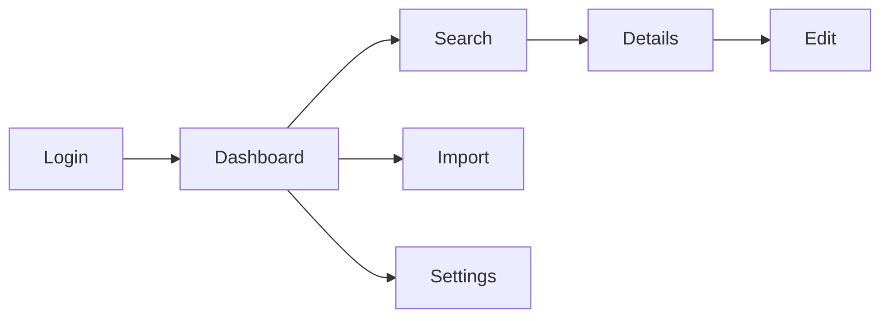

# Step 04: UI Design Guidelines

**Objective**: Establish visual design system and create high-fidelity main screen mockups

---

## Inputs

- `arch-to-be/brd/AR-BRD.md` (from Step 03)
  - User personas
  - UI/UX requirements
  - Key screens list
  - Brand guidelines reference
- `arch-to-be/05-building-block-view.md` (component context)

---

## Scope

### IN SCOPE

- Style guide (colors, typography, spacing, icons)
- Component pattern library
- High-fidelity main/initial screens (from BRD key screens list)
- Navigation structure
- Responsive breakpoints

### OUT OF SCOPE (handled in Step 06: Specifications)

- Sequence diagrams
- Class diagrams
- Data flow diagrams
- Every possible screen and dialogue
- Detailed component specifications

---

## Activities

### 1. Style Guide Definition

Define the visual language:

| Element | What to Define |
|---------|----------------|
| **Colors** | Primary, secondary, accent, semantic (error, success, warning, info) |
| **Typography** | Font families, sizes, weights, line heights |
| **Spacing** | Base unit (e.g., 4px), margin/padding scale |
| **Border Radius** | Corner radius values (none, sm, md, lg, full) |
| **Shadows** | Elevation levels (sm, md, lg) |
| **Icons** | Icon library choice (Lucide, Heroicons, Material Icons) |

**Output**: `arch-to-be/design/UI-STYLE-GUIDE.md`

### 2. Component Pattern Library

Define reusable UI components:

| Component | Variants | States |
|-----------|----------|--------|
| Button | Primary, Secondary, Ghost, Danger | Default, Hover, Active, Disabled, Loading |
| Input | Text, Search, Password, Textarea | Default, Focus, Error, Disabled |
| Card | Basic, Elevated, Outlined | - |
| Table | Basic, Striped, Bordered | Loading, Empty, Error |
| Modal | Small, Medium, Large | - |
| Toast | Success, Error, Warning, Info | - |
| Navigation | Sidebar, Topbar, Breadcrumb | Collapsed, Expanded |

**Output**: `arch-to-be/design/COMPONENT-PATTERNS.md`

### 3. Navigation Structure

Document screen relationships and navigation flow:



**Output**: `arch-to-be/design/NAVIGATION-STRUCTURE.md`

### 4. Responsive Breakpoints

| Breakpoint | Width | Layout Changes |
|------------|-------|----------------|
| Mobile | < 640px | Single column, bottom nav, hamburger menu |
| Tablet | 640-1024px | Two column, sidebar collapsed |
| Desktop | > 1024px | Full layout, sidebar expanded |

### 5. High-Fidelity Main Screen Mockups

Create high-fidelity mockups for main screens identified in BRD (Section 5.4).

**Required Screens** (from BRD key screens list):
- Login screen
- Dashboard / Home screen
- Primary search screen
- Primary data entry/detail screen
- Settings / Admin screen

**NOT Required Here** (created in Step 06 as needed):
- Every detail screen variant
- Every modal and dialogue
- Error screens
- Empty states

---

## Mockup Creation Methods

### Option A: AI Image Generation

Use AI models available in GitHub Copilot or Claude Code:
- Gemini 2.5 Pro
- GPT-4.1
- Claude with image generation capability

**Prompt Template**:
```
Create a high-fidelity UI mockup for a [screen name] screen.
Style: Modern, clean, professional
Colors: [from style guide]
Components needed: [list from component patterns]
Layout: [desktop/mobile], [specific layout requirements]
```

### Option B: Code-Based Mockups + Screenshot (RECOMMENDED)

**Framework**: HTML + DaisyUI + Tailwind CSS (CDN - no build step required)

**Why DaisyUI**:
- 50+ pre-built components
- Multiple themes (light, dark, corporate)
- No build step with CDN
- Production-quality appearance
- Responsive by default

**Mockup HTML Template**:

```html
<!DOCTYPE html>
<html lang="en" data-theme="light">
<head>
  <meta charset="UTF-8">
  <meta name="viewport" content="width=device-width, initial-scale=1.0">
  <title>{Screen Name} - Mockup</title>
  <link href="https://cdn.jsdelivr.net/npm/daisyui@4.12.14/dist/full.min.css" rel="stylesheet">
  <script src="https://cdn.tailwindcss.com"></script>
  <script>
    tailwind.config = {
      theme: {
        extend: {
          colors: {
            // Add brand colors from style guide
            'brand-primary': '#2563eb',
            'brand-secondary': '#64748b',
          }
        }
      }
    }
  </script>
</head>
<body class="bg-base-200 min-h-screen">

  <!-- Navigation -->
  <div class="navbar bg-primary text-primary-content">
    <div class="flex-1">
      <span class="text-xl font-bold">{App Name}</span>
    </div>
    <div class="flex-none gap-2">
      <button class="btn btn-ghost">Settings</button>
      <div class="dropdown dropdown-end">
        <div tabindex="0" class="btn btn-ghost btn-circle avatar">
          <div class="w-10 rounded-full bg-neutral text-neutral-content">
            <span class="text-xl">U</span>
          </div>
        </div>
      </div>
    </div>
  </div>

  <!-- Main Content -->
  <main class="container mx-auto p-6">
    <!-- Screen-specific content here -->
  </main>

</body>
</html>
```

**Screenshot Process**:

1. Create HTML mockup file in `arch-to-be/design/mockups/html/`
2. Use Playwright MCP to screenshot:
   ```
   mcp__playwright__browser_navigate({ url: "file:///path/to/mockup.html" })
   mcp__playwright__browser_take_screenshot({ filename: "01-dashboard.png" })
   ```
3. Save screenshots to `arch-to-be/design/mockups/screenshots/`

**Alternative: Open in Browser**
1. Open HTML file directly in browser
2. Use browser dev tools to set viewport (1920x1080 desktop, 390x844 mobile)
3. Take screenshot manually or with browser extension

### Option C: Figma/Design Tool Export

If design team provides Figma mockups:
1. Export as PNG at 2x resolution
2. Save to `arch-to-be/design/mockups/screenshots/`
3. Document Figma link in NAVIGATION-STRUCTURE.md

---

## Outputs

### Folder Structure

```
arch-to-be/design/
├── UI-STYLE-GUIDE.md           # Colors, typography, spacing
├── COMPONENT-PATTERNS.md        # Component inventory and usage
├── NAVIGATION-STRUCTURE.md      # Screen flow and hierarchy
└── mockups/
    ├── html/                    # Source HTML files (if using Option B)
    │   ├── 01-login.html
    │   ├── 02-dashboard.html
    │   ├── 03-search.html
    │   └── 04-settings.html
    └── screenshots/             # High-fidelity images
        ├── 01-login-desktop.png
        ├── 01-login-mobile.png
        ├── 02-dashboard-desktop.png
        ├── 03-search-desktop.png
        └── 04-settings-desktop.png
```

### Screenshot Specifications

| Viewport | Resolution | Usage |
|----------|------------|-------|
| Desktop | 1920x1080 | Primary mockups |
| Tablet | 1024x768 | Optional, key screens only |
| Mobile | 390x844 | Key screens (login, search) |

---

## Success Criteria

- [ ] Style guide defines all visual elements (colors, typography, spacing)
- [ ] Component patterns documented with variants and states
- [ ] Navigation structure documented with diagram
- [ ] High-fidelity mockups for ALL main screens (from BRD key screens list)
- [ ] Desktop mockups at minimum; mobile for key screens
- [ ] Responsive breakpoints defined
- [ ] Mockups reviewed and approved by stakeholders

---

## Tools Reference

| Tool | Purpose | Link |
|------|---------|------|
| DaisyUI | Component framework | https://daisyui.com |
| Tailwind CSS | Utility CSS | https://tailwindcss.com |
| Playwright MCP | Screenshot generation | MCP tool |
| Lucide Icons | Icon library | https://lucide.dev |
| Heroicons | Icon library | https://heroicons.com |

---

## Human Review Gate

After completing UI Design, consider a design review gate:
- Review mockups with stakeholders
- Validate against brand guidelines
- Confirm accessibility requirements met
- Approve before proceeding to Use Cases

See: `gates/gate-02-design-review.md` (optional)

---

**Estimated Duration**: 90-120 minutes
**Next Step**: [Step 05: Use Cases](05-use-cases.md)
