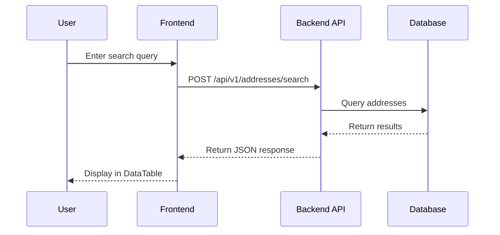

# Step 06: Technical Specifications

**Objective**: Create detailed technical specifications for backend and frontend, including diagrams and additional screen mockups

---

## Inputs

- `arch-to-be/enablers/UC-*.md` (from Step 05)
- `arch-to-be/enablers/UC-SUMMARY.md` (screens needed list from Step 05)
- `arch-to-be/design/UI-STYLE-GUIDE.md` (from Step 04)
- `arch-to-be/design/COMPONENT-PATTERNS.md` (from Step 04)
- `arch-to-be/design/mockups/` (from Step 04)
- `arch-to-be/05-building-block-view.md`

---

## Template

`.ai/2_templates/spec-template.md`

---

## Activities

### 1. Backend Specifications

For each use case, create backend spec:

#### API Endpoints

```markdown
### Endpoint: POST /api/v1/addresses/search

**Authentication**: JWT Bearer token
**Rate Limit**: 100 requests/minute

**Request Schema**:
```json
{
  "query": "string",
  "filters": {
    "municipality": "string",
    "postalCode": "string"
  },
  "pagination": {
    "page": 1,
    "pageSize": 20
  }
}
```

**Response Schema**:
```json
{
  "data": [...],
  "pagination": {...},
  "meta": {...}
}
```

**Error Responses**:
- 400: Invalid input
- 401: Unauthorized
- 429: Rate limit exceeded
- 500: Internal server error
```

#### Business Logic

- Validation rules
- Processing steps
- Error handling
- Transaction boundaries

#### Data Access

- Database operations
- Entity relationships
- Caching strategy

### 2. Frontend Specifications

For each use case, create frontend spec:

#### UI Components (Reference Design System)

Reference components from `COMPONENT-PATTERNS.md`:
- Component hierarchy
- Props and state
- Event handlers
- Validation

#### Pages and Flows

- Page layouts (reference mockups)
- Navigation flows
- Form designs
- Error states

#### Integration

- API calls
- State management
- Loading and error handling

### 3. Technical Diagrams

Create technical diagrams (moved from previous Design step):

#### Sequence Diagrams

Document end-to-end flows:
- User → UI → API → DB
- Component interactions
- API call sequences
- External service integrations

**Tools**: PlantUML or Mermaid



#### Class Diagrams

- Domain model (entities, value objects)
- Service classes
- Repository patterns
- DTOs and mappers

#### Data Flow Diagrams

- System boundaries
- External integrations
- Data transformations
- Message flows

### 4. Additional Screen Mockups

Create mockups for screens identified in Use Cases (Step 05) as "NOT in Design".

#### Process

1. Review `UC-SUMMARY.md` for "Screens Needed" list
2. For each screen:
   - Create HTML mockup using design system (same approach as Step 04)
   - Follow `UI-STYLE-GUIDE.md` colors/typography
   - Use components from `COMPONENT-PATTERNS.md`
   - Screenshot with Playwright MCP
3. Reference in specification document

#### Mockup Template for Additional Screens

Use same DaisyUI + Tailwind approach from Step 04:

```html
<!DOCTYPE html>
<html lang="en" data-theme="light">
<head>
  <meta charset="UTF-8">
  <meta name="viewport" content="width=device-width, initial-scale=1.0">
  <title>{Screen Name} - Mockup</title>
  <link href="https://cdn.jsdelivr.net/npm/daisyui@4.12.14/dist/full.min.css" rel="stylesheet">
  <script src="https://cdn.tailwindcss.com"></script>
</head>
<body class="bg-base-200 min-h-screen">
  <!-- Reuse navbar from main mockups -->
  <!-- Screen-specific content -->
</body>
</html>
```

#### Output Location

Additional mockups go in specifications folder:
- HTML: `arch-to-be/specifications/mockups/html/{spec-id}-{screen}.html`
- Screenshots: `arch-to-be/specifications/mockups/screenshots/{spec-id}-{screen}.png`

---

## Outputs

### Backend Specifications

`arch-to-be/specifications/backend/AR-BE-*.md`

Examples:
- `AR-BE-FR01-address-search.md`
- `AR-BE-FR02-address-update.md`
- `AR-BE-FR11-vrk-import.md`

### Frontend Specifications

`arch-to-be/specifications/frontend/AR-FE-*.md`

Examples:
- `AR-FE-US01-search-ui.md`
- `AR-FE-US02-detail-view.md`
- `AR-FE-US03-admin-dashboard.md`

### Technical Diagrams

`arch-to-be/diagrams/`
- `sequence/` - Sequence diagrams
- `class/` - Class diagrams
- `dataflow/` - Data flow diagrams

### Additional Mockups

`arch-to-be/specifications/mockups/`
- `html/` - Source HTML files
- `screenshots/` - Generated PNG images

### Arc42 Sections Updated

- `arch-to-be/06-runtime-view.md` (sequence diagrams)
- `arch-to-be/07-deployment-view.md` (deployment architecture)

---

## Specification Document Structure

```markdown
# [AR-BE-FR01]: Address Search API

## Overview

| Field | Value |
|-------|-------|
| **Feature** | Address Search |
| **Type** | Backend API |
| **Priority** | MUST |
| **Related Use Cases** | UC-01 |

## API Specification

### Endpoint: POST /api/v1/addresses/search

**Authentication**: JWT Bearer token
**Rate Limit**: 100 requests/minute

**Request Schema**:
```json
{...}
```

**Response Schema**:
```json
{...}
```

## Business Logic

1. Validate input (query min length: 3)
2. Apply filters
3. Execute search
4. Sort by relevance
5. Paginate results

## Data Access

- **Repository**: `AddressSearchRepository`
- **Caching**: Redis, TTL 5 minutes
- **Database**: Read replica for queries

## Error Handling

| Code | Condition | Response |
|------|-----------|----------|
| 400 | Invalid input | Validation error details |
| 401 | No token | Authentication required |
| 429 | Rate exceeded | Retry-After header |
| 500 | Server error | Generic error message |

## Sequence Diagram

```mermaid
sequenceDiagram
    ...
```

## Performance Targets

- Response time: < 200ms (p95)
- Concurrent requests: 1000+

## Related Mockups

- Main screen: `design/mockups/screenshots/03-search-desktop.png`
- Detail screen: `specifications/mockups/screenshots/AR-FE-US02-detail.png`
```

---

## Success Criteria

- [ ] All use cases have backend specifications
- [ ] All use cases have frontend specifications
- [ ] API contracts defined (OpenAPI/Swagger ready)
- [ ] Validation rules documented
- [ ] Sequence diagrams for key flows
- [ ] Class diagrams for domain model
- [ ] Additional screen mockups created (from UC-SUMMARY list)
- [ ] Arc42 sections 6 and 7 updated
- [ ] Specifications reviewable by developers

---

**Estimated Duration**: 120-180 minutes
**Next Step**: [Step 07: Data Model Planning](07-data-model.md)
