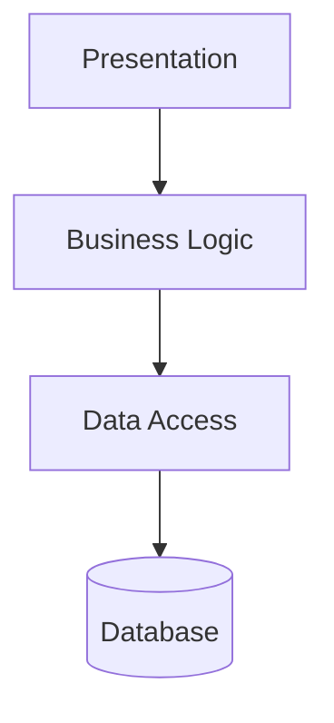
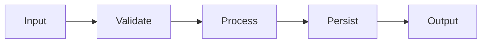
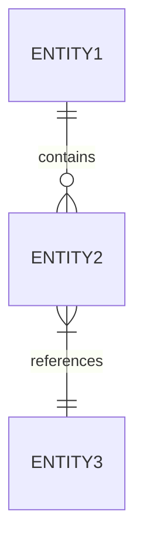

# C# Component Analysis Template

**For**: SA-01 through SA-07

```markdown
# SA-{XX}: {Component Name} Analysis

## 1. Executive Summary

- **Component**: {Component Name}
- **Directory**: {path}
- **Project Count**: {n}
- **Total Files**: {n}
- **Total LOC**: {n}
- **Key Responsibilities**:
  - {responsibility 1}
  - {responsibility 2}
  - {responsibility 3}
- **Integration Complexity**: {Low | Medium | High}
- **Technical Debt Level**: {Low | Medium | High}

---

## 2. Component Inventory

### 2.1 Projects

| Project | Type | Target Framework | Key Purpose |
|---------|------|-----------------|-------------|
| {project.csproj} | {Library|WebAPI|Console} | {net6.0|net48} | {description} |

### 2.2 Entry Points

| Entry Point | File | Description |
|-------------|------|-------------|
| {Main/Startup} | {file:line} | {description} |

### 2.3 Public Interfaces

| Interface | File | Methods | Purpose |
|-----------|------|---------|---------|
| {IService} | {file:line} | {n} | {description} |

---

## 3. Architecture Overview

### 3.1 Architectural Pattern

{Description of the architectural pattern used}

### 3.2 Layer Diagram



### 3.3 Component Responsibilities

| Component | Responsibility | Key Classes |
|-----------|---------------|-------------|
| {name} | {responsibility} | {class1, class2} |

---

## 4. Integration Points

### 4.1 Database Integration

| Type | Count | Technology | Key Files |
|------|-------|------------|-----------|
| Stored Procedure Calls | {n} | {ODP.NET|EF} | {files} |
| Direct SQL | {n} | {ADO.NET} | {files} |

**Example Call Pattern**:
```csharp
// file:line - description
{code snippet}
```

### 4.2 External Services

| Service | Protocol | Endpoint Pattern | Files |
|---------|----------|------------------|-------|
| {service} | {REST|SOAP|gRPC} | {pattern} | {files} |

### 4.3 File System

| Operation | Purpose | Path Pattern | Files |
|-----------|---------|--------------|-------|
| {Read|Write} | {purpose} | {pattern} | {files} |

### 4.4 Messaging/Queues

| Queue/Topic | Direction | Message Type | Files |
|-------------|-----------|--------------|-------|
| {SNS topic} | {Publish|Subscribe} | {type} | {files} |

---

## 5. Business Logic Summary

### 5.1 Core Business Rules

| ID | Rule | Location | Description |
|----|------|----------|-------------|
| BR-001 | {name} | {file:line} | {description} |
| BR-002 | {name} | {file:line} | {description} |

### 5.2 Validation Logic

| Validation | Type | Location | Description |
|------------|------|----------|-------------|
| {name} | {Input|Business|Output} | {file:line} | {description} |

### 5.3 Key Workflows



---

## 6. Data Models

### 6.1 Entity Models

| Entity | File | Properties | Relationships |
|--------|------|------------|---------------|
| {Entity} | {file:line} | {n} | {description} |

### 6.2 DTOs

| DTO | File | Purpose | Maps To |
|-----|------|---------|---------|
| {DTO} | {file:line} | {purpose} | {entity} |

### 6.3 Entity Relationships



---

## 7. Configuration Requirements

### 7.1 Configuration Files

| File | Purpose | Key Settings |
|------|---------|--------------|
| {file} | {purpose} | {settings} |

### 7.2 Environment Variables

| Variable | Purpose | Required |
|----------|---------|----------|
| {VAR_NAME} | {purpose} | {Yes|No} |

### 7.3 Connection Strings

| Name | Type | Pattern |
|------|------|---------|
| {name} | {Oracle|SQL Server} | {pattern, no secrets} |

---

## 8. Quality Assessment

### 8.1 Test Coverage

| Test Type | Count | Coverage | Location |
|-----------|-------|----------|----------|
| Unit Tests | {n} |  | {directory} |

### 8.2 Complexity Hotspots

| File | Cyclomatic Complexity | LOC | Recommendation |
|------|----------------------|-----|----------------|
| {file} | {score} | {loc} | {recommendation} |

### 8.3 Technical Debt Indicators

| Issue | Count | Severity | Examples |
|-------|-------|----------|----------|
| {issue type} | {n} | {High|Medium|Low} | {file:line} |

### 8.4 Code Smells

- {smell 1}: {description} ({file:line})
- {smell 2}: {description} ({file:line})

---

## 9. Extracted Requirements

### 9.1 Functional Requirements

| ID | Category | Requirement | Source |
|----|----------|-------------|--------|
| FR-{XX}-001 | {category} | {requirement text} | {file:line} |
| FR-{XX}-002 | {category} | {requirement text} | {file:line} |

### 9.2 Non-Functional Requirements

| ID | Type | Requirement | Source |
|----|------|-------------|--------|
| NFR-{XX}-001 | {Performance|Security|...} | {requirement text} | {inferred from} |

---

## 10. Modernization Observations

### 10.1 Opportunities

| Opportunity | Impact | Effort | Priority |
|-------------|--------|--------|----------|
| {opportunity} | {High|Medium|Low} | {T-shirt size} | {1-5} |

### 10.2 Challenges

| Challenge | Risk | Mitigation |
|-----------|------|------------|
| {challenge} | {High|Medium|Low} | {mitigation strategy} |

### 10.3 Recommendations

1. {recommendation 1}
2. {recommendation 2}
3. {recommendation 3}

---

*Generated by Sub-Agent SA-{XX}*
*Timestamp: {ISO timestamp}*
```
