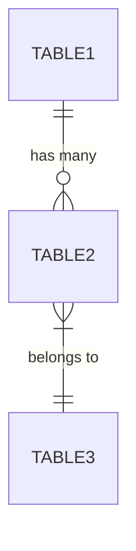
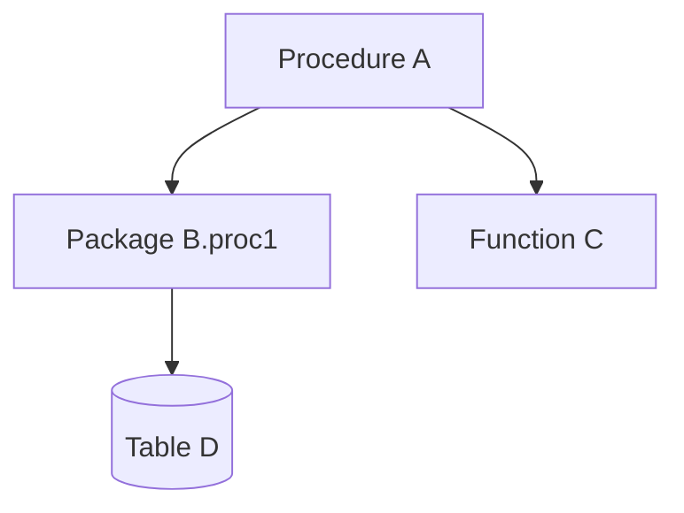

# Database Object Analysis Template

**For**: SA-11 through SA-16

### LLM-Specific Detection Checklists

**IMPORTANT FOR LLM AGENTS**: Before completing database analysis, explicitly check for these patterns. These are commonly missed by automated analysis.

#### EAV Pattern Detection Checklist

Look for Entity-Attribute-Value patterns and document them:

```markdown
### EAV Pattern Analysis

Check for these indicators:
- [ ] Tables with generic column names (ATTRIBUTE_NAME, ATTRIBUTE_VALUE)
- [ ] Pivot operations in queries (CASE WHEN ... END)
- [ ] Dynamic column/attribute configuration tables
- [ ] Sparse data patterns (many NULL columns)

If EAV found, document:
| Entity Table | Attribute Table | Value Storage | Pivot Location |
|--------------|-----------------|---------------|----------------|
| {entity} | {attributes} | {how values stored} | {file:line} |

Example EAV structure:
```
addresses (entity)
  |-> address_features (attributes)
        |-> features (attribute definitions)
```
```

#### Calculation Rule Extraction Checklist

For EVERY calculation found, extract EXACT formulas:

```markdown
### Calculation Rules

- [ ] Coordinate conversions (WGS84, ETRS89, etc.)
- [ ] Distance calculations (between addresses/buildings)
- [ ] Postal code algorithms
- [ ] Date/time calculations (age, duration, deadlines)
- [ ] Status transition rules
- [ ] Validation formulas

For each calculation:
| ID | Name | Formula | File:Line | C# Equivalent |
|----|------|---------|-----------|---------------|
| CALC-001 | {name} | {exact formula} | {location} | {pseudocode} |
```

#### Business Rule Extraction Depth

High-level mapping is INSUFFICIENT for rewrite. For each rule:

```markdown
### Business Rule: {BR-ID}

**High-Level**: {one sentence description}

**Exact Logic**:
```sql
-- From {file:line}
IF condition1 AND condition2 THEN
    action1
ELSIF condition3 OR condition4 THEN
    action2
ELSE
    default_action
END IF;
```

**Edge Cases**:
- NULL handling: {how nulls are treated}
- Boundary conditions: {min/max values}
- Error conditions: {what triggers errors}

**C# Pseudocode**:
```csharp
public Result ApplyRule(Input input)
{
    if (condition1 && condition2)
        return action1;
    // ...
}
```
```

---

```markdown
# SA-{XX}: {Database Area} Analysis

## 1. Executive Summary

- **Database Area**: {area}
- **Directory**: {path}
- **Object Count**: {n}
- **Total LOC**: {n}
- **Primary Purpose**: {description}
- **Complexity Level**: {Low | Medium | High}

---

## 2. Object Inventory

### 2.1 Object List

| Name | Type | LOC | Complexity | Purpose |
|------|------|-----|------------|---------|
| {object_name} | {Function|Procedure|Package} | {n} | {score} | {description} |

### 2.2 Category Distribution

| Category | Count | Description |
|----------|-------|-------------|
| CRUD Operations | {n} | {description} |
| Validation | {n} | {description} |
| Calculation | {n} | {description} |
| Reporting | {n} | {description} |
| Integration | {n} | {description} |

---

## 3. Business Logic Summary

### 3.1 Core Business Rules

| ID | Rule Name | Object | Description |
|----|-----------|--------|-------------|
| BR-DB-001 | {name} | {object:line} | {description} |

### 3.2 Validation Logic

```sql
-- Example from {object}:{line}
{code snippet showing validation}
```

### 3.3 Calculation Algorithms

| Algorithm | Object | Purpose | Formula/Logic |
|-----------|--------|---------|---------------|
| {name} | {object:line} | {purpose} | {description} |

---

## 4. Data Model (for SA-14)

### 4.1 Table Structures

| Table | Columns | PK | FKs | Purpose |
|-------|---------|----|----|---------|
| {table} | {n} | {pk_col} | {n} | {description} |

### 4.2 Relationships



### 4.3 Indexes

| Table | Index Name | Columns | Type |
|-------|------------|---------|------|
| {table} | {index} | {cols} | {Unique|NonUnique} |

---

## 5. Dependency Map

### 5.1 Call Graph



### 5.2 Cross-Schema References

| From Object | To Object | Schema | Type |
|-------------|-----------|--------|------|
| {object} | {object} | {schema} | {Call|Select|DML} |

### 5.3 External Dependencies

| Object | External Dependency | Type |
|--------|---------------------|------|
| {object} | {db_link/external_table} | {type} |

---

## 6. Integration Points

### 6.1 Application Call Patterns

| Object | Called From | Frequency | Purpose |
|--------|------------|-----------|---------|
| {object} | {C# class:method} | {High|Medium|Low} | {purpose} |

### 6.2 Scheduled Jobs

| Object | Job Name | Schedule | Purpose |
|--------|----------|----------|---------|
| {object} | {job} | {cron} | {purpose} |

### 6.3 Triggers

| Trigger | Table | Event | Action |
|---------|-------|-------|--------|
| {trigger} | {table} | {INSERT|UPDATE|DELETE} | {description} |

---

## 7. Performance Analysis

### 7.1 Bulk Operations

| Object | Operation | Estimated Volume | Method |
|--------|-----------|------------------|--------|
| {object} | {operation} | {rows/time} | {BULK COLLECT|FORALL|etc} |

### 7.2 Cursor Patterns

| Object | Cursor Type | Risk Level | Recommendation |
|--------|-------------|------------|----------------|
| {object} | {Explicit|Implicit|FOR loop} | {High|Medium|Low} | {recommendation} |

### 7.3 Optimization Opportunities

- {opportunity 1}
- {opportunity 2}

---

## 8. Quality Assessment

### 8.1 Code Quality Issues

| Issue Type | Count | Examples |
|------------|-------|----------|
| SELECT * usage | {n} | {object:line} |
| Hardcoded values | {n} | {object:line} |
| Missing exception handling | {n} | {object:line} |

### 8.2 Naming Convention Violations

| Object | Issue | Current | Suggested |
|--------|-------|---------|-----------|
| {object} | {issue} | {current} | {suggested} |

### 8.3 Technical Debt

- {debt item 1}
- {debt item 2}

---

## 9. Extracted Requirements

### 9.1 Business Rules (BR-DB-XXX)

| ID | Rule | Object | Description |
|----|------|--------|-------------|
| BR-DB-{XX}-001 | {name} | {object:line} | {description} |

### 9.2 Data Integrity Requirements (DI-XXX)

| ID | Requirement | Enforcement | Object |
|----|-------------|-------------|--------|
| DI-{XX}-001 | {requirement} | {Constraint|Trigger|Code} | {object} |

---

## 10. Modernization Observations

### 10.1 Logic Migration Candidates

| Object | Complexity | Reason to Migrate | Priority |
|--------|------------|-------------------|----------|
| {object} | {score} | {reason} | {1-5} |

### 10.2 Keep in Database

| Object | Reason | Notes |
|--------|--------|-------|
| {object} | {performance|transaction|etc} | {notes} |

---

*Generated by Sub-Agent SA-{XX}*
*Timestamp: {ISO timestamp}*
```
