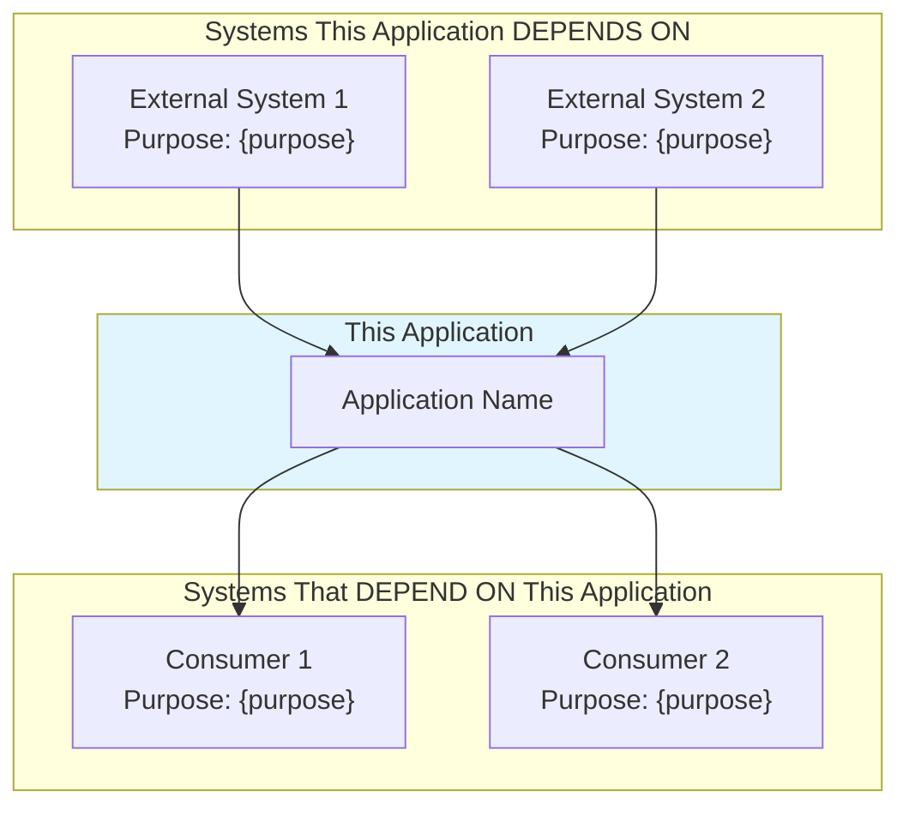
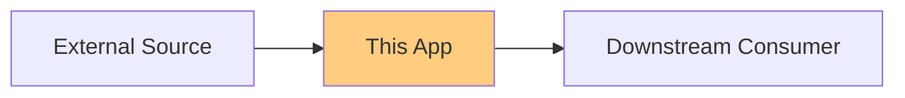

# Integration Analysis Template

**For**: SA-21, SA-22, SA-23

```markdown
# SA-{XX}: {Integration Area} Analysis

## 1. Executive Summary

- **Integration Area**: {area}
- **Integration Point Count**: {n}
- **Protocols Used**: {list}
- **Risk Level**: {Low | Medium | High}

---

## 2. Integration Inventory

| ID | Type | Source | Target | Protocol | Count |
|----|------|--------|--------|----------|-------|
| INT-001 | {type} | {source} | {target} | {protocol} | {n} |

---

## 3. Communication Patterns

### 3.1 Synchronous

| Pattern | Usage | Example |
|---------|-------|---------|
| {Request-Response} | {count} | {file:line} |

### 3.2 Asynchronous

| Pattern | Usage | Example |
|---------|-------|---------|
| {Pub/Sub} | {count} | {file:line} |

---

## 4. Data Exchange

### 4.1 Formats

| Format | Direction | Usage |
|--------|-----------|-------|
| {JSON|XML|CSV} | {In|Out|Both} | {description} |

### 4.2 Schema Definitions

| Schema | Location | Version |
|--------|----------|---------|
| {schema} | {file} | {version} |

---

## 5. Security

### 5.1 Authentication

| Integration | Method | Details |
|-------------|--------|---------|
| {integration} | {OAuth|API Key|Cert} | {details} |

### 5.2 Authorization

| Integration | Control | Level |
|-------------|---------|-------|
| {integration} | {RBAC|ACL|etc} | {description} |

---

## 6. Error Handling

| Integration | Strategy | Retry | Fallback |
|-------------|----------|-------|----------|
| {integration} | {strategy} | {Yes|No} | {fallback} |

---

## 7. Performance

| Integration | Latency | Throughput | SLA |
|-------------|---------|------------|-----|
| {integration} | {ms} | {ops/sec} | {requirement} |

---

## 8. Modernization

### 8.1 Opportunities

| Integration | Opportunity | Impact |
|-------------|-------------|--------|
| {integration} | {opportunity} | {impact} |

### 8.2 Risks

| Integration | Risk | Mitigation |
|-------------|------|------------|
| {integration} | {risk} | {mitigation} |

---

## 9. Use Cases per Integration

> **Meeting Recommendation**: Document use cases for each integration system to provide business context.
> "Customers might not be sure where it integrates... need clear list with use cases per system" - Jarkko Enden

### 9.1 Integration Use Case Details

#### INT-001: {System Name}

| Attribute | Value |
|-----------|-------|
| **Primary Use Case** | {What business process does this support?} |
| **Secondary Use Cases** | {Other processes using this integration} |
| **Trigger** | {Event/Schedule/User action that initiates the integration} |
| **Frequency** | {Real-time / Hourly / Daily / Weekly / On-demand} |
| **Data Volume** | {Typical message size, records per batch, daily volume} |
| **Business Owner** | {Who owns this integration from business perspective} |
| **Technical Owner** | {Who maintains this integration} |

**Business Context**:
{Describe why this integration exists from a business perspective. What problem does it solve?}

**User Impact**:
{What happens to users if this integration fails or is delayed?}

#### INT-002: {System Name}

{Repeat the pattern above for each integration}

---

## 10. Dependency Map (Enterprise Architecture Level)

> **Meeting Recommendation**: Create EA-level dependency visualization showing what this system depends on and what depends on it.
> "Which things is this software dependent on... which systems are dependent on this system" - Jarkko Enden

### 10.1 Visual Dependency Diagram



### 10.2 Inbound Dependencies (What We Depend On)

| System | Data/Service Consumed | Criticality | Impact if Unavailable | Fallback Strategy |
|--------|----------------------|-------------|----------------------|-------------------|
| {System} | {What we get from them} | {Critical/High/Medium/Low} | {What happens to our app} | {Cache/Queue/Degrade/None} |

### 10.3 Outbound Dependencies (What Depends On Us)

| System | Data/Service Provided | Known Consumers | Impact if We Fail | SLA Commitment |
|--------|----------------------|-----------------|-------------------|----------------|
| {API/Service} | {What they get from us} | {List of known consumers} | {Impact to them} | {Response time, uptime} |

### 10.4 Critical Dependency Chain



**Single Points of Failure**:
| Dependency | Risk Level | Mitigation |
|------------|------------|------------|
| {dependency} | {High/Medium/Low} | {mitigation strategy} |

---

## 11. API Consumer Documentation

> **Meeting Recommendation**: Document who consumes our APIs where this information is available.
> "API provisioning documents can help deduce what type of API consumers are using it" - Jarkko Enden

### 11.1 Exposed APIs

| API | Type | Endpoint | Purpose | Authentication |
|-----|------|----------|---------|----------------|
| {API Name} | {REST/SOAP/gRPC} | {/api/v1/resource} | {Brief purpose} | {OAuth/API Key/Cert} |

### 11.2 Known API Consumers

| API | Consumer System | Contact | Usage Pattern | Contract Version |
|-----|-----------------|---------|---------------|-----------------|
| {API} | {Consumer name} | {Team/Email} | {Real-time/Batch/Ad-hoc} | {v1/v2} |

### 11.3 Unknown/Undocumented Consumers

> **Risk**: Changing API contracts may break unknown consumers.

**Evidence of Unknown Consumers**:
- [ ] API logs show requests from unidentified sources
- [ ] API keys exist without documented owners
- [ ] Historical documentation mentions consumers no longer tracked

**Discovery Recommendations**:
1. Review API gateway logs for unique client identifiers
2. Check API key provisioning records
3. Survey internal teams for undocumented usage
4. Add consumer identification header requirements

---

## 12. Change Management & Traceability

> **Meeting Recommendation**: Track integration changes and maintain traceability to requirements.

### 12.1 Integration Change History

| Date | Integration | Change Type | Description | Impact | Reference |
|------|-------------|-------------|-------------|--------|-----------|
| {YYYY-MM-DD} | {INT-XXX} | {Added/Modified/Deprecated} | {Brief description} | {Breaking/Non-breaking} | {Ticket/ADR} |

### 12.2 Traceability to Requirements

| Integration ID | Business Requirement | User Story | Test Case | Documentation |
|----------------|---------------------|------------|-----------|---------------|
| INT-001 | {BR-XXX or description} | {US-XXX} | {TC-XXX} | {Doc link} |

### 12.3 Version Compatibility

| Integration | Current Version | Minimum Supported | Deprecation Timeline |
|-------------|-----------------|-------------------|---------------------|
| {INT-XXX} | {v2.1} | {v1.5} | {Date or N/A} |

### 12.4 Open Issues & Documentation Gaps

| Issue ID | Integration | Description | Severity | Resolution Plan |
|----------|-------------|-------------|----------|-----------------|
| {ISSUE-001} | {INT-XXX} | {What's missing or unclear} | {High/Medium/Low} | {How to resolve} |

---

*Generated by Sub-Agent SA-{XX}*
*Timestamp: {ISO timestamp}*
*Template Version: 2.0 - Updated 2026-01-08 with meeting recommendations*
```
