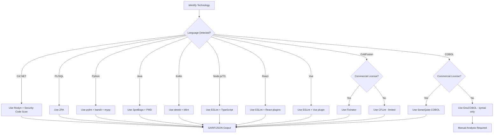

# Tool Selection Decision Tree

**Purpose**: Guide for selecting static analysis tools for any technology stack

---

## Step 1: Identify Language/Framework

Run technology detection to identify ALL languages and frameworks in the codebase:

```powershell
# Quick detection
Get-ChildItem -Recurse -File |
    Group-Object Extension |
    Sort-Object Count -Descending |
    Select-Object Count, Name -First 20
```

Or use the comprehensive detection script in [01-codebase-reconnaissance.md](../../process-steps/as-is-brownfield/steps/01-codebase-reconnaissance.md).

---

## Step 2: Check Tool Availability

| Language | Tool Available? | Installation Complexity | Output Format | Guide |
|----------|----------------|------------------------|---------------|-------|
| C# (.NET) | Yes (Roslyn) | Low (built-in) | SARIF | [backend-dotnet.md](../../process-steps/as-is-brownfield/steps/02-tool-setup-guides/backend-dotnet.md) |
| Oracle PL/SQL | Yes (ZPA) | Medium (Java required) | JSON | [legacy-plsql.md](../../process-steps/as-is-brownfield/steps/02-tool-setup-guides/legacy-plsql.md) |
| Python | Yes (pylint) | Low (pip) | JSON | [backend-python.md](../../process-steps/as-is-brownfield/steps/02-tool-setup-guides/backend-python.md) |
| Java | Yes (SpotBugs) | Medium (Gradle/Maven) | SARIF/XML | [backend-java.md](../../process-steps/as-is-brownfield/steps/02-tool-setup-guides/backend-java.md) |
| Kotlin | Yes (detekt) | Medium (Gradle) | SARIF | [backend-kotlin.md](../../process-steps/as-is-brownfield/steps/02-tool-setup-guides/backend-kotlin.md) |
| Node.js/TypeScript | Yes (ESLint) | Low (npm) | JSON/SARIF | [backend-nodejs.md](../../process-steps/as-is-brownfield/steps/02-tool-setup-guides/backend-nodejs.md) |
| React | Yes (ESLint) | Low (npm) | JSON/SARIF | [frontend-react.md](../../process-steps/as-is-brownfield/steps/02-tool-setup-guides/frontend-react.md) |
| Vue | Yes (ESLint) | Low (npm) | JSON | [frontend-vue.md](../../process-steps/as-is-brownfield/steps/02-tool-setup-guides/frontend-vue.md) |
| NestJS | Yes (ESLint) | Low (npm) | JSON | [frontend-nestjs.md](../../process-steps/as-is-brownfield/steps/02-tool-setup-guides/frontend-nestjs.md) |
| ColdFusion | Commercial (Fixinator) | Medium | JSON | [legacy-coldfusion.md](../../process-steps/as-is-brownfield/steps/02-tool-setup-guides/legacy-coldfusion.md) |
| COBOL | Commercial (SonarQube) | High | XML | [backend-cobol.md](../../process-steps/as-is-brownfield/steps/02-tool-setup-guides/backend-cobol.md) |

---

## Step 3: Decision Tree



---

## Step 4: Install Tools

Follow installation guide in the appropriate `02-tool-setup-guides/*.md` file.

### Quick Reference Commands

| Language | Install Command |
|----------|-----------------|
| Python | `pip install pylint bandit mypy ruff` |
| Node.js | `npm install -D eslint @typescript-eslint/parser @typescript-eslint/eslint-plugin` |
| React | `npm install -D eslint eslint-plugin-react eslint-plugin-react-hooks` |
| Vue | `npm install -D eslint eslint-plugin-vue` |
| Java | Add SpotBugs, PMD, Checkstyle to `build.gradle` or `pom.xml` |
| Kotlin | Add detekt, ktlint plugins to `build.gradle.kts` |

---

## Step 5: Verify Installation

Run the verification script:

```powershell
.\docs\ai\legacy_analysis\scripts\verification-scripts.ps1
```

Or verify individual tools:

```bash
# Python
pylint --version && bandit --version && mypy --version

# Node.js
eslint --version && npx tsc --version

# Java (Gradle)
./gradlew spotbugsMain --dry-run

# Kotlin
./gradlew detekt --dry-run
```

---

## Step 6: Run Analysis

Execute analysis commands from the setup guide. All tools should produce machine-readable output (JSON, SARIF, XML).

### Output Location Convention

```
artifacts/03-metrics/
├── {language}-inventory.json      # File inventory
├── {tool}-report.sarif           # SARIF format
├── {tool}-report.json            # JSON format
└── {tool}-report.xml             # XML format (Java tools)
```

---

## Tool Selection Rationale

### Why These Tools?

| Criterion | Requirement |
|-----------|-------------|
| **CLI-friendly** | Headless execution in CI/CD |
| **Machine-readable output** | JSON, SARIF, or XML (NOT plain text) |
| **Open source or free tier** | Avoid commercial lock-in where possible |
| **Actively maintained** | Updated within last 12 months |
| **Community adoption** | Industry-standard tools preferred |

### Commercial Tool Warnings

| Tool | Warning |
|------|---------|
| Fixinator (ColdFusion) | Commercial license required for full features |
| SonarQube COBOL | Commercial license required |
| Visual Expert | Commercial license required |

**Recommendation**: For systems requiring commercial tools (especially COBOL), budget for licenses or consider migration to modern languages.

---

## Multi-Technology Codebases

For heterogeneous systems with multiple languages:

1. **Run detection first** - Identify all languages present
2. **Prioritize by LOC** - Focus on languages with most code
3. **Install tools incrementally** - Start with highest-impact languages
4. **Consolidate output** - All tools output to `artifacts/03-metrics/`

### Example Multi-Tech Analysis Order

```
1. Identify technologies: C#, PL/SQL, React, Python
2. Install in priority order:
   - C# (Roslyn) - largest codebase
   - PL/SQL (ZPA) - critical business logic
   - React (ESLint) - frontend
   - Python (pylint) - scripts/utilities
3. Run all scans
4. Consolidate findings in artifacts/
```

---

## See Also

- [Environment Setup](../../process-steps/as-is-brownfield/steps/02-environment-setup.md) - Full tool installation guide
- [Codebase Reconnaissance](../../process-steps/as-is-brownfield/steps/01-codebase-reconnaissance.md) - Technology detection
- [Verification Scripts](../../process-steps/as-is-brownfield/steps/02-tool-setup-guides/verification-scripts.md) - Validate installations

---

*Last Updated: 2026-01-09*
