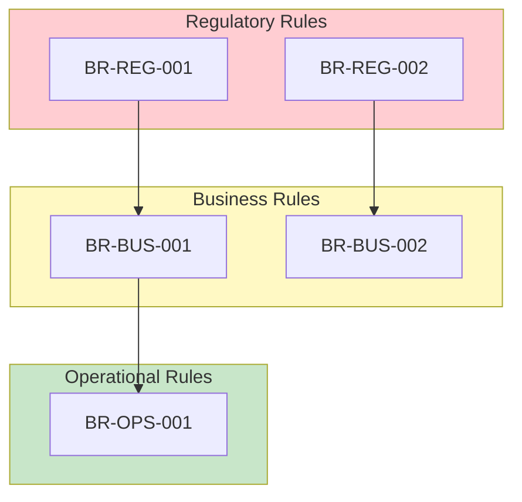

# Business Rules Template ("Unchangeables")

> **Meeting Recommendation (2026-01-08)**: Extract business rules separately as "unchangeables" that must be preserved regardless of technical implementation.
> "There are some things the customer would tell 'these things you cannot do differently'" - Tuomo Penttinen

**Usage**: Use this template to document business rules that MUST be preserved in any modernization effort.
**Key Principle**: These rules are NON-NEGOTIABLE - they represent legal requirements, regulatory compliance, or core business constraints.

---

## Template

```markdown
# Business Rules Catalog

**Project**: {PROJECT_NAME}
**Date**: {DATE}
**Status**: {Draft | Review | Approved}
**Validated By**: {STAKEHOLDER_NAME}

---

## 1. Executive Summary

| Metric | Value |
|--------|-------|
| **Total Business Rules** | {n} |
| **Regulatory/Legal** | {n} |
| **Business-Critical** | {n} |
| **Operational** | {n} |
| **Status** | {Draft/Validated} |

---

## 2. Business Rules Registry

### 2.1 Regulatory & Legal Rules

> These rules stem from laws, regulations, or contractual obligations. They CANNOT be changed.

| ID | Rule | Source | Ext. (Ph2+) | Verified | Consequence of Violation |
|----|------|--------|-------------|----------|--------------------------|
| BR-REG-001 | If a user makes a purchase, user MUST receive a receipt | Finnish Accounting Act | ❌ Keep | ✓2026-02-08 | Legal non-compliance, audit failure |
| BR-REG-002 | Finnish VAT of 25.5% MUST be added to items total for receipt calculation | Finnish VAT Law | ⚠️ Eval | [DRAFT] | Tax authority penalties |
| BR-REG-003 | Customer data retention MUST NOT exceed 7 years after last transaction | GDPR Art. 17 | ❌ Keep | ✓2026-02-08 | Data protection fines |
| BR-REG-004 | {Rule description} | {Law/Regulation/Contract} | {❌/⚠️/✅} | {✓date/[DRAFT]} | {What happens if violated} |

### Externalization Legend (Phase 2+ Planning)

> **NOTE**: Externalization to a rules engine (e.g., DROOLS) is NOT Phase 1 scope.
> This column captures planning metadata for future phases.

| Symbol | Meaning | Phase | Criteria |
|--------|---------|-------|----------|
| ✅ Rules Engine | Candidate for DROOLS/similar | Phase 2+ | Dynamic, configurable, policy-driven |
| ⚠️ Evaluate | Needs analysis | Phase 2+ | Complex derived calculations |
| ❌ Keep in Code | Not for externalization | N/A | Core domain logic, DB constraints |

**Phase 1 Rule Locations** (current migration):
- **Angular validators**: Format, required field validation
- **tms-rest API**: Server-side validation (existing)
- **tms-core**: Business logic (existing)
- **Database**: Constraints (existing)

**Detailed Rules**:

#### BR-REG-001: {Rule Title}

| Attribute | Value |
|-----------|-------|
| **Category** | Regulatory |
| **Source** | {Specific law, regulation, or contract clause} |
| **Effective Date** | {When this rule became effective} |
| **Jurisdiction** | {Geographic or organizational scope} |
| **Validation** | {How to verify compliance} |

**Rule Statement**:
{Clear, unambiguous statement of what must always be true}

**Business Context**:
{Why this rule exists from a business perspective}

**Examples**:
- **Valid**: {Example of compliant behavior}
- **Invalid**: {Example of non-compliant behavior}

**Legacy Implementation Reference** (for context only):
- Location: `{file:line}` or `{stored procedure}`
- Note: This is how legacy implemented it, NOT a constraint on new implementation

---

### 2.2 Business-Critical Rules

> These rules are essential for correct business operation. They represent core business logic that defines how the organization operates.

| ID | Rule | Owner | Ext. (Ph2+) | Verified | Impact if Violated |
|----|------|-------|-------------|----------|-------------------|
| BR-BUS-001 | Order cannot be shipped if payment status is "pending" | Finance Team | ✅ Rules Eng | ✓2026-02-08 | Revenue loss, bad debt |
| BR-BUS-002 | Refund amount MUST NOT exceed original purchase amount | Finance Team | ❌ Keep | ✓2026-02-08 | Financial loss |
| BR-BUS-003 | Price changes require approval from two separate managers | Sales Director | ✅ Rules Eng | [DRAFT] | Unauthorized discounts |
| BR-BUS-004 | Swedish postal code MUST be 5 digits with space format (e.g., "123 45") | Data Quality | ❌ Keep | ✓2026-02-08 | Delivery failures |
| BR-BUS-005 | {Rule description} | {Business Owner} | {❌/⚠️/✅} | {✓date/[DRAFT]} | {Impact} |

**Detailed Rules**:

#### BR-BUS-001: {Rule Title}

| Attribute | Value |
|-----------|-------|
| **Category** | Business-Critical |
| **Business Owner** | {Name/Role} |
| **Domain** | {Business domain this rule belongs to} |
| **Dependencies** | {Other rules this depends on or affects} |

**Rule Statement**:
{Clear statement of the business rule}

**Business Context**:
{Why this rule exists - what business problem it solves}

**Conditions**:
- **Applies When**: {Conditions under which this rule is active}
- **Exceptions**: {Any known exceptions or overrides}

**Examples**:
- **Scenario 1**: {Given X, When Y, Then Z}
- **Scenario 2**: {Given A, When B, Then C}

---

### 2.3 Operational Rules

> These rules ensure smooth day-to-day operations. They may be more flexible than regulatory or business-critical rules.

| ID | Rule | Rationale | Flexibility |
|----|------|-----------|-------------|
| BR-OPS-001 | {Rule description} | {Why needed} | {Low/Medium/High} |

---

## 3. Rule Dependencies

### 3.1 Dependency Matrix



### 3.2 Conflict Resolution

| Rule 1 | Rule 2 | Conflict | Resolution |
|--------|--------|----------|------------|
| {BR-XXX} | {BR-XXX} | {Description of conflict} | {How to resolve} |

---

## 4. Validation Status

### 4.1 Stakeholder Validation

| Rule ID | Validated By | Date | Status | Notes |
|---------|--------------|------|--------|-------|
| BR-REG-001 | {Name} | {Date} | {Approved/Pending/Disputed} | {Notes} |

### 4.2 Outstanding Questions

| Question | Rule(s) Affected | Asked To | Status |
|----------|------------------|----------|--------|
| {Question about rule interpretation} | {BR-XXX} | {Stakeholder} | {Open/Resolved} |

---

## 5. Change History

| Date | Rule | Change | Reason | Approved By |
|------|------|--------|--------|-------------|
| {Date} | {BR-XXX} | {What changed} | {Why} | {Who approved} |

---

## 6. Traceability

### 6.1 Rules to Requirements

| Business Rule | Related Requirements | User Stories |
|---------------|---------------------|--------------|
| BR-XXX | FR-XXX, FR-XXX | US-XXX |

### 6.2 Rules to Legacy Code

> For reference only - NOT a constraint on new implementation

| Business Rule | Legacy Implementation | Notes |
|---------------|----------------------|-------|
| BR-XXX | {file:line or procedure} | {Implementation notes} |

---

## 7. Glossary

| Term | Definition | Context |
|------|------------|---------|
| {Term} | {Definition} | {Where/how this term is used} |

---

*Generated from Legacy Analysis*
*Template Version: 1.0*
*Created: 2026-01-08 based on meeting recommendations*
```

---

## Usage Guidelines

### When to Document a Rule as "Unchangeable"

Document a rule here if:

1. **Legal/Regulatory**: Mandated by law, regulation, or contract
2. **Business-Critical**: Core to how the business operates
3. **Stakeholder-Confirmed**: Business owner explicitly says "this cannot change"
4. **Data Integrity**: Required for data correctness

Do NOT document here if:

1. **Implementation Detail**: How something is done (not what)
2. **UI/UX Preference**: Visual or interaction preferences
3. **Technical Constraint**: Database choice, framework, etc.
4. **Historical Accident**: "It's always been this way"

### Rule Statement Best Practices

**Good Rule Statements** (Granular, Specific, Testable):
- "If a user makes a purchase, user MUST receive a receipt"
- "If items total is 100 EUR, Finnish VAT of 25.5% MUST be added to calculate receipt total"
- "Swedish postal code MUST be 5 digits with space format (e.g., '123 45')"
- "Order cannot be shipped if payment status is 'pending'"
- "Customer data retention MUST NOT exceed 7 years after last transaction"
- "Price changes require approval from two separate managers"
- "Refund amount MUST NOT exceed original purchase amount"

**Bad Rule Statements** (Too High-Level or Too Technical):
- ❌ "System handles purchases" (capability, not rule)
- ❌ "Tax calculation is important" (vague, not testable)
- ❌ "Data must be validated" (no specific criteria)
- ❌ "The stored procedure must call VRK_VALIDATE before INSERT" (implementation detail)
- ❌ "Address validation timeout must be 30 seconds" (NFR, not business rule)
- ❌ "Use Oracle sequences for ID generation" (technology choice)

### Interview Questions for Extracting Business Rules

When interviewing stakeholders, ask:

1. "What would happen if this rule was not followed?"
2. "Is there a law, regulation, or contract that requires this?"
3. "Who would need to approve changing this rule?"
4. "Has this rule ever been changed? What was the process?"
5. "Are there any exceptions to this rule?"

---

## Anti-Patterns to Avoid

| Anti-Pattern | Example | Problem |
|--------------|---------|---------|
| Technical as Rule | "Must use Oracle" | Technology choice, not business rule |
| UI as Rule | "Button must be blue" | Design choice, not business rule |
| Legacy as Rule | "Must work like old system" | Prevents improvement |
| Vague Rule | "System must be fast" | Not measurable, not a rule |
| Implementation | "Must use stored procedure X" | HOW, not WHAT |

---

## Cross-References

- **Related Template**: `templates/analysis/user-story-template.md` (references business rules)
- **Process Step**: `process/as-is-brownfield/steps/07-requirements-synthesis.md`
- **Output Location**: `artifacts/07-synthesis/requirements/BUSINESS-RULES.md`
- **Arc42 Section**: `arch-as-is/02-constraints-requirements.md`

---

*Template Version: 1.0*
*Created: 2026-01-08 based on meeting recommendations*
