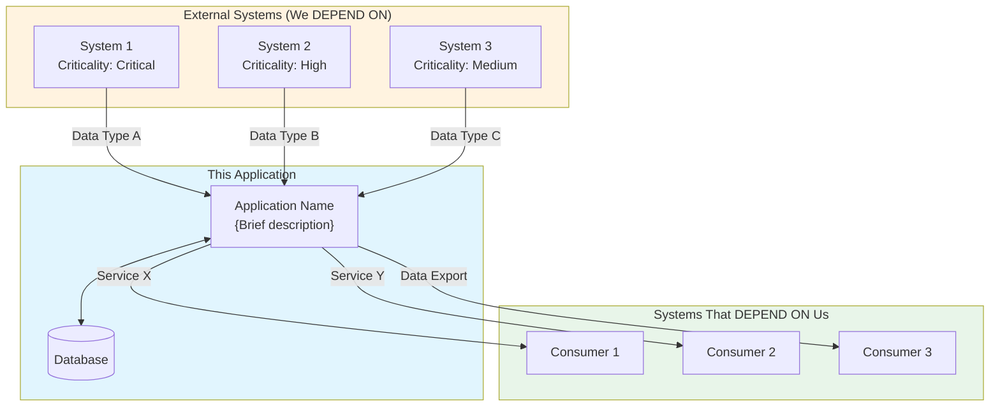
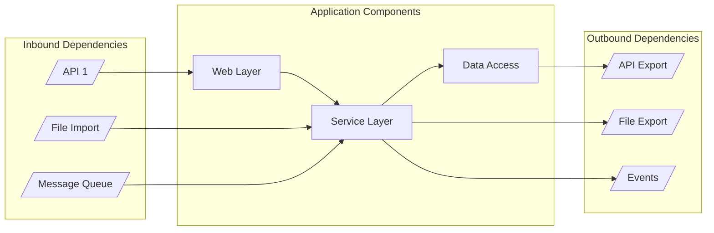
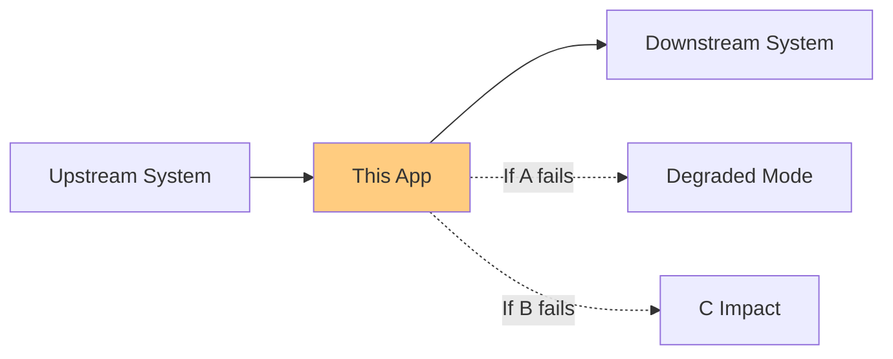
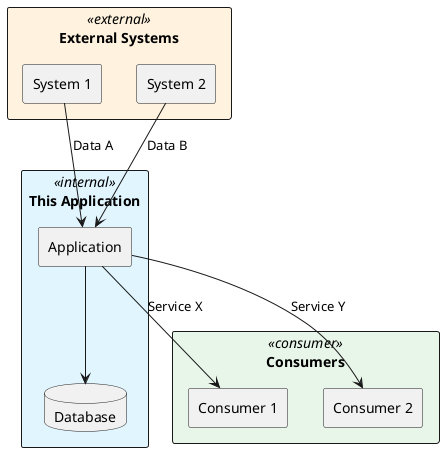
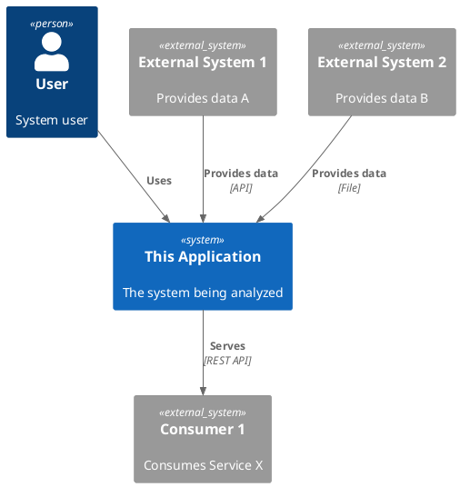

# Dependency Map Template

> **Meeting Recommendation (2026-01-08)**: Create EA-level dependency visualization showing what this system depends on and what depends on it.
> "Which things is this software dependent on... which systems are dependent on this system" - Jarkko Enden

**Usage**: Use this template to document enterprise-level dependencies for legacy systems.
**Key Principle**: Provide clear visibility into both inbound (what we need) and outbound (what needs us) dependencies.

---

## Template

```markdown
# Dependency Map: {SYSTEM_NAME}

**Project**: {PROJECT_NAME}
**Date**: {DATE}
**Status**: {Draft | Review | Approved}
**Owner**: {OWNER}

---

## 1. Executive Summary

| Metric | Value |
|--------|-------|
| **Total Dependencies** | {n} |
| **Inbound (We Depend On)** | {n} |
| **Outbound (Depends On Us)** | {n} |
| **Critical Dependencies** | {n} |
| **Single Points of Failure** | {n} |

---

## 2. Visual Dependency Map

### 2.1 High-Level Overview



### 2.2 Detailed Component View



---

## 3. Inbound Dependencies (What We Depend On)

### 3.1 Summary Table

| ID | System | Type | Data/Service | Criticality | Availability | Fallback |
|----|--------|------|--------------|-------------|--------------|----------|
| DEP-IN-001 | {System Name} | {API/File/DB} | {What we consume} | {Critical/High/Medium/Low} | {%} | {Strategy} |

### 3.2 Detailed Dependency Cards

#### DEP-IN-001: {System Name}

| Attribute | Value |
|-----------|-------|
| **System** | {Full system name} |
| **Owner** | {Organization/Team} |
| **Type** | {REST API / SOAP / File / Database Link / MQ} |
| **Protocol** | {HTTP/HTTPS/SFTP/etc.} |
| **Criticality** | {Critical / High / Medium / Low} |

**What We Consume**:
{Describe what data or services we get from this system}

**Business Purpose**:
{Why do we need this dependency? What business process does it support?}

**Impact if Unavailable**:
| Scenario | Impact | Duration Tolerance |
|----------|--------|-------------------|
| Complete outage | {Impact description} | {How long before critical} |
| Degraded service | {Impact description} | {Acceptable degradation} |
| Data staleness | {Impact description} | {Max acceptable age} |

**Fallback Strategy**:
- [ ] Cache available: {Yes/No - duration}
- [ ] Queue/retry: {Yes/No - policy}
- [ ] Graceful degradation: {Description}
- [ ] Manual workaround: {Description}

**Technical Details**:
| Attribute | Value |
|-----------|-------|
| Endpoint | `{URL or path}` |
| Authentication | {Method} |
| Rate Limits | {If applicable} |
| Timeout | {Current setting} |

---

## 4. Outbound Dependencies (What Depends On Us)

### 4.1 Summary Table

| ID | Consumer | Type | Data/Service | Impact if We Fail | SLA |
|----|----------|------|--------------|-------------------|-----|
| DEP-OUT-001 | {System Name} | {API/File/etc} | {What they consume} | {Impact} | {SLA} |

### 4.2 Detailed Consumer Cards

#### DEP-OUT-001: {Consumer Name}

| Attribute | Value |
|-----------|-------|
| **Consumer** | {Full system name} |
| **Owner** | {Organization/Team} |
| **Type** | {REST API / File / Events} |
| **SLA Commitment** | {Response time, uptime} |

**What We Provide**:
{Describe what data or services we provide to this consumer}

**Business Purpose**:
{Why does this consumer need our data/services?}

**Known Usage Pattern**:
| Metric | Value |
|--------|-------|
| Frequency | {Real-time / Hourly / Daily} |
| Volume | {Requests/day or records/batch} |
| Peak Times | {When} |

**Contract/Interface**:
| Version | Status | Breaking Changes |
|---------|--------|-----------------|
| v{X} | {Active/Deprecated} | {Yes/No} |

**Impact if We Fail**:
{What happens to the consumer if our service is unavailable}

---

## 5. Critical Dependency Analysis

### 5.1 Single Points of Failure

| Dependency | Risk Level | Impact | Mitigation Status |
|------------|------------|--------|-------------------|
| {DEP-XXX} | {Critical/High} | {What breaks} | {Mitigated/Unmitigated} |

### 5.2 Dependency Chain Analysis



**Chain Risks**:

| Chain | Trigger | Cascade Effect | Mitigation |
|-------|---------|----------------|------------|
| {A → B → C} | {A fails} | {C impacted because...} | {Strategy} |

### 5.3 Availability Requirements Matrix

| Dependency | Our Requirement | Their SLA | Gap |
|------------|-----------------|-----------|-----|
| {DEP-XXX} | {99.9%} | {99.5%} | {0.4% risk} |

---

## 6. Dependency Health Monitoring

### 6.1 Current Monitoring

| Dependency | Monitored | Alert Threshold | Dashboard |
|------------|-----------|-----------------|-----------|
| {DEP-XXX} | {Yes/No} | {Threshold} | {Link} |

### 6.2 Recommended Monitoring

| Dependency | Metric | Threshold | Priority |
|------------|--------|-----------|----------|
| {DEP-XXX} | {Latency/Availability/Errors} | {Value} | {P1/P2/P3} |

---

## 7. Modernization Considerations

### 7.1 Dependencies to Preserve

| Dependency | Reason | Modernization Approach |
|------------|--------|------------------------|
| {DEP-XXX} | {Why keep} | {Adapt/Abstract/Keep} |

### 7.2 Dependencies to Replace/Modernize

| Dependency | Issue | Target State | Effort |
|------------|-------|--------------|--------|
| {DEP-XXX} | {Current problem} | {New approach} | {S/M/L} |

### 7.3 New Dependencies (Target State)

| Dependency | Purpose | Rationale |
|------------|---------|-----------|
| {New System} | {What for} | {Why adding} |

---

## 8. Risk Register

| Risk | Probability | Impact | Mitigation | Owner |
|------|-------------|--------|------------|-------|
| {Dependency X becomes unavailable} | {H/M/L} | {H/M/L} | {Strategy} | {Who} |
| {API version deprecation} | {H/M/L} | {H/M/L} | {Strategy} | {Who} |
| {Vendor relationship change} | {H/M/L} | {H/M/L} | {Strategy} | {Who} |

---

## 9. Documentation Gaps

| Gap | Impact | Resolution |
|-----|--------|------------|
| {What's unknown} | {Why it matters} | {How to find out} |

---

*Generated from Legacy Analysis*
*Template Version: 1.0*
*Created: 2026-01-08 based on meeting recommendations*
```

---

## Diagram Templates

### PlantUML Version



### C4 Model Version



---

## Cross-References

- **Related Template**: `templates/arc42/03-context-scope.md` (Arc42 Section 3.4 - Integration Details)
- **Related Template**: `templates/analysis/03-integration-analysis.md` (detailed integration analysis)
- **Process Step**: `process/as-is-brownfield/steps/08-arc42-conversion.md`
- **Output Location**: `artifacts/05-analysis/integration/DEPENDENCY-MAP.md`

---

*Template Version: 1.0*
*Created: 2026-01-08 based on meeting recommendations*
