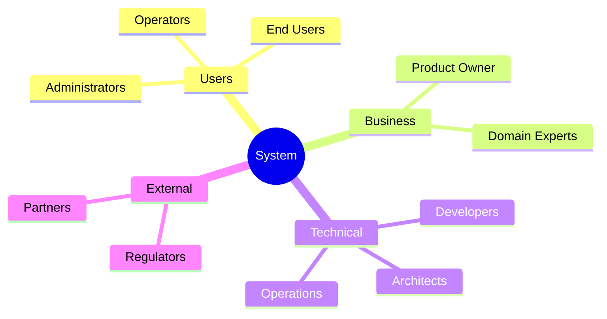

# 1. Business Vision, Goals, and Technology-Agnostic Requirements

<!--
Arc42 Section 1: Introduction and Goals (Renamed)
Original: "Introduction and Goals"
New: "Business Vision, Goals, and Technology-Agnostic Requirements"

Provides the essential context for the system and its development.
Key content: User Stories (US-XXX), Business Rules ("Unchangeables"), Project Goals, Design Intent
-->

## 1.1 Requirements Overview

### Business Context

| Attribute | Description |
|-----------|-------------|
| **System Name** | {System Name} |
| **Business Domain** | {Domain - e.g., Address Registry, Financial Services} |
| **Primary Purpose** | {1-2 sentence description of what the system does} |
| **Key Stakeholders** | {List primary stakeholder groups} |

### Essential Features

| Feature ID | Feature | Description | Priority |
|------------|---------|-------------|----------|
| F-001 | {Feature Name} | {Brief description} | {Must/Should/Could} |
| F-002 | {Feature Name} | {Brief description} | {Must/Should/Could} |
| F-003 | {Feature Name} | {Brief description} | {Must/Should/Could} |

### Background and Motivation

{Why does this system exist? What problem does it solve?}

---

## 1.2 Quality Goals

The top quality goals for the system, ordered by priority:

| Priority | Quality Goal | Scenario | Metric |
|----------|--------------|----------|--------|
| 1 | {e.g., Reliability} | {Concrete scenario} | {Measurable target} |
| 2 | {e.g., Performance} | {Concrete scenario} | {Measurable target} |
| 3 | {e.g., Security} | {Concrete scenario} | {Measurable target} |

### Quality Goal Details

#### Goal 1: {Quality Goal Name}

**Definition**: {What does this quality mean in context of this system?}

**Rationale**: {Why is this quality important?}

**Acceptance Criteria**:
- {Criterion 1}
- {Criterion 2}

---

## 1.3 Stakeholders

### Stakeholder Overview



### Stakeholder Table

| Role | Contact | Expectations | Concerns |
|------|---------|--------------|----------|
| {Role} | {Name/Team} | {What they expect from the system} | {What worries them} |
| {Role} | {Name/Team} | {What they expect from the system} | {What worries them} |
| {Role} | {Name/Team} | {What they expect from the system} | {What worries them} |

### Communication Channels

| Stakeholder | Artifact | Frequency |
|-------------|----------|-----------|
| {Role} | {Document/Meeting type} | {How often} |

---

## 1.4 Project Structure

**Purpose**: Document repository layout and module locations so readers can navigate to source code.

**Source**: `work/01-reconnaissance/CODE-INVENTORY.md`

---

### 1.4.1 Repository Overview

**Repository Type**: {Multi-repo / Monorepo / Hybrid}

| Repository | Purpose | Technology Stack | Location |
|------------|---------|------------------|----------|
| {repo_name} | {description} | {tech_stack} | {url_or_path} |

**Example**:
| Repository | Purpose | Technology Stack | Location |
|------------|---------|------------------|----------|
| {PROJECT}-legacy | Legacy system repository (sparse checkout) | .NET 4.7.2, Oracle 12c | {PROJECT_ROOT}\ |

---

### 1.4.2 Module Directory Structure

**{PROJECT_NAME} Module Location**: `{relative_path}/`

```
{repo_name}/
├── src/
│   ├── {component_category}/
│   │   ├── {component_name}/       # {description}
│   │   │   ├── {file1}.{ext}
│   │   │   └── {file2}.{ext}
│   └── {another_category}/
├── test/
│   └── {test_project}/
└── docs/
```

**Example (DAR Project)**:
```
trunk/DAR/
├── src/
│   ├── Common/
│   │   ├── DarCommon/              # Shared utilities, models
│   │   └── DarDatabaseServices/    # Oracle database access layer
│   ├── ExternalServices/
│   │   ├── DarSearchServices/      # RESTful search API
│   │   └── DarUpdateServices/      # Address update API
│   └── Sync/
│       └── SyncAgent/              # Main synchronization orchestrator
├── test/
│   └── DarSearchServices.Tests/
└── docs/
```

---

### 1.4.3 Component Location Mapping

**Cross-Reference**: See Section 5 (Building Block View) for detailed component descriptions with file locations.

| Component | Category | Location |
|-----------|----------|----------|
| {component_name} | {Common/API/Sync/Tool} | `{repo}/{path}/` |

**Example**:
| Component | Category | Location |
|-----------|----------|----------|
| DarCommon | Common Library | `trunk/DAR/src/Common/DarCommon/` |
| DarSearchServices | External API | `trunk/DAR/src/ExternalServices/DarSearchServices/` |
| SyncAgent | Synchronization | `trunk/DAR/src/Sync/SyncAgent/` |

---

### 1.4.4 Database Code Location

**Database Type**: {Oracle / PostgreSQL / SQL Server / etc.}

**Location**: `{path_to_db_code}/`

**Structure**:
```
{db_folder}/
├── Packages/
│   └── {package_name}.sql
├── Procedures/
│   └── {proc_name}.sql
└── Functions/
    └── {func_name}.sql
```

**Example (DAR)**:
```
trunk/DARDb/
├── PROD/
│   ├── Packages/          # 45+ PL/SQL packages
│   ├── Procedures/        # 800+ stored procedures
│   └── Functions/         # 200+ functions
└── TEST/
```

---

## 1.5 Design Intent and Evolution

### Original System Goals ({Original Year})

**Business Drivers** (from {Source - BRD, ADR, etc.}):
1. {Original business driver 1}
2. {Original business driver 2}
3. {Original business driver 3}

**Design Principles** (from {Source - ADR documents, interviews}):
1. {Design principle 1 - e.g., Flexibility over performance}
2. {Design principle 2 - e.g., Standards compliance}
3. {Design principle 3 - e.g., Incremental migration}

**Constraints at Time of Design** (from {Source - interviews, docs}):
1. {Constraint 1 - e.g., Backward compatibility requirements}
2. {Constraint 2 - e.g., Budget limitations}
3. {Constraint 3 - e.g., Team size/expertise}

### System Evolution ({Start Year}-{Current Year})

**Major Changes**:
- {Year}: {Change description}
- {Year}: {Change description}
- {Year}: {Change description}

**Divergence from Original Design**:
- {Status icon} {Divergence description} (was: {original intent})
- {Status icon} {Divergence description} (was: {original intent})

Use:
- ⚠️ for concerning divergence
- ✅ for positive outcome
- ❌ for negative outcome

**Lessons Learned** (from stakeholder interviews):
- {Lesson 1}
- {Lesson 2}
- {Lesson 3}

---

## 1.6 Documentation Gaps Identified

This AS-IS documentation corrects the following gaps between original documentation and current reality:

| Gap | Original Docs | Reality | Source |
|-----|--------------|---------|--------|
| {Gap Name} | {What original docs said} | {What actually exists} | {Code + Stakeholder} |
| {Gap Name} | {What original docs said} | {What actually exists} | {Code + Stakeholder} |
| {Gap Name} | {What original docs said} | {What actually exists} | {Code + Stakeholder} |

See `artifacts/07-synthesis/DOCUMENTATION-GAP-SUMMARY.md` for complete list.

---

## 1.7 Requirements Summary

> **Documentation Strategy**: Arc42 provides summaries with key metrics and links to detailed artifacts.
> Full requirements live in `artifacts/07-synthesis/requirements/`.

### Business Rules ("Unchangeables")

| Metric | Value |
|--------|-------|
| **Total Business Rules** | {n} |
| **Regulatory/Legal** | {n} |
| **Business-Critical** | {n} |
| **Operational** | {n} |

**Top 5 Critical Rules**:

| ID | Rule | Type |
|----|------|------|
| {BR-REG-001} | {Rule description} | {Legal/Tax/GDPR} |
| {BR-REG-002} | {Rule description} | {Legal/Tax/GDPR} |
| {BR-BUS-001} | {Rule description} | {Business} |
| {BR-BUS-002} | {Rule description} | {Business} |
| {BR-BUS-003} | {Rule description} | {Validation} |

> **Full Catalog**: See [BUSINESS-RULES-CATALOG.md](../artifacts/07-synthesis/requirements/BUSINESS-RULES-CATALOG.md) for all {n} rules.

### Functional Requirements

| Metric | Value |
|--------|-------|
| **Total Requirements** | {n} |
| **Must Have** | {n} |
| **Should Have** | {n} |
| **Could Have** | {n} |

**Top 5 Critical Requirements**:

| ID | Requirement | Priority |
|----|-------------|----------|
| {FR-001} | {Requirement description} | Must |
| {FR-002} | {Requirement description} | Must |
| {FR-003} | {Requirement description} | Must |
| {FR-004} | {Requirement description} | Must |
| {FR-005} | {Requirement description} | Should |

> **Full Requirements**: See [FUNCTIONAL-REQUIREMENTS.md](../artifacts/07-synthesis/requirements/FUNCTIONAL-REQUIREMENTS.md) for all {n} requirements.

### User Stories

| Metric | Value |
|--------|-------|
| **Total User Stories** | {n} |
| **With Acceptance Criteria** | {n} |
| **Mapped to Requirements** | {n} |

**Key User Stories**:

| ID | Story | Priority |
|----|-------|----------|
| {US-001} | As a {role}, I want to {goal} | Must |
| {US-002} | As a {role}, I want to {goal} | Must |
| {US-003} | As a {role}, I want to {goal} | Should |

> **Full Stories**: See [USER-STORIES.md](../artifacts/07-synthesis/requirements/USER-STORIES.md) for all {n} stories.

---

## References

- [Constraints](02-constraints.md) - Technical and organizational constraints
- [Quality Requirements](10-quality-requirements.md) - Detailed quality scenarios
- [Glossary](12-glossary.md) - Term definitions

### Detailed Artifacts

| Artifact | Description | Location |
|----------|-------------|----------|
| Business Rules Catalog | All {n} business rules ("unchangeables") | `artifacts/07-synthesis/requirements/BUSINESS-RULES-CATALOG.md` |
| Functional Requirements | All {n} functional requirements | `artifacts/07-synthesis/requirements/FUNCTIONAL-REQUIREMENTS.md` |
| User Stories | All {n} user stories | `artifacts/07-synthesis/requirements/USER-STORIES.md` |
| Traceability Matrix | Requirements to code mapping | `artifacts/07-synthesis/requirements/REQUIREMENTS-TRACEABILITY-MATRIX.md` |

---

*Last Updated: {Date}*
*Status: [ ] Draft / [ ] Review / [ ] Complete*
