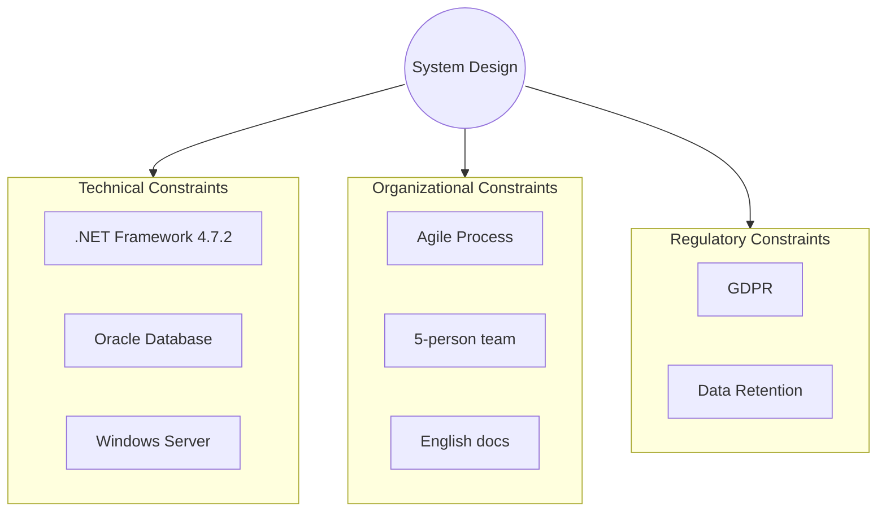

# 2. Technical, Organizational, and Regulatory Constraints

<!--
Arc42 Section 2: Constraints (Renamed)
Original: "Constraints"
New: "Technical, Organizational, and Regulatory Constraints"

Documents anything that constrains design and implementation decisions.
-->

## 2.1 Technical Constraints

### Technology Stack Constraints

| Constraint | Description | Background |
|------------|-------------|------------|
| TC-01 | {e.g., Must use .NET Framework 4.7.2} | {Why this constraint exists} |
| TC-02 | {e.g., Oracle Database required} | {Why this constraint exists} |
| TC-03 | {e.g., Windows Server deployment} | {Why this constraint exists} |

### Development Constraints

| Constraint | Description | Background |
|------------|-------------|------------|
| DC-01 | {e.g., Must use Visual Studio 2022} | {Reason} |
| DC-02 | {e.g., NuGet packages from internal feed only} | {Reason} |
| DC-03 | {e.g., Code must pass SonarQube quality gates} | {Reason} |

### Integration Constraints

| Constraint | Description | Background |
|------------|-------------|------------|
| IC-01 | {e.g., Must integrate via SOAP/WCF} | {Legacy system requirement} |
| IC-02 | {e.g., Maximum 5 second response time} | {SLA requirement} |
| IC-03 | {e.g., Must support XML format} | {Partner requirement} |

---

## 2.2 Organizational Constraints

### Process Constraints

| Constraint | Description | Background |
|------------|-------------|------------|
| OC-01 | {e.g., Must follow Agile/Scrum} | {Company standard} |
| OC-02 | {e.g., Code review required} | {Quality policy} |
| OC-03 | {e.g., Documentation in English} | {International team} |

### Team Constraints

| Constraint | Description | Impact |
|------------|-------------|--------|
| {e.g., Team size limited to 5} | {Description} | {How it affects design} |
| {e.g., No Oracle DBA available} | {Description} | {How it affects design} |

### Timeline Constraints

| Milestone | Date | Constraint |
|-----------|------|------------|
| {Milestone} | {Date} | {What must be delivered} |

---

## 2.3 Conventions

### Coding Conventions

| Area | Convention | Reference |
|------|------------|-----------|
| C# Style | {e.g., Microsoft C# Coding Conventions} | [Link] |
| SQL Style | {e.g., Oracle Naming Standards} | [Link] |
| API Design | {e.g., RESTful API Guidelines} | [Link] |

### Documentation Conventions

| Document Type | Format | Location |
|---------------|--------|----------|
| Architecture | Arc42 Markdown | `docs/architecture/arc42/` |
| API | OpenAPI 3.0 | `docs/api/` |
| ADRs | MADR Format | `docs/architecture/adr/` |

### Naming Conventions

| Element | Convention | Example |
|---------|------------|---------|
| Classes | PascalCase | `AddressService` |
| Methods | PascalCase | `GetAddress()` |
| Variables | camelCase | `addressId` |
| Database Tables | UPPER_SNAKE_CASE | `DAR_ADDRESS` |
| Stored Procedures | UPPER_SNAKE_CASE | `GET_ADDRESS_BY_ID` |

---

## 2.4 Regulatory and Compliance Constraints

### Legal Requirements

| Requirement | Description | Impact |
|-------------|-------------|--------|
| {e.g., GDPR} | {Description} | {How it affects design} |
| {e.g., Data Retention} | {Description} | {How it affects design} |

### Industry Standards

| Standard | Description | Compliance Status |
|----------|-------------|-------------------|
| {e.g., ISO 27001} | {Description} | {Compliant/Partial/Planned} |

---

## Constraint Visualization

---

## 2.5 Business Rules Summary (Constraints from "Unchangeables")

> **Documentation Strategy**: Business rules that act as constraints are summarized here.
> Full catalog lives in `artifacts/07-synthesis/requirements/BUSINESS-RULES-CATALOG.md`.

### Regulatory Constraints (from Business Rules)

| Metric | Value |
|--------|-------|
| **Total Regulatory Rules** | {n} |
| **Legal/Compliance** | {n} |
| **Tax/Financial** | {n} |
| **Data Protection (GDPR)** | {n} |

**Key Regulatory Rules Acting as Constraints**:

| ID | Rule | Source | Impact on Architecture |
|----|------|--------|------------------------|
| {BR-REG-001} | {Rule description} | {Law/Regulation} | {How it constrains design} |
| {BR-REG-002} | {Rule description} | {Law/Regulation} | {How it constrains design} |
| {BR-REG-003} | {Rule description} | {GDPR Article} | {How it constrains design} |

> **Full Catalog**: See [BUSINESS-RULES-CATALOG.md](../artifacts/07-synthesis/requirements/BUSINESS-RULES-CATALOG.md) for all regulatory rules.

### Constraint Traceability

| Constraint Type | Source Artifact | Count |
|-----------------|-----------------|-------|
| Technical Constraints | This document (Section 2.1) | {n} |
| Organizational Constraints | This document (Section 2.2) | {n} |
| Regulatory Constraints | Business Rules Catalog (BR-REG-*) | {n} |
| **Total Constraints** | | **{n}** |

---

## References

- [Introduction and Goals](01-introduction-goals.md) - System context
- [Solution Strategy](04-solution-strategy.md) - How constraints are addressed
- [Risks](11-risks-technical-debt.md) - Risks from constraints

### Detailed Artifacts

| Artifact | Description | Location |
|----------|-------------|----------|
| Business Rules Catalog | Regulatory rules that act as constraints | `artifacts/07-synthesis/requirements/BUSINESS-RULES-CATALOG.md` |
| Component Analysis | Technical constraint sources | `artifacts/05-analysis/` |

---

*Last Updated: {Date}*
*Status: [ ] Draft / [ ] Review / [ ] Complete*
