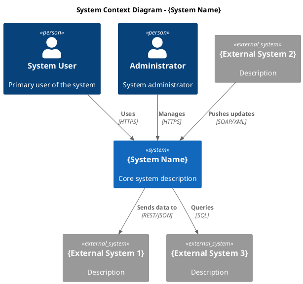
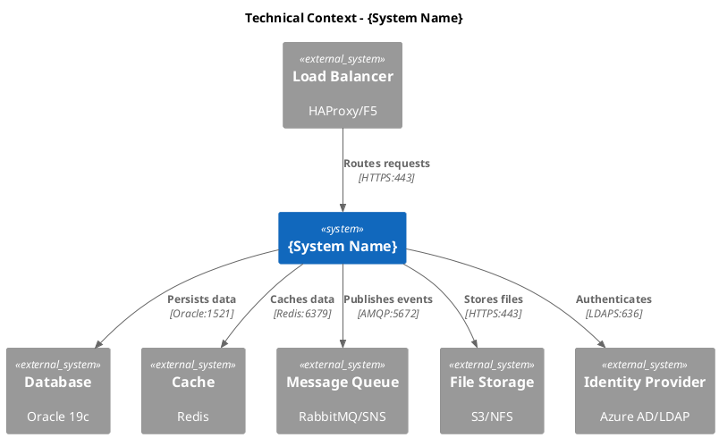
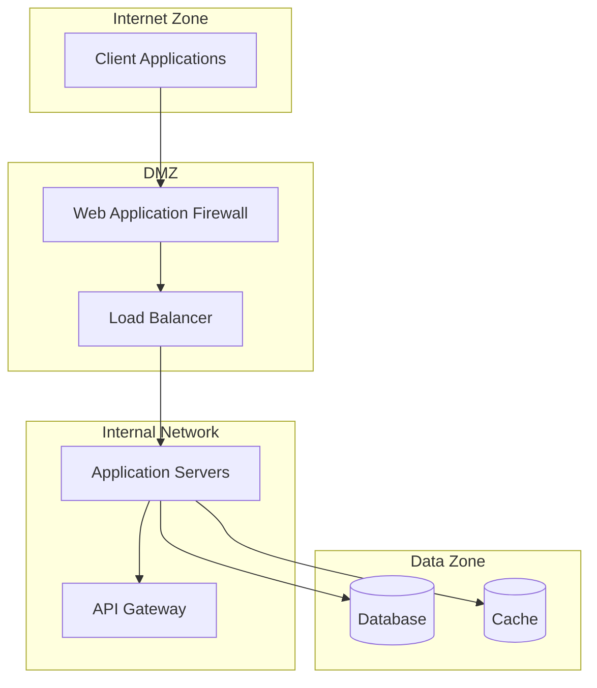
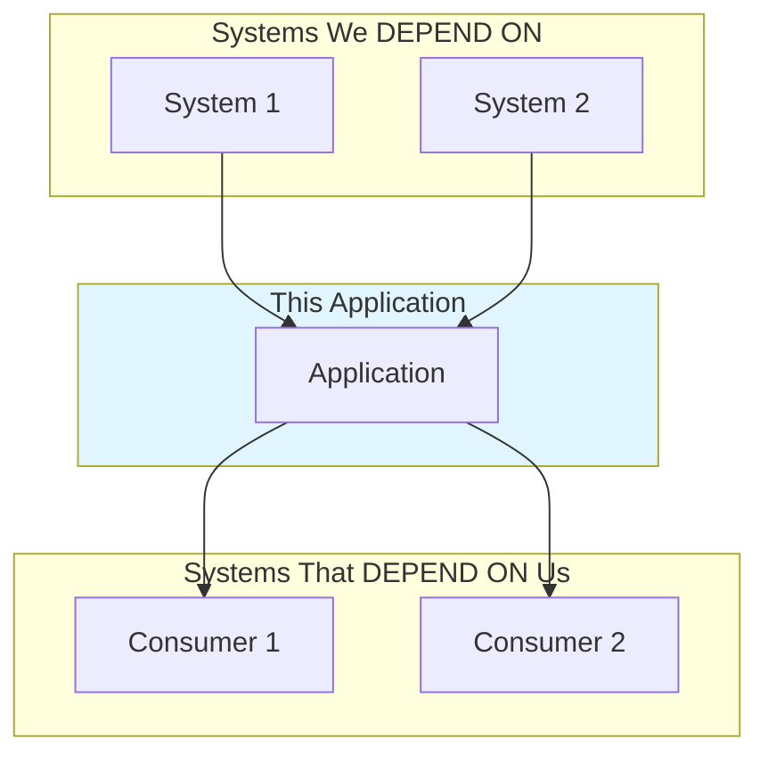

# 3. Enterprise Landscape, System Boundaries, and Integration Interfaces

<!--
Arc42 Section 3: Context and Scope (Renamed)
Original: "System Scope and Context"
New: "Enterprise Landscape, System Boundaries, and Integration Interfaces"

Defines the system boundary and its interactions with external systems.
Key content: EA Landscape, Inbound/Outbound Dependencies, Integration Use Cases, API Consumers
-->

## 3.1 Business Context

### Context Diagram

*Export: `docs/architecture/diagrams/exports/c4-context.png`*

### Business Partners/Users

| Partner/User | Description | Interface | Data Exchanged |
|--------------|-------------|-----------|----------------|
| {Name} | {Who they are} | {How they interact} | {What data} |
| {Name} | {Who they are} | {How they interact} | {What data} |
| {Name} | {Who they are} | {How they interact} | {What data} |

### External Systems

| System | Description | Interface | Protocol | Direction |
|--------|-------------|-----------|----------|-----------|
| {Name} | {Purpose} | {API/File/DB} | {REST/SOAP/File} | {In/Out/Both} |
| {Name} | {Purpose} | {API/File/DB} | {REST/SOAP/File} | {In/Out/Both} |

---

## 3.2 Technical Context

### Technical Context Diagram

### Technical Interfaces

| Interface | Technology | Port | Protocol | Security |
|-----------|------------|------|----------|----------|
| Web API | IIS/Kestrel | 443 | HTTPS | TLS 1.2+ |
| Database | Oracle | 1521 | TNS | Encrypted |
| Cache | Redis | 6379 | RESP | TLS |
| Events | SNS/SQS | 443 | HTTPS | IAM |

### Network Zones

---

## 3.3 Mapping Input/Output

### Data Flow Summary

| Direction | Source | Destination | Data | Format | Frequency |
|-----------|--------|-------------|------|--------|-----------|
| Inbound | {Source} | {System} | {Data type} | {JSON/XML} | {Real-time/Batch} |
| Outbound | {System} | {Destination} | {Data type} | {JSON/XML} | {Real-time/Batch} |

### Input Channels

| Channel | Source | Data | Format | Validation |
|---------|--------|------|--------|------------|
| {Name} | {Source} | {Description} | {Format} | {Rules} |

### Output Channels

| Channel | Destination | Data | Format | SLA |
|---------|-------------|------|--------|-----|
| {Name} | {Destination} | {Description} | {Format} | {Response time} |

---

## 3.4 Integration Details (Enhanced)

> **Meeting Recommendation (2026-01-08)**: Provide clear visibility into integrations with use cases and dependency maps.
> "Customers might not be sure where it integrates... need clear list with use cases per system" - Jarkko Enden

### 3.4.1 Integration Inventory

| ID | External System | Type | Purpose | Direction | Criticality | Status |
|----|-----------------|------|---------|-----------|-------------|--------|
| INT-001 | {System} | {REST/SOAP/File} | {Brief purpose} | {In/Out/Both} | {Critical/High/Medium/Low} | {Active} |

### 3.4.2 Use Cases per Integration

> Document WHY each integration exists from a business perspective.

#### INT-001: {System Name}

| Attribute | Value |
|-----------|-------|
| **Primary Use Case** | {What business process does this support?} |
| **Trigger** | {Event/Schedule/User action} |
| **Frequency** | {Real-time / Hourly / Daily / On-demand} |
| **Data Volume** | {Typical size, records per batch} |
| **Business Owner** | {Who owns from business perspective} |

**Business Context**:
{Why does this integration exist? What problem does it solve?}

**User Impact**:
{What happens to users if this integration fails or is delayed?}

### 3.4.3 Dependency Map

> "Which things is this software dependent on... which systems are dependent on this system" - Jarkko Enden

#### Inbound Dependencies (What We Depend On)

| System | Data/Service Consumed | Criticality | Impact if Unavailable | Fallback |
|--------|----------------------|-------------|----------------------|----------|
| {System} | {What we get} | {Critical/High/Medium/Low} | {Impact description} | {Strategy} |

#### Outbound Dependencies (What Depends On Us)

| System | Data/Service Provided | Known Consumers | Impact if We Fail | SLA |
|--------|----------------------|-----------------|-------------------|-----|
| {Service} | {What they get} | {List} | {Impact} | {SLA} |

### 3.4.4 API Consumer Documentation

> Document who consumes our APIs where this information is available.

#### Exposed APIs

| API | Type | Endpoint | Purpose | Authentication |
|-----|------|----------|---------|----------------|
| {API Name} | {REST/SOAP} | {/api/v1/resource} | {Brief purpose} | {OAuth/API Key} |

#### Known API Consumers

| API | Consumer System | Contact | Usage Pattern | Contract Version |
|-----|-----------------|---------|---------------|------------------|
| {API} | {Consumer name} | {Team/Email} | {Real-time/Batch} | {v1/v2} |

#### Unknown/Undocumented Consumers

> **Risk**: Changing API contracts may break unknown consumers.

- [ ] API logs show requests from unidentified sources
- [ ] API keys exist without documented owners
- [ ] Historical documentation mentions consumers no longer tracked

---

## References

- [Building Block View](05-building-block-view.md) - Internal structure
- [Runtime View](06-runtime-view.md) - Runtime interactions
- [Deployment View](07-deployment-view.md) - Physical deployment

- [Dependency Map Template](../analysis/dependency-map-template.md) - Detailed dependency analysis

---

*Last Updated: 2026-01-08*
*Status: [ ] Draft / [ ] Review / [ ] Complete*
*Changes: Added Section 3.4 (Integration Details) based on meeting recommendations*
