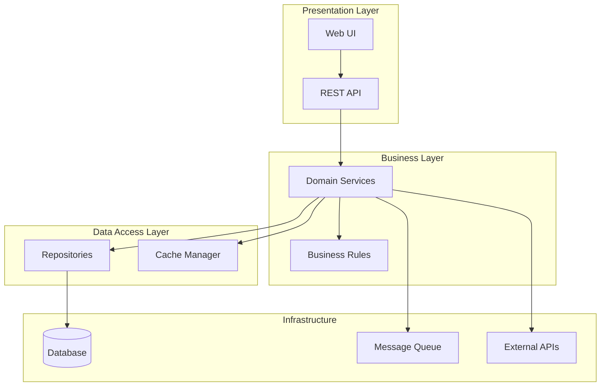
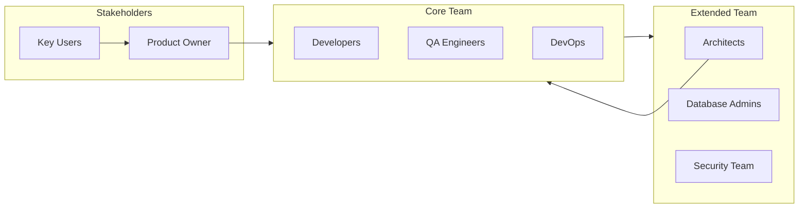
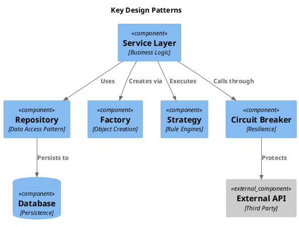

# 4. Architecture Design Principles, Vision, and Key Strategies

<!--
Arc42 Section 4: Solution Strategy (Renamed)
Original: "Solution Strategy"
New: "Architecture Design Principles, Vision, and Key Strategies"

Summarizes fundamental decisions and solution approaches.
Key content: Architectural patterns, high-level decisions, technology selection rationale
-->

## 4.1 Technology Decisions with Intent and Rationale

### Technology Stack

| Layer | Technology | Version | Rationale |
|-------|------------|---------|-----------|
| Frontend | {e.g., React} | {Version} | {Why chosen} |
| Backend | {e.g., .NET Core} | {Version} | {Why chosen} |
| Database | {e.g., Oracle} | {Version} | {Why chosen} |
| Cache | {e.g., Redis} | {Version} | {Why chosen} |
| Messaging | {e.g., AWS SNS} | {Version} | {Why chosen} |

### Technology Decision Matrix

| Requirement | Option A | Option B | Option C | Decision |
|-------------|----------|----------|----------|----------|
| {Requirement} | {Option} | {Option} | {Option} | {Chosen + Why} |

### Decision: {Decision Name - e.g., Entity-Attribute-Value (EAV) Pattern}

**What**: {Description of what was decided}

**Why** (from {Source - ADR, interview, docs}):
- {Reason 1}
- {Reason 2}
- {Trade-off accepted}

**Current Assessment** ({Current Year}):
- ✅ {Positive outcome}
- ❌ {Negative outcome}
- {Status icon} {Technical debt recognized if applicable}

**Would We Choose Differently?**:
"{Stakeholder quote about hindsight}" - {Stakeholder name}

**Implication for TO-BE**:
{What this means for modernization}

---

### Decision: {Another Major Decision}

**What**: {Description}

**Why** (from {Source}):
- {Reason 1}
- {Reason 2}

**Constraints**:
- {Constraint that influenced decision}
- {Constraint that influenced decision}

**Current Assessment**:
- ✅ {What's working}
- ❌ {What's not working}

---

## 4.2 Top-Level Decomposition

### Architecture Style

**Chosen Style**: {Monolith / Layered / Microservices / Event-Driven / Hybrid}

**Rationale**: {Why this style fits the requirements and constraints}

### High-Level Structure

### Component Responsibilities

| Component | Responsibility | Key Patterns |
|-----------|----------------|--------------|
| {Component} | {What it does} | {Patterns used} |
| {Component} | {What it does} | {Patterns used} |
| {Component} | {What it does} | {Patterns used} |

---

## 4.3 Approaches to Achieve Quality Goals

### Quality Goal: {Goal 1 - e.g., Performance}

| Approach | Description | Trade-offs |
|----------|-------------|------------|
| Caching | {How caching is used} | {Memory vs freshness} |
| Indexing | {Database optimization} | {Write vs read performance} |
| Async Processing | {Background jobs} | {Consistency vs speed} |

### Quality Goal: {Goal 2 - e.g., Reliability}

| Approach | Description | Trade-offs |
|----------|-------------|------------|
| Redundancy | {HA setup} | {Cost vs availability} |
| Circuit Breakers | {Failure isolation} | {Complexity vs resilience} |
| Retry Policies | {Error handling} | {Latency vs success rate} |

### Quality Goal: {Goal 3 - e.g., Security}

| Approach | Description | Trade-offs |
|----------|-------------|------------|
| Authentication | {Identity management} | {UX vs security} |
| Encryption | {Data protection} | {Performance vs protection} |
| Audit Logging | {Traceability} | {Storage vs compliance} |

---

## 4.4 Organizational Decisions

### Development Approach

| Aspect | Decision | Rationale |
|--------|----------|-----------|
| Methodology | {Agile/Scrum/Kanban} | {Why} |
| Branching | {Git Flow/Trunk-based} | {Why} |
| Code Review | {PR required/Pair programming} | {Why} |
| Testing | {TDD/BDD/Traditional} | {Why} |

### Team Structure

---

## 4.5 Key Design Patterns

| Pattern | Applied Where | Purpose |
|---------|---------------|---------|
| Repository | Data Access | Decouple business logic from data access |
| Factory | Object Creation | Encapsulate object construction |
| Strategy | Business Rules | Interchangeable algorithms |
| Observer | Events | Loose coupling for notifications |
| Circuit Breaker | External Calls | Failure isolation |

### Pattern Visualization

---

## References

- [Introduction](01-introduction-goals.md) - Quality goals being addressed
- [Constraints](02-constraints.md) - Constraints driving decisions
- [Building Blocks](05-building-block-view.md) - Detailed decomposition
- [ADRs](09-architecture-decisions/) - Detailed decision records

---

*Last Updated: {Date}*
*Status: [ ] Draft / [ ] Review / [ ] Complete*
