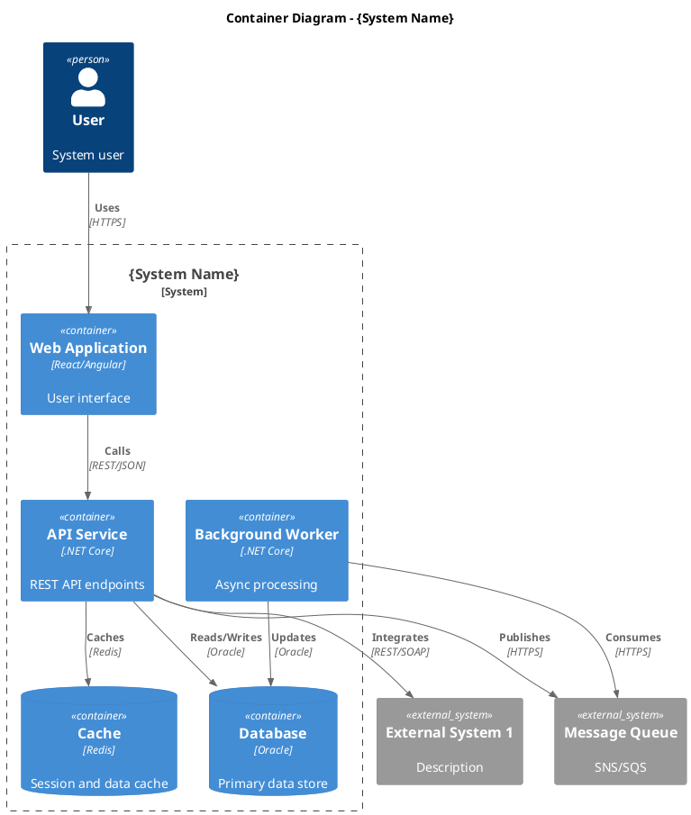
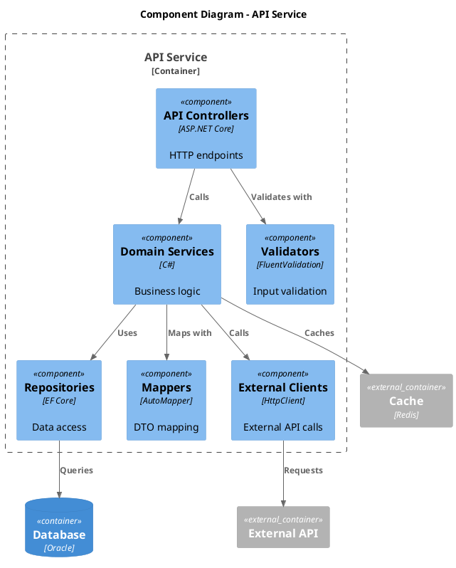
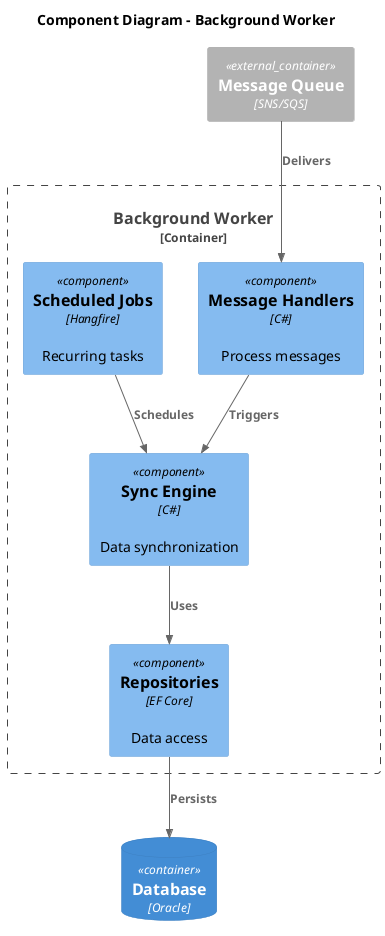
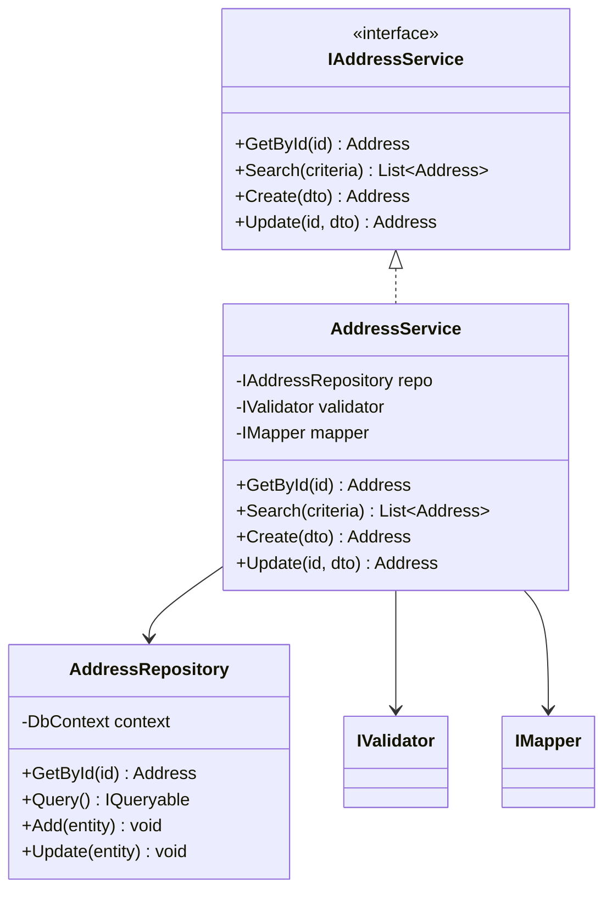
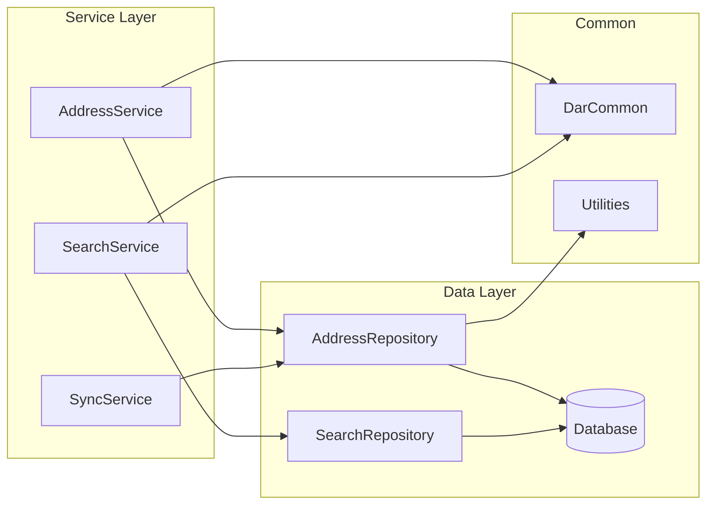
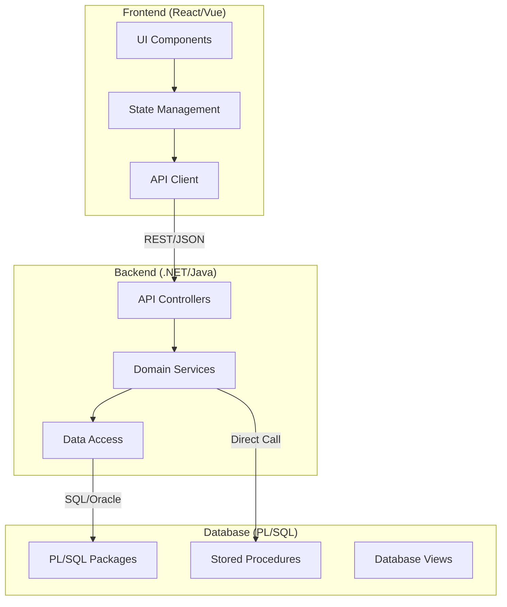
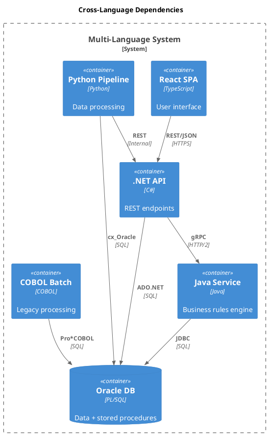

# 5. High-Level Software Architecture and Module Decomposition

<!--
Arc42 Section 5: Building Block View (Renamed)
Original: "Building Block View"
New: "High-Level Software Architecture and Module Decomposition"

Shows the static decomposition of the system into building blocks and their dependencies.
Uses C4 model hierarchy: Context -> Container -> Component
Key content: Codebase structure, Modules, Projects, C4 Container/Component views
-->

## 5.1 Level 1: System Context (Whitebox)

### Container Diagram

*Export: `docs/architecture/diagrams/exports/c4-container.png`*

### Container Overview

| Container | Technology | Purpose | Owner | Location |
|-----------|------------|---------|-------|----------|
| Web Application | React | User interface | Frontend Team | `{repo}/{path}/` |
| API Service | .NET Core | Business logic & API | Backend Team | `{repo}/{path}/` |
| Background Worker | .NET Core | Async processing | Backend Team | `{repo}/{path}/` |
| Database | Oracle | Persistent storage | DBA Team | `{db_server}/{schema}` |
| Cache | Redis | Performance | DevOps | `{host}:{port}` |

---

## 5.2 Level 2: Container Decomposition

### 5.2.1 API Service (Whitebox)

#### Component Responsibilities

| Component | Responsibility | Key Classes | Location |
|-----------|----------------|-------------|----------|
| Controllers | HTTP request handling | `AddressController`, `SearchController` | `{repo}/{path}/Controllers/` |
| Services | Business logic | `AddressService`, `SearchService` | `{repo}/{path}/Services/` |
| Validators | Input validation | `AddressValidator`, `SearchValidator` | `{repo}/{path}/Validators/` |
| Repositories | Data access | `AddressRepository`, `IRepository<T>` | `{repo}/{path}/Repositories/` |
| Mappers | Object mapping | `AddressProfile`, `DTOMappings` | `{repo}/{path}/Mappers/` |
| Clients | External integration | `VrkClient`, `OsorClient` | `{repo}/{path}/Clients/` |

### 5.2.2 Background Worker (Whitebox)

---

## 5.3 Level 3: Component Details

### Key Component: {Component Name}

#### Class Responsibilities

| Class | Purpose | Dependencies |
|-------|---------|--------------|
| `AddressService` | Core business logic | Repository, Validator, Mapper |
| `AddressRepository` | Data access | DbContext |
| `AddressValidator` | Validation rules | None |

---

## 5.4 Dependency Overview

### Internal Dependencies

### Dependency Matrix

| Component | Depends On | Used By | Location |
|-----------|------------|---------|----------|
| DarCommon | - | All services | `{repo}/{path}/DarCommon/` |
| DarDatabaseServices | DarCommon | All services | `{repo}/{path}/DarDatabaseServices/` |
| AddressService | DarDatabaseServices, DarCommon | Controllers | `{repo}/{path}/Services/AddressService.cs` |
| SearchService | DarDatabaseServices, DarCommon | Controllers | `{repo}/{path}/Services/SearchService.cs` |

---

## 5.5 Important Interfaces

| Interface | Purpose | Implementors | Location |
|-----------|---------|--------------|----------|
| `IAddressService` | Address operations | `AddressService` | `{repo}/{path}/Interfaces/IAddressService.cs` |
| `IRepository<T>` | Generic data access | All repositories | `{repo}/{path}/Interfaces/IRepository.cs` |
| `IExternalClient` | External API calls | `VrkClient`, `OsorClient` | `{repo}/{path}/Interfaces/IExternalClient.cs` |

---

## 5.6 Multi-Language Component Analysis

For heterogeneous systems with multiple languages, additional analysis patterns apply:

### Analyze by Language Layer

| Layer | Common Technologies | Analysis Focus |
|-------|---------------------|----------------|
| **Backend** | .NET, Java, Python, Node.js, Go | Business logic, API design, data access |
| **Frontend** | React, Vue, Angular, Blazor | UI components, state management, API calls |
| **Database** | PL/SQL, T-SQL, PostgreSQL | Stored procedures, triggers, business logic in DB |
| **Legacy** | COBOL, ColdFusion, VB6, Delphi | Encapsulation, interface extraction |
| **Integration** | gRPC, REST, SOAP, Message Queues | Cross-system boundaries, contracts |

### Per-Language Component Diagrams

Create separate C4 diagrams for each language boundary:

### Cross-Language Integration Points

Document all cross-language boundaries:

| Source | Target | Protocol | Contract | Source Location | Target Location |
|--------|--------|----------|----------|-----------------|-----------------|
| React Frontend | .NET API | REST/JSON | OpenAPI | `{repo}/frontend/` | `{repo}/api/` |
| .NET API | Oracle DB | ADO.NET | SQL + PL/SQL | `{repo}/api/` | `{db_server}/{schema}` |
| Java Service | .NET API | gRPC | .proto files | `{repo}/java-service/` | `{repo}/api/` |
| Python Scripts | REST APIs | HTTP | JSON | `{repo}/scripts/` | `{api_endpoint}` |
| COBOL Batch | File System | Files | Fixed-width | `{mainframe_path}` | `{file_share_path}` |

### Multi-Tech Analysis Workflow

1. **Inventory All Languages**
   - Use detection script from [01-codebase-reconnaissance.md](../../process-steps/as-is-brownfield/steps/01-codebase-reconnaissance.md)
   - Run `cloc` for LOC breakdown

2. **Prioritize by Business Impact**
   - Core business logic (highest priority)
   - Integration layers (high priority)
   - Utilities and scripts (lower priority)

3. **Create Per-Language SA-XX Documents**
   - Group components by primary language
   - Document cross-language dependencies
   - Reference tool selection from [TOOL-SELECTION-DECISION-TREE.md](../analysis/TOOL-SELECTION-DECISION-TREE.md)

4. **Map Integration Contracts**
   - API contracts (OpenAPI, WSDL, .proto)
   - Database contracts (stored procedures, views)
   - File formats (CSV, JSON, XML, fixed-width)
   - Message formats (queue payloads)

### Cross-Language Dependency Example

### Technology-Specific Considerations

| Technology | Special Considerations |
|------------|------------------------|
| **PL/SQL** | Business logic often embedded; extract as separate component |
| **COBOL** | Usually batch; document file I/O contracts |
| **ColdFusion** | Often mixed with SQL; identify data access patterns |
| **Legacy .NET** | May use COM interop; document native dependencies |
| **Node.js** | Often BFF layer; document downstream API calls |
| **Python** | Scripts vs services distinction; document entry points |

### See Also

- [Tool Selection Decision Tree](../analysis/TOOL-SELECTION-DECISION-TREE.md) - Select analysis tools per language
- [Step 3: Automated Discovery Scan](../../process-steps/as-is-brownfield/steps/03-automated-discovery-scan.md) - Run static analysis
- [Step 5: Component Analysis](../../process-steps/as-is-brownfield/steps/05-component-analysis.md) - Deep-dive per component

---

## References

- [Context](03-context-scope.md) - System boundary
- [Runtime View](06-runtime-view.md) - How blocks interact
- [Deployment View](07-deployment-view.md) - Where blocks run

---

*Last Updated: {Date}*
*Status: [ ] Draft / [ ] Review / [ ] Complete*
