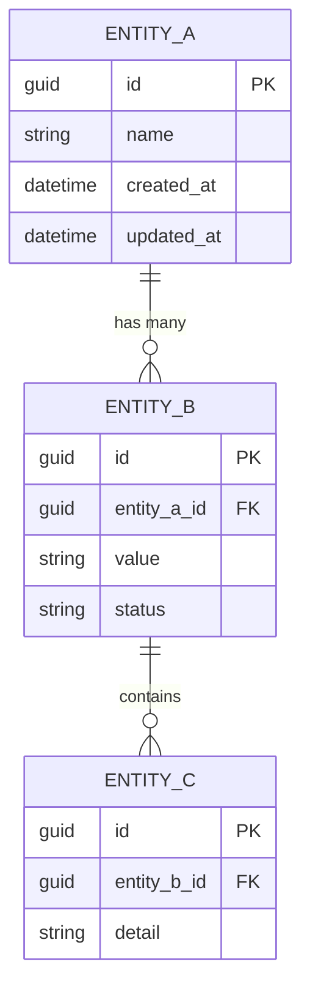
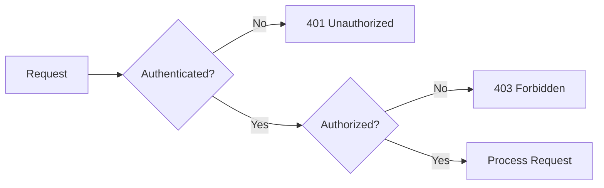
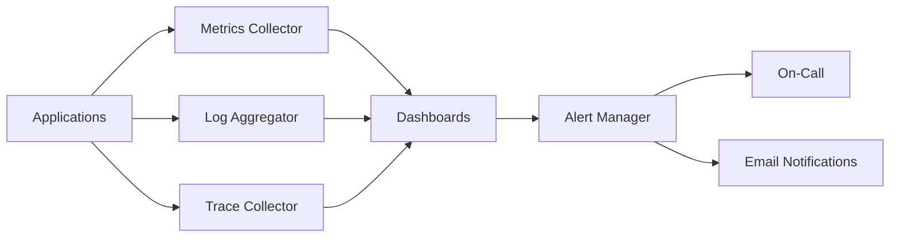
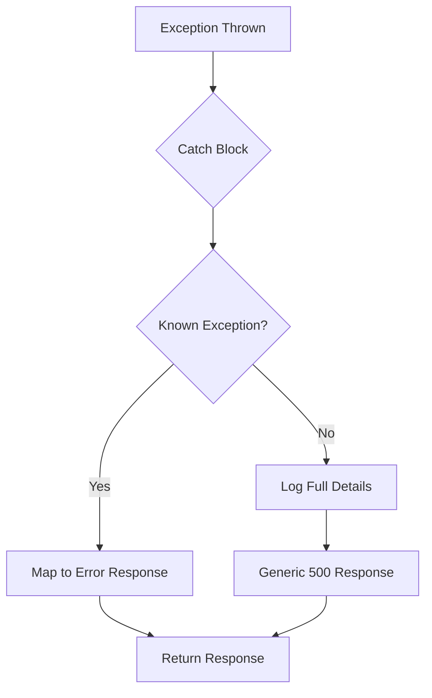
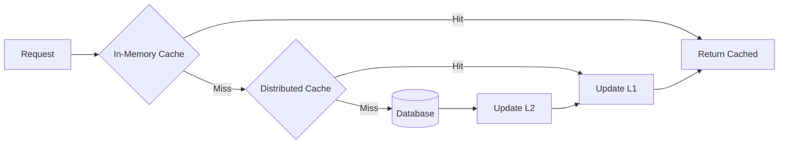
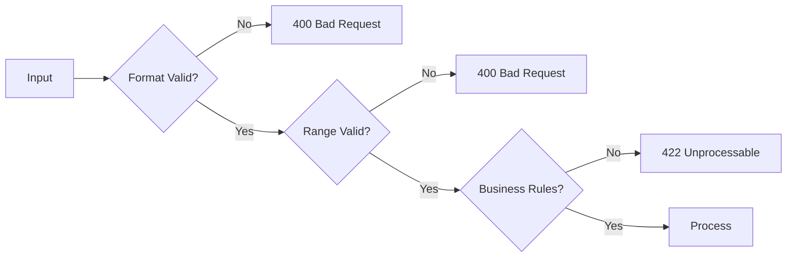
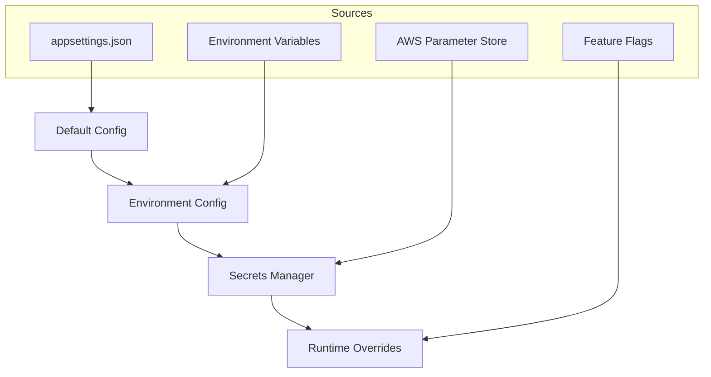
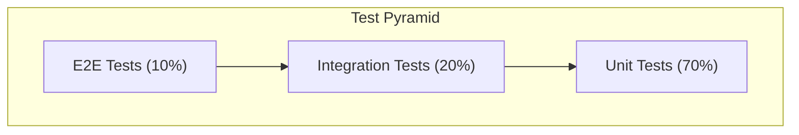

# 8. Domain Rules, Data Standards, and Cross-Functional Guidelines

<!--
Arc42 Section 8: Crosscutting Concepts (Renamed)
Original: "Cross-cutting Concepts"
New: "Domain Rules, Data Standards, and Cross-Functional Guidelines"

Describes business rules (BR-XXX), data rules, domain models, and patterns that apply across multiple building blocks.
Key content: Business rules, data validation rules, domain models, logging, security, UI guidelines
-->

## 8.1 Domain Model

### Core Domain Entities



### Domain Concepts

| Concept | Definition | Invariants |
|---------|------------|------------|
| {Concept 1} | {Definition} | {Business rules that must always hold} |
| {Concept 2} | {Definition} | {Business rules that must always hold} |
| {Concept 3} | {Definition} | {Business rules that must always hold} |

---

## 8.2 Security

### Authentication

| Aspect | Approach | Technology |
|--------|----------|------------|
| User Authentication | {OAuth2 / SAML / JWT} | {Identity Provider} |
| Service Authentication | {API Keys / mTLS} | {Technology} |
| Token Management | {JWT with refresh} | {Token service} |

### Authorization



| Role | Permissions | Scope |
|------|-------------|-------|
| Admin | Full access | All resources |
| Operator | Read/Write | Assigned resources |
| Viewer | Read only | Assigned resources |
| System | Service-to-service | API endpoints |

### Data Protection

| Data Classification | Protection Measures |
|--------------------|---------------------|
| PII | Encryption at rest, masked in logs |
| Credentials | Encrypted, never logged |
| Business Data | Access controlled |
| Public | None required |

---

## 8.3 Logging and Monitoring

### Logging Strategy

| Log Level | Usage | Retention |
|-----------|-------|-----------|
| Error | Exceptions, failures | 90 days |
| Warn | Potential issues | 30 days |
| Info | Business events | 14 days |
| Debug | Development only | 7 days |

### Log Format

```json
{
  "timestamp": "2024-01-15T10:30:00.000Z",
  "level": "INFO",
  "correlationId": "abc-123",
  "service": "api-service",
  "message": "Request processed",
  "context": {
    "userId": "user-456",
    "action": "search",
    "duration_ms": 150
  }
}
```

### Monitoring



---

## 8.4 Error Handling

### Error Categories

| Category | HTTP Status | Retry | Example |
|----------|-------------|-------|---------|
| Validation | 400 | No | Invalid input |
| Authentication | 401 | No | Invalid token |
| Authorization | 403 | No | Insufficient permissions |
| Not Found | 404 | No | Resource missing |
| Business Rule | 422 | No | Operation not allowed |
| Server Error | 500 | Yes | Unexpected exception |
| Service Unavailable | 503 | Yes | Dependency down |

### Error Response Format

```json
{
  "error": {
    "code": "VALIDATION_ERROR",
    "message": "Invalid request parameters",
    "details": [
      {
        "field": "email",
        "message": "Invalid email format"
      }
    ],
    "correlationId": "abc-123",
    "timestamp": "2024-01-15T10:30:00Z"
  }
}
```

### Exception Handling Flow



---

## 8.5 Caching

### Caching Strategy

| Cache Type | Use Case | TTL | Invalidation |
|------------|----------|-----|--------------|
| Distributed (Redis) | Session, shared data | 30 min | Event-based |
| In-memory | Reference data | 5 min | Time-based |
| HTTP | API responses | Varies | Cache-Control headers |

### Cache Hierarchy



### Cache Keys

| Pattern | Example | Purpose |
|---------|---------|---------|
| `{entity}:{id}` | `address:123` | Single entity |
| `{entity}:list:{hash}` | `address:list:abc` | Query results |
| `{entity}:count` | `address:count` | Aggregations |

---

## 8.6 Data Validation

### Validation Layers

| Layer | Responsibility | Technology |
|-------|----------------|------------|
| Client | UX feedback | Form validation |
| API | Input sanitization | FluentValidation |
| Domain | Business rules | Domain objects |
| Database | Data integrity | Constraints |

### Validation Rules



---

## 8.7 Internationalization (i18n)

### Supported Locales

| Locale | Language | Date Format | Number Format |
|--------|----------|-------------|---------------|
| en-US | English (US) | MM/DD/YYYY | 1,234.56 |
| da-DK | {COUNTRY_ADJ} | DD-MM-YYYY | 1.234,56 |
| de-DE | German | DD.MM.YYYY | 1.234,56 |

### Localization Strategy

| Content Type | Storage | Retrieval |
|--------------|---------|-----------|
| UI Text | Resource files | Accept-Language header |
| Error Messages | Resource files | Exception context |
| Dynamic Content | Database | User preference |

---

## 8.8 Configuration Management

### Configuration Hierarchy



### Configuration Categories

| Category | Source | Refresh |
|----------|--------|---------|
| Static | Config files | Restart required |
| Environment | Env vars | Restart required |
| Secrets | Secret manager | Hot reload |
| Features | Feature service | Real-time |

---

## 8.9 Testing Approach

### Test Pyramid



### Testing Standards

| Test Type | Scope | Framework | Coverage Target |
|-----------|-------|-----------|-----------------|
| Unit | Single class/method | xUnit/NUnit | 80% |
| Integration | Component interactions | TestContainers | Key paths |
| E2E | Full user journeys | Playwright/Selenium | Critical flows |
| Performance | Load/stress | k6/JMeter | Baselines |

---

## 8.10 Dependency Injection

### DI Container

| Registration | Lifetime | Example |
|--------------|----------|---------|
| Transient | Per request | Validators |
| Scoped | Per HTTP request | Repositories |
| Singleton | Application lifetime | Configuration |

### Registration Pattern

```csharp
// Example service registration
services.AddScoped<IAddressService, AddressService>();
services.AddScoped<IAddressRepository, AddressRepository>();
services.AddSingleton<ICacheService, RedisCacheService>();
```

---

## References

- [Building Blocks](05-building-block-view.md) - Where concepts are applied
- [Quality Requirements](10-quality-requirements.md) - Non-functional requirements
- [ADRs](09-architecture-decisions/) - Decision rationale

---

*Last Updated: {Date}*
*Status: [ ] Draft / [ ] Review / [ ] Complete*
