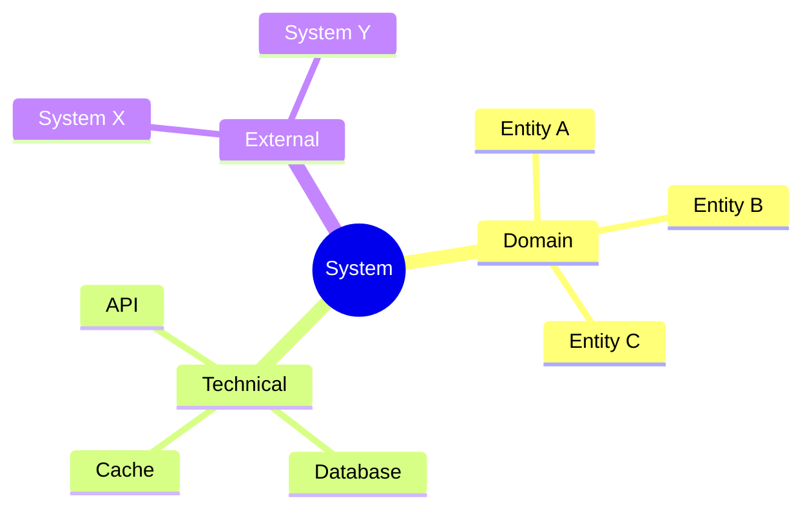

# 12. Domain Terminology and Business Language Dictionary

<!--
Arc42 Section 12: Glossary (Renamed)
Original: "Glossary"
New: "Domain Terminology and Business Language Dictionary"

Defines important domain and technical terms.
Organized alphabetically with categorization.
Key content: Business term definitions, Ubiquitous Language
-->

## Overview

This glossary defines key terms used throughout the architecture documentation. Terms are organized alphabetically within categories.

---

## Domain Terms

| Term | Definition | Example/Context |
|------|------------|-----------------|
| {Term A} | {Clear, concise definition} | {Usage example} |
| {Term B} | {Clear, concise definition} | {Usage example} |
| {Term C} | {Clear, concise definition} | {Usage example} |

### Domain-Specific Abbreviations

| Abbreviation | Full Form | Definition |
|--------------|-----------|------------|
| {ABBR} | {Full form} | {Definition} |
| {ABBR} | {Full form} | {Definition} |

---

## Technical Terms

| Term | Definition | Related Concepts |
|------|------------|------------------|
| {Term} | {Definition} | {Related terms} |
| {Term} | {Definition} | {Related terms} |

### Technical Abbreviations

| Abbreviation | Full Form | Definition |
|--------------|-----------|------------|
| API | Application Programming Interface | Contract for software component interaction |
| CI/CD | Continuous Integration/Continuous Deployment | Automated build and deployment pipeline |
| DTO | Data Transfer Object | Object for transferring data between layers |
| HA | High Availability | System design for minimal downtime |
| JWT | JSON Web Token | Compact token format for authentication |
| REST | Representational State Transfer | Architectural style for APIs |
| SLA | Service Level Agreement | Defined service quality targets |
| TLS | Transport Layer Security | Protocol for encrypted communication |

---

## Architecture Terms

| Term | Definition | Arc42 Section |
|------|------------|---------------|
| Building Block | A component or module within the system | Section 5 |
| Constraint | A limitation on the solution space | Section 2 |
| Quality Scenario | A testable quality requirement | Section 10 |
| Runtime View | How components interact at execution time | Section 6 |
| Technical Debt | Implied cost of future rework | Section 11 |

---

## Project-Specific Terms

### System Components

| Term | Definition | Location |
|------|------------|----------|
| {Component Name} | {What it does} | {Where in codebase} |
| {Component Name} | {What it does} | {Where in codebase} |

### Business Entities

| Entity | Definition | Attributes |
|--------|------------|------------|
| {Entity} | {Business meaning} | {Key fields} |
| {Entity} | {Business meaning} | {Key fields} |

### External Systems

| System | Full Name | Purpose |
|--------|-----------|---------|
| {Acronym} | {Full name} | {What it does} |
| {Acronym} | {Full name} | {What it does} |

---

## Status Codes and Enumerations

### Entity States

| State | Code | Description |
|-------|------|-------------|
| {State} | {Code} | {When an entity is in this state} |
| {State} | {Code} | {When an entity is in this state} |

### Error Codes

| Code | Name | Description |
|------|------|-------------|
| {Code} | {Name} | {What this error means} |
| {Code} | {Name} | {What this error means} |

---

## Related Glossaries

| Glossary | Scope | Location |
|----------|-------|----------|
| {External Glossary} | {Domain} | [Link] |
| {Industry Standard} | {Scope} | [Link] |

---

## Term Relationships

---

## Maintenance

### Adding New Terms

1. Identify the appropriate category
2. Add term in alphabetical order
3. Include definition, example, and related terms
4. Update related documentation if needed

### Term Standards

| Guideline | Example |
|-----------|---------|
| Use consistent capitalization | "REST API" not "Rest Api" |
| Define abbreviations on first use | "JWT (JSON Web Token)" |
| Cross-reference related terms | "See also: Authentication" |
| Keep definitions concise | <50 words per definition |

---

*Last Updated: {Date}*
*Status: [ ] Draft / [ ] Review / [ ] Complete*
