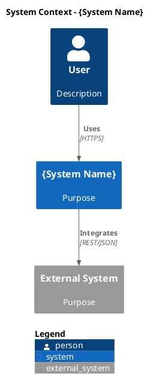

# Arc42 Architecture Documentation

This skill provides generic Arc42 architecture documentation templates with Context7 MCP integration for official Arc42 guidance.

## When to Use

Auto-triggered when discussing:
- Arc42 architecture documentation
- System architecture templates
- Software architecture documentation
- AS-IS or TO-BE system documentation
- Architecture decision records (ADRs)

## Arc42 Template Structure

Arc42 provides a proven 12-section template for documenting software architectures:

| Section | Name | Purpose |
|---------|------|---------|
| 1 | Business Vision & Goals | Requirements overview, quality goals, stakeholders |
| 2 | Constraints | Technical, organizational, and regulatory constraints |
| 3 | Context & Scope | System boundaries, external interfaces, integration points |
| 4 | Solution Strategy | Architecture design principles, key strategies |
| 5 | Building Block View | Static decomposition (C4: Context → Container → Component) |
| 6 | Runtime View | Key user workflows, data flows, sequences |
| 7 | Deployment View | Infrastructure, hosting, deployment topology |
| 8 | Crosscutting Concepts | Domain rules, data standards, guidelines |
| 9 | Architecture Decisions | ADRs (Architecture Decision Records) |
| 10 | Quality Requirements | Performance metrics, SLAs, quality attributes |
| 11 | Risks & Technical Debt | Known limitations, risks, debt catalog |
| 12 | Glossary | Domain terminology, acronyms |

### BMAD Extension

Section 13 (Documentation Gaps) - Optional extension for brownfield analysis documenting what's missing or unknown.

## Using Context7 for Official Arc42 Guidance

Access official Arc42 documentation via Context7 MCP:

```javascript
// Query Arc42 section guidance
mcp__context7__query-docs({
  libraryId: "/arc42/arc42-template",
  query: "Arc42 Section 5 Building Block View template structure and best practices"
})

// Query diagram conventions
mcp__context7__query-docs({
  libraryId: "/arc42/arc42-template",
  query: "How to document context diagrams in Arc42 Section 3"
})

// Query quality attributes
mcp__context7__query-docs({
  libraryId: "/arc42/arc42-template",
  query: "Arc42 Section 10 Quality Requirements scenarios and metrics"
})
```

## Template Usage

All templates use `{placeholders}` for system-specific content:
- `{System Name}` - Name of the system being documented
- `{Domain}` - Business domain (e.g., "Tax Management", "E-Commerce")
- `{Quality Goal}` - Specific quality objective (e.g., "High Availability")
- `{Stakeholder}` - Stakeholder name or role

### Quick Start

1. **Copy template**: Use section templates from `templates/` directory
2. **Replace placeholders**: Fill in `{System Name}`, `{Domain}`, etc.
3. **Add diagrams**: Use C4 model (Context → Container → Component) with PlantUML or Mermaid
4. **Query Context7**: Get official Arc42 guidance for specific sections
5. **Iterate**: Refine based on stakeholder feedback

## Diagram Formats

Arc42 supports both PlantUML and Mermaid:

### PlantUML (C4 Model)


### Mermaid (Mindmap for Stakeholders)
```mermaid
mindmap
  root(({System Name}))
    Users
      End Users
      Operators
      Admins
    Business
      Product Owner
      Domain Experts
    Technical
      Developers
      Architects
```

## Architecture Decision Records (ADRs)

Use MADR (Markdown Any Decision Records) format for Section 9:

```markdown
# ADR-001: {Decision Title}

**Status**: Proposed | Accepted | Deprecated | Superseded
**Date**: YYYY-MM-DD
**Deciders**: {Names/Roles}

## Context and Problem Statement

{What is the issue we're addressing?}

## Considered Options

1. {Option 1}
2. {Option 2}
3. {Option 3}

## Decision Outcome

**Chosen option**: {Option X}

**Rationale**: {Why this option was chosen}

### Positive Consequences

- {Benefit 1}
- {Benefit 2}

### Negative Consequences

- {Trade-off 1}
- {Trade-off 2}
```

## Best Practices

1. **Start with Section 1 (Goals)** - Establish business context and quality objectives
2. **Use C4 Model for Section 5** - Context → Container → Component hierarchy
3. **Keep diagrams simple** - Focus on clarity over completeness
4. **Document decisions** - Capture WHY, not just WHAT (Section 9)
5. **Update regularly** - Architecture documentation should evolve with the system
6. **Stakeholder review** - Different audiences need different detail levels

## Integration with Legacy Analysis

For full 9-step legacy analysis workflow, use the slash command:
```
/ai1st-arch-legacy-sys-analysis
```

This skill provides templates and knowledge; the command orchestrates the workflow.

## Examples

See `examples/` directory for:
- **microservices-example.md** - Arc42 for microservices architecture
- **monolith-example.md** - Arc42 for monolithic legacy systems
- **legacy-modernization-example.md** - AS-IS/TO-BE modernization documentation

## References

- **context7-integration.md** - Detailed Context7 query examples
- **section-guidance.md** - When to use each Arc42 section
- **Official Arc42 Site**: https://arc42.org/
- **Arc42 Template**: https://github.com/arc42/arc42-template

## Notes

- Templates are generic and technology-agnostic
- Use placeholders to maintain reusability
- Context7 provides official Arc42 guidance (33 code snippets available)
- For project-specific templates, see `.ai/legacy-analysis-process/templates/arc42/`
