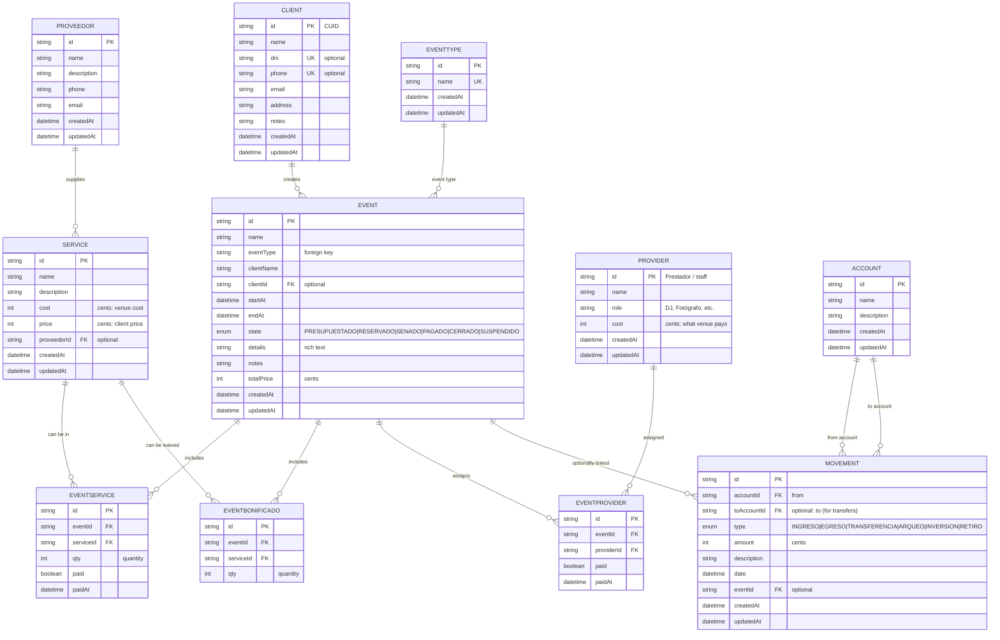

# crm-salon-infantil System Overview

**A greenfield CRM and management platform for children's party venues (salones de fiestas infantiles).** Centralizes event scheduling, accounting, inventory, staff, and client-facing digital invitations in a single Next.js application.

This document is the entry point for the codebase—it ties together all module documentation, architectural patterns, and conventions. Read this first to understand the system as a whole.

---

## Table of Contents

1. [What We Build](#what-we-build)
2. [Technology Stack](#technology-stack)
3. [Architecture](#architecture)
4. [Data Model](#data-model)
5. [Route Map](#route-map)
6. [Module Index](#module-index)
7. [Development Commands](#development-commands)
8. [Key Conventions](#key-conventions)
9. [Getting Started](#getting-started)

---

## What We Build

crm-salon-infantil is a unified platform for small-to-medium children's party venues (100–5,000 events annually). Staff manage a calendar of sold and quoted events, build each event from a catalog of services and assigned staff (prestadores), apply complimentary services (bonificados), and quote or reserve it while the system auto-computes cost, profit, and price.

**Core features:**

- **Event Calendar** — Day/week/month/year/list views; events color-coded by state (Reservado, Señado, Pagado, Cerrado, Suspendido, Presupuestado)
- **Event Management** — Create/edit events with services, staff assignments, complimentary items, and financial summary
- **Client Management** — Client records, contact info, event history
- **Service Catalog** — Services with cost (what the venue pays) and price (what clients pay)
- **Staff / Providers (Prestadores)** — Employees and external vendors assignable to events
- **Finance (Finanzas)** — Accounts, balance sheet, movements (income/expense/transfers), financial reports
- **Supplier & Staff Payments** — Track payouts to providers and staff

**Roadmap features (not yet built):**
- Digital invitations (customizable cards shared with guests, RSVP)
- Inventory & supplies (stock control, low-stock alerts)
- Furniture & equipment (predefined packages, auto-assignment)
- Sales (guest purchases, discounts, digital receipts)

---

## Technology Stack

| Layer | Technology | Version | Purpose |
|-------|-----------|---------|---------|
| **Framework** | Next.js (App Router) | 16.2.6 | React framework with SSR + Server Components |
| **Language** | TypeScript | 5.x | Strict mode for type safety across FE/BE |
| **React** | React | 19.2.4 | Server + Client Components; no separate client library |
| **Styling** | Tailwind CSS | 4.x | Utility CSS with design tokens (`app/globals.css`) |
| **UI Components** | shadcn/ui + Radix | latest | Accessible primitives; copy-in to `components/ui/` |
| **Forms** | React Hook Form + Zod | latest | Form state + shared validation (client + server) |
| **Server State** | Server Actions + Server Components | — | Default data path; no TanStack Query (yet) |
| **ORM** | Prisma | 7.8.0 | Type-safe queries + migrations; generated client at `app/generated/prisma` |
| **Database (dev)** | SQLite | — | Zero-setup local file DB (`prisma/dev.db`, gitignored) |
| **Database (prod)** | PostgreSQL | — | Swap Prisma `datasource provider` only (queries stay the same) |
| **Auth** | Auth.js (NextAuth) + JWT | — | Session/cookie login; JWT tokens in `httpOnly` cookies |
| **Testing (unit)** | Vitest | 4.1.7 | Unit tests for `lib/` domain logic |
| **Testing (E2E)** | Playwright | 1.60.0 | End-to-end tests for user flows |
| **Icons** | Lucide React | 1.17.0 | Consistent icon set (SVG, tree-shakeable) |
| **Calendar** | React Big Calendar | 1.19.4 | Week/month/agenda views |
| **Date Handling** | date-fns | 4.3.0 | Locale-aware date parsing and formatting |

---

## Architecture

### Single Next.js App, No Separate Backend

The system is a **single Next.js application** (no separate API server). All logic lives inside the same repo and deployment unit:

- **UI Layer** (`app/`, `components/`) — React Server Components for pages; `"use client"` only on interactive components
- **Server Layer** (`app/**/actions.ts`, `app/api/**/route.ts`) — Server Actions handle form mutations; Route Handlers expose HTTP endpoints when needed
- **Domain Logic** (`lib/<domain>/`) — Plain TypeScript modules wrapping Prisma queries and business rules; called by Server Actions and Route Handlers
- **Data Access** (`lib/prisma.ts`, `prisma/schema.prisma`) — Singleton Prisma client; schema + migrations

### Data Flow Diagram

```mermaid
graph LR
    Browser["🌐 Browser<br/>(Staff Dashboard)"]
    ServerAction["⚙️ Server Action<br/>(app/**/actions.ts)"]
    RouteHandler["🛣️ Route Handler<br/>(app/api/**/route.ts)"]
    LibDomain["📚 Domain Logic<br/>(lib/&lt;domain&gt;/)"]
    Prisma["🔐 Prisma Client<br/>(lib/prisma.ts)"]
    Database["💾 SQLite / PostgreSQL<br/>(prisma/dev.db | Prod DB)"]

    Browser -->|Server Action call| ServerAction
    Browser -->|fetch()| RouteHandler
    ServerAction -->|call| LibDomain
    RouteHandler -->|call| LibDomain
    LibDomain -->|query| Prisma
    Prisma -->|SQL| Database
    Database -->|rows| Prisma
    Prisma -->|typed result| LibDomain
    LibDomain -->|return| ServerAction
    LibDomain -->|return| RouteHandler
    ServerAction -->|revalidatePath| Browser
    RouteHandler -->|JSON response| Browser
```

### Key Patterns

- **Server Components by default** — Pages fetch data server-side via `lib/`; mark a component `"use client"` only when it needs state, effects, or event handlers.
- **Mutations via Server Actions** — Forms call a Server Action; on success, revalidate the route (`revalidatePath`) so the list refreshes—no manual cache management.
- **Thin Server Actions, Fat Domain Logic** — Actions validate input (Zod) → call `lib` → return result. All business rules live in `lib/`.
- **Keep the client boundary low** — Push `"use client"` to the leaf that needs it, not the whole page.

---

## Data Model

### Entity-Relationship Diagram



### Key Model Notes

- **Money in cents**: All financial fields (`cost`, `price`, `amount`, `totalPrice`) are stored as integer cents (centavos) to avoid floating-point errors. Convert at I/O boundaries using `lib/money.ts`.
- **Event** is the central aggregate: it links event type, client, services, providers, bonificados, and derives the financial summary (Costo total, Ganancia total, Subtotal, Precio total).
- **EventState enum** maps Bonete states: PRESUPUESTADO (quoted), RESERVADO (confirmed), SENADO (deposit paid), PAGADO (fully paid), CERRADO (closed), SUSPENDIDO (suspended).
- **Movement** posts against accounts and may be linked or not linked to an event. Types: INGRESO (income), EGRESO (expense), TRANSFERENCIA (transfer), ARQUEO (cash count), INVERSION (investment), RETIRO (withdrawal).
- **Service** and **Proveedor** are separate: Proveedor is an external vendor; Service is what the venue offers (and may use a proveedor for). Service has both cost (venue cost) and price (what client pays).

---

## Route Map

All routes below are nested under `/app/(dashboard)/` and are staff-only (session-protected via middleware).

| Route | Purpose | Module Doc |
|-------|---------|-----------|
| `/calendario` | Calendar views (day/week/month/year/list) of events | `calendar.md` (planned) |
| `/eventos` | Event list (Mis eventos / Presupuestados), quick create | `events.md` |
| `/eventos/[id]` | Event detail, edit, view financials | `events.md` |
| `/eventos/nuevo` | Create event form (multi-step or single form) | `events.md` |
| `/clientes` | Client list, create, edit | `clients.md` (planned) |
| `/servicios` | Service catalog, create/edit/delete | `catalog.md` |
| `/tipos-evento` | Event type list, create/edit/delete | `catalog.md` |
| `/prestadores` | Staff/providers list, create/edit/delete | `catalog.md` |
| `/proveedores` | External vendor list, create/edit/delete | `catalog.md` |
| `/finanzas` | Account list, balance sheet, create/edit account | `finance-payments.md` |
| `/finanzas/movimientos` | Movement list (income/expense/transfer), create/edit/delete | `finance-payments.md` |
| `/pagos/prestadores` | Provider/staff payment list, record payouts | `finance-payments.md` |
| `/pagos/proveedores` | Supplier payment list, record payouts | `finance-payments.md` |
| `/reportes` | Financial reports, analytics dashboards | `finance-payments.md` |

---

## Module Index

### Core Modules (Implemented)

| Module | Location | Purpose | Doc |
|--------|----------|---------|-----|
| **Events** | `lib/events/` | Event CRUD, financial summary calculation | `modules/events.md` |
| **Clients** | `lib/clients/` | Client CRUD | `modules/clients.md` (planned) |
| **Services & Catalog** | `lib/services/`, `lib/eventTypes/`, `lib/providers/`, `lib/proveedores/` | Service/type/staff/vendor CRUD | `modules/catalog.md` |
| **Finance & Movements** | `lib/finanzas/`, `lib/pagos/`, `lib/reports/` | Accounts, movements, balance, payments, reporting | `modules/finance-payments.md` |
| **Auth** | `lib/auth/` | Session management (JWT + cookies), password hashing | `modules/auth-reports-shared.md` |

### Shared Utilities

| Utility | Location | Purpose |
|---------|----------|---------|
| **Money** | `lib/money.ts` | `pesosToCents()`, `formatMoney()`, `centsToPesos()` |
| **Pagination** | `lib/pagination.ts` | Offset-based pagination helpers |
| **Prisma Client** | `lib/prisma.ts` | Singleton Prisma instance |
| **Utils** | `lib/utils.ts` | `cn()` for class merging (shadcn) |

### Roadmap Modules (Not Yet Implemented)

- **Invitations** (`lib/invitations/`) — Digital invitations, guest management, RSVP
- **Inventory** (`lib/inventory/`) — Stock control, supplies
- **Furniture** (`lib/furniture/`) — Predefined packages, assignment
- **Sales** (`lib/sales/`) — Guest purchases, discounts

---

## Development Commands

From `package.json`:

```bash
# Development
npm run dev              # Start Next.js dev server (:3000)

# Production
npm run build            # Build optimized bundle
npm start                # Run production server

# Code Quality
npm run lint             # ESLint check
npm run lint --fix       # ESLint auto-fix

# Testing
npm run test             # Vitest (unit tests, run once)
npm run test:watch       # Vitest (watch mode)
npm run test:e2e         # Playwright (end-to-end tests)

# Database
npm run db:migrate       # Create/apply Prisma migration
npm run db:generate      # Regenerate Prisma client (after schema change)
npm run db:studio        # Open Prisma Studio (GUI for data inspection)
npm run db:seed          # Run prisma/seed.ts (populate sample data)

# Security
npm run hash-password    # Hash a password for testing
```

---

## Key Conventions

### 1. Money in Cents

All monetary amounts are stored as **integer cents** (centavos) to avoid floating-point rounding errors in accounting.

**Convention:**
- Form input (pesos as string) → `pesosToCents()` → store in DB
- Stored cents → `formatMoney()` → display (e.g., "$15.500,50")
- Stored cents → `centsToPesos()` → prefill a number input

**Example:**
```typescript
import { pesosToCents, formatMoney } from "@/lib/money";

const userInput = "1550.50"; // User enters pesos
const cents = pesosToCents(1550.50); // 155050
const display = formatMoney(155050); // "$15.500,50"
```

See `lib/money.ts` for the full set of conversion functions.

### 2. Spanish UI, English Code

- **All UI text, labels, placeholders, error messages** → **Spanish** (es-AR / Argentine Spanish)
- **All identifiers, function names, variable names, types, comments** → **English**
- **Database column names** → **English**
- **API response keys** → **English**

This makes the codebase maintainable for international teams while keeping the user experience localized.

### 3. Authentication (proxy.ts, Next.js 16)

Next.js 16 uses `proxy.ts` (not `middleware.ts`). Auth is handled via:

- **Session management**: JWT tokens in `httpOnly` cookies (`lib/auth/session.ts`)
- **Route protection**: Middleware gates `/` → `/login` redirect
- **Server Action protection**: `requireSession()` call at the start of a Server Action to verify auth (defense in depth)

```typescript
// Example Server Action
"use server";
import { requireSession } from "@/lib/auth/session";

export async function createEvent(data: EventInput) {
  await requireSession(); // Throws redirect to /login if not authenticated
  // ... rest of logic
}
```

### 4. Prisma v7 Generated Client

The Prisma client is generated to a custom location:

```prisma
generator client {
  provider = "prisma-client"
  output   = "../app/generated/prisma"
}
```

**After any schema change:**
```bash
npx prisma migrate dev --name <change>  # Creates migration + regenerates client
```

If you only change the schema without migrating:
```bash
npx prisma generate  # Regenerate just the client
```

### 5. Design Tokens & Tailwind 4

Design tokens live in `app/globals.css` (CSS variables). The theme is "Sage & Clay" Montessori palette.

- Control height consistency: default `h-9` for Input, Button, Select, etc.
- Responsive layout: `grid-cols-1 sm:grid-cols-2`, never bare `grid-cols-2`
- Mobile-first sidebar: desktop persistent (`hidden lg:flex`), mobile drawer
- Empty states use `EmptyState` component (icon + title + CTA)

### 6. Form Validation (Client + Server)

Use Zod schemas shared between client and server:

```typescript
// lib/events/schema.ts
import { z } from "zod";

export const createEventSchema = z.object({
  name: z.string().min(1, "Event name is required"),
  startAt: z.date(),
  // ...
});

export type CreateEventInput = z.infer<typeof createEventSchema>;

// app/(dashboard)/eventos/actions.ts
"use server";
import { createEventSchema } from "@/lib/events/schema";

export async function createEventAction(data: CreateEventInput) {
  await requireSession();
  const parsed = createEventSchema.parse(data); // Validate again server-side
  // ... create event
}

// components/EventForm.tsx (Client Component)
const form = useForm<CreateEventInput>({
  resolver: zodResolver(createEventSchema),
  // ...
});
```

### 7. Feature-Based Folders

Code is organized by domain/feature:

```
lib/
├── auth/              # Authentication, session, password
├── events/            # Event CRUD, financial summary
├── clients/           # Client management
├── services/          # Service catalog
├── providers/         # Staff / prestadores
├── proveedores/       # External vendors
├── eventTypes/        # Event type catalog
├── finanzas/          # Accounts, balance
├── movimientos/       # Movements (if separate)
├── pagos/             # Payments to providers/staff
├── reports/           # Financial reports
└── (shared)           # money.ts, pagination.ts, prisma.ts, utils.ts
```

Each domain folder contains:
- `schema.ts` — Zod validation schemas
- `<domain>Service.ts` — Business logic (CRUD, calculations)
- `.test.ts` files for unit tests

### 8. Server Actions vs. Route Handlers

- **Use Server Actions** for form mutations (create, update, delete). Simpler, no manual fetch boilerplate, automatic `revalidatePath`.
- **Use Route Handlers** only when you need a real HTTP endpoint: called by client-side fetch, webhooks, or external APIs.

```typescript
// ✅ Server Action (preferred for forms)
"use server";
export async function updateEvent(id: string, data: EventInput) {
  await requireSession();
  const event = await updateEventInDb(id, data);
  revalidatePath("/eventos");
  return event;
}

// Route Handler (only when needed)
export async function POST(request: Request) {
  const data = await request.json();
  // ... handle
  return Response.json({ ok: true });
}
```

### 9. Testing

- **Unit tests** (`lib/` domain logic) use **Vitest** + Vitest fixtures. Run once with `npm run test` or watch with `npm run test:watch`.
- **E2E tests** (user flows) use **Playwright**. Run with `npm run test:e2e`. Tests reuse the dev server and require login.

```typescript
// lib/events/financials.test.ts
import { describe, it, expect } from "vitest";
import { computeEventFinancials } from "./financials";

describe("computeEventFinancials", () => {
  it("should sum service prices", () => {
    const result = computeEventFinancials({
      services: [{ price: 1000, qty: 2 }],
      bonificados: [],
      providers: [],
    });
    expect(result.subtotal).toBe(2000);
  });
});
```

---

## Getting Started

### 1. Clone and Install

```bash
git clone <repo> crm-salon-infantil
cd crm-salon-infantil
npm install
```

### 2. Set Up Database

```bash
# Create SQLite dev database and apply migrations
npx prisma migrate dev

# (Optional) Populate with sample data
npm run db:seed

# (Optional) Open Prisma Studio to inspect data
npm run db:studio
```

### 3. Set Up Environment

Copy `.env.example` to `.env.local` and fill in:

```bash
# .env.local
AUTH_SECRET=your-jwt-secret-key  # Generate with `openssl rand -hex 32`
DATABASE_URL=file:./prisma/dev.db  # SQLite (dev)
```

### 4. Start Dev Server

```bash
npm run dev
# Server runs at http://localhost:3000
# You are directed to /login; use test credentials from db:seed
```

### 5. Run Tests

```bash
# Unit tests
npm run test

# E2E tests (requires dev server running)
npm run test:e2e
```

### 6. Read the Docs

- **This file** (`docs/modules/README.md`) — System overview and conventions
- **`docs/modules/events.md`** — Event data model and operations
- **`docs/modules/finance-payments.md`** — Finance, accounts, movements, payments
- **`docs/modules/catalog.md`** — Services, event types, staff, vendors
- **`.ai_project_memory/`** — Project context (general-overview.md, architecture.md, constitutions)

---

## Architecture Decision Records (ADRs)

Key architectural decisions are documented in the memory files:

- **Single Next.js App**: No separate backend API server. All logic in one deployment unit.
- **Server Components + Server Actions**: Default to server-first rendering; `"use client"` only where interactivity is needed.
- **Money in Cents**: Integer arithmetic to avoid floating-point rounding errors.
- **Prisma ORM + SQLite (dev)**: Type-safe queries; portable to PostgreSQL via one-line config change.
- **Shared Zod Schemas**: Validate on client and server; source of truth is the schema.

See `.ai_project_memory/architecture.md` for detailed system architecture.

---

## Support & Further Reading

- **Constitution Documents** (`.ai_project_memory/`):
  - `general-overview.md` — Project vision and scope
  - `architecture.md` — System architecture and integration points
  - `constitution.md` — Universal development principles
  - `constitution-frontend.md` — Frontend tech stack and patterns
  - `constitution-backend.md` — Server-side tech stack and patterns

- **Code Standards** (`.ai/0_core_memory/`):
  - `coding-standards.md` — Code quality and testing requirements
  - `security-rules.md` — Security best practices

- **Official Documentation**:
  - [Next.js 16 Docs](https://nextjs.org/docs)
  - [Prisma 7 Docs](https://www.prisma.io/docs)
  - [React 19 Docs](https://react.dev)
  - [Tailwind CSS 4 Docs](https://tailwindcss.com/docs)

---

**Last Updated**: 2026-06-05  
**Maintained By**: Development Team  
**For Questions**: See `.ai_project_memory/` files or open an issue
