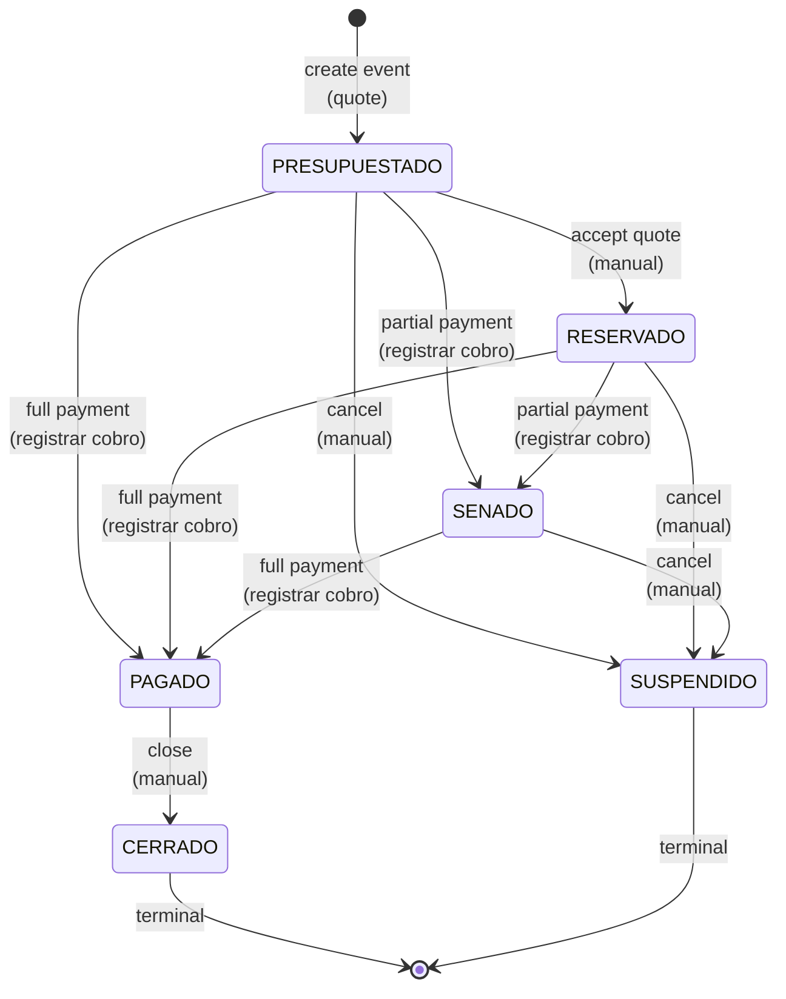

# Events Module

**Location**: `lib/events/`, `app/(dashboard)/eventos/`  
**Purpose**: Core domain for managing event bookings, state transitions, financial calculations, and mutations.  
**Audience**: Maintainers, QA, full-stack developers.

---

## 1. Purpose & Domain Concepts

### Event Lifecycle & States

An **Event** represents a single party or celebration at the venue. It moves through a state machine reflecting the business workflow:

| State | Meaning | Notes |
|-------|---------|-------|
| **PRESUPUESTADO** | Quoted, not confirmed | Initial state; a quote sent to the client (no payment yet). |
| **RESERVADO** | Confirmed reservation | Client has accepted; no deposit or partial payment received. |
| **SENADO** | Deposit ("seña") received | A partial payment has been collected; event is locked in. |
| **PAGADO** | Fully paid | Total collected ≥ totalPrice. Terminal paid state. |
| **CERRADO** | Closed / complete | Terminal state; event is finished. Cannot be downgraded. |
| **SUSPENDIDO** | Cancelled / suspended | Terminal state; event cancelled. Cannot be downgraded. |

### Event Types

- **Mis eventos** (My events) — Confirmed reservations (RESERVADO, SENADO, PAGADO, CERRADO).
- **Presupuestados** (Quoted) — Unconfirmed quotes (PRESUPUESTADO).

### Primary Actions

- **Presupuestar** (Quote) — Create an event in PRESUPUESTADO state; send cost estimate to client.
- **Reservar** (Reserve) — Confirm an event, moving it to RESERVADO; client has agreed.
- **Registrar cobro** (Record payment) — Log a payment movement; auto-advance event state based on amount collected (via `resolvePaidState`).

---

## 2. Data Model

### Core Entities

**Event** (`prisma/schema.prisma:47–69`)
- `id`: Unique identifier (CUID).
- `name`: Event title.
- `eventType`: Category (e.g., "Cumpleaños", "Casamientos").
- `clientName`: Client name (denormalized text; references Client.id if known).
- `clientId`: Optional FK to Client record.
- `startAt`, `endAt`: Datetime range (stored as ISO 8601).
- `state`: EventState enum (PRESUPUESTADO | RESERVADO | SENADO | PAGADO | CERRADO | SUSPENDIDO).
- `totalPrice`: Event price quoted to client, **in integer cents** (e.g., 150000 = $1,500).
- `details`: Rich-text event description.
- `notes`: Internal notes.
- Relations: `services` (EventService[]), `providers` (EventProvider[]), `bonificados` (EventBonificado[]).

**EventService** (`prisma/schema.prisma:101–113`)  
Join table: Event → Service. Represents a service offered on the event.
- `eventId`, `serviceId`: FK pair (unique composite key).
- `qty`: Quantity of this service (e.g., "3× DJ sessions").
- `paid`, `paidAt`: Not yet used; reserved for per-service payment tracking.

**EventProvider** (`prisma/schema.prisma:140–151`)  
Join table: Event → Provider (staff/prestador). Represents staff assigned to the event.
- `eventId`, `providerId`: FK pair (unique composite key).
- `paid`, `paidAt`: Not yet used; reserved for per-provider payment tracking.

**EventBonificado** (`prisma/schema.prisma:116–126`)  
Join table: Event → Service. Represents a complimentary (waived) service line.
- `eventId`, `serviceId`: FK pair (unique composite key).
- `qty`: Quantity of waived service.
- Unlike EventService, bonificados **reduce** the client's subtotal but **do not** reduce the venue's cost.

**Service** (`prisma/schema.prisma:84–98`)  
Catalog of offerings.
- `cost`: What the venue pays (in cents). Used in financial calculations.
- `price`: What the client pays (in cents). Used in financial calculations.
- `proveedorId`: Optional FK to Proveedor (external vendor).

**Provider** (`prisma/schema.prisma:129–137`)  
Staff or external contractor.
- `cost`: Fixed cost per event (in cents).

### Relation Diagram

```
Event (1)
  ├─ (M) EventService → Service (cost, price)
  ├─ (M) EventProvider → Provider (cost per event)
  └─ (M) EventBonificado → Service (price waived)
```

All money is **integer cents** (centavos). Conversion occurs only at I/O boundaries via `lib/money.ts`.

---

## 3. Financial Summary Computation

### Overview

**`computeEventFinancials(lines)`** (`lib/events/financials.ts:26–42`) is the **single source of truth** for event financial calculations. It is a pure function (no Prisma dependency), reused by:
- The event detail page to display financial summary.
- The presupuesto (quote) page to show cost breakdown.
- The edit page to update pricing in real time.
- Reports service for income/expense aggregation.

### Formula (All in Integer Cents)

Given an event with service lines, provider lines, and bonificado lines:

```
servicePrice   = Σ (service.price × qty) for each EventService
serviceCost    = Σ (service.cost × qty) for each EventService
providerCost   = Σ provider.cost for each EventProvider
totalBonificado = Σ (service.price × qty) for each EventBonificado

subtotal       = servicePrice - totalBonificado   [what the client pays]
totalCost      = serviceCost + providerCost       [what the venue spends]
profit         = subtotal - totalCost             [venue's margin]
```

### Example (from `lib/events/financials.test.ts`)

| Line | Type | Component | Qty | Unit Cost | Unit Price | Total Cost | Total Price |
|------|------|-----------|-----|-----------|------------|------------|-------------|
| 1 | Service | "Decoración" | 2 | 100¢ | 300¢ | 200¢ | 600¢ |
| 2 | Service | "Animación" | 1 | 50¢ | 200¢ | 50¢ | 200¢ |
| 3 | Provider | "DJ" | 1 | 400¢ | — | 400¢ | — |
| 4 | Bonificado | "Regalo sorpresa" | 1 | — | 100¢ | — | 100¢ |

**Computation**:
- `servicePrice` = 600 + 200 = 800¢
- `serviceCost` = 200 + 50 = 250¢
- `providerCost` = 400¢
- `totalBonificado` = 100¢
- `subtotal` = 800 − 100 = 700¢ (client pays this)
- `totalCost` = 250 + 400 = 650¢ (venue spends this)
- `profit` = 700 − 650 = 50¢ (venue earns this)

### Key Invariants

- **Bonificados only subtract from price**, not cost. If the venue offers a waived service, the client pays less but the venue's cost remains (reflecting goods/staff used).
- **Providers have no qty**; each provider assigned incurs their fixed cost once per event.
- **Negative profit is valid**. If a quoted price is too low or costs spike, profit can be negative; the financial summary must reflect this truthfully.
- **Empty event (no lines) returns all zeros**; it is not an error state.

---

## 4. Payment-Driven State Logic

### `resolvePaidState(current, cobrado, totalPrice)`

**File**: `lib/events/paymentState.ts:12–34`  
**Purpose**: Given the current event state, total amount collected (cobrado), and quoted price, determine whether to auto-advance the event state.  
**Returns**: New EventState, or `null` (no change).

### Rules

1. **No price** (`totalPrice <= 0`) → Return `null` (no state change; event may be a placeholder).
2. **Terminal states** (CERRADO, SUSPENDIDO) → Return `null` (never auto-advance manually closed/cancelled events).
3. **Already PAGADO** → Return `null` (stay paid; no downgrade).
4. **Fully paid** (`cobrado >= totalPrice` AND `totalPrice > 0`):
   - Advance to PAGADO (unless already PAGADO).
5. **Partial payment** (`0 < cobrado < totalPrice`):
   - If current is PRESUPUESTADO or RESERVADO → Advance to SENADO.
   - If current is already SENADO → Return `null` (stay SENADO; no re-advancement on further partial payments).
6. **No payment** (`cobrado == 0`) → Return `null` (stay in current state).

### State Machine Diagram



### Example Flow (from `lib/events/paymentState.test.ts`)

```
1. Event created PRESUPUESTADO, totalPrice = 100,00¢
2. Client pays 40,00¢ → resolvePaidState("PRESUPUESTADO", 40_00, 100_00) = "SENADO"
3. Client pays another 30,00¢ (total cobrado = 70,00¢) → resolvePaidState("SENADO", 70_00, 100_00) = null (no change; stay SENADO)
4. Client pays final 30,00¢ (total cobrado = 100,00¢) → resolvePaidState("SENADO", 100_00, 100_00) = "PAGADO"
```

---

## 5. Server Actions & Mutation Flow

### Validation Boundary

All external input is validated at the Server Action boundary using Zod schemas. The **eventSchema** pipeline is:

```
HTML form (all strings)
  ↓ [eventFormInputSchema validates presence/format]
form input object (still strings: dates, prices)
  ↓ [eventSchema transforms: parse dates, parse pesos to cents]
EventFormValues (typed, dates as Date objects, price as integer cents)
  ↓ [passed to lib/ service layer]
Prisma create/update
```

**File**: `lib/events/schema.ts`

- `eventFormInputSchema` (`schema.ts:19–30`): Validates form HTML input (all strings). Checks required fields, enum values.
- `eventSchema` (`schema.ts:35–40`): Transforms form strings into typed values:
  - `startAt`, `endAt`: `string` → `Date`
  - `totalPrice`: `string` (pesos, e.g., "15000") → `number` (cents, 1,500,000) via `parsePesosToCents`.

**Zod + React Hook Form note** (`schema.ts:1–2`): `z.coerce.*` breaks the RHF Resolver type; use plain `z.string()` in the form schema and `.transform()` in the server schema.

### Creating an Event

**File**: `app/(dashboard)/eventos/actions.ts:16–34`

```typescript
async function createEventAction(
  formInput: EventFormInput,     // from form (all strings)
  lines?: {                       // optional: services + providers to add
    services: { serviceId: string; qty: number }[];
    providerIds: string[];
  }
): Promise<ActionResult>
```

**Flow**:
1. Call `requireSession()` (auth check).
2. Parse form input through `eventSchema` (validate, transform).
3. If validation fails, return `{ ok: false, error: message }`.
4. Call `createEvent(parsed.data)` (Prisma create).
5. If lines provided:
   - Call `addServiceToEvent(eventId, serviceId, qty)` for each service.
   - Call `addProviderToEvent(eventId, providerId)` for each provider.
   - All done in parallel (Promise.all).
6. Call `revalidatePath("/eventos")` (refresh the list).
7. Return `{ ok: true, id: event.id }`.

**Zod validation is always re-done** (`actions.ts:21`), even if the form already validated client-side.

### Updating an Event

**File**: `app/(dashboard)/eventos/actions.ts:36–48`

Similar to create: validate → update Prisma → revalidate.

### Deleting an Event

**File**: `app/(dashboard)/eventos/actions.ts:50–55`

Deletes the event (cascade deletes EventService, EventProvider, EventBonificado via FK constraints).

### Recording a Payment

**File**: `app/(dashboard)/eventos/[id]/actions.ts:9–51`

```typescript
async function registrarCobroAction(
  eventId: string,
  data: { accountId: string; amount: number; description: string; date: string }
): Promise<{ ok: boolean; error?: string }>
```

**Flow**:
1. Call `requireSession()` (auth check).
2. Validate inputs (accountId, amount > 0).
3. Fetch the event (to include its name in the default description).
4. Create a Movement record (type INGRESO, amount in cents, linked to the event).
5. Fetch all INGRESOes for the event; sum them to get `cobrado` (total collected).
6. Call `resolvePaidState(event.state, cobrado, event.totalPrice)`.
7. If a new state is returned, call `setEventState(eventId, newState)`.
8. Revalidate multiple paths (event detail, list, finance sections).

**Key point**: Payment does not update the event's `totalPrice`; it only auto-advances state based on how much has been paid toward the existing price.

---

## 6. Service Layer Functions

All functions live in `lib/events/` and are called by Server Actions / Route Handlers. Prisma is never imported outside this layer.

### Event CRUD

| Function | Purpose | File |
|----------|---------|------|
| `listEvents()` | Fetch all events ordered by start date. | eventService.ts:6–10 |
| `listEventsPage(skip, take)` | Paginated list (for the events table). | eventService.ts:14–24 |
| `getEvent(id)` | Fetch a single event (throws if not found). | eventService.ts:26–28 |
| `createEvent(data)` | Create event from EventFormValues. | eventService.ts:30–32 |
| `updateEvent(id, data)` | Update event fields. | eventService.ts:34–36 |
| `deleteEvent(id)` | Delete event (cascade deletes joins). | eventService.ts:38–40 |
| `setEventState(id, state)` | Transition event to a new state. | eventService.ts:42–44 |
| `listEventsInRange(start, end)` | Fetch events in a date range (for calendar). | eventService.ts:46–51 |

### Service Lines

| Function | Purpose | File |
|----------|---------|------|
| `getEventWithServices(id)` | Fetch event with all its EventService joins (eagerly loaded). | eventServiceLines.ts:4–14 |
| `addServiceToEvent(eventId, serviceId, qty)` | Add or upsert a service on the event. | eventServiceLines.ts:16–22 |
| `removeServiceFromEvent(eventId, serviceId)` | Delete a service from the event. | eventServiceLines.ts:24–28 |

### Provider Lines

| Function | Purpose | File |
|----------|---------|------|
| `getEventWithAll(id)` | Fetch event with all services, providers, and bonificados (full hydration). | eventProviderLines.ts:3–21 |
| `addProviderToEvent(eventId, providerId)` | Add or upsert a provider on the event. | eventProviderLines.ts:23–29 |
| `removeProviderFromEvent(eventId, providerId)` | Remove a provider from the event. | eventProviderLines.ts:31–35 |

### Bonificado Lines

| Function | Purpose | File |
|----------|---------|------|
| `addBonificadoToEvent(eventId, serviceId, qty)` | Add or upsert a bonificado (waived service) on the event. | eventBonificadoLines.ts:3–9 |
| `removeBonificadoFromEvent(eventId, serviceId)` | Remove a bonificado from the event. | eventBonificadoLines.ts:11–15 |

### Financial Calculation (Pure Function)

| Function | Purpose | File |
|----------|---------|------|
| `computeEventFinancials(lines)` | Calculate event financial summary (servicePrice, serviceCost, providerCost, totalBonificado, subtotal, totalCost, profit). | financials.ts:26–42 |

### Payment State Logic (Pure Function)

| Function | Purpose | File |
|----------|---------|------|
| `resolvePaidState(current, cobrado, totalPrice)` | Determine whether to auto-advance event state based on payment. | paymentState.ts:12–34 |

---

## 7. Key Behaviors & Edge Cases

### From Test Files

#### financials.test.ts

- **Empty event**: All fields are 0 (not an error).
- **Service qty**: price and cost are multiplied by qty.
- **Provider cost**: Each provider incurs their fixed cost once; no qty.
- **Bonificado subtraction**: Bonificados subtract from subtotal (what client pays) but do NOT reduce totalCost (what venue spends). This reflects the business rule: "we're giving away the service but still pay for it".
- **Negative profit**: Valid. If costs exceed the quoted price, profit is negative.

#### paymentState.test.ts

- **Transition on full payment**: RESERVADO + 100,00¢ payment on a 100,00¢ event → PAGADO.
- **Overpayment is fine**: 150,00¢ collected on a 100,00¢ event → still PAGADO.
- **Partial payment locks in**: PRESUPUESTADO + 40,00¢ on 100,00¢ → SENADO (deposit received).
- **No re-advancement from SENADO**: If the event is already SENADO and another partial payment is made, the state stays SENADO. Use full payment to reach PAGADO.
- **Terminal states are locked**: CERRADO and SUSPENDIDO never auto-advance, even with payments.
- **Zero or negative price**: No state transition (event may be a placeholder or free).

#### eventService.test.ts

- **Required fields**: name, eventType, clientName, startAt, endAt are all mandatory.
- **Optional fields**: clientId, details, notes are optional.
- **State enum**: All 6 states (PRESUPUESTADO, RESERVADO, SENADO, PAGADO, CERRADO, SUSPENDIDO) are valid.
- **Type coercion**: Dates (ISO strings) and prices (pesos string → cents integer) are transformed server-side.
- **Default totalPrice**: Form uses `"0"` as default; transforms to 0 cents.

### UI / UX Behaviors

#### Events List Page (`app/(dashboard)/eventos/page.tsx`)

- **Paginated**: 10 rows per page (via `parsePage` / `buildPaginated`).
- **Sorted by startAt descending**: Most recent first.
- **Desktop table + mobile cards**: Different layouts for responsiveness (table hidden on md below, cards hidden on md and above).
- **StatusBadge**: Color-coded by event state (PRESUPUESTADO=gray, SENADO=warning, PAGADO=success, etc.).
- **formatMoney**: Prices displayed in Argentine peso format (e.g., "$15.500,50") using `Intl.NumberFormat("es-AR")`.
- **Empty state**: CTA to create first event when no events exist.

#### Event Detail Page (not shown here, but inferred)

- Displays full event record, calculated financial summary (via `computeEventFinancials`), related services/providers/bonificados.
- Links to edit page and payment recording form.

---

## 8. Money Convention

**All monetary values are integer cents (centavos).** No floating-point arithmetic in the database or business logic.

### I/O Boundaries (in `lib/money.ts`)

| Function | Input | Output | Example |
|----------|-------|--------|---------|
| `pesosToCents(pesos)` | number (pesos) | number (cents) | 150.5 → 15050 |
| `parsePesosToCents(string)` | string (pesos) | number (cents) | "150.5" → 15050 |
| `centsToPesos(cents)` | number (cents) | number (pesos) | 15050 → 150.5 |
| `formatMoney(cents)` | number (cents) | string (formatted) | 15050 → "$150,50" |

### Where Money Appears

- **Event.totalPrice**: Stored in cents (schema.prisma:58).
- **Service.cost, Service.price**: Stored in cents (schema.prisma:88–89).
- **Provider.cost**: Stored in cents (schema.prisma:133).
- **Movement.amount**: Stored in cents (schema.prisma:179).
- **HTML form inputs**: Always a number input (user enters pesos); form schema receives string; server schema transforms to cents.
- **Financial calculations**: All arithmetic in cents; result is in cents.
- **Display**: Call `formatMoney(cents)` to format for Spanish locale.

---

## 9. Integration Points

### Calendar Views

Uses `listEventsInRange(start, end)` to fetch events for a given date range.

### Finance Module

- **Movements**: Created in `finanzas/` service; linked to an event via `eventId` FK.
- **Payment recording**: Server Action in `[id]/actions.ts` calls `registrarCobroAction`, which:
  - Creates a Movement (INGRESO).
  - Queries movements for the event.
  - Auto-advances event state via `resolvePaidState`.

### Reports Service

Calls `computeEventFinancials` to include event financial summary in reports (income by event, services report, etc.).

---

## 10. Testing Strategy

### Unit Tests (Vitest)

- **financials.test.ts**: Tests `computeEventFinancials` with various line combinations. High-value for business logic correctness.
- **paymentState.test.ts**: Tests `resolvePaidState` state transitions. Covers all enum values and edge cases (overpayment, terminal states, zero price).
- **eventService.test.ts**: Tests Zod schema validation (required fields, type coercion, enum values). Covers form input and server transformation.

### E2E Tests (Playwright)

- Create event flow: fill form → submit → list shows event.
- Update event: edit form → revalidate.
- Delete event: button → confirm → list updated.
- Payment recording: open event detail → record payment → check state auto-advanced.

### Coverage Checklist

- ✓ Financial summary for empty, single-line, multi-line, and edge cases (negative profit).
- ✓ State transitions on payment (full, partial, overpaid, already PAGADO, terminal states).
- ✓ Validation: required fields, date/price coercion, enum values.
- ✓ CRUD: create, read, update, delete events.
- ✓ Line management: add/remove services, providers, bonificados.

---

## 11. Common Patterns & Code Organization

### Domain Layer (`lib/events/`)

- **eventService.ts**: CRUD, event queries.
- **eventServiceLines.ts**: Service join management.
- **eventProviderLines.ts**: Provider join management.
- **eventBonificadoLines.ts**: Bonificado join management.
- **financials.ts**: Pure financial calculations.
- **paymentState.ts**: Pure state-transition logic.
- **schema.ts**: Zod validation schemas (form input + server transform).

### UI Layer (`app/(dashboard)/eventos/`)

- **page.tsx**: List view (paginated, sorted, responsive).
- **nuevo/page.tsx**: Create form (form + services/providers picker).
- **[id]/page.tsx**: Detail view (event data + financial summary + actions).
- **[id]/editar/page.tsx**: Edit form.
- **[id]/presupuesto/page.tsx**: Quote/presupuesto view (financial breakdown).
- **actions.ts**: Server Actions (create, update, delete).
- **[id]/actions.ts**: Server Actions for detail-page mutations (payment recording).

### Component Naming

- `EventForm.tsx`: Reusable form component (shared by create and edit pages).
- `EventDetail.tsx`: Read-only event display.
- `FinancialSummary.tsx`: Displays computed financials.
- etc.

---

## Summary for Maintainers

The Events module is the **core domain** of crm-salon-infantil. Master these concepts to understand the system:

1. **Event state machine** (PRESUPUESTADO → RESERVADO → SENADO → PAGADO / CERRADO / SUSPENDIDO) is enforced by `resolvePaidState`, not by enum restrictions.
2. **Financial summary** is a pure function over line items; it is recomputed on demand (no stored summary fields).
3. **Money is always cents** (integer); conversion happens only at I/O.
4. **Validation happens twice**: client-side (UX) and server-side (security). The server schema is the source of truth.
5. **Services/providers/bonificados are join tables**, not fields on Event; this keeps the model flexible.
6. **Payment auto-advances state**; no manual state transitions in the payment flow (other than terminal states).

Read the test files first; they document the intended behavior clearly.
